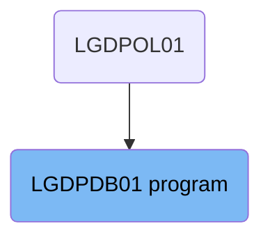
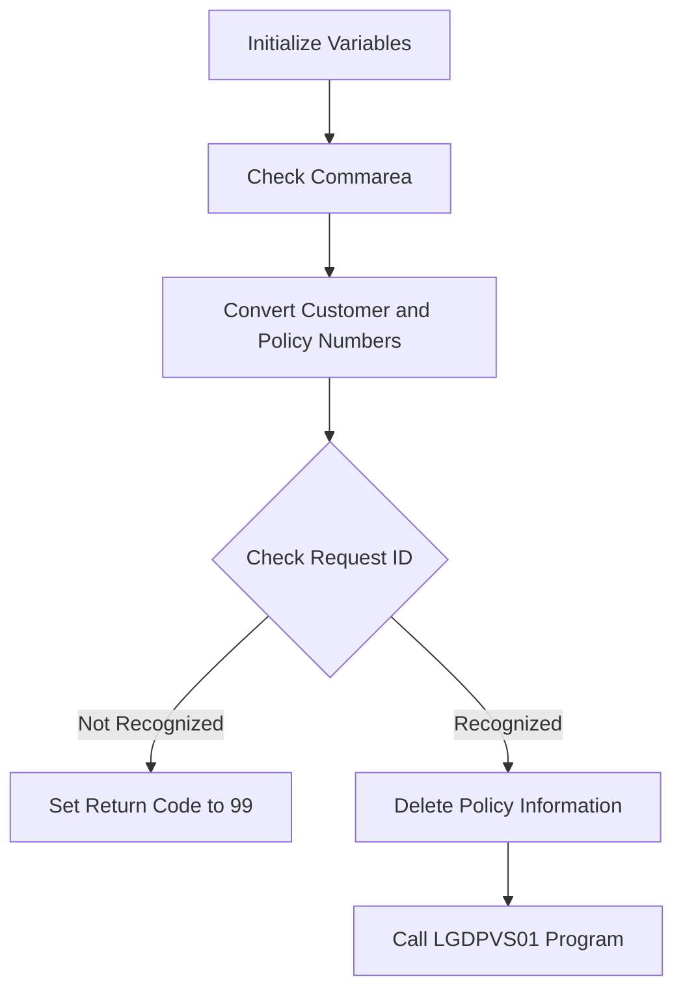

The <SwmToken path="base/src/lgdpdb01.cbl" pos="13:6:6" line-data="       PROGRAM-ID. LGDPDB01.">`LGDPDB01`</SwmToken> program is responsible for deleting policy information from the <SwmToken path="base/src/lgdpdb01.cbl" pos="148:17:17" line-data="      * Convert commarea customer &amp; policy nums to DB2 integer format">`DB2`</SwmToken> database. It is used in a flow that starts from the LGDPOL01 program. The program initializes variables, checks the communication area, converts customer and policy numbers, checks the request ID, deletes policy information if the request ID is recognized, and calls the <SwmToken path="base/src/lgdpdb01.cbl" pos="168:9:9" line-data="               EXEC CICS LINK PROGRAM(LGDPVS01)">`LGDPVS01`</SwmToken> program to handle the deletion of the policy record from a VSAM KSDS file.

The <SwmToken path="base/src/lgdpdb01.cbl" pos="13:6:6" line-data="       PROGRAM-ID. LGDPDB01.">`LGDPDB01`</SwmToken> program starts by setting up necessary variables and checking if it received the required communication area. It then converts customer and policy numbers for <SwmToken path="base/src/lgdpdb01.cbl" pos="148:17:17" line-data="      * Convert commarea customer &amp; policy nums to DB2 integer format">`DB2`</SwmToken> processing. The program checks if the request ID is valid; if not, it sets an error code. If the request ID is valid, it deletes the policy information from the <SwmToken path="base/src/lgdpdb01.cbl" pos="148:17:17" line-data="      * Convert commarea customer &amp; policy nums to DB2 integer format">`DB2`</SwmToken> database and calls another program, <SwmToken path="base/src/lgdpdb01.cbl" pos="168:9:9" line-data="               EXEC CICS LINK PROGRAM(LGDPVS01)">`LGDPVS01`</SwmToken>, to complete the deletion process in a different file system.

# Where is this program used?

This program is used once, in a flow starting from `LGDPOL01` as represented in the following diagram:



Lets' zoom into the flow:



<SwmSnippet path="/base/src/lgdpdb01.cbl" line="116">

---

## Initialize Variables

First, the program initializes working storage variables to set up the environment for processing the request. This includes setting up transaction ID, terminal ID, and task number.

```cobol
      * initialize working storage variables
           INITIALIZE WS-HEADER.
      * set up general variable
           MOVE EIBTRNID TO WS-TRANSID.
           MOVE EIBTRMID TO WS-TERMID.
           MOVE EIBTASKN TO WS-TASKNUM.
```

---

</SwmSnippet>

<SwmSnippet path="/base/src/lgdpdb01.cbl" line="130">

---

## Check Commarea

Next, the program checks if the communication area (commarea) is received. If not, it issues an ABEND (abnormal end) to terminate the process.

```cobol
      * If NO commarea received issue an ABEND
           IF EIBCALEN IS EQUAL TO ZERO
               MOVE ' NO COMMAREA RECEIVED' TO EM-VARIABLE
               PERFORM WRITE-ERROR-MESSAGE
               EXEC CICS ABEND ABCODE('LGCA') NODUMP END-EXEC
           END-IF
```

---

</SwmSnippet>

<SwmSnippet path="/base/src/lgdpdb01.cbl" line="148">

---

## Convert Customer and Policy Numbers

Then, the program converts the customer and policy numbers from the commarea to <SwmToken path="base/src/lgdpdb01.cbl" pos="148:17:17" line-data="      * Convert commarea customer &amp; policy nums to DB2 integer format">`DB2`</SwmToken> integer format for further processing.

```cobol
      * Convert commarea customer & policy nums to DB2 integer format
           MOVE CA-CUSTOMER-NUM TO DB2-CUSTOMERNUM-INT
           MOVE CA-POLICY-NUM   TO DB2-POLICYNUM-INT
      * and save in error msg field incase required
           MOVE CA-CUSTOMER-NUM TO EM-CUSNUM
           MOVE CA-POLICY-NUM   TO EM-POLNUM
```

---

</SwmSnippet>

<SwmSnippet path="/base/src/lgdpdb01.cbl" line="160">

---

## Check Request ID

Moving to the main logic, the program checks if the request ID in the commarea is recognized. If not, it sets the return code to 99, indicating an unrecognized request.

```cobol
           IF ( CA-REQUEST-ID NOT EQUAL TO '01DEND' AND
                CA-REQUEST-ID NOT EQUAL TO '01DHOU' AND
                CA-REQUEST-ID NOT EQUAL TO '01DCOM' AND
                CA-REQUEST-ID NOT EQUAL TO '01DMOT' ) Then
      *        Request is not recognised or supported
               MOVE '99' TO CA-RETURN-CODE
           ELSE
               PERFORM DELETE-POLICY-DB2-INFO
               EXEC CICS LINK PROGRAM(LGDPVS01)
                    Commarea(DFHCOMMAREA)
                    LENGTH(32500)
               END-EXEC
           END-IF.
```

---

</SwmSnippet>

<SwmSnippet path="/base/src/lgdpdb01.cbl" line="186">

---

## Delete Policy Information

If the request ID is recognized, the program performs the <SwmToken path="base/src/lgdpdb01.cbl" pos="186:1:7" line-data="       DELETE-POLICY-DB2-INFO.">`DELETE-POLICY-DB2-INFO`</SwmToken> routine to delete the policy information from the <SwmToken path="base/src/lgdpdb01.cbl" pos="186:5:5" line-data="       DELETE-POLICY-DB2-INFO.">`DB2`</SwmToken> database.

```cobol
       DELETE-POLICY-DB2-INFO.

           MOVE ' DELETE POLICY  ' TO EM-SQLREQ
           EXEC SQL
             DELETE
               FROM POLICY
               WHERE ( CUSTOMERNUMBER = :DB2-CUSTOMERNUM-INT AND
                       POLICYNUMBER  = :DB2-POLICYNUM-INT      )
           END-EXEC
```

---

</SwmSnippet>

<SwmSnippet path="/base/src/lgdpdb01.cbl" line="168">

---

## Call <SwmToken path="base/src/lgdpdb01.cbl" pos="168:9:9" line-data="               EXEC CICS LINK PROGRAM(LGDPVS01)">`LGDPVS01`</SwmToken> Program

Finally, the program calls the <SwmToken path="base/src/lgdpdb01.cbl" pos="168:9:9" line-data="               EXEC CICS LINK PROGRAM(LGDPVS01)">`LGDPVS01`</SwmToken> program to handle the deletion of the policy record from a VSAM KSDS file in a CICS environment.

More about <SwmToken path="base/src/lgdpdb01.cbl" pos="168:9:9" line-data="               EXEC CICS LINK PROGRAM(LGDPVS01)">`LGDPVS01`</SwmToken>: <SwmLink doc-title="Handling Customer and Policy Data (LGDPVS01)">[Handling Customer and Policy Data (LGDPVS01)](/.swm/handling-customer-and-policy-data-lgdpvs01.xneg2muu.sw.md)</SwmLink>

```cobol
               EXEC CICS LINK PROGRAM(LGDPVS01)
                    Commarea(DFHCOMMAREA)
                    LENGTH(32500)
               END-EXEC
```

---

</SwmSnippet>

&nbsp;

*This is an auto-generated document by Swimm 🌊 and has not yet been verified by a human*

<SwmMeta version="3.0.0" repo-id="Z2l0aHViJTNBJTNBa3luZHJ5bC1jaWNzLWdlbmFwcCUzQSUzQVN3aW1tLURlbW8=" repo-name="kyndryl-cics-genapp"><sup>Powered by [Swimm](/)</sup></SwmMeta>
