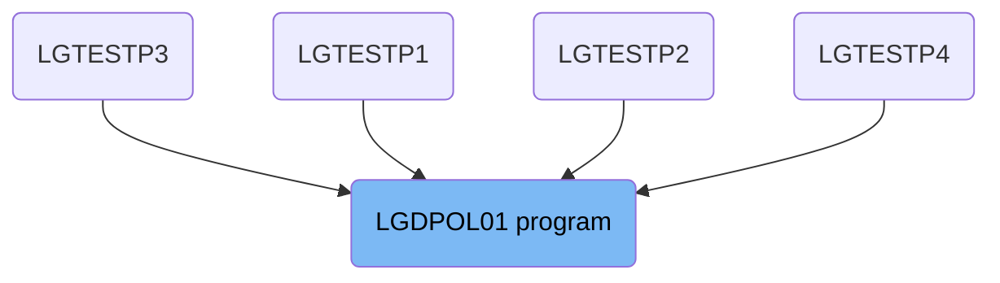

The <SwmToken path="base/src/lgdpol01.cbl" pos="11:6:6" line-data="       PROGRAM-ID. LGDPOL01.">`LGDPOL01`</SwmToken> program is responsible for handling the deletion of policy information in the system. It ensures that the request ID is valid, processes the deletion of policy data from the <SwmToken path="base/src/lgdpol01.cbl" pos="126:7:7" line-data="               PERFORM DELETE-POLICY-DB2-INFO">`DB2`</SwmToken> database, and manages error handling by linking to other programs such as LGSTSQ and <SwmToken path="base/src/lgdpol01.cbl" pos="59:3:3" line-data="       01 LGDPDB01                  PIC x(8) Value &#39;LGDPDB01&#39;.">`LGDPDB01`</SwmToken>.

The flow starts by checking if the request ID is valid. If valid, it proceeds to delete the policy information from the database. It then calls the <SwmToken path="base/src/lgdpol01.cbl" pos="59:3:3" line-data="       01 LGDPDB01                  PIC x(8) Value &#39;LGDPDB01&#39;.">`LGDPDB01`</SwmToken> program to handle the deletion of the policy from various tables and manages any errors by writing messages to error queues.

# Where is this program used?

This program is used multiple times in the codebase as represented in the following diagram:



Lets' zoom into the flow:

<SwmSnippet path="/base/src/lgdpol01.cbl" line="180">

---

## Handling Error Messages

First, the MAINLINE function checks if the <SwmToken path="base/src/lgdpol01.cbl" pos="117:9:13" line-data="           MOVE FUNCTION UPPER-CASE(CA-REQUEST-ID) TO CA-REQUEST-ID">`CA-REQUEST-ID`</SwmToken> is not equal to specific values ('01DEND', <SwmToken path="base/src/lgdpol01.cbl" pos="120:14:14" line-data="                CA-REQUEST-ID NOT EQUAL TO &#39;01DMOT&#39; AND">`01DMOT`</SwmToken>, <SwmToken path="base/src/lgdpol01.cbl" pos="121:14:14" line-data="                CA-REQUEST-ID NOT EQUAL TO &#39;01DHOU&#39; AND">`01DHOU`</SwmToken>, <SwmToken path="base/src/lgdpol01.cbl" pos="122:14:14" line-data="                CA-REQUEST-ID NOT EQUAL TO &#39;01DCOM&#39; )">`01DCOM`</SwmToken>). This check ensures that the request ID is valid and determines the next steps in the process.

```cobol
               EXEC CICS LINK PROGRAM('LGSTSQ')
                         COMMAREA(CA-ERROR-MSG)
                         LENGTH(LENGTH OF CA-ERROR-MSG)
               END-EXEC
             END-IF
           END-IF.
           EXIT.

```

---

</SwmSnippet>

<SwmSnippet path="/base/src/lgdpol01.cbl" line="180">

---

## Deleting Policy Information

Next, if the <SwmToken path="base/src/lgdpol01.cbl" pos="117:9:13" line-data="           MOVE FUNCTION UPPER-CASE(CA-REQUEST-ID) TO CA-REQUEST-ID">`CA-REQUEST-ID`</SwmToken> is valid, the flow proceeds to the <SwmToken path="base/src/lgdpol01.cbl" pos="126:3:9" line-data="               PERFORM DELETE-POLICY-DB2-INFO">`DELETE-POLICY-DB2-INFO`</SwmToken> paragraph. This paragraph is responsible for deleting the policy information from the database.

```cobol
               EXEC CICS LINK PROGRAM('LGSTSQ')
                         COMMAREA(CA-ERROR-MSG)
                         LENGTH(LENGTH OF CA-ERROR-MSG)
               END-EXEC
             END-IF
           END-IF.
           EXIT.

```

---

</SwmSnippet>

<SwmSnippet path="/base/src/lgdpol01.cbl" line="180">

---

## Calling <SwmToken path="base/src/lgdpol01.cbl" pos="59:3:3" line-data="       01 LGDPDB01                  PIC x(8) Value &#39;LGDPDB01&#39;.">`LGDPDB01`</SwmToken>

Then, the <SwmToken path="base/src/lgdpol01.cbl" pos="59:3:3" line-data="       01 LGDPDB01                  PIC x(8) Value &#39;LGDPDB01&#39;.">`LGDPDB01`</SwmToken> program is called. This program handles the deletion of the policy from the <SwmToken path="base/src/lgdpol01.cbl" pos="126:7:7" line-data="               PERFORM DELETE-POLICY-DB2-INFO">`DB2`</SwmToken> Policy table and the associated Endowment/House/Motor/Commercial table. It initializes necessary variables, checks for a valid communication area, processes customer and policy numbers, validates the request ID, performs the deletion of the policy, and handles errors by writing messages to error queues.

More about <SwmToken path="base/src/lgdpol01.cbl" pos="59:3:3" line-data="       01 LGDPDB01                  PIC x(8) Value &#39;LGDPDB01&#39;.">`LGDPDB01`</SwmToken>: <SwmLink doc-title="Deleting Policy Information (LGDPDB01)">[Deleting Policy Information (LGDPDB01)](/.swm/deleting-policy-information-lgdpdb01.4iufc8fu.sw.md)</SwmLink>

```cobol
               EXEC CICS LINK PROGRAM('LGSTSQ')
                         COMMAREA(CA-ERROR-MSG)
                         LENGTH(LENGTH OF CA-ERROR-MSG)
               END-EXEC
             END-IF
           END-IF.
           EXIT.

```

---

</SwmSnippet>

&nbsp;

*This is an auto-generated document by Swimm 🌊 and has not yet been verified by a human*

<SwmMeta version="3.0.0" repo-id="Z2l0aHViJTNBJTNBa3luZHJ5bC1jaWNzLWdlbmFwcCUzQSUzQVN3aW1tLURlbW8=" repo-name="kyndryl-cics-genapp"><sup>Powered by [Swimm](/)</sup></SwmMeta>
