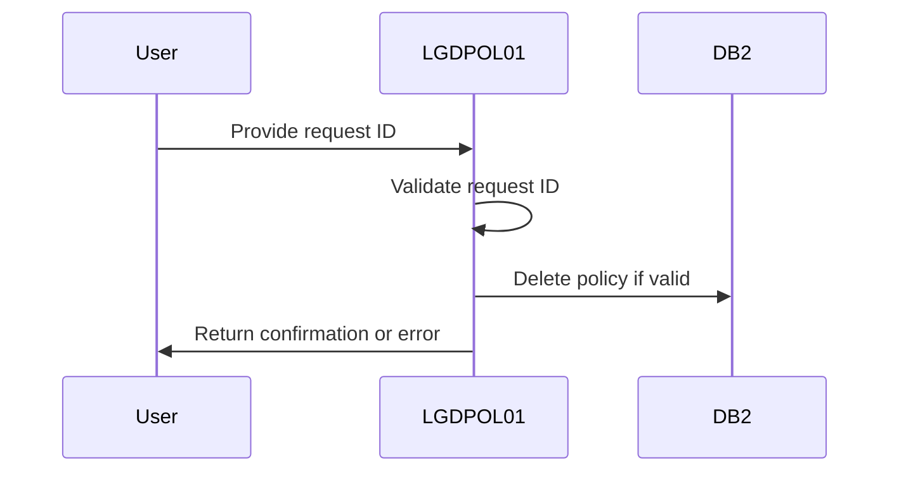
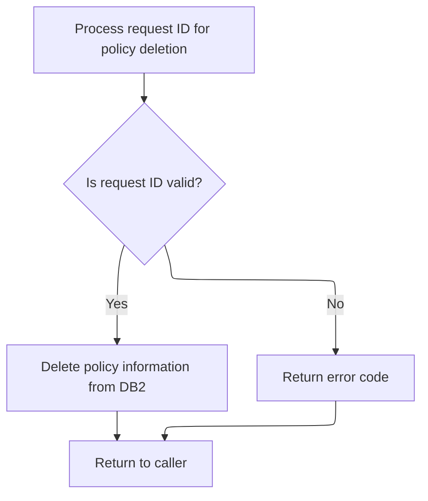

The document describes the process of deleting policy records using the <SwmToken path="base/src/lgdpol01.cbl" pos="11:6:6" line-data="       PROGRAM-ID. LGDPOL01.">`LGDPOL01`</SwmToken> program. Within the insurance application, this program handles requests to delete policy records by validating the request ID and removing the policy information from the database if the ID is recognized.

For example, if the request ID <SwmToken path="base/src/lgdpol01.cbl" pos="120:14:14" line-data="                CA-REQUEST-ID NOT EQUAL TO &#39;01DMOT&#39; AND">`01DMOT`</SwmToken> is provided, the program deletes the corresponding motor policy record from the database and returns a confirmation.

The main steps are:

- Process request ID for policy deletion
- Validate request ID
- Delete policy information from <SwmToken path="base/src/lgdpol01.cbl" pos="126:7:7" line-data="               PERFORM DELETE-POLICY-DB2-INFO">`DB2`</SwmToken> if valid
- Return error code if invalid
- Return to caller



## Dependencies

### Programs

- <SwmToken path="base/src/lgdpol01.cbl" pos="141:9:9" line-data="           EXEC CICS LINK PROGRAM(LGDPDB01)">`LGDPDB01`</SwmToken> (<SwmPath>[base/src/lgdpdb01.cbl](base/src/lgdpdb01.cbl)</SwmPath>) - <SwmLink doc-title="Deleting Policy Records (LGDPDB01)">[Deleting Policy Records (LGDPDB01)](/.swm/deleting-policy-records-lgdpdb01.t1v6h4u2.sw.md)</SwmLink>
- LGDPVS01 (<SwmPath>[base/src/lgdpvs01.cbl](base/src/lgdpvs01.cbl)</SwmPath>) - <SwmLink doc-title="Deleting Policy Records (LGDPVS01)">[Deleting Policy Records (LGDPVS01)](/.swm/deleting-policy-records-lgdpvs01.c9cypss1.sw.md)</SwmLink>
- LGSTSQ (<SwmPath>[base/src/lgstsq.cbl](base/src/lgstsq.cbl)</SwmPath>) - <SwmLink doc-title="Message Queue Handler (LGSTSQ)">[Message Queue Handler (LGSTSQ)](/.swm/message-queue-handler-lgstsq.e7y8uelv.sw.md)</SwmLink>

### Copybooks

- LGCMAREA (<SwmPath>[base/src/lgcmarea.cpy](base/src/lgcmarea.cpy)</SwmPath>)
- SQLCA

# Where is this program used?

This program is used multiple times in the codebase as represented in the following diagram:

```mermaid
graph TD
  1858b("Commercial Policy Menu (LGTESTP4)") --> l5822("Deleting Policy (LGDPOL01)"):::currentEntity
click 1858b openCode "base/src/lgtestp4.cbl:1"
o0g4l("Motor Policy Menu (LGTESTP1)") --> l5822("Deleting Policy (LGDPOL01)"):::currentEntity
click o0g4l openCode "base/src/lgtestp1.cbl:1"
li6ed("House Policy Transactions Menu (LGTESTP3)") --> l5822("Deleting Policy (LGDPOL01)"):::currentEntity
click li6ed openCode "base/src/lgtestp3.cbl:1"
162te("Endowment Policy Transactions (LGTESTP2)") --> l5822("Deleting Policy (LGDPOL01)"):::currentEntity
click 162te openCode "base/src/lgtestp2.cbl:1"
  
  
click l5822 openCode "base/src/lgdpol01.cbl:1"
    classDef currentEntity color:#000000,fill:#7CB9F4

%% Swimm:
%% graph TD
%%   1858b("Commercial Policy Menu (LGTESTP4)") --> l5822("Deleting Policy (<SwmToken path="base/src/lgdpol01.cbl" pos="11:6:6" line-data="       PROGRAM-ID. LGDPOL01.">`LGDPOL01`</SwmToken>)"):::currentEntity
%% click 1858b openCode "<SwmPath>[base/src/lgtestp4.cbl](base/src/lgtestp4.cbl)</SwmPath>:1"
%% o0g4l("Motor Policy Menu (LGTESTP1)") --> l5822("Deleting Policy (<SwmToken path="base/src/lgdpol01.cbl" pos="11:6:6" line-data="       PROGRAM-ID. LGDPOL01.">`LGDPOL01`</SwmToken>)"):::currentEntity
%% click o0g4l openCode "<SwmPath>[base/src/lgtestp1.cbl](base/src/lgtestp1.cbl)</SwmPath>:1"
%% li6ed("House Policy Transactions Menu (LGTESTP3)") --> l5822("Deleting Policy (<SwmToken path="base/src/lgdpol01.cbl" pos="11:6:6" line-data="       PROGRAM-ID. LGDPOL01.">`LGDPOL01`</SwmToken>)"):::currentEntity
%% click li6ed openCode "<SwmPath>[base/src/lgtestp3.cbl](base/src/lgtestp3.cbl)</SwmPath>:1"
%% 162te("Endowment Policy Transactions (LGTESTP2)") --> l5822("Deleting Policy (<SwmToken path="base/src/lgdpol01.cbl" pos="11:6:6" line-data="       PROGRAM-ID. LGDPOL01.">`LGDPOL01`</SwmToken>)"):::currentEntity
%% click 162te openCode "<SwmPath>[base/src/lgtestp2.cbl](base/src/lgtestp2.cbl)</SwmPath>:1"
%%   
%%   
%% click l5822 openCode "<SwmPath>[base/src/lgdpol01.cbl](base/src/lgdpol01.cbl)</SwmPath>:1"
%%     classDef currentEntity color:#000000,fill:#7CB9F4
```



# Processing and Validating Request ID for Policy Deletion



<SwmSnippet path="/base/src/lgdpol01.cbl" line="117">

---

In <SwmToken path="base/src/lgdpol01.cbl" pos="78:1:1" line-data="       MAINLINE SECTION.">`MAINLINE`</SwmToken>, we start by converting the request ID to uppercase and checking if it matches any of the recognized IDs (<SwmToken path="base/src/lgdpol01.cbl" pos="119:18:18" line-data="           IF ( CA-REQUEST-ID NOT EQUAL TO &#39;01DEND&#39; AND">`01DEND`</SwmToken>, <SwmToken path="base/src/lgdpol01.cbl" pos="120:14:14" line-data="                CA-REQUEST-ID NOT EQUAL TO &#39;01DMOT&#39; AND">`01DMOT`</SwmToken>, <SwmToken path="base/src/lgdpol01.cbl" pos="121:14:14" line-data="                CA-REQUEST-ID NOT EQUAL TO &#39;01DHOU&#39; AND">`01DHOU`</SwmToken>, <SwmToken path="base/src/lgdpol01.cbl" pos="122:14:14" line-data="                CA-REQUEST-ID NOT EQUAL TO &#39;01DCOM&#39; )">`01DCOM`</SwmToken>). If it doesn't match, we set an error return code. If it does, we proceed to call <SwmToken path="base/src/lgdpol01.cbl" pos="126:3:9" line-data="               PERFORM DELETE-POLICY-DB2-INFO">`DELETE-POLICY-DB2-INFO`</SwmToken> to handle the deletion of the policy from the database.

```cobol
           MOVE FUNCTION UPPER-CASE(CA-REQUEST-ID) TO CA-REQUEST-ID

           IF ( CA-REQUEST-ID NOT EQUAL TO '01DEND' AND
                CA-REQUEST-ID NOT EQUAL TO '01DMOT' AND
                CA-REQUEST-ID NOT EQUAL TO '01DHOU' AND
                CA-REQUEST-ID NOT EQUAL TO '01DCOM' )
      *        Request is not recognised or supported
               MOVE '99' TO CA-RETURN-CODE
           ELSE
               PERFORM DELETE-POLICY-DB2-INFO
```

---

</SwmSnippet>

<SwmSnippet path="/base/src/lgdpol01.cbl" line="139">

---

<SwmToken path="base/src/lgdpol01.cbl" pos="139:1:7" line-data="       DELETE-POLICY-DB2-INFO.">`DELETE-POLICY-DB2-INFO`</SwmToken> calls <SwmToken path="base/src/lgdpol01.cbl" pos="141:9:9" line-data="           EXEC CICS LINK PROGRAM(LGDPDB01)">`LGDPDB01`</SwmToken> to delete the policy from the database.

```cobol
       DELETE-POLICY-DB2-INFO.

           EXEC CICS LINK PROGRAM(LGDPDB01)
                Commarea(DFHCOMMAREA)
                LENGTH(32500)
           END-EXEC.

           EXIT.
```

---

</SwmSnippet>

<SwmSnippet path="/base/src/lgdpol01.cbl" line="130">

---

Finally, after returning from <SwmToken path="base/src/lgdpol01.cbl" pos="126:3:9" line-data="               PERFORM DELETE-POLICY-DB2-INFO">`DELETE-POLICY-DB2-INFO`</SwmToken>, <SwmToken path="base/src/lgdpol01.cbl" pos="78:1:1" line-data="       MAINLINE SECTION.">`MAINLINE`</SwmToken> completes by executing a CICS RETURN command. This returns control to the caller, signaling the end of the operation.

```cobol
           END-IF

      * Return to caller
           EXEC CICS RETURN END-EXEC.
```

---

</SwmSnippet>

&nbsp;

*This is an auto-generated document by Swimm 🌊 and has not yet been verified by a human*

<SwmMeta version="3.0.0" repo-id="Z2l0aHViJTNBJTNBa3luZHJ5bC1jaWNzLWdlbmFwcCUzQSUzQVN3aW1tLURlbW8=" repo-name="kyndryl-cics-genapp"><sup>Powered by [Swimm](/)</sup></SwmMeta>
