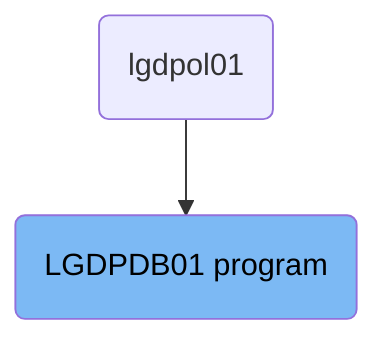

The <SwmToken path="base/src/lgdpdb01.cbl" pos="13:6:6" line-data="       PROGRAM-ID. LGDPDB01.">`LGDPDB01`</SwmToken> program is responsible for handling the deletion of policy information from the <SwmToken path="base/src/lgdpdb01.cbl" pos="124:5:5" line-data="      * initialize DB2 host variables">`DB2`</SwmToken> database. It is used in a flow that starts from the `lgdpol01` program. The program initializes necessary variables, checks the communication area, converts customer and policy numbers, verifies the request ID, and performs the deletion operation.

The <SwmToken path="base/src/lgdpdb01.cbl" pos="13:6:6" line-data="       PROGRAM-ID. LGDPDB01.">`LGDPDB01`</SwmToken> program starts by initializing variables and checking the communication area. It then converts customer and policy numbers to the <SwmToken path="base/src/lgdpdb01.cbl" pos="124:5:5" line-data="      * initialize DB2 host variables">`DB2`</SwmToken> integer format. The program checks if the request ID is valid and, if so, deletes the policy information from the <SwmToken path="base/src/lgdpdb01.cbl" pos="124:5:5" line-data="      * initialize DB2 host variables">`DB2`</SwmToken> database. Finally, it returns control to the caller.

# Where is this program used?

This program is used once, in a flow starting from `lgdpol01` as represented in the following diagram:



Lets' zoom into the flow:

```mermaid
graph TD
  mainline["MAINLINE<br>Program Start"]:::ab9b3e5e1 --> id-2{{"Check if CA-REQUEST-ID is valid"}}
  id-2 -->|No| delete-policy-db2-info["DELETE-POLICY-DB2-INFO<br>Delete policy from DB2"]
  delete-policy-db2-info --> id-3["LGDPVS01<br>Call to LGDPVS01"]
  classDef ab9b3e5e1 color:#000000,fill:#7CB9F4

%% Swimm:
%% graph TD
%%   mainline["MAINLINE<br>Program Start"]:::ab9b3e5e1 --> id-2{{"Check if <SwmToken path="base/src/lgdpdb01.cbl" pos="160:5:9" line-data="           IF ( CA-REQUEST-ID NOT EQUAL TO &#39;01DEND&#39; AND">`CA-REQUEST-ID`</SwmToken> is valid"}}
%%   id-2 -->|No| delete-policy-db2-info["DELETE-POLICY-DB2-INFO<br>Delete policy from DB2"]
%%   delete-policy-db2-info --> id-3["LGDPVS01<br>Call to LGDPVS01"]
%%   classDef ab9b3e5e1 color:#000000,fill:#7CB9F4
```



<SwmSnippet path="/base/src/lgdpdb01.cbl" line="111">

---

## Initializing Variables

First, the program initializes working storage variables and <SwmToken path="base/src/lgdpdb01.cbl" pos="124:5:5" line-data="      * initialize DB2 host variables">`DB2`</SwmToken> host variables. This sets up the necessary environment for the program to run correctly by ensuring all variables are in a known state.

```cobol
       MAINLINE SECTION.

      *----------------------------------------------------------------*
      * Common code                                                    *
      *----------------------------------------------------------------*
      * initialize working storage variables
           INITIALIZE WS-HEADER.
      * set up general variable
           MOVE EIBTRNID TO WS-TRANSID.
           MOVE EIBTRMID TO WS-TERMID.
           MOVE EIBTASKN TO WS-TASKNUM.
      *----------------------------------------------------------------*

      * initialize DB2 host variables
           INITIALIZE DB2-IN-INTEGERS.
```

---

</SwmSnippet>

<SwmSnippet path="/base/src/lgdpdb01.cbl" line="128">

---

## Checking Commarea

Next, the program checks if the commarea (communication area) is received. If not, it issues an ABEND (abnormal end) to terminate the program. It also checks if the commarea is large enough and initializes the commarea return code to zero.

```cobol
      * Check commarea and obtain required details                     *
      *----------------------------------------------------------------*
      * If NO commarea received issue an ABEND
           IF EIBCALEN IS EQUAL TO ZERO
               MOVE ' NO COMMAREA RECEIVED' TO EM-VARIABLE
               PERFORM WRITE-ERROR-MESSAGE
               EXEC CICS ABEND ABCODE('LGCA') NODUMP END-EXEC
           END-IF

      * initialize commarea return code to zero
           MOVE '00' TO CA-RETURN-CODE
           MOVE EIBCALEN TO WS-CALEN.
           SET WS-ADDR-DFHCOMMAREA TO ADDRESS OF DFHCOMMAREA.

      * Check commarea is large enough
           IF EIBCALEN IS LESS THAN WS-CA-HEADER-LEN
             MOVE '98' TO CA-RETURN-CODE
             EXEC CICS RETURN END-EXEC
           END-IF
```

---

</SwmSnippet>

<SwmSnippet path="/base/src/lgdpdb01.cbl" line="148">

---

## Converting Customer and Policy Numbers

Then, the program converts the customer and policy numbers from the commarea to <SwmToken path="base/src/lgdpdb01.cbl" pos="148:17:17" line-data="      * Convert commarea customer &amp; policy nums to DB2 integer format">`DB2`</SwmToken> integer format. This is necessary for the subsequent database operations.

```cobol
      * Convert commarea customer & policy nums to DB2 integer format
           MOVE CA-CUSTOMER-NUM TO DB2-CUSTOMERNUM-INT
           MOVE CA-POLICY-NUM   TO DB2-POLICYNUM-INT
      * and save in error msg field incase required
           MOVE CA-CUSTOMER-NUM TO EM-CUSNUM
           MOVE CA-POLICY-NUM   TO EM-POLNUM
```

---

</SwmSnippet>

<SwmSnippet path="/base/src/lgdpdb01.cbl" line="156">

---

## Checking Request ID

Moving to the main logic, the program checks if the request ID in the commarea is recognized. If not, it sets the return code to '99'. If recognized, it performs the <SwmToken path="base/src/lgdpdb01.cbl" pos="167:3:9" line-data="               PERFORM DELETE-POLICY-DB2-INFO">`DELETE-POLICY-DB2-INFO`</SwmToken> routine and calls the <SwmToken path="base/src/lgdpdb01.cbl" pos="168:9:9" line-data="               EXEC CICS LINK PROGRAM(LGDPVS01)">`LGDPVS01`</SwmToken> program.

```cobol
      * Check request-id in commarea and if recognised ...             *
      * Call routine to delete row from policy table                   *
      *----------------------------------------------------------------*

           IF ( CA-REQUEST-ID NOT EQUAL TO '01DEND' AND
                CA-REQUEST-ID NOT EQUAL TO '01DHOU' AND
                CA-REQUEST-ID NOT EQUAL TO '01DCOM' AND
                CA-REQUEST-ID NOT EQUAL TO '01DMOT' ) Then
      *        Request is not recognised or supported
               MOVE '99' TO CA-RETURN-CODE
           ELSE
               PERFORM DELETE-POLICY-DB2-INFO
               EXEC CICS LINK PROGRAM(LGDPVS01)
                    Commarea(DFHCOMMAREA)
                    LENGTH(32500)
               END-EXEC
           END-IF.
```

---

</SwmSnippet>

<SwmSnippet path="/base/src/lgdpdb01.cbl" line="174">

---

## Returning to Caller

Finally, the program returns control to the caller, completing the mainline section.

```cobol
      * Return to caller
           EXEC CICS RETURN END-EXEC.

       MAINLINE-EXIT.
           EXIT.
```

---

</SwmSnippet>

<SwmSnippet path="/base/src/lgdpdb01.cbl" line="186">

---

## Deleting Policy from <SwmToken path="base/src/lgdpdb01.cbl" pos="186:5:5" line-data="       DELETE-POLICY-DB2-INFO.">`DB2`</SwmToken>

Diving into the <SwmToken path="base/src/lgdpdb01.cbl" pos="186:1:7" line-data="       DELETE-POLICY-DB2-INFO.">`DELETE-POLICY-DB2-INFO`</SwmToken> routine, it deletes the appropriate row from the policy table in the <SwmToken path="base/src/lgdpdb01.cbl" pos="186:5:5" line-data="       DELETE-POLICY-DB2-INFO.">`DB2`</SwmToken> database. If the SQL operation is not successful, it sets the return code to '90' and performs the <SwmToken path="base/src/lgdpdb01.cbl" pos="200:3:7" line-data="               PERFORM WRITE-ERROR-MESSAGE">`WRITE-ERROR-MESSAGE`</SwmToken> routine.

```cobol
       DELETE-POLICY-DB2-INFO.

           MOVE ' DELETE POLICY  ' TO EM-SQLREQ
           EXEC SQL
             DELETE
               FROM POLICY
               WHERE ( CUSTOMERNUMBER = :DB2-CUSTOMERNUM-INT AND
                       POLICYNUMBER  = :DB2-POLICYNUM-INT      )
           END-EXEC

      *    Treat SQLCODE 0 and SQLCODE 100 (record not found) as
      *    successful - end result is record does not exist
           IF SQLCODE NOT EQUAL 0 Then
               MOVE '90' TO CA-RETURN-CODE
               PERFORM WRITE-ERROR-MESSAGE
               EXEC CICS RETURN END-EXEC
           END-IF.
```

---

</SwmSnippet>

&nbsp;

*This is an auto-generated document by Swimm 🌊 and has not yet been verified by a human*

<SwmMeta version="3.0.0" repo-id="Z2l0aHViJTNBJTNBa3luZHJ5bC1jaWNzLWdlbmFwcCUzQSUzQVN3aW1tLURlbW8=" repo-name="kyndryl-cics-genapp"><sup>Powered by [Swimm](/)</sup></SwmMeta>
