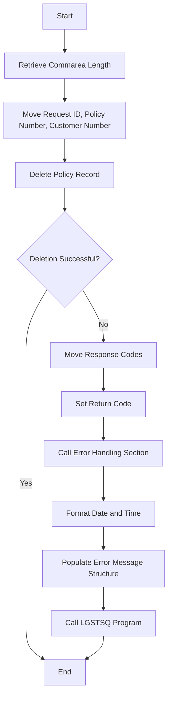

This doc will cover the <SwmToken path="base/src/lgdpvs01.cbl" pos="11:6:6" line-data="       PROGRAM-ID. LGDPVS01.">`LGDPVS01`</SwmToken> program. We'll cover:

1. What the Program Does
2. Program Flow
3. Program Sections

## What the Program Does

The <SwmToken path="base/src/lgdpvs01.cbl" pos="11:6:6" line-data="       PROGRAM-ID. LGDPVS01.">`LGDPVS01`</SwmToken> program is designed to delete a policy record from a VSAM KSDS file. The program reads the policy information from the communication area, attempts to delete the policy record, and handles any errors that occur during the deletion process.

## Program Flow

The program flow of <SwmToken path="base/src/lgdpvs01.cbl" pos="11:6:6" line-data="       PROGRAM-ID. LGDPVS01.">`LGDPVS01`</SwmToken> is as follows:

1. Retrieve the length of the communication area.
2. Move the request ID, policy number, and customer number from the communication area to working storage.
3. Attempt to delete the policy record from the VSAM KSDS file.
4. If the deletion is unsuccessful, move the response codes to working storage, set the return code, and call the error handling section.
5. If an error occurs, format the current date and time, populate the error message structure, and call the LGSTSQ program to process the error message.



<SwmSnippet path="/base/src/lgdpvs01.cbl" line="72">

---

### MAINLINE SECTION

First, the program retrieves the length of the communication area and moves the request ID, policy number, and customer number from the communication area to working storage. Then, it attempts to delete the policy record from the VSAM KSDS file. If the deletion is unsuccessful, it moves the response codes to working storage, sets the return code, and calls the error handling section.

```cobol
       MAINLINE SECTION.
      *
      *---------------------------------------------------------------*
           Move EIBCALEN To WS-Commarea-Len.
      *---------------------------------------------------------------*
           Move CA-Request-ID(4:1) To WF-Request-ID
           Move CA-Policy-Num      To WF-Policy-Num
           Move CA-Customer-Num    To WF-Customer-Num
      *---------------------------------------------------------------*
           Exec CICS Delete File('KSDSPOLY')
                     Ridfld(WF-Policy-Key)
                     KeyLength(21)
                     RESP(WS-RESP)
           End-Exec.
           If WS-RESP Not = DFHRESP(NORMAL)
             Move EIBRESP2 To WS-RESP2
             MOVE '81' TO CA-RETURN-CODE
             PERFORM WRITE-ERROR-MESSAGE
             EXEC CICS RETURN END-EXEC
           End-If.
```

---

</SwmSnippet>

<SwmSnippet path="/base/src/lgdpvs01.cbl" line="99">

---

### <SwmToken path="base/src/lgdpvs01.cbl" pos="99:1:5" line-data="       WRITE-ERROR-MESSAGE.">`WRITE-ERROR-MESSAGE`</SwmToken>

Next, if an error occurs, the program formats the current date and time, populates the error message structure, and calls the LGSTSQ program to process the error message. The LGSTSQ program processes messages by determining their source, potentially modifying the queue name based on the message content, and writing the messages to specified queues in a CICS environment.

```cobol
       WRITE-ERROR-MESSAGE.
           EXEC CICS ASKTIME ABSTIME(WS-ABSTIME)
           END-EXEC
           EXEC CICS FORMATTIME ABSTIME(WS-ABSTIME)
                     MMDDYYYY(WS-DATE)
                     TIME(WS-TIME)
           END-EXEC
      *
           MOVE WS-DATE TO EM-DATE
           MOVE WS-TIME TO EM-TIME
           Move CA-Customer-Num To EM-CUSNUM 
           Move CA-POLICY-NUM To EM-POLNUM 
           Move WS-RESP         To EM-RespRC
           Move WS-RESP2        To EM-Resp2RC
           EXEC CICS LINK PROGRAM('LGSTSQ')
                     COMMAREA(ERROR-MSG)
                     LENGTH(LENGTH OF ERROR-MSG)
           END-EXEC.
           IF EIBCALEN > 0 THEN
             IF EIBCALEN < 91 THEN
               MOVE DFHCOMMAREA(1:EIBCALEN) TO CA-DATA
```

---

</SwmSnippet>

&nbsp;

*This is an auto-generated document by Swimm 🌊 and has not yet been verified by a human*

<SwmMeta version="3.0.0" repo-id="Z2l0aHViJTNBJTNBa3luZHJ5bC1jaWNzLWdlbmFwcCUzQSUzQVN3aW1tLURlbW8=" repo-name="kyndryl-cics-genapp"><sup>Powered by [Swimm](/)</sup></SwmMeta>
