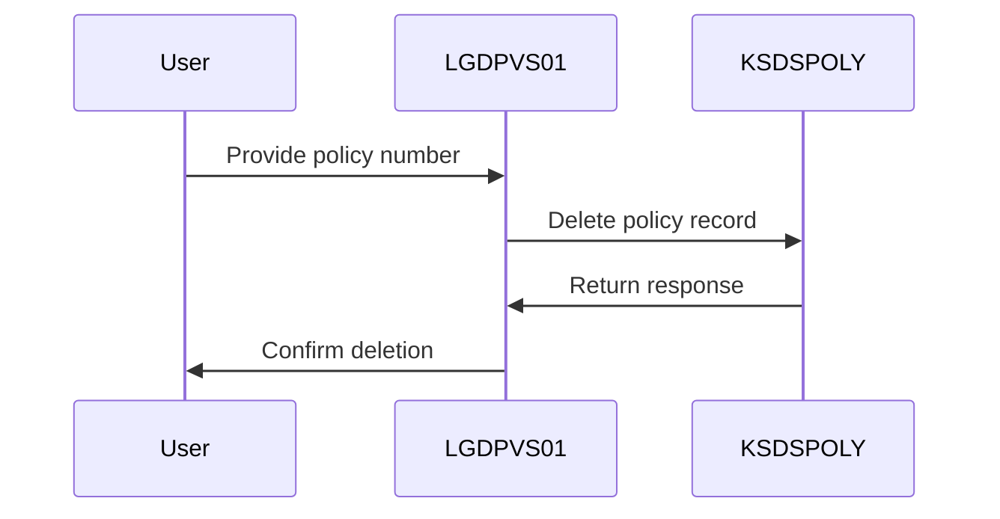
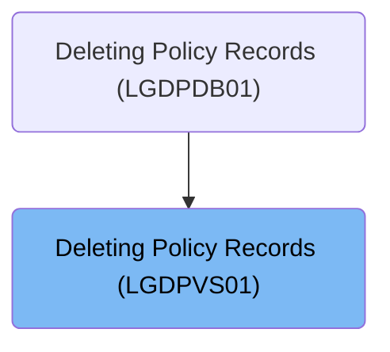

This document describes the process of deleting policy records using the <SwmToken path="base/src/lgdpvs01.cbl" pos="11:6:6" line-data="       PROGRAM-ID. LGDPVS01.">`LGDPVS01`</SwmToken> program. The program is responsible for removing policy records from the VSAM KSDS dataset. It extracts necessary identifiers and executes a CICS command to delete the record.

For example, if a policy number '12345' is provided, the program deletes the corresponding record from the dataset and returns a success response.

The main steps are:

- Extract key identifiers like request ID, policy number, and customer number
- Execute CICS command to delete policy record from 'KSDSPOLY' dataset



## Dependencies

### Program

- LGSTSQ (<SwmPath>[base/src/lgstsq.cbl](base/src/lgstsq.cbl)</SwmPath>) - <SwmLink doc-title="Message Queue Handler (LGSTSQ)">[Message Queue Handler (LGSTSQ)](/.swm/message-queue-handler-lgstsq.e7y8uelv.sw.md)</SwmLink>

### Copybook

- LGCMAREA (<SwmPath>[base/src/lgcmarea.cpy](base/src/lgcmarea.cpy)</SwmPath>)

# Where is this program used?

This program is used once, as represented in the following diagram:



# Initiating Policy Deletion

<SwmSnippet path="/base/src/lgdpvs01.cbl" line="72">

---

<SwmToken path="base/src/lgdpvs01.cbl" pos="72:1:1" line-data="       MAINLINE SECTION.">`MAINLINE`</SwmToken> kicks off the flow by setting up the communication area length and extracting key identifiers like request ID, policy number, and customer number. It then calls a CICS command to delete a policy record from the 'KSDSPOLY' dataset using a specific key, capturing the response to handle any errors.

```cobol
       MAINLINE SECTION.
      *
      *---------------------------------------------------------------*
           Move EIBCALEN To WS-Commarea-Len.
      *---------------------------------------------------------------*
           Move CA-Request-ID(4:1) To WF-Request-ID
           Move CA-Policy-Num      To WF-Policy-Num
           Move CA-Customer-Num    To WF-Customer-Num
      *---------------------------------------------------------------*
           Exec CICS Delete File('KSDSPOLY')
                     Ridfld(WF-Policy-Key)
                     KeyLength(21)
                     RESP(WS-RESP)
           End-Exec.
```

---

</SwmSnippet>

&nbsp;

*This is an auto-generated document by Swimm 🌊 and has not yet been verified by a human*

<SwmMeta version="3.0.0" repo-id="Z2l0aHViJTNBJTNBa3luZHJ5bC1jaWNzLWdlbmFwcCUzQSUzQVN3aW1tLURlbW8=" repo-name="kyndryl-cics-genapp"><sup>Powered by [Swimm](/)</sup></SwmMeta>
