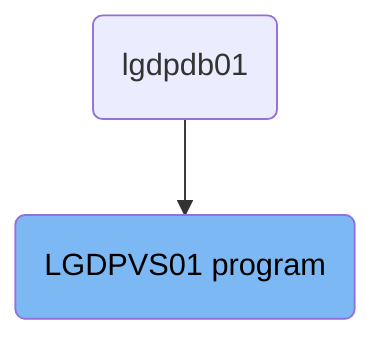
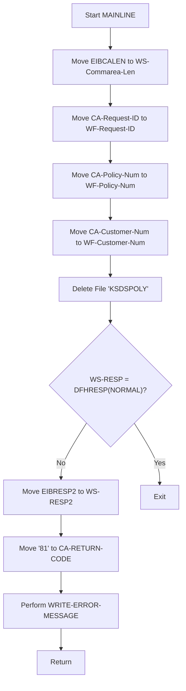

The <SwmToken path="base/src/lgdpvs01.cbl" pos="11:6:6" line-data="       PROGRAM-ID. LGDPVS01.">`LGDPVS01`</SwmToken> program is responsible for deleting insurance policy records from the database. This is achieved by moving necessary data from the communication area to working fields, executing a CICS command to delete the policy record, and handling the response to ensure proper error logging and message handling.

The <SwmToken path="base/src/lgdpvs01.cbl" pos="11:6:6" line-data="       PROGRAM-ID. LGDPVS01.">`LGDPVS01`</SwmToken> program starts by setting up the length of the communication area. It then moves the request ID, policy number, and customer number to working fields. Next, it deletes the policy record from the database and checks the response. If the delete operation fails, it logs the error details and links to another program to handle the error message.

# Where is this program used?

This program is used once, in a flow starting from `lgdpdb01` as represented in the following diagram:



Lets' zoom into the flow:



<SwmSnippet path="/base/src/lgdpvs01.cbl" line="75">

---

## Moving EIBCALEN to <SwmToken path="base/src/lgdpvs01.cbl" pos="75:7:11" line-data="           Move EIBCALEN To WS-Commarea-Len.">`WS-Commarea-Len`</SwmToken>

First, we move the length of the communication area (<SwmToken path="base/src/lgdpvs01.cbl" pos="75:3:3" line-data="           Move EIBCALEN To WS-Commarea-Len.">`EIBCALEN`</SwmToken>) to <SwmToken path="base/src/lgdpvs01.cbl" pos="75:7:11" line-data="           Move EIBCALEN To WS-Commarea-Len.">`WS-Commarea-Len`</SwmToken>. This sets up the length of the communication area for further processing.

```cobol
           Move EIBCALEN To WS-Commarea-Len.
```

---

</SwmSnippet>

<SwmSnippet path="/base/src/lgdpvs01.cbl" line="77">

---

## Moving Request and Policy Information

Next, we move the request ID, policy number, and customer number from the communication area (<SwmToken path="base/src/lgdpvs01.cbl" pos="77:3:7" line-data="           Move CA-Request-ID(4:1) To WF-Request-ID">`CA-Request-ID`</SwmToken>, <SwmToken path="base/src/lgdpvs01.cbl" pos="78:3:7" line-data="           Move CA-Policy-Num      To WF-Policy-Num">`CA-Policy-Num`</SwmToken>, <SwmToken path="base/src/lgdpvs01.cbl" pos="79:3:7" line-data="           Move CA-Customer-Num    To WF-Customer-Num">`CA-Customer-Num`</SwmToken>) to working fields (<SwmToken path="base/src/lgdpvs01.cbl" pos="77:16:20" line-data="           Move CA-Request-ID(4:1) To WF-Request-ID">`WF-Request-ID`</SwmToken>, <SwmToken path="base/src/lgdpvs01.cbl" pos="78:11:15" line-data="           Move CA-Policy-Num      To WF-Policy-Num">`WF-Policy-Num`</SwmToken>, <SwmToken path="base/src/lgdpvs01.cbl" pos="79:11:15" line-data="           Move CA-Customer-Num    To WF-Customer-Num">`WF-Customer-Num`</SwmToken>). This prepares the necessary data for the delete operation.

```cobol
           Move CA-Request-ID(4:1) To WF-Request-ID
           Move CA-Policy-Num      To WF-Policy-Num
           Move CA-Customer-Num    To WF-Customer-Num
```

---

</SwmSnippet>

<SwmSnippet path="/base/src/lgdpvs01.cbl" line="81">

---

## Deleting the Policy Record

Then, we execute a CICS command to delete the policy record from the file <SwmToken path="base/src/lgdpvs01.cbl" pos="81:10:10" line-data="           Exec CICS Delete File(&#39;KSDSPOLY&#39;)">`KSDSPOLY`</SwmToken> using the policy key (<SwmToken path="base/src/lgdpvs01.cbl" pos="82:3:7" line-data="                     Ridfld(WF-Policy-Key)">`WF-Policy-Key`</SwmToken>). The response is stored in <SwmToken path="base/src/lgdpvs01.cbl" pos="84:3:5" line-data="                     RESP(WS-RESP)">`WS-RESP`</SwmToken>.

```cobol
           Exec CICS Delete File('KSDSPOLY')
                     Ridfld(WF-Policy-Key)
                     KeyLength(21)
                     RESP(WS-RESP)
           End-Exec.
```

---

</SwmSnippet>

<SwmSnippet path="/base/src/lgdpvs01.cbl" line="86">

---

## Handling Delete Response

If the delete operation is not successful (<SwmToken path="base/src/lgdpvs01.cbl" pos="86:3:5" line-data="           If WS-RESP Not = DFHRESP(NORMAL)">`WS-RESP`</SwmToken> is not equal to <SwmToken path="base/src/lgdpvs01.cbl" pos="86:11:14" line-data="           If WS-RESP Not = DFHRESP(NORMAL)">`DFHRESP(NORMAL)`</SwmToken>), we move the extended response code (<SwmToken path="base/src/lgdpvs01.cbl" pos="87:3:3" line-data="             Move EIBRESP2 To WS-RESP2">`EIBRESP2`</SwmToken>) to <SwmToken path="base/src/lgdpvs01.cbl" pos="87:7:9" line-data="             Move EIBRESP2 To WS-RESP2">`WS-RESP2`</SwmToken>, set the return code to '81', perform the <SwmToken path="base/src/lgdpvs01.cbl" pos="89:3:7" line-data="             PERFORM WRITE-ERROR-MESSAGE">`WRITE-ERROR-MESSAGE`</SwmToken> routine, and return control to CICS.

```cobol
           If WS-RESP Not = DFHRESP(NORMAL)
             Move EIBRESP2 To WS-RESP2
             MOVE '81' TO CA-RETURN-CODE
             PERFORM WRITE-ERROR-MESSAGE
             EXEC CICS RETURN END-EXEC
           End-If.
```

---

</SwmSnippet>

<SwmSnippet path="/base/src/lgdpvs01.cbl" line="99">

---

## Writing Error Message

The <SwmToken path="base/src/lgdpvs01.cbl" pos="99:1:5" line-data="       WRITE-ERROR-MESSAGE.">`WRITE-ERROR-MESSAGE`</SwmToken> routine logs the error details including the date, time, customer number, policy number, and response codes. It then links to the <SwmToken path="base/src/lgdpvs01.cbl" pos="113:10:10" line-data="           EXEC CICS LINK PROGRAM(&#39;LGSTSQ&#39;)">`LGSTSQ`</SwmToken> program to handle the error message.

More about LGSTSQ: <SwmLink doc-title="Handling Messages (LGSTSQ)">[Handling Messages (LGSTSQ)](/.swm/handling-messages-lgstsq.o6o7rslw.sw.md)</SwmLink>

```cobol
       WRITE-ERROR-MESSAGE.
           EXEC CICS ASKTIME ABSTIME(WS-ABSTIME)
           END-EXEC
           EXEC CICS FORMATTIME ABSTIME(WS-ABSTIME)
                     MMDDYYYY(WS-DATE)
                     TIME(WS-TIME)
           END-EXEC
      *
           MOVE WS-DATE TO EM-DATE
           MOVE WS-TIME TO EM-TIME
           Move CA-Customer-Num To EM-CUSNUM 
           Move CA-POLICY-NUM To EM-POLNUM 
           Move WS-RESP         To EM-RespRC
           Move WS-RESP2        To EM-Resp2RC
           EXEC CICS LINK PROGRAM('LGSTSQ')
                     COMMAREA(ERROR-MSG)
                     LENGTH(LENGTH OF ERROR-MSG)
           END-EXEC.
           IF EIBCALEN > 0 THEN
             IF EIBCALEN < 91 THEN
               MOVE DFHCOMMAREA(1:EIBCALEN) TO CA-DATA
```

---

</SwmSnippet>

&nbsp;

*This is an auto-generated document by Swimm 🌊 and has not yet been verified by a human*

<SwmMeta version="3.0.0" repo-id="Z2l0aHViJTNBJTNBa3luZHJ5bC1jaWNzLWdlbmFwcCUzQSUzQVN3aW1tLURlbW8=" repo-name="kyndryl-cics-genapp"><sup>Powered by [Swimm](https://app.swimm.io/)</sup></SwmMeta>
