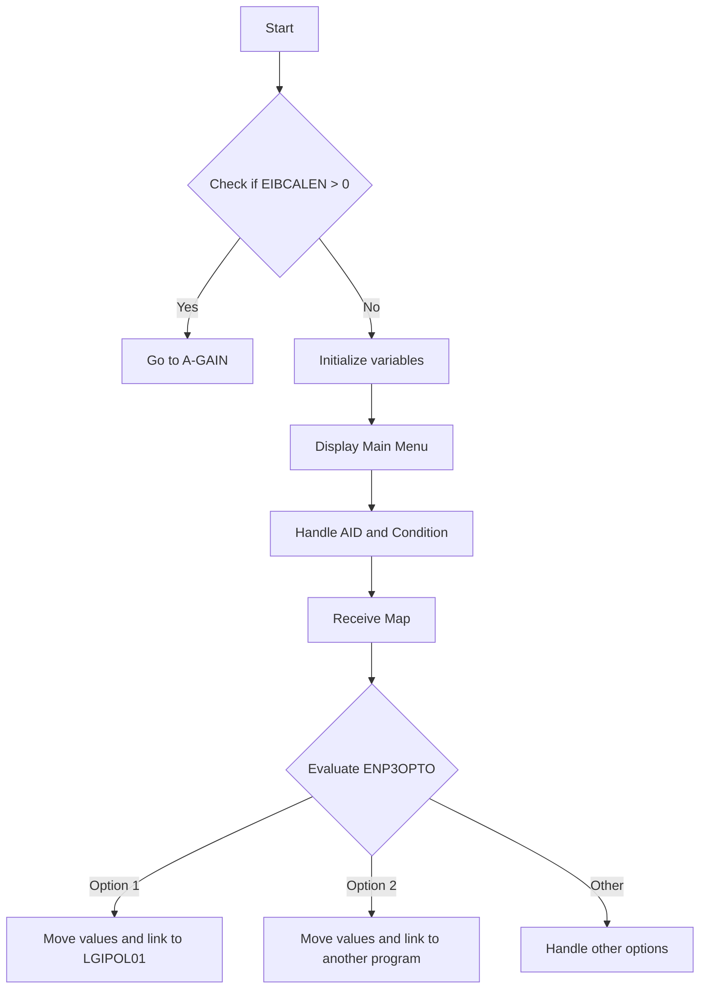

The <SwmToken path="base/src/lgastat1.cbl" pos="7:6:6" line-data="       PROGRAM-ID. LGASTAT1.">`LGASTAT1`</SwmToken> program is responsible for displaying the main menu and handling user input in the general insurance application. It achieves this by checking the communication area length, initializing variables, displaying the main menu, setting up handlers for user actions, receiving user input, and evaluating the user's selection to link to the appropriate program.

The <SwmToken path="base/src/lgastat1.cbl" pos="7:6:6" line-data="       PROGRAM-ID. LGASTAT1.">`LGASTAT1`</SwmToken> program starts by checking if there is any data in the communication area. If not, it initializes necessary variables and displays the main menu to the user. It then sets up handlers to manage user actions and receives the user's input from the main menu. Finally, it evaluates the user's selection and links to the appropriate program based on the user's choice.

Lets' zoom into the flow:



<SwmSnippet path="/base/src/lgastat1.cbl" line="171">

---

## Checking EIBCALEN

First, the program checks if <SwmToken path="base/src/lgastat1.cbl" pos="77:3:3" line-data="           MOVE EIBCALEN TO WS-CALEN.">`EIBCALEN`</SwmToken> (which indicates the length of the communication area) is greater than 0. If it is, the program jumps to the `A-GAIN` label to handle repeated execution.

```cobol

```

---

</SwmSnippet>

<SwmSnippet path="/base/src/lgastat1.cbl" line="174">

---

## Initializing Variables

Next, the program initializes several variables, including `SSMAPP3I`, `SSMAPP3O`, and `COMM-AREA`. It also sets initial values for `ENP3CNOO`, `ENP3PNOO`, `ENP3VALO`, and `ENP3BEDO` to prepare for user input handling.

```cobol

```

---

</SwmSnippet>

<SwmSnippet path="/base/src/lgastat1.cbl" line="181">

---

## Displaying Main Menu

Then, the program displays the main menu by sending the `SSMAPP3` map using the <SwmToken path="base/src/lgastat1.cbl" pos="79:3:3" line-data="           Exec CICS Get Container(WS-CHANname1)">`CICS`</SwmToken>` SEND MAP` command. This allows the user to interact with the application.

```cobol

```

---

</SwmSnippet>

<SwmSnippet path="/base/src/lgastat1.cbl" line="185">

---

## Handling AID and Condition

Moving to the next step, the program sets up handlers for AID (Attention Identifier) keys and conditions like `MAPFAIL` using the <SwmToken path="base/src/lgastat1.cbl" pos="79:3:3" line-data="           Exec CICS Get Container(WS-CHANname1)">`CICS`</SwmToken>` HANDLE AID` and <SwmToken path="base/src/lgastat1.cbl" pos="79:3:3" line-data="           Exec CICS Get Container(WS-CHANname1)">`CICS`</SwmToken>` HANDLE CONDITION` commands. This ensures that the program can respond to user actions appropriately.

```cobol

```

---

</SwmSnippet>

<SwmSnippet path="/base/src/lgastat1.cbl" line="191">

---

## Receiving Map

Next, the program receives the map `SSMAPP3` into the `SSMAPP3I` variable using the <SwmToken path="base/src/lgastat1.cbl" pos="79:3:3" line-data="           Exec CICS Get Container(WS-CHANname1)">`CICS`</SwmToken>` RECEIVE MAP` command. This captures the user's input from the main menu.

```cobol

```

---

</SwmSnippet>

<SwmSnippet path="/base/src/lgastat1.cbl" line="194">

---

## Evaluating User Input

Going into the evaluation step, the program checks the value of `ENP3OPTO` to determine the user's selection. For example, if the user selects option '1', the program moves specific values to <SwmToken path="base/src/lgastat1.cbl" pos="96:3:7" line-data="               Move CA-REQUEST-ID  To GENAcounter">`CA-REQUEST-ID`</SwmToken>, `CA-CUSTOMER-NUM`, and `CA-POLICY-NUM`, and then links to the `LGIPOL01` program using the <SwmToken path="base/src/lgastat1.cbl" pos="79:3:3" line-data="           Exec CICS Get Container(WS-CHANname1)">`CICS`</SwmToken>` LINK `<SwmToken path="base/src/lgastat1.cbl" pos="7:1:1" line-data="       PROGRAM-ID. LGASTAT1.">`PROGRAM`</SwmToken> command.

```cobol

```

---

</SwmSnippet>

&nbsp;

*This is an auto-generated document by Swimm 🌊 and has not yet been verified by a human*

<SwmMeta version="3.0.0" repo-id="Z2l0aHViJTNBJTNBa3luZHJ5bC1jaWNzLWdlbmFwcCUzQSUzQVN3aW1tLURlbW8=" repo-name="kyndryl-cics-genapp"><sup>Powered by [Swimm](/)</sup></SwmMeta>
