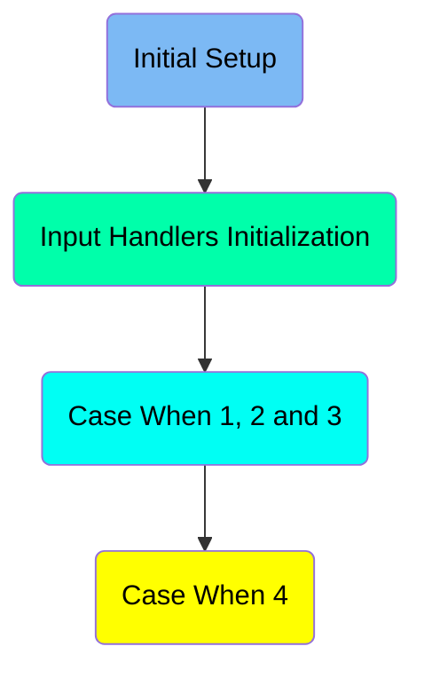
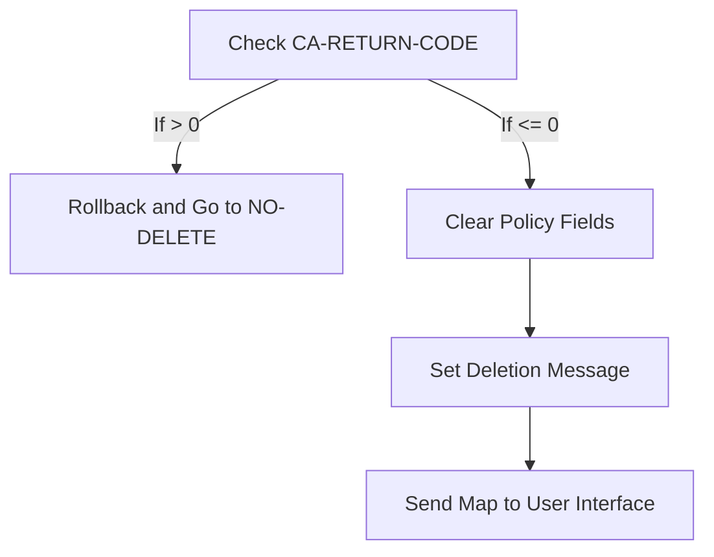
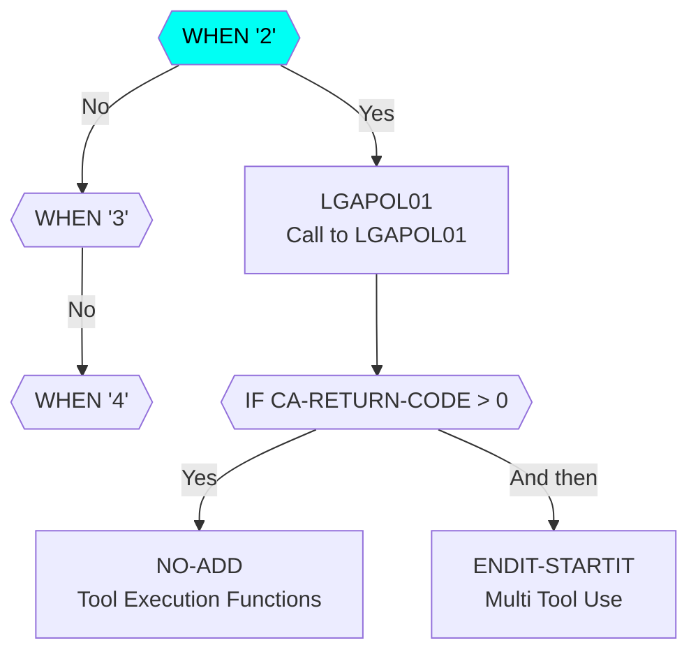

The <SwmToken path="base/src/lgtestp2.cbl" pos="11:6:6" line-data="       PROGRAM-ID. LGTESTP2.">`LGTESTP2`</SwmToken> program handles the deletion of life policies in the system. It ensures that policies are properly deleted by checking return codes, clearing policy fields, setting deletion messages, and updating the user interface. This process is achieved through a series of steps that involve interacting with the user interface and the database.

The flow for handling life policy deletion starts by checking the return code from the previous operation. If the return code indicates an error, a rollback is performed, and the flow jumps to handle the error. If no error is found, the program clears the policy fields, sets a deletion message, and updates the user interface to inform the user that the policy has been successfully deleted.

Here is a high level diagram of the program:



# Initial Setup



<SwmSnippet path="/base/src/lgtestp2.cbl" line="30">

---

## Handling life policy deletion

First, the code checks if <SwmToken path="base/src/lgtestp2.cbl" pos="71:3:7" line-data="                 IF CA-RETURN-CODE &gt; 0">`CA-RETURN-CODE`</SwmToken> (which holds the return code from the previous operation) is greater than 0. If it is, a rollback is performed to undo any changes, and the flow jumps to the <SwmToken path="base/src/lgtestp2.cbl" pos="135:5:7" line-data="                   GO TO NO-DELETE">`NO-DELETE`</SwmToken> section to handle the error.

```cobol
       MAINLINE SECTION.

           IF EIBCALEN > 0
              GO TO A-GAIN.
```

---

</SwmSnippet>

<SwmSnippet path="/base/src/lgtestp2.cbl" line="35">

---

## Clearing policy fields

Next, the code clears various policy fields (<SwmToken path="base/src/lgtestp2.cbl" pos="75:11:11" line-data="                 Move CA-ISSUE-DATE     To  ENP2IDAI">`ENP2IDAI`</SwmToken>, <SwmToken path="base/src/lgtestp2.cbl" pos="76:11:11" line-data="                 Move CA-EXPIRY-DATE    To  ENP2EDAI">`ENP2EDAI`</SwmToken>, <SwmToken path="base/src/lgtestp2.cbl" pos="77:13:13" line-data="                 Move CA-E-FUND-NAME    To  ENP2FNMI">`ENP2FNMI`</SwmToken>, <SwmToken path="base/src/lgtestp2.cbl" pos="78:11:11" line-data="                 Move CA-E-TERM         To  ENP2TERI">`ENP2TERI`</SwmToken>, <SwmToken path="base/src/lgtestp2.cbl" pos="79:13:13" line-data="                 Move CA-E-SUM-ASSURED  To  ENP2SUMI">`ENP2SUMI`</SwmToken>, <SwmToken path="base/src/lgtestp2.cbl" pos="80:13:13" line-data="                 Move CA-E-LIFE-ASSURED To  ENP2LIFI">`ENP2LIFI`</SwmToken>, <SwmToken path="base/src/lgtestp2.cbl" pos="144:7:7" line-data="                 Move Spaces            To  ENP2WPRI">`ENP2WPRI`</SwmToken>, <SwmToken path="base/src/lgtestp2.cbl" pos="145:7:7" line-data="                 Move Spaces            To  ENP2MANI">`ENP2MANI`</SwmToken>, <SwmToken path="base/src/lgtestp2.cbl" pos="146:7:7" line-data="                 Move Spaces            To  ENP2EQUI">`ENP2EQUI`</SwmToken>) by setting them to spaces. This ensures that any previous data is removed before displaying the deletion message.

```cobol
           Initialize SSMAPP2I.
           Initialize SSMAPP2O.
           Initialize COMM-AREA.
           MOVE '0000000000'   To ENP2CNOO.
           MOVE '0000000000'   To ENP2PNOO.

      * Display Main Menu
           EXEC CICS SEND MAP ('SSMAPP2')
                     MAPSET ('SSMAP')
```

---

</SwmSnippet>

<SwmSnippet path="/base/src/lgtestp2.cbl" line="44">

---

## Setting deletion message

Then, the code sets the message <SwmToken path="base/src/lgtestp2.cbl" pos="147:4:8" line-data="                 Move &#39;Life Policy Deleted&#39;">`Life Policy Deleted`</SwmToken> to <SwmToken path="base/src/lgtestp2.cbl" pos="118:3:3" line-data="                   To  ERP2FLDO">`ERP2FLDO`</SwmToken> (which holds the message to be displayed to the user). This informs the user that the life policy has been successfully deleted.

```cobol
                     ERASE
                     END-EXEC.
```

---

</SwmSnippet>

<SwmSnippet path="/base/src/lgtestp2.cbl" line="46">

---

## Updating the user interface

Finally, the code sends the map <SwmToken path="base/src/lgtestp2.cbl" pos="42:11:11" line-data="           EXEC CICS SEND MAP (&#39;SSMAPP2&#39;)">`SSMAPP2`</SwmToken> to the user interface using the <SwmToken path="base/src/lgtestp2.cbl" pos="42:1:7" line-data="           EXEC CICS SEND MAP (&#39;SSMAPP2&#39;)">`EXEC CICS SEND MAP`</SwmToken> command. This updates the terminal screen to reflect the changes made, including the deletion message.

```cobol

       A-GAIN.
```

---

</SwmSnippet>

# Input Handlers Initialization

This is the next section of the flow.

```mermaid
graph TD
  A[Check CA-RETURN-CODE] -->|When '4'| B[Set CA-REQUEST-ID to '01IEND']
  B --> C[Set CA-CUSTOMER-NUM]
  C --> D[Set CA-POLICY-NUM]
  D --> E[Link to LGIPOL01 program]

%% Swimm:
%% graph TD
%%   A[Check CA-RETURN-CODE] -->|When '4'| B[Set <SwmToken path="base/src/lgtestp2.cbl" pos="64:9:13" line-data="                 Move &#39;01IEND&#39;   To CA-REQUEST-ID">`CA-REQUEST-ID`</SwmToken> to '01IEND']
%%   B --> C[Set CA-CUSTOMER-NUM]
%%   C --> D[Set CA-POLICY-NUM]
%%   D --> E[Link to <SwmToken path="base/src/lgtestp2.cbl" pos="67:10:10" line-data="                 EXEC CICS LINK PROGRAM(&#39;LGIPOL01&#39;)">`LGIPOL01`</SwmToken> program]
```



<SwmSnippet path="/base/src/lgtestp2.cbl" line="52">

---

## Handling the '4' case for policy information

Next, when the <SwmToken path="base/src/lgtestp2.cbl" pos="71:3:7" line-data="                 IF CA-RETURN-CODE &gt; 0">`CA-RETURN-CODE`</SwmToken> is '4', the program prepares to handle a policy information request. It sets the <SwmToken path="base/src/lgtestp2.cbl" pos="64:9:13" line-data="                 Move &#39;01IEND&#39;   To CA-REQUEST-ID">`CA-REQUEST-ID`</SwmToken> to <SwmToken path="base/src/lgtestp2.cbl" pos="64:4:4" line-data="                 Move &#39;01IEND&#39;   To CA-REQUEST-ID">`01IEND`</SwmToken>, which indicates the type of request being made. Then, it moves the customer number (<SwmToken path="base/src/lgtestp2.cbl" pos="38:9:9" line-data="           MOVE &#39;0000000000&#39;   To ENP2CNOO.">`ENP2CNOO`</SwmToken>) and policy number (<SwmToken path="base/src/lgtestp2.cbl" pos="39:9:9" line-data="           MOVE &#39;0000000000&#39;   To ENP2PNOO.">`ENP2PNOO`</SwmToken>) into the communication area. Finally, it links to the <SwmToken path="base/src/lgtestp2.cbl" pos="67:10:10" line-data="                 EXEC CICS LINK PROGRAM(&#39;LGIPOL01&#39;)">`LGIPOL01`</SwmToken> program to process the request.

More about <SwmToken path="base/src/lgtestp2.cbl" pos="67:10:10" line-data="                 EXEC CICS LINK PROGRAM(&#39;LGIPOL01&#39;)">`LGIPOL01`</SwmToken>: <SwmLink doc-title="Handling Policy Inquiries (LGIPOL01)">[Handling Policy Inquiries (LGIPOL01)](/.swm/handling-policy-inquiries-lgipol01.q1xuxpj6.sw.md)</SwmLink>

```cobol
           EXEC CICS HANDLE CONDITION
                     MAPFAIL(ENDIT)
                     END-EXEC.

           EXEC CICS RECEIVE MAP('SSMAPP2')
                     INTO(SSMAPP2I)
                     MAPSET('SSMAP') END-EXEC.
```

---

</SwmSnippet>

# Case When 1, 2 and 3



<SwmSnippet path="/base/src/lgtestp2.cbl" line="60">

---

## Handling Policy Updates

First, the code checks if <SwmToken path="base/src/lgtestp2.cbl" pos="71:3:7" line-data="                 IF CA-RETURN-CODE &gt; 0">`CA-RETURN-CODE`</SwmToken> is greater than 0. If it is, the flow goes to <SwmToken path="base/src/lgtestp2.cbl" pos="72:5:7" line-data="                   GO TO NO-DATA">`NO-DATA`</SwmToken>, indicating no data was found. Otherwise, it proceeds to move various policy details into corresponding fields and sends a map using CICS commands.

```cobol

           EVALUATE ENP2OPTO

             WHEN '1'
                 Move '01IEND'   To CA-REQUEST-ID
                 Move ENP2CNOO   To CA-CUSTOMER-NUM
                 Move ENP2PNOO   To CA-POLICY-NUM
                 EXEC CICS LINK PROGRAM('LGIPOL01')
                           COMMAREA(COMM-AREA)
                           LENGTH(32500)
                 END-EXEC
                 IF CA-RETURN-CODE > 0
                   GO TO NO-DATA
                 END-IF

                 Move CA-ISSUE-DATE     To  ENP2IDAI
                 Move CA-EXPIRY-DATE    To  ENP2EDAI
                 Move CA-E-FUND-NAME    To  ENP2FNMI
                 Move CA-E-TERM         To  ENP2TERI
                 Move CA-E-SUM-ASSURED  To  ENP2SUMI
                 Move CA-E-LIFE-ASSURED To  ENP2LIFI
```

---

</SwmSnippet>

<SwmSnippet path="/base/src/lgtestp2.cbl" line="60">

---

## Sending Responses

Next, the code sends and receives a map using CICS commands to interact with the user interface. It then prepares the data for updating the policy by moving values into the <SwmToken path="base/src/lgtestp2.cbl" pos="68:3:5" line-data="                           COMMAREA(COMM-AREA)">`COMM-AREA`</SwmToken> and calls the <SwmToken path="base/src/lgtestp2.cbl" pos="198:10:10" line-data="                 EXEC CICS LINK PROGRAM(&#39;LGUPOL01&#39;)">`LGUPOL01`</SwmToken> program to update the policy.

More about <SwmToken path="base/src/lgtestp2.cbl" pos="198:10:10" line-data="                 EXEC CICS LINK PROGRAM(&#39;LGUPOL01&#39;)">`LGUPOL01`</SwmToken>: <SwmLink doc-title="Handling Policy Information (LGUPOL01)">[Handling Policy Information (LGUPOL01)](/.swm/handling-policy-information-lgupol01.uutnl1xi.sw.md)</SwmLink>

```cobol

           EVALUATE ENP2OPTO

             WHEN '1'
                 Move '01IEND'   To CA-REQUEST-ID
                 Move ENP2CNOO   To CA-CUSTOMER-NUM
                 Move ENP2PNOO   To CA-POLICY-NUM
                 EXEC CICS LINK PROGRAM('LGIPOL01')
                           COMMAREA(COMM-AREA)
                           LENGTH(32500)
                 END-EXEC
                 IF CA-RETURN-CODE > 0
                   GO TO NO-DATA
                 END-IF

                 Move CA-ISSUE-DATE     To  ENP2IDAI
                 Move CA-EXPIRY-DATE    To  ENP2EDAI
                 Move CA-E-FUND-NAME    To  ENP2FNMI
                 Move CA-E-TERM         To  ENP2TERI
                 Move CA-E-SUM-ASSURED  To  ENP2SUMI
                 Move CA-E-LIFE-ASSURED To  ENP2LIFI
```

---

</SwmSnippet>

<SwmSnippet path="/base/src/lgtestp2.cbl" line="60">

---

## Finalizing the Update

Then, the code checks the <SwmToken path="base/src/lgtestp2.cbl" pos="71:3:7" line-data="                 IF CA-RETURN-CODE &gt; 0">`CA-RETURN-CODE`</SwmToken> again to ensure the update was successful. If the update was successful, it moves the updated policy details back to the interface fields and sends a confirmation message to the user.

```cobol

           EVALUATE ENP2OPTO

             WHEN '1'
                 Move '01IEND'   To CA-REQUEST-ID
                 Move ENP2CNOO   To CA-CUSTOMER-NUM
                 Move ENP2PNOO   To CA-POLICY-NUM
                 EXEC CICS LINK PROGRAM('LGIPOL01')
                           COMMAREA(COMM-AREA)
                           LENGTH(32500)
                 END-EXEC
                 IF CA-RETURN-CODE > 0
                   GO TO NO-DATA
                 END-IF

                 Move CA-ISSUE-DATE     To  ENP2IDAI
                 Move CA-EXPIRY-DATE    To  ENP2EDAI
                 Move CA-E-FUND-NAME    To  ENP2FNMI
                 Move CA-E-TERM         To  ENP2TERI
                 Move CA-E-SUM-ASSURED  To  ENP2SUMI
                 Move CA-E-LIFE-ASSURED To  ENP2LIFI
```

---

</SwmSnippet>

<SwmSnippet path="/base/src/lgtestp2.cbl" line="60">

---

## Handling Invalid Options

Finally, if an invalid option is entered, the code moves an error message to the interface fields and sends it to the user, prompting them to enter a valid option.

```cobol

           EVALUATE ENP2OPTO

             WHEN '1'
                 Move '01IEND'   To CA-REQUEST-ID
                 Move ENP2CNOO   To CA-CUSTOMER-NUM
                 Move ENP2PNOO   To CA-POLICY-NUM
                 EXEC CICS LINK PROGRAM('LGIPOL01')
                           COMMAREA(COMM-AREA)
                           LENGTH(32500)
                 END-EXEC
                 IF CA-RETURN-CODE > 0
                   GO TO NO-DATA
                 END-IF

                 Move CA-ISSUE-DATE     To  ENP2IDAI
                 Move CA-EXPIRY-DATE    To  ENP2EDAI
                 Move CA-E-FUND-NAME    To  ENP2FNMI
                 Move CA-E-TERM         To  ENP2TERI
                 Move CA-E-SUM-ASSURED  To  ENP2SUMI
                 Move CA-E-LIFE-ASSURED To  ENP2LIFI
```

---

</SwmSnippet>

## Interim Summary

So far, we saw how the program handles life policy deletion, including checking return codes, clearing policy fields, setting deletion messages, and updating the user interface. Now, we will focus on the initialization of input handlers and the handling of different cases for policy updates.

# Case When 4

```mermaid
graph TD
  A[Check if option is 4] -->|Yes| B[Call LGIPOL01 to insert policy]
  B --> C{Check if CA-RETURN-CODE > 0}
  C -->|Yes| D[Display 'No data was returned.' message]
  C -->|And then| E[Call LGUPOL01 to update policy]

%% Swimm:
%% graph TD
%%   A[Check if option is 4] -->|Yes| B[Call <SwmToken path="base/src/lgtestp2.cbl" pos="67:10:10" line-data="                 EXEC CICS LINK PROGRAM(&#39;LGIPOL01&#39;)">`LGIPOL01`</SwmToken> to insert policy]
%%   B --> C{Check if <SwmToken path="base/src/lgtestp2.cbl" pos="71:3:7" line-data="                 IF CA-RETURN-CODE &gt; 0">`CA-RETURN-CODE`</SwmToken> > 0}
%%   C -->|Yes| D[Display 'No data was returned.' message]
%%   C -->|And then| E[Call <SwmToken path="base/src/lgtestp2.cbl" pos="198:10:10" line-data="                 EXEC CICS LINK PROGRAM(&#39;LGUPOL01&#39;)">`LGUPOL01`</SwmToken> to update policy]
```



<SwmSnippet path="/base/src/lgtestp2.cbl" line="126">

---

## Handling policy updates and error management

First, the program checks if the user has selected option '4'. If yes, it proceeds to call the <SwmToken path="base/src/lgtestp2.cbl" pos="67:10:10" line-data="                 EXEC CICS LINK PROGRAM(&#39;LGIPOL01&#39;)">`LGIPOL01`</SwmToken> function to insert a policy. This function is responsible for inserting policy information into the database.

```cobol
                 Move '01DEND'   To CA-REQUEST-ID
                 Move ENP2CNOO   To CA-CUSTOMER-NUM
                 Move ENP2PNOO   To CA-POLICY-NUM
                 EXEC CICS LINK PROGRAM('LGDPOL01')
                           COMMAREA(COMM-AREA)
                           LENGTH(32500)
                 END-EXEC
                 IF CA-RETURN-CODE > 0
                   Exec CICS Syncpoint Rollback End-Exec
                   GO TO NO-DELETE
                 END-IF

                 Move Spaces            To  ENP2IDAI
                 Move Spaces            To  ENP2EDAI
                 Move Spaces            To  ENP2FNMI
                 Move Spaces            To  ENP2TERI
                 Move Spaces            To  ENP2SUMI
                 Move Spaces            To  ENP2LIFI
                 Move Spaces            To  ENP2WPRI
                 Move Spaces            To  ENP2MANI
                 Move Spaces            To  ENP2EQUI
```

---

</SwmSnippet>

<SwmSnippet path="/base/src/lgtestp2.cbl" line="126">

---

### Checking for errors after insertion

Next, the program checks the <SwmToken path="base/src/lgtestp2.cbl" pos="133:3:7" line-data="                 IF CA-RETURN-CODE &gt; 0">`CA-RETURN-CODE`</SwmToken> to determine if there were any errors during the insertion process. If the return code is greater than 0, it indicates an error, and the program moves to the <SwmToken path="base/src/lgtestp2.cbl" pos="72:5:7" line-data="                   GO TO NO-DATA">`NO-DATA`</SwmToken> section to handle the error by displaying a 'No data was returned.' message to the user.

```cobol
                 Move '01DEND'   To CA-REQUEST-ID
                 Move ENP2CNOO   To CA-CUSTOMER-NUM
                 Move ENP2PNOO   To CA-POLICY-NUM
                 EXEC CICS LINK PROGRAM('LGDPOL01')
                           COMMAREA(COMM-AREA)
                           LENGTH(32500)
                 END-EXEC
                 IF CA-RETURN-CODE > 0
                   Exec CICS Syncpoint Rollback End-Exec
                   GO TO NO-DELETE
                 END-IF

                 Move Spaces            To  ENP2IDAI
                 Move Spaces            To  ENP2EDAI
                 Move Spaces            To  ENP2FNMI
                 Move Spaces            To  ENP2TERI
                 Move Spaces            To  ENP2SUMI
                 Move Spaces            To  ENP2LIFI
                 Move Spaces            To  ENP2WPRI
                 Move Spaces            To  ENP2MANI
                 Move Spaces            To  ENP2EQUI
```

---

</SwmSnippet>

<SwmSnippet path="/base/src/lgtestp2.cbl" line="126">

---

### Updating the policy

Then, regardless of the error check, the program proceeds to call the <SwmToken path="base/src/lgtestp2.cbl" pos="198:10:10" line-data="                 EXEC CICS LINK PROGRAM(&#39;LGUPOL01&#39;)">`LGUPOL01`</SwmToken> function to update the policy information. This ensures that any necessary updates to the policy are made even if there was an error during the insertion process.

```cobol
                 Move '01DEND'   To CA-REQUEST-ID
                 Move ENP2CNOO   To CA-CUSTOMER-NUM
                 Move ENP2PNOO   To CA-POLICY-NUM
                 EXEC CICS LINK PROGRAM('LGDPOL01')
                           COMMAREA(COMM-AREA)
                           LENGTH(32500)
                 END-EXEC
                 IF CA-RETURN-CODE > 0
                   Exec CICS Syncpoint Rollback End-Exec
                   GO TO NO-DELETE
                 END-IF

                 Move Spaces            To  ENP2IDAI
                 Move Spaces            To  ENP2EDAI
                 Move Spaces            To  ENP2FNMI
                 Move Spaces            To  ENP2TERI
                 Move Spaces            To  ENP2SUMI
                 Move Spaces            To  ENP2LIFI
                 Move Spaces            To  ENP2WPRI
                 Move Spaces            To  ENP2MANI
                 Move Spaces            To  ENP2EQUI
```

---

</SwmSnippet>

&nbsp;

*This is an auto-generated document by Swimm 🌊 and has not yet been verified by a human*

<SwmMeta version="3.0.0" repo-id="Z2l0aHViJTNBJTNBa3luZHJ5bC1jaWNzLWdlbmFwcCUzQSUzQVN3aW1tLURlbW8=" repo-name="kyndryl-cics-genapp"><sup>Powered by [Swimm](https://app.swimm.io/)</sup></SwmMeta>
