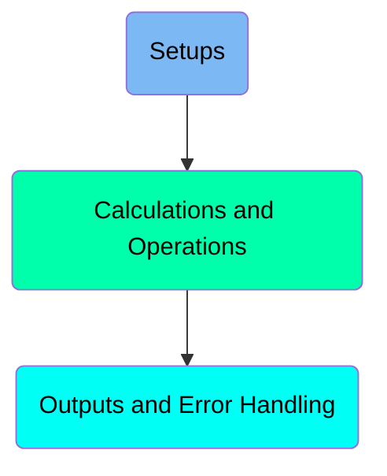
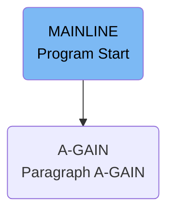
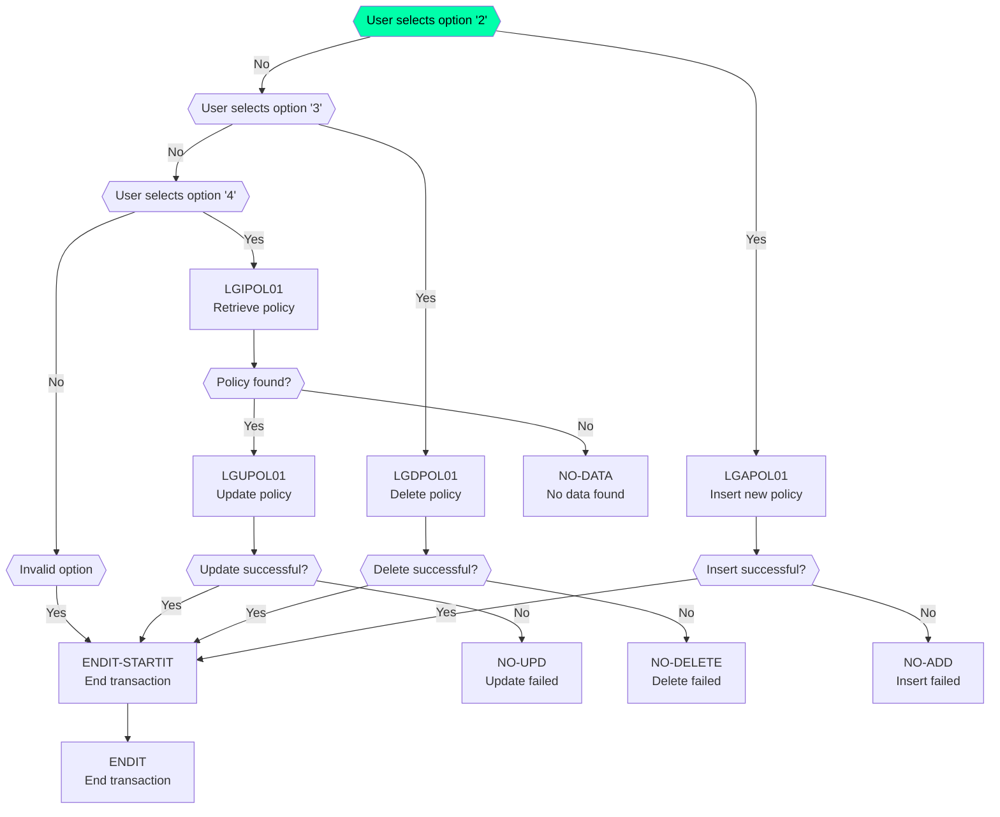
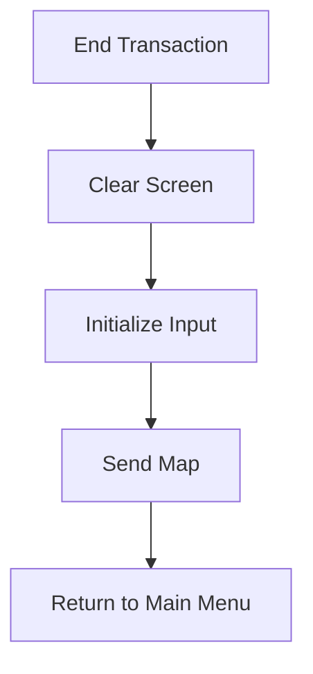

The <SwmToken path="base/src/lgtestp2.cbl" pos="11:6:6" line-data="       PROGRAM-ID. LGTESTP2.">`LGTESTP2`</SwmToken> program is responsible for handling various user interactions related to insurance policies. It achieves this by providing a main menu for users to insert, query, and delete insurance policy information stored in an IBM Db2 database. The program initializes necessary variables, displays the main menu, and processes user inputs to perform the required operations.

The <SwmToken path="base/src/lgtestp2.cbl" pos="11:6:6" line-data="       PROGRAM-ID. LGTESTP2.">`LGTESTP2`</SwmToken> program starts by initializing variables and displaying the main menu to the user. Depending on the user's selection, it can insert a new policy, delete an existing policy, or retrieve and update a policy. If an invalid option is selected, an error message is displayed. The program ensures robust error handling for each operation to maintain data integrity and provide feedback to the user.

Here is a high level diagram of the program:



# Setups



<SwmSnippet path="/base/src/lgtestp2.cbl" line="30">

---

## MAINLINE Section

The <SwmToken path="base/src/lgtestp2.cbl" pos="30:1:1" line-data="       MAINLINE SECTION.">`MAINLINE`</SwmToken> section is the entry point of the program. It first checks if <SwmToken path="base/src/lgtestp2.cbl" pos="32:3:3" line-data="           IF EIBCALEN &gt; 0">`EIBCALEN`</SwmToken> (which holds the length of the communication area) is greater than 0. If true, it transfers control to the <SwmToken path="base/src/lgtestp2.cbl" pos="33:5:7" line-data="              GO TO A-GAIN.">`A-GAIN`</SwmToken> paragraph.

```cobol
       MAINLINE SECTION.

           IF EIBCALEN > 0
              GO TO A-GAIN.

           Initialize SSMAPP2I.
           Initialize SSMAPP2O.
           Initialize COMM-AREA.
           MOVE '0000000000'   To ENP2CNOO.
           MOVE '0000000000'   To ENP2PNOO.

      * Display Main Menu
           EXEC CICS SEND MAP ('SSMAPP2')
                     MAPSET ('SSMAP')
                     ERASE
                     END-EXEC.

       A-GAIN.
```

---

</SwmSnippet>

<SwmSnippet path="/base/src/lgtestp2.cbl" line="35">

---

## Initialization

The program initializes several variables and areas: <SwmToken path="base/src/lgtestp2.cbl" pos="35:3:3" line-data="           Initialize SSMAPP2I.">`SSMAPP2I`</SwmToken>, <SwmToken path="base/src/lgtestp2.cbl" pos="36:3:3" line-data="           Initialize SSMAPP2O.">`SSMAPP2O`</SwmToken>, and <SwmToken path="base/src/lgtestp2.cbl" pos="37:3:5" line-data="           Initialize COMM-AREA.">`COMM-AREA`</SwmToken>. It also sets <SwmToken path="base/src/lgtestp2.cbl" pos="38:9:9" line-data="           MOVE &#39;0000000000&#39;   To ENP2CNOO.">`ENP2CNOO`</SwmToken> and <SwmToken path="base/src/lgtestp2.cbl" pos="39:9:9" line-data="           MOVE &#39;0000000000&#39;   To ENP2PNOO.">`ENP2PNOO`</SwmToken> to '0000000000'. This prepares the program for further processing.

```cobol
           Initialize SSMAPP2I.
           Initialize SSMAPP2O.
           Initialize COMM-AREA.
           MOVE '0000000000'   To ENP2CNOO.
           MOVE '0000000000'   To ENP2PNOO.
```

---

</SwmSnippet>

<SwmSnippet path="/base/src/lgtestp2.cbl" line="41">

---

## Display Main Menu

The program sends the main menu map <SwmToken path="base/src/lgtestp2.cbl" pos="42:11:11" line-data="           EXEC CICS SEND MAP (&#39;SSMAPP2&#39;)">`SSMAPP2`</SwmToken> to the user terminal using the <SwmToken path="base/src/lgtestp2.cbl" pos="42:1:7" line-data="           EXEC CICS SEND MAP (&#39;SSMAPP2&#39;)">`EXEC CICS SEND MAP`</SwmToken> command. This displays the main menu to the user, allowing them to interact with the application.

```cobol
      * Display Main Menu
           EXEC CICS SEND MAP ('SSMAPP2')
                     MAPSET ('SSMAP')
                     ERASE
                     END-EXEC.
```

---

</SwmSnippet>

<SwmSnippet path="/base/src/lgtestp2.cbl" line="47">

---

## <SwmToken path="base/src/lgtestp2.cbl" pos="47:1:3" line-data="       A-GAIN.">`A-GAIN`</SwmToken> Paragraph

The <SwmToken path="base/src/lgtestp2.cbl" pos="47:1:3" line-data="       A-GAIN.">`A-GAIN`</SwmToken> paragraph handles user inputs and conditions. It sets up handlers for AID and condition handling, and then receives the map <SwmToken path="base/src/lgtestp2.cbl" pos="42:11:11" line-data="           EXEC CICS SEND MAP (&#39;SSMAPP2&#39;)">`SSMAPP2`</SwmToken> into <SwmToken path="base/src/lgtestp2.cbl" pos="35:3:3" line-data="           Initialize SSMAPP2I.">`SSMAPP2I`</SwmToken>. This prepares the program to process user inputs from the main menu.

```cobol
       A-GAIN.

           EXEC CICS HANDLE AID
                     CLEAR(CLEARIT)
                     PF3(ENDIT) END-EXEC.
           EXEC CICS HANDLE CONDITION
                     MAPFAIL(ENDIT)
                     END-EXEC.
```

---

</SwmSnippet>

# Calculations and Operations



<SwmSnippet path="/base/src/lgtestp2.cbl" line="90">

---

## Handling Option '2'

First, we handle the case when the user selects option '2'. This involves inserting a new insurance policy. The relevant data is moved into the communication area and the <SwmToken path="base/src/lgtestp2.cbl" pos="105:10:10" line-data="                 EXEC CICS LINK PROGRAM(&#39;LGAPOL01&#39;)">`LGAPOL01`</SwmToken> program is called to perform the insertion. If the insertion is successful, a confirmation message is sent to the user. If not, the transaction is rolled back and an error message is displayed.

```cobol
             WHEN '2'
                 Move '01AEND'          To CA-REQUEST-ID
                 Move ENP2CNOI          To CA-CUSTOMER-NUM
                 Move 0                 To CA-PAYMENT
                 Move 0                 To CA-BROKERID
                 Move '        '        To CA-BROKERSREF
                 Move ENP2IDAI          To CA-ISSUE-DATE
                 Move ENP2EDAI          To CA-EXPIRY-DATE
                 Move ENP2FNMI          To CA-E-FUND-NAME
                 Move ENP2TERI          To CA-E-TERM
                 Move ENP2SUMI          To CA-E-SUM-ASSURED
                 Move ENP2LIFI          To CA-E-LIFE-ASSURED
                 Move ENP2WPRI          To CA-E-WITH-PROFITS
                 Move ENP2MANI          To CA-E-MANAGED-FUND
                 Move ENP2EQUI          To CA-E-EQUITIES
                 EXEC CICS LINK PROGRAM('LGAPOL01')
                           COMMAREA(COMM-AREA)
                           LENGTH(32500)
                 END-EXEC
                 IF CA-RETURN-CODE > 0
                   Exec CICS Syncpoint Rollback End-Exec
```

---

</SwmSnippet>

<SwmSnippet path="/base/src/lgtestp2.cbl" line="125">

---

## Handling Option '3'

Next, we handle the case when the user selects option '3'. This involves deleting an existing insurance policy. The relevant data is moved into the communication area and the <SwmToken path="base/src/lgtestp2.cbl" pos="129:10:10" line-data="                 EXEC CICS LINK PROGRAM(&#39;LGDPOL01&#39;)">`LGDPOL01`</SwmToken> program is called to perform the deletion. If the deletion is successful, a confirmation message is sent to the user. If not, the transaction is rolled back and an error message is displayed.

More about <SwmToken path="base/src/lgtestp2.cbl" pos="129:10:10" line-data="                 EXEC CICS LINK PROGRAM(&#39;LGDPOL01&#39;)">`LGDPOL01`</SwmToken>: <SwmLink doc-title="Deleting Insurance Policies (LGDPOL01)">[Deleting Insurance Policies (LGDPOL01)](/.swm/deleting-insurance-policies-lgdpol01.1gbfsqsp.sw.md)</SwmLink>

```cobol
             WHEN '3'
                 Move '01DEND'   To CA-REQUEST-ID
                 Move ENP2CNOO   To CA-CUSTOMER-NUM
                 Move ENP2PNOO   To CA-POLICY-NUM
                 EXEC CICS LINK PROGRAM('LGDPOL01')
                           COMMAREA(COMM-AREA)
                           LENGTH(32500)
                 END-EXEC
                 IF CA-RETURN-CODE > 0
                   Exec CICS Syncpoint Rollback End-Exec
                   GO TO NO-DELETE
                 END-IF

                 Move Spaces            To  ENP2IDAI
                 Move Spaces            To  ENP2EDAI
                 Move Spaces            To  ENP2FNMI
                 Move Spaces            To  ENP2TERI
                 Move Spaces            To  ENP2SUMI
                 Move Spaces            To  ENP2LIFI
                 Move Spaces            To  ENP2WPRI
                 Move Spaces            To  ENP2MANI
```

---

</SwmSnippet>

<SwmSnippet path="/base/src/lgtestp2.cbl" line="155">

---

## Handling Option '4'

Then, we handle the case when the user selects option '4'. This involves retrieving and updating an existing insurance policy. The relevant data is moved into the communication area and the <SwmToken path="base/src/lgtestp2.cbl" pos="159:10:10" line-data="                 EXEC CICS LINK PROGRAM(&#39;LGIPOL01&#39;)">`LGIPOL01`</SwmToken> program is called to retrieve the policy. If the policy is found, the user is prompted to update the policy details, which are then sent to the <SwmToken path="base/src/lgtestp2.cbl" pos="198:10:10" line-data="                 EXEC CICS LINK PROGRAM(&#39;LGUPOL01&#39;)">`LGUPOL01`</SwmToken> program for updating. If the update is successful, a confirmation message is sent to the user. If not, an error message is displayed.

More about <SwmToken path="base/src/lgtestp2.cbl" pos="159:10:10" line-data="                 EXEC CICS LINK PROGRAM(&#39;LGIPOL01&#39;)">`LGIPOL01`</SwmToken>: <SwmLink doc-title="Inquiring Policy Details (LGIPOL01)">[Inquiring Policy Details (LGIPOL01)](/.swm/inquiring-policy-details-lgipol01.a4iime4v.sw.md)</SwmLink>

```cobol
             WHEN '4'
                 Move '01IEND'   To CA-REQUEST-ID
                 Move ENP2CNOO   To CA-CUSTOMER-NUM
                 Move ENP2PNOO   To CA-POLICY-NUM
                 EXEC CICS LINK PROGRAM('LGIPOL01')
                           COMMAREA(COMM-AREA)
                           LENGTH(32500)
                 END-EXEC
                 IF CA-RETURN-CODE > 0
                   GO TO NO-DATA
                 END-IF

                 Move CA-ISSUE-DATE     To  ENP2IDAI
                 Move CA-EXPIRY-DATE    To  ENP2EDAI
                 Move CA-E-FUND-NAME    To  ENP2FNMI
                 Move CA-E-TERM         To  ENP2TERI
                 Move CA-E-SUM-ASSURED  To  ENP2SUMI
                 Move CA-E-LIFE-ASSURED To  ENP2LIFI
                 Move CA-E-WITH-PROFITS To  ENP2WPRI
                 Move CA-E-MANAGED-FUND To  ENP2MANI
                 Move CA-E-EQUITIES     To  ENP2EQUI
```

---

</SwmSnippet>

<SwmSnippet path="/base/src/lgtestp2.cbl" line="218">

---

## Handling Invalid Options

Finally, we handle the case when the user selects an invalid option. An error message is displayed prompting the user to enter a valid option.

```cobol
             WHEN OTHER

                 Move 'Please enter a valid option'
                   To  ERP2FLDO
                 Move -1 To ENP2OPTL

                 EXEC CICS SEND MAP ('SSMAPP2')
                           FROM(SSMAPP2O)
                           MAPSET ('SSMAP')
                           CURSOR
                 END-EXEC
                 GO TO ENDIT-STARTIT
```

---

</SwmSnippet>

<SwmSnippet path="/base/src/lgtestp2.cbl" line="239">

---

### <SwmToken path="base/src/lgtestp2.cbl" pos="239:1:3" line-data="       ENDIT-STARTIT.">`ENDIT-STARTIT`</SwmToken>

The <SwmToken path="base/src/lgtestp2.cbl" pos="239:1:3" line-data="       ENDIT-STARTIT.">`ENDIT-STARTIT`</SwmToken> paragraph is used to end the transaction and return control to the CICS system.

```cobol
       ENDIT-STARTIT.
           EXEC CICS RETURN
                TRANSID('SSP2')
                COMMAREA(COMM-AREA)
                END-EXEC.
```

---

</SwmSnippet>

<SwmSnippet path="/base/src/lgtestp2.cbl" line="268">

---

### <SwmToken path="base/src/lgtestp2.cbl" pos="268:1:3" line-data="       NO-ADD.">`NO-ADD`</SwmToken>

The <SwmToken path="base/src/lgtestp2.cbl" pos="268:1:3" line-data="       NO-ADD.">`NO-ADD`</SwmToken> paragraph handles errors that occur during the insertion of a new policy. It evaluates the return code and displays an appropriate error message.

```cobol
       NO-ADD.
           Evaluate CA-RETURN-CODE
             When 70
               Move 'Customer does not exist'          To  ERP1FLDO
               Go To ERROR-OUT
             When Other
               Move 'Error Adding Life Policy'        To  ERP1FLDO
               Go To ERROR-OUT
           End-Evaluate.
```

---

</SwmSnippet>

<SwmSnippet path="/base/src/lgtestp2.cbl" line="278">

---

### <SwmToken path="base/src/lgtestp2.cbl" pos="278:1:3" line-data="       NO-UPD.">`NO-UPD`</SwmToken>

The <SwmToken path="base/src/lgtestp2.cbl" pos="278:1:3" line-data="       NO-UPD.">`NO-UPD`</SwmToken> paragraph handles errors that occur during the update of a policy. It displays an error message indicating that the update failed.

```cobol
       NO-UPD.
           Move 'Error Updating Life Policy'       To  ERP2FLDO
           Go To ERROR-OUT.
```

---

</SwmSnippet>

<SwmSnippet path="/base/src/lgtestp2.cbl" line="286">

---

### <SwmToken path="base/src/lgtestp2.cbl" pos="286:1:3" line-data="       NO-DATA.">`NO-DATA`</SwmToken>

The <SwmToken path="base/src/lgtestp2.cbl" pos="286:1:3" line-data="       NO-DATA.">`NO-DATA`</SwmToken> paragraph handles cases where no data is returned during a policy retrieval. It displays an error message indicating that no data was found.

```cobol
       NO-DATA.
           Move 'No data was returned.'            To  ERP2FLDO
           Go To ERROR-OUT.
```

---

</SwmSnippet>

<SwmSnippet path="/base/src/lgtestp2.cbl" line="282">

---

### <SwmToken path="base/src/lgtestp2.cbl" pos="282:1:3" line-data="       NO-DELETE.">`NO-DELETE`</SwmToken>

The <SwmToken path="base/src/lgtestp2.cbl" pos="282:1:3" line-data="       NO-DELETE.">`NO-DELETE`</SwmToken> paragraph handles errors that occur during the deletion of a policy. It displays an error message indicating that the deletion failed.

```cobol
       NO-DELETE.
           Move 'Error Deleting Life Policy'       To  ERP2FLDO
           Go To ERROR-OUT.
```

---

</SwmSnippet>

<SwmSnippet path="/base/src/lgtestp2.cbl" line="245">

---

### ENDIT

The <SwmToken path="base/src/lgtestp2.cbl" pos="245:1:1" line-data="       ENDIT.">`ENDIT`</SwmToken> paragraph is used to send a final message to the user and return control to the CICS system.

```cobol
       ENDIT.
           EXEC CICS SEND TEXT
                     FROM(MSGEND)
                     LENGTH(LENGTH OF MSGEND)
                     ERASE
                     FREEKB
           END-EXEC
           EXEC CICS RETURN
           END-EXEC.
```

---

</SwmSnippet>

## Interim Summary

So far, we saw how the program handles various user options such as inserting, deleting, and retrieving insurance policies, as well as handling invalid options. We also covered the error handling for each of these operations. Now, we will focus on the outputs and error handling mechanisms that ensure the program's robustness and user interaction.

# Outputs and Error Handling



<SwmSnippet path="/base/src/lgtestp2.cbl" line="236">

---

## End Transaction

First, the transaction ends with a <SwmToken path="base/src/lgtestp2.cbl" pos="236:1:5" line-data="           EXEC CICS RETURN">`EXEC CICS RETURN`</SwmToken> command, which signifies the end of the current transaction and returns control to CICS.

```cobol
           EXEC CICS RETURN
           END-EXEC.
```

---

</SwmSnippet>

<SwmSnippet path="/base/src/lgtestp2.cbl" line="255">

---

## Clear Screen

Moving to the <SwmToken path="base/src/lgtestp2.cbl" pos="255:1:1" line-data="       CLEARIT.">`CLEARIT`</SwmToken> paragraph, the screen is cleared and the input map is sent to the user. This prepares the screen for the next operation by initializing the input map and sending it to the user.

```cobol
       CLEARIT.

           Initialize SSMAPP2I.
           EXEC CICS SEND MAP ('SSMAPP2')
                     MAPSET ('SSMAP')
                     MAPONLY
           END-EXEC

           EXEC CICS RETURN
                TRANSID('SSP2')
                COMMAREA(COMM-AREA)
                END-EXEC.
```

---

</SwmSnippet>

<SwmSnippet path="/base/src/lgtestp2.cbl" line="35">

---

## Initialize Input

Next, the input map <SwmToken path="base/src/lgtestp2.cbl" pos="257:3:3" line-data="           Initialize SSMAPP2I.">`SSMAPP2I`</SwmToken> is initialized to ensure that any previous data is cleared and the map is ready for new input.

```cobol
           Initialize SSMAPP2I.
```

---

</SwmSnippet>

<SwmSnippet path="/base/src/lgtestp2.cbl" line="258">

---

## Send Map

Then, the map <SwmToken path="base/src/lgtestp2.cbl" pos="258:11:11" line-data="           EXEC CICS SEND MAP (&#39;SSMAPP2&#39;)">`SSMAPP2`</SwmToken> is sent to the user with the <SwmToken path="base/src/lgtestp2.cbl" pos="258:1:7" line-data="           EXEC CICS SEND MAP (&#39;SSMAPP2&#39;)">`EXEC CICS SEND MAP`</SwmToken> command. This displays the map on the user's screen.

```cobol
           EXEC CICS SEND MAP ('SSMAPP2')
                     MAPSET ('SSMAP')
                     MAPONLY
           END-EXEC
```

---

</SwmSnippet>

<SwmSnippet path="/base/src/lgtestp2.cbl" line="240">

---

## Return to Main Menu

Finally, the transaction returns to the main menu with a <SwmToken path="base/src/lgtestp2.cbl" pos="263:1:5" line-data="           EXEC CICS RETURN">`EXEC CICS RETURN`</SwmToken> command, setting the transaction ID to <SwmToken path="base/src/lgtestp2.cbl" pos="264:4:4" line-data="                TRANSID(&#39;SSP2&#39;)">`SSP2`</SwmToken> and passing the communication area <SwmToken path="base/src/lgtestp2.cbl" pos="265:3:5" line-data="                COMMAREA(COMM-AREA)">`COMM-AREA`</SwmToken>.

```cobol
           EXEC CICS RETURN
                TRANSID('SSP2')
                COMMAREA(COMM-AREA)
                END-EXEC.
```

---

</SwmSnippet>

&nbsp;

*This is an auto-generated document by Swimm 🌊 and has not yet been verified by a human*

<SwmMeta version="3.0.0" repo-id="Z2l0aHViJTNBJTNBa3luZHJ5bC1jaWNzLWdlbmFwcCUzQSUzQVN3aW1tLURlbW8=" repo-name="kyndryl-cics-genapp"><sup>Powered by [Swimm](https://app.swimm.io/)</sup></SwmMeta>
