This document describes the Endowment Policy Menu (<SwmToken path="base/src/lgtestp2.cbl" pos="11:6:6" line-data="       PROGRAM-ID. LGTESTP2.">`LGTESTP2`</SwmToken>) program, which manages endowment policy transactions through a menu-driven interface. The program facilitates user interaction with endowment policy transactions using CICS features.

For example, if a user selects 'Add Policy', the program sets up data for the new policy, links to <SwmToken path="base/src/lgtestp2.cbl" pos="105:10:10" line-data="                 EXEC CICS LINK PROGRAM(&#39;LGAPOL01&#39;)">`LGAPOL01`</SwmToken>, and updates the user interface with a confirmation message.

The main steps are:

- Check communication area length
- Manage insurance transactions
- Initialize data structures
- Send main menu to user
- Handle user inputs and errors
- Process policy inquiries, additions, deletions, or updates
- Send map to display policy details

```mermaid
sequenceDiagram
  participant User
  participant LGTESTP2
  participant CICS
  User->>LGTESTP2: Select transaction
  LGTESTP2->>LGTESTP2: Check communication area length
  LGTESTP2->>LGTESTP2: Manage insurance transactions
  LGTESTP2->>LGTESTP2: Initialize data structures
  LGTESTP2->>User: Send main menu
  User->>LGTESTP2: Provide input
  LGTESTP2->>LGTESTP2: Handle input and errors
  LGTESTP2->>LGTESTP2: Process transaction
  LGTESTP2->>User: Display policy details
  LGTESTP2->>CICS: Return control with transaction ID SSP2

%% Swimm:
%% sequenceDiagram
%%   participant User
%%   participant <SwmToken path="base/src/lgtestp2.cbl" pos="11:6:6" line-data="       PROGRAM-ID. LGTESTP2.">`LGTESTP2`</SwmToken>
%%   participant CICS
%%   User->><SwmToken path="base/src/lgtestp2.cbl" pos="11:6:6" line-data="       PROGRAM-ID. LGTESTP2.">`LGTESTP2`</SwmToken>: Select transaction
%%   <SwmToken path="base/src/lgtestp2.cbl" pos="11:6:6" line-data="       PROGRAM-ID. LGTESTP2.">`LGTESTP2`</SwmToken>->><SwmToken path="base/src/lgtestp2.cbl" pos="11:6:6" line-data="       PROGRAM-ID. LGTESTP2.">`LGTESTP2`</SwmToken>: Check communication area length
%%   <SwmToken path="base/src/lgtestp2.cbl" pos="11:6:6" line-data="       PROGRAM-ID. LGTESTP2.">`LGTESTP2`</SwmToken>->><SwmToken path="base/src/lgtestp2.cbl" pos="11:6:6" line-data="       PROGRAM-ID. LGTESTP2.">`LGTESTP2`</SwmToken>: Manage insurance transactions
%%   <SwmToken path="base/src/lgtestp2.cbl" pos="11:6:6" line-data="       PROGRAM-ID. LGTESTP2.">`LGTESTP2`</SwmToken>->><SwmToken path="base/src/lgtestp2.cbl" pos="11:6:6" line-data="       PROGRAM-ID. LGTESTP2.">`LGTESTP2`</SwmToken>: Initialize data structures
%%   <SwmToken path="base/src/lgtestp2.cbl" pos="11:6:6" line-data="       PROGRAM-ID. LGTESTP2.">`LGTESTP2`</SwmToken>->>User: Send main menu
%%   User->><SwmToken path="base/src/lgtestp2.cbl" pos="11:6:6" line-data="       PROGRAM-ID. LGTESTP2.">`LGTESTP2`</SwmToken>: Provide input
%%   <SwmToken path="base/src/lgtestp2.cbl" pos="11:6:6" line-data="       PROGRAM-ID. LGTESTP2.">`LGTESTP2`</SwmToken>->><SwmToken path="base/src/lgtestp2.cbl" pos="11:6:6" line-data="       PROGRAM-ID. LGTESTP2.">`LGTESTP2`</SwmToken>: Handle input and errors
%%   <SwmToken path="base/src/lgtestp2.cbl" pos="11:6:6" line-data="       PROGRAM-ID. LGTESTP2.">`LGTESTP2`</SwmToken>->><SwmToken path="base/src/lgtestp2.cbl" pos="11:6:6" line-data="       PROGRAM-ID. LGTESTP2.">`LGTESTP2`</SwmToken>: Process transaction
%%   <SwmToken path="base/src/lgtestp2.cbl" pos="11:6:6" line-data="       PROGRAM-ID. LGTESTP2.">`LGTESTP2`</SwmToken>->>User: Display policy details
%%   <SwmToken path="base/src/lgtestp2.cbl" pos="11:6:6" line-data="       PROGRAM-ID. LGTESTP2.">`LGTESTP2`</SwmToken>->>CICS: Return control with transaction ID <SwmToken path="base/src/lgtestp2.cbl" pos="241:4:4" line-data="                TRANSID(&#39;SSP2&#39;)">`SSP2`</SwmToken>
```

- Return control to CICS with transaction ID <SwmToken path="base/src/lgtestp2.cbl" pos="241:4:4" line-data="                TRANSID(&#39;SSP2&#39;)">`SSP2`</SwmToken>



## Dependencies

### Programs

- <SwmToken path="base/src/lgtestp2.cbl" pos="67:10:10" line-data="                 EXEC CICS LINK PROGRAM(&#39;LGIPOL01&#39;)">`LGIPOL01`</SwmToken> (<SwmPath>[base/src/lgipol01.cbl](base/src/lgipol01.cbl)</SwmPath>) - <SwmLink doc-title="Policy Inquiry Logic (LGIPOL01)">[Policy Inquiry Logic (LGIPOL01)](/.swm/policy-inquiry-logic-lgipol01.9ezlc51y.sw.md)</SwmLink>
- LGIPDB01 (<SwmPath>[base/src/lgipdb01.cbl](base/src/lgipdb01.cbl)</SwmPath>) - <SwmLink doc-title="Policy Inquiry (LGIPDB01)">[Policy Inquiry (LGIPDB01)](/.swm/policy-inquiry-lgipdb01.183np482.sw.md)</SwmLink>
- LGSTSQ (<SwmPath>[base/src/lgstsq.cbl](base/src/lgstsq.cbl)</SwmPath>) - <SwmLink doc-title="Message Queue Handler (LGSTSQ)">[Message Queue Handler (LGSTSQ)](/.swm/message-queue-handler-lgstsq.e7y8uelv.sw.md)</SwmLink>
- <SwmToken path="base/src/lgtestp2.cbl" pos="105:10:10" line-data="                 EXEC CICS LINK PROGRAM(&#39;LGAPOL01&#39;)">`LGAPOL01`</SwmToken> (<SwmPath>[base/src/lgapol01.cbl](base/src/lgapol01.cbl)</SwmPath>) - <SwmLink doc-title="Adding Policy Details (LGAPOL01)">[Adding Policy Details (LGAPOL01)](/.swm/adding-policy-details-lgapol01.kinp27r0.sw.md)</SwmLink>
- LGAPDB01 (<SwmPath>[base/src/lgapdb01.cbl](base/src/lgapdb01.cbl)</SwmPath>) - <SwmLink doc-title="Adding Policy Details (LGAPDB01)">[Adding Policy Details (LGAPDB01)](/.swm/adding-policy-details-lgapdb01.9o8n772r.sw.md)</SwmLink>
- LGAPVS01 (<SwmPath>[base/src/lgapvs01.cbl](base/src/lgapvs01.cbl)</SwmPath>) - <SwmLink doc-title="Adding Policy Records (LGAPVS01)">[Adding Policy Records (LGAPVS01)](/.swm/adding-policy-records-lgapvs01.hs8lg2t7.sw.md)</SwmLink>
- <SwmToken path="base/src/lgtestp2.cbl" pos="129:10:10" line-data="                 EXEC CICS LINK PROGRAM(&#39;LGDPOL01&#39;)">`LGDPOL01`</SwmToken> (<SwmPath>[base/src/lgdpol01.cbl](base/src/lgdpol01.cbl)</SwmPath>) - <SwmLink doc-title="Deleting Policy (LGDPOL01)">[Deleting Policy (LGDPOL01)](/.swm/deleting-policy-lgdpol01.m4xoedhy.sw.md)</SwmLink>
- LGDPDB01 (<SwmPath>[base/src/lgdpdb01.cbl](base/src/lgdpdb01.cbl)</SwmPath>) - <SwmLink doc-title="Deleting Policy Records (LGDPDB01)">[Deleting Policy Records (LGDPDB01)](/.swm/deleting-policy-records-lgdpdb01.t1v6h4u2.sw.md)</SwmLink>
- LGDPVS01 (<SwmPath>[base/src/lgdpvs01.cbl](base/src/lgdpvs01.cbl)</SwmPath>) - <SwmLink doc-title="Deleting Policy Records (LGDPVS01)">[Deleting Policy Records (LGDPVS01)](/.swm/deleting-policy-records-lgdpvs01.c9cypss1.sw.md)</SwmLink>
- <SwmToken path="base/src/lgtestp2.cbl" pos="198:10:10" line-data="                 EXEC CICS LINK PROGRAM(&#39;LGUPOL01&#39;)">`LGUPOL01`</SwmToken> (<SwmPath>[base/src/lgupol01.cbl](base/src/lgupol01.cbl)</SwmPath>) - <SwmLink doc-title="Updating Policy Details (LGUPOL01)">[Updating Policy Details (LGUPOL01)](/.swm/updating-policy-details-lgupol01.5nve4qbm.sw.md)</SwmLink>
- LGUPDB01 (<SwmPath>[base/src/lgupdb01.cbl](base/src/lgupdb01.cbl)</SwmPath>) - <SwmLink doc-title="Updating Policy Details (LGUPDB01)">[Updating Policy Details (LGUPDB01)](/.swm/updating-policy-details-lgupdb01.17dw3gy8.sw.md)</SwmLink>
- LGUPVS01 (<SwmPath>[base/src/lgupvs01.cbl](base/src/lgupvs01.cbl)</SwmPath>) - <SwmLink doc-title="Updating Policy Records (LGUPVS01)">[Updating Policy Records (LGUPVS01)](/.swm/updating-policy-records-lgupvs01.j9n26r47.sw.md)</SwmLink>

### Copybooks

- SQLCA
- LGPOLICY (<SwmPath>[base/src/lgpolicy.cpy](base/src/lgpolicy.cpy)</SwmPath>)
- LGCMAREA (<SwmPath>[base/src/lgcmarea.cpy](base/src/lgcmarea.cpy)</SwmPath>)
- SSMAP

# Initialize and Prepare Transaction

```mermaid
%%{init: {"flowchart": {"defaultRenderer": "elk"}} }%%
flowchart TD
    node1[Check communication area length] --> node2{Process transaction again?}
    click node1 openCode "base/src/lgtestp2.cbl:32:33"
    node2 -->|Yes| node3[Manage insurance transactions]
    click node2 openCode "base/src/lgtestp2.cbl:33:33"
    click node3 openCode "base/src/lgtestp2.cbl:47:47"
    node2 -->|No| node4[Initialize data structures]
    click node4 openCode "base/src/lgtestp2.cbl:35:39"
    node4 --> node5[Send main menu to user]
    click node5 openCode "base/src/lgtestp2.cbl:42:45"


subgraph node2 [A-GAIN]
  sgmain_1_node1[Return control to CICS with transaction ID SSP2]
  click sgmain_1_node1 openCode "base/src/lgtestp2.cbl:239:243"
end

%% Swimm:
%% %%{init: {"flowchart": {"defaultRenderer": "elk"}} }%%
%% flowchart TD
%%     node1[Check communication area length] --> node2{Process transaction again?}
%%     click node1 openCode "<SwmPath>[base/src/lgtestp2.cbl](base/src/lgtestp2.cbl)</SwmPath>:32:33"
%%     node2 -->|Yes| node3[Manage insurance transactions]
%%     click node2 openCode "<SwmPath>[base/src/lgtestp2.cbl](base/src/lgtestp2.cbl)</SwmPath>:33:33"
%%     click node3 openCode "<SwmPath>[base/src/lgtestp2.cbl](base/src/lgtestp2.cbl)</SwmPath>:47:47"
%%     node2 -->|No| node4[Initialize data structures]
%%     click node4 openCode "<SwmPath>[base/src/lgtestp2.cbl](base/src/lgtestp2.cbl)</SwmPath>:35:39"
%%     node4 --> node5[Send main menu to user]
%%     click node5 openCode "<SwmPath>[base/src/lgtestp2.cbl](base/src/lgtestp2.cbl)</SwmPath>:42:45"
%% 
%% 
%% subgraph node2 [<SwmToken path="base/src/lgtestp2.cbl" pos="33:5:7" line-data="              GO TO A-GAIN.">`A-GAIN`</SwmToken>]
%%   sgmain_1_node1[Return control to CICS with transaction ID <SwmToken path="base/src/lgtestp2.cbl" pos="241:4:4" line-data="                TRANSID(&#39;SSP2&#39;)">`SSP2`</SwmToken>]
%%   click sgmain_1_node1 openCode "<SwmPath>[base/src/lgtestp2.cbl](base/src/lgtestp2.cbl)</SwmPath>:239:243"
%% end
```



## Transaction Completion and Re-entry

<SwmSnippet path="/base/src/lgtestp2.cbl" line="239">

---

<SwmToken path="base/src/lgtestp2.cbl" pos="239:1:3" line-data="       ENDIT-STARTIT.">`ENDIT-STARTIT`</SwmToken> ends the transaction and sets it up for re-entry using <SwmToken path="base/src/lgtestp2.cbl" pos="241:4:4" line-data="                TRANSID(&#39;SSP2&#39;)">`SSP2`</SwmToken> and <SwmToken path="base/src/lgtestp2.cbl" pos="242:3:5" line-data="                COMMAREA(COMM-AREA)">`COMM-AREA`</SwmToken>.

```cobol
       ENDIT-STARTIT.
           EXEC CICS RETURN
                TRANSID('SSP2')
                COMMAREA(COMM-AREA)
                END-EXEC.
```

---

</SwmSnippet>

<SwmSnippet path="/base/src/lgtestp2.cbl" line="47">

---

In <SwmToken path="base/src/lgtestp2.cbl" pos="47:1:3" line-data="       A-GAIN.">`A-GAIN`</SwmToken>, it handles user inputs and errors, then receives data for processing.

```cobol
       A-GAIN.

           EXEC CICS HANDLE AID
                     CLEAR(CLEARIT)
                     PF3(ENDIT) END-EXEC.
           EXEC CICS HANDLE CONDITION
                     MAPFAIL(ENDIT)
                     END-EXEC.

           EXEC CICS RECEIVE MAP('SSMAPP2')
                     INTO(SSMAPP2I)
                     MAPSET('SSMAP') END-EXEC.
```

---

</SwmSnippet>

<SwmSnippet path="/base/src/lgtestp2.cbl" line="61">

---

The EVALUATE statement checks the user's option (<SwmToken path="base/src/lgtestp2.cbl" pos="61:3:3" line-data="           EVALUATE ENP2OPTO">`ENP2OPTO`</SwmToken>) and calls the appropriate program using CICS LINK. This snippet handles policy inquiries by linking to <SwmToken path="base/src/lgtestp2.cbl" pos="67:10:10" line-data="                 EXEC CICS LINK PROGRAM(&#39;LGIPOL01&#39;)">`LGIPOL01`</SwmToken>.

```cobol
           EVALUATE ENP2OPTO

             WHEN '1'
                 Move '01IEND'   To CA-REQUEST-ID
                 Move ENP2CNOO   To CA-CUSTOMER-NUM
                 Move ENP2PNOO   To CA-POLICY-NUM
                 EXEC CICS LINK PROGRAM('LGIPOL01')
                           COMMAREA(COMM-AREA)
                           LENGTH(32500)
                 END-EXEC
```

---

</SwmSnippet>

<SwmSnippet path="/base/src/lgtestp2.cbl" line="75">

---

It transfers policy details to local variables for further use.

```cobol
                 Move CA-ISSUE-DATE     To  ENP2IDAI
                 Move CA-EXPIRY-DATE    To  ENP2EDAI
                 Move CA-E-FUND-NAME    To  ENP2FNMI
                 Move CA-E-TERM         To  ENP2TERI
                 Move CA-E-SUM-ASSURED  To  ENP2SUMI
                 Move CA-E-LIFE-ASSURED To  ENP2LIFI
                 Move CA-E-WITH-PROFITS To  ENP2WPRI
                 Move CA-E-MANAGED-FUND To  ENP2MANI
                 Move CA-E-EQUITIES     To  ENP2EQUI
```

---

</SwmSnippet>

<SwmSnippet path="/base/src/lgtestp2.cbl" line="84">

---

This snippet sends the map to display policy details to the user, enabling them to view or confirm the information.

```cobol
                 EXEC CICS SEND MAP ('SSMAPP2')
                           FROM(SSMAPP2O)
                           MAPSET ('SSMAP')
                 END-EXEC
```

---

</SwmSnippet>

<SwmSnippet path="/base/src/lgtestp2.cbl" line="90">

---

This snippet sets up data for adding a new policy, using <SwmToken path="base/src/lgtestp2.cbl" pos="91:4:4" line-data="                 Move &#39;01AEND&#39;          To CA-REQUEST-ID">`01AEND`</SwmToken> to indicate the operation type.

```cobol
             WHEN '2'
                 Move '01AEND'          To CA-REQUEST-ID
                 Move ENP2CNOI          To CA-CUSTOMER-NUM
                 Move 0                 To CA-PAYMENT
                 Move 0                 To CA-BROKERID
                 Move '        '        To CA-BROKERSREF
                 Move ENP2IDAI          To CA-ISSUE-DATE
                 Move ENP2EDAI          To CA-EXPIRY-DATE
                 Move ENP2FNMI          To CA-E-FUND-NAME
                 Move ENP2TERI          To CA-E-TERM
                 Move ENP2SUMI          To CA-E-SUM-ASSURED
                 Move ENP2LIFI          To CA-E-LIFE-ASSURED
                 Move ENP2WPRI          To CA-E-WITH-PROFITS
                 Move ENP2MANI          To CA-E-MANAGED-FUND
                 Move ENP2EQUI          To CA-E-EQUITIES
```

---

</SwmSnippet>

<SwmSnippet path="/base/src/lgtestp2.cbl" line="105">

---

This snippet links to <SwmToken path="base/src/lgtestp2.cbl" pos="105:10:10" line-data="                 EXEC CICS LINK PROGRAM(&#39;LGAPOL01&#39;)">`LGAPOL01`</SwmToken> to handle policy addition, passing data through <SwmToken path="base/src/lgtestp2.cbl" pos="106:3:5" line-data="                           COMMAREA(COMM-AREA)">`COMM-AREA`</SwmToken>.

```cobol
                 EXEC CICS LINK PROGRAM('LGAPOL01')
                           COMMAREA(COMM-AREA)
                           LENGTH(32500)
                 END-EXEC
```

---

</SwmSnippet>

<SwmSnippet path="/base/src/lgtestp2.cbl" line="113">

---

This snippet updates the user interface with new policy info and resets options for further interaction.

```cobol
                 Move CA-CUSTOMER-NUM To ENP2CNOI
                 Move CA-POLICY-NUM   To ENP2PNOI
                 Move CA-E-FUND-NAME  To ENP2FNMI
                 Move ' '             To ENP2OPTI
                 Move 'New Life Policy Inserted'
                   To  ERP2FLDO
                 EXEC CICS SEND MAP ('SSMAPP2')
                           FROM(SSMAPP2O)
                           MAPSET ('SSMAP')
                 END-EXEC
```

---

</SwmSnippet>

<SwmSnippet path="/base/src/lgtestp2.cbl" line="125">

---

This snippet sets up data for deleting a policy, using <SwmToken path="base/src/lgtestp2.cbl" pos="126:4:4" line-data="                 Move &#39;01DEND&#39;   To CA-REQUEST-ID">`01DEND`</SwmToken> to indicate the operation type.

```cobol
             WHEN '3'
                 Move '01DEND'   To CA-REQUEST-ID
                 Move ENP2CNOO   To CA-CUSTOMER-NUM
                 Move ENP2PNOO   To CA-POLICY-NUM
                 EXEC CICS LINK PROGRAM('LGDPOL01')
                           COMMAREA(COMM-AREA)
                           LENGTH(32500)
                 END-EXEC
```

---

</SwmSnippet>

<SwmSnippet path="/base/src/lgtestp2.cbl" line="138">

---

This snippet clears fields to indicate policy deletion and reset the interface for further actions.

```cobol
                 Move Spaces            To  ENP2IDAI
                 Move Spaces            To  ENP2EDAI
                 Move Spaces            To  ENP2FNMI
                 Move Spaces            To  ENP2TERI
                 Move Spaces            To  ENP2SUMI
                 Move Spaces            To  ENP2LIFI
                 Move Spaces            To  ENP2WPRI
                 Move Spaces            To  ENP2MANI
                 Move Spaces            To  ENP2EQUI
                 Move 'Life Policy Deleted'
                   To  ERP2FLDO
```

---

</SwmSnippet>

<SwmSnippet path="/base/src/lgtestp2.cbl" line="149">

---

This snippet sends the map again to refresh the UI, confirming deletion and prepping for the next action.

```cobol
                 EXEC CICS SEND MAP ('SSMAPP2')
                           FROM(SSMAPP2O)
                           MAPSET ('SSMAP')
                 END-EXEC
```

---

</SwmSnippet>

<SwmSnippet path="/base/src/lgtestp2.cbl" line="155">

---

This snippet sets up data for a policy inquiry, using <SwmToken path="base/src/lgtestp2.cbl" pos="156:4:4" line-data="                 Move &#39;01IEND&#39;   To CA-REQUEST-ID">`01IEND`</SwmToken> to indicate the operation type.

```cobol
             WHEN '4'
                 Move '01IEND'   To CA-REQUEST-ID
                 Move ENP2CNOO   To CA-CUSTOMER-NUM
                 Move ENP2PNOO   To CA-POLICY-NUM
                 EXEC CICS LINK PROGRAM('LGIPOL01')
                           COMMAREA(COMM-AREA)
                           LENGTH(32500)
                 END-EXEC
```

---

</SwmSnippet>

<SwmSnippet path="/base/src/lgtestp2.cbl" line="167">

---

It transfers policy details to local variables for further use.

```cobol
                 Move CA-ISSUE-DATE     To  ENP2IDAI
                 Move CA-EXPIRY-DATE    To  ENP2EDAI
                 Move CA-E-FUND-NAME    To  ENP2FNMI
                 Move CA-E-TERM         To  ENP2TERI
                 Move CA-E-SUM-ASSURED  To  ENP2SUMI
                 Move CA-E-LIFE-ASSURED To  ENP2LIFI
                 Move CA-E-WITH-PROFITS To  ENP2WPRI
                 Move CA-E-MANAGED-FUND To  ENP2MANI
                 Move CA-E-EQUITIES     To  ENP2EQUI
```

---

</SwmSnippet>

<SwmSnippet path="/base/src/lgtestp2.cbl" line="176">

---

This snippet sends and receives the map to display updated policy details and allow further user input.

```cobol
                 EXEC CICS SEND MAP ('SSMAPP2')
                           FROM(SSMAPP2O)
                           MAPSET ('SSMAP')
                 END-EXEC
                 EXEC CICS RECEIVE MAP('SSMAPP2')
                           INTO(SSMAPP2I)
                           MAPSET('SSMAP') END-EXEC
```

---

</SwmSnippet>

<SwmSnippet path="/base/src/lgtestp2.cbl" line="184">

---

This snippet sets up data for updating a policy, using <SwmToken path="base/src/lgtestp2.cbl" pos="184:4:4" line-data="                 Move &#39;01UEND&#39;          To CA-REQUEST-ID">`01UEND`</SwmToken> to indicate the operation type.

```cobol
                 Move '01UEND'          To CA-REQUEST-ID
                 Move ENP2CNOI          To CA-CUSTOMER-NUM
                 Move 0                 To CA-PAYMENT
                 Move 0                 To CA-BROKERID
                 Move '        '        To CA-BROKERSREF
                 Move ENP2IDAI          To CA-ISSUE-DATE
                 Move ENP2EDAI          To CA-EXPIRY-DATE
                 Move ENP2FNMI          To CA-E-FUND-NAME
                 Move ENP2TERI          To CA-E-TERM
                 Move ENP2SUMI          To CA-E-SUM-ASSURED
                 Move ENP2LIFI          To CA-E-LIFE-ASSURED
                 Move ENP2WPRI          To CA-E-WITH-PROFITS
                 Move ENP2MANI          To CA-E-MANAGED-FUND
                 Move ENP2EQUI          To CA-E-EQUITIES
```

---

</SwmSnippet>

<SwmSnippet path="/base/src/lgtestp2.cbl" line="198">

---

This snippet links to <SwmToken path="base/src/lgtestp2.cbl" pos="198:10:10" line-data="                 EXEC CICS LINK PROGRAM(&#39;LGUPOL01&#39;)">`LGUPOL01`</SwmToken> to handle policy updates, passing data through <SwmToken path="base/src/lgtestp2.cbl" pos="199:3:5" line-data="                           COMMAREA(COMM-AREA)">`COMM-AREA`</SwmToken>.

```cobol
                 EXEC CICS LINK PROGRAM('LGUPOL01')
                           COMMAREA(COMM-AREA)
                           LENGTH(32500)
                 END-EXEC
```

---

</SwmSnippet>

<SwmSnippet path="/base/src/lgtestp2.cbl" line="206">

---

This snippet updates the user interface with updated policy info and resets options for further interaction.

```cobol
                 Move CA-CUSTOMER-NUM To ENP2CNOI
                 Move CA-POLICY-NUM   To ENP2PNOI
                 Move ' '             To ENP2OPTI
                 Move 'Life Policy Updated'
                   To  ERP2FLDO
                 EXEC CICS SEND MAP ('SSMAPP2')
                           FROM(SSMAPP2O)
                           MAPSET ('SSMAP')
                 END-EXEC
```

---

</SwmSnippet>

<SwmSnippet path="/base/src/lgtestp2.cbl" line="218">

---

It manages invalid inputs by prompting for a valid option.

```cobol
             WHEN OTHER

                 Move 'Please enter a valid option'
                   To  ERP2FLDO
                 Move -1 To ENP2OPTL

                 EXEC CICS SEND MAP ('SSMAPP2')
                           FROM(SSMAPP2O)
                           MAPSET ('SSMAP')
                           CURSOR
                 END-EXEC
                 GO TO ENDIT-STARTIT

           END-EVALUATE.


      *    Send message to terminal and return

           EXEC CICS RETURN
           END-EXEC.
```

---

</SwmSnippet>

## Initialize and Display Main Menu

<SwmSnippet path="/base/src/lgtestp2.cbl" line="30">

---

In <SwmToken path="base/src/lgtestp2.cbl" pos="30:1:1" line-data="       MAINLINE SECTION.">`MAINLINE`</SwmToken>, it checks if there's data from a previous transaction (EIBCALEN > 0) and transitions to <SwmToken path="base/src/lgtestp2.cbl" pos="33:5:7" line-data="              GO TO A-GAIN.">`A-GAIN`</SwmToken> if so.

```cobol
       MAINLINE SECTION.

           IF EIBCALEN > 0
              GO TO A-GAIN.
```

---

</SwmSnippet>

<SwmSnippet path="/base/src/lgtestp2.cbl" line="35">

---

This snippet sends the main menu map to present transaction options to the user, erasing previous content for clarity.

```cobol
           Initialize SSMAPP2I.
           Initialize SSMAPP2O.
           Initialize COMM-AREA.
           MOVE '0000000000'   To ENP2CNOO.
           MOVE '0000000000'   To ENP2PNOO.

      * Display Main Menu
           EXEC CICS SEND MAP ('SSMAPP2')
                     MAPSET ('SSMAP')
                     ERASE
                     END-EXEC.
```

---

</SwmSnippet>

&nbsp;

*This is an auto-generated document by Swimm 🌊 and has not yet been verified by a human*

<SwmMeta version="3.0.0" repo-id="Z2l0aHViJTNBJTNBa3luZHJ5bC1jaWNzLWdlbmFwcCUzQSUzQVN3aW1tLURlbW8=" repo-name="kyndryl-cics-genapp"><sup>Powered by [Swimm](/)</sup></SwmMeta>
