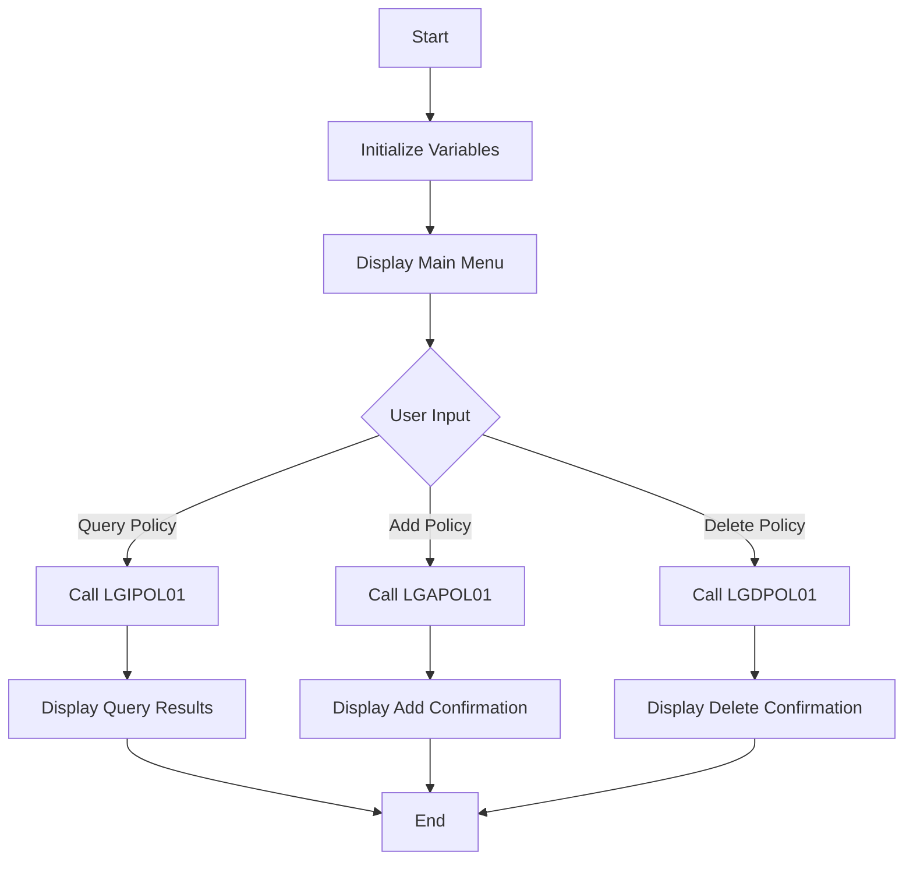

This document will cover the <SwmToken path="base/src/lgtestp4.cbl" pos="11:6:6" line-data="       PROGRAM-ID. LGTESTP4.">`LGTESTP4`</SwmToken> program. We'll cover:

1. What the Program Does
2. Program Flow
3. Program Sections

## What the Program Does

The <SwmToken path="base/src/lgtestp4.cbl" pos="11:6:6" line-data="       PROGRAM-ID. LGTESTP4.">`LGTESTP4`</SwmToken> program is designed to handle commercial policy transactions. It provides a menu for users to perform various operations such as querying, adding, and deleting policy information. The program initializes necessary variables and displays a main menu to the user. Based on the user's input, it either queries policy details, adds a new policy, or deletes an existing policy by calling respective programs.

## Program Flow

The program flow of <SwmToken path="base/src/lgtestp4.cbl" pos="11:6:6" line-data="       PROGRAM-ID. LGTESTP4.">`LGTESTP4`</SwmToken> is as follows:

1. Initialize variables and display the main menu.
2. Handle user input and determine the operation to perform.
3. Based on the user's choice, call the appropriate program to query, add, or delete policy information.
4. Display the results or appropriate messages to the user.



<SwmSnippet path="/base/src/lgtestp4.cbl" line="27">

---

## Program Sections

First, the program initializes various variables and displays the main menu to the user.

```cobol
       PROCEDURE DIVISION.

      *---------------------------------------------------------------*
       MAINLINE SECTION.

           IF EIBCALEN > 0
              GO TO A-GAIN.

           Initialize SSMAPP4I.
           Initialize SSMAPP4O.
           Initialize COMM-AREA.
           MOVE '0000000000'   To ENP4CNOO.
           MOVE '0000000000'   To ENP4PNOO.
           MOVE LOW-VALUES     To ENP4FPEO.
           MOVE LOW-VALUES     To ENP4FPRO.
           MOVE LOW-VALUES     To ENP4CPEO.
           MOVE LOW-VALUES     To ENP4CPRO.
           MOVE LOW-VALUES     To ENP4XPEO.
           MOVE LOW-VALUES     To ENP4XPRO.
           MOVE LOW-VALUES     To ENP4WPEO.
           MOVE LOW-VALUES     To ENP4WPRO.
```

---

</SwmSnippet>

<SwmSnippet path="/base/src/lgtestp4.cbl" line="57">

---

Next, the program handles user input and determines the operation to perform based on the user's choice.

```cobol
       A-GAIN.

           EXEC CICS HANDLE AID
                     CLEAR(CLEARIT)
                     PF3(ENDIT) END-EXEC.
           EXEC CICS HANDLE CONDITION
                     MAPFAIL(ENDIT)
                     END-EXEC.

           EXEC CICS RECEIVE MAP('SSMAPP4')
                     INTO(SSMAPP4I)
                     MAPSET('SSMAP') END-EXEC.
```

---

</SwmSnippet>

<SwmSnippet path="/base/src/lgtestp4.cbl" line="71">

---

Then, if the user chooses to query policy information, the program calls <SwmToken path="base/src/lgtestp4.cbl" pos="122:10:10" line-data="                 EXEC CICS LINK PROGRAM(&#39;LGIPOL01&#39;)">`LGIPOL01`</SwmToken> to retrieve and display the policy details.

```cobol
           EVALUATE ENP4OPTO

             WHEN '1'
                 If (
                     ENP4CNOO Not = Spaces      AND
                     ENP4CNOO Not = Low-Values  AND
                     ENP4CNOO Not = 0           AND
                     ENP4CNOO Not = 0000000000
                                                   )
                                                    AND
                    (
                     ENP4PNOO Not = Spaces      AND
                     ENP4PNOO Not = Low-Values  AND
                     ENP4PNOO Not = 0           AND
                     ENP4PNOO Not = 0000000000
                                                   )
                        Move '01ICOM'   To CA-REQUEST-ID
                        Move ENP4CNOO   To CA-CUSTOMER-NUM
                        Move ENP4PNOO   To CA-POLICY-NUM
                 Else
                 If (
```

---

</SwmSnippet>

<SwmSnippet path="/base/src/lgtestp4.cbl" line="156">

---

If the user chooses to add a new policy, the program calls <SwmToken path="base/src/lgtestp4.cbl" pos="178:10:10" line-data="                 EXEC CICS LINK PROGRAM(&#39;LGAPOL01&#39;)">`LGAPOL01`</SwmToken> to add the policy information and displays a confirmation message.

```cobol
             WHEN '2'
                 Move '01ACOM'             To  CA-REQUEST-ID
                 Move ENP4CNOO             To  CA-CUSTOMER-NUM
                 Move ENP4IDAO             To  CA-ISSUE-DATE
                 Move ENP4EDAO             To  CA-EXPIRY-DATE
                 Move ENP4ADDO             To  CA-B-Address
                 Move ENP4HPCO             To  CA-B-Postcode
                 Move ENP4LATO             To  CA-B-Latitude
                 Move ENP4LONO             To  CA-B-Longitude
                 Move ENP4CUSO             To  CA-B-Customer
                 Move ENP4PTYO             To  CA-B-PropType
                 Move ENP4FPEO             To  CA-B-FirePeril
                 Move ENP4FPRO             To  CA-B-FirePremium
                 Move ENP4CPEO             To  CA-B-CrimePeril
                 Move ENP4CPRO             To  CA-B-CrimePremium
                 Move ENP4XPEO             To  CA-B-FloodPeril
                 Move ENP4XPRO             To  CA-B-FloodPremium
                 Move ENP4WPEO             To  CA-B-WeatherPeril
                 Move ENP4WPRO             To  CA-B-WeatherPremium
                 Move ENP4STAO             To  CA-B-Status
                 Move ENP4REJO             To  CA-B-RejectReason
```

---

</SwmSnippet>

<SwmSnippet path="/base/src/lgtestp4.cbl" line="197">

---

If the user chooses to delete a policy, the program calls <SwmToken path="base/src/lgtestp4.cbl" pos="201:10:10" line-data="                 EXEC CICS LINK PROGRAM(&#39;LGDPOL01&#39;)">`LGDPOL01`</SwmToken> to delete the policy information and displays a confirmation message.

```cobol
             WHEN '3'
                 Move '01DCOM'   To CA-REQUEST-ID
                 Move ENP4CNOO   To CA-CUSTOMER-NUM
                 Move ENP4PNOO   To CA-POLICY-NUM
                 EXEC CICS LINK PROGRAM('LGDPOL01')
                           COMMAREA(COMM-AREA)
                           LENGTH(32500)
                 END-EXEC
                 IF CA-RETURN-CODE > 0
                   Exec CICS Syncpoint Rollback End-Exec
                   GO TO NO-DELETE
                 END-IF

                 Move Spaces             To ENP4EDAI
                 Move Spaces             To ENP4ADDI
                 Move Spaces             To ENP4HPCI
                 Move Spaces             To ENP4LATI
                 Move Spaces             To ENP4LONI
                 Move Spaces             To ENP4CUSI
                 Move Spaces             To ENP4PTYI
                 Move Spaces             To ENP4FPEI
```

---

</SwmSnippet>

<SwmSnippet path="/base/src/lgtestp4.cbl" line="236">

---

If the user input is invalid, the program displays an error message and prompts the user to enter a valid option.

```cobol
             WHEN OTHER

                 Move 'Please enter a valid option'
                   To  ERP4FLDO
                 Move -1 To ENP4OPTL

                 EXEC CICS SEND MAP ('SSMAPP4')
                           FROM(SSMAPP4O)
                           MAPSET ('SSMAP')
                           CURSOR
                 END-EXEC
                 GO TO ENDIT-STARTIT
```

---

</SwmSnippet>

<SwmSnippet path="/base/src/lgtestp4.cbl" line="249">

---

Finally, the program sends a message to the terminal and returns control to CICS.

```cobol
           END-EVALUATE.


      *    Send message to terminal and return

           EXEC CICS RETURN
           END-EXEC.

       ENDIT-STARTIT.
           EXEC CICS RETURN
                TRANSID('SSP4')
                COMMAREA(COMM-AREA)
                END-EXEC.

       ENDIT.
           EXEC CICS SEND TEXT
                     FROM(MSGEND)
                     LENGTH(LENGTH OF MSGEND)
                     ERASE
                     FREEKB
           END-EXEC
```

---

</SwmSnippet>

&nbsp;

*This is an auto-generated document by Swimm 🌊 and has not yet been verified by a human*

<SwmMeta version="3.0.0" repo-id="Z2l0aHViJTNBJTNBa3luZHJ5bC1jaWNzLWdlbmFwcCUzQSUzQVN3aW1tLURlbW8=" repo-name="kyndryl-cics-genapp"><sup>Powered by [Swimm](/)</sup></SwmMeta>
