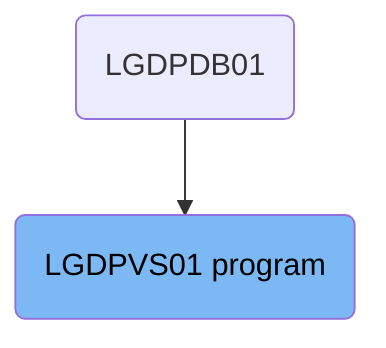
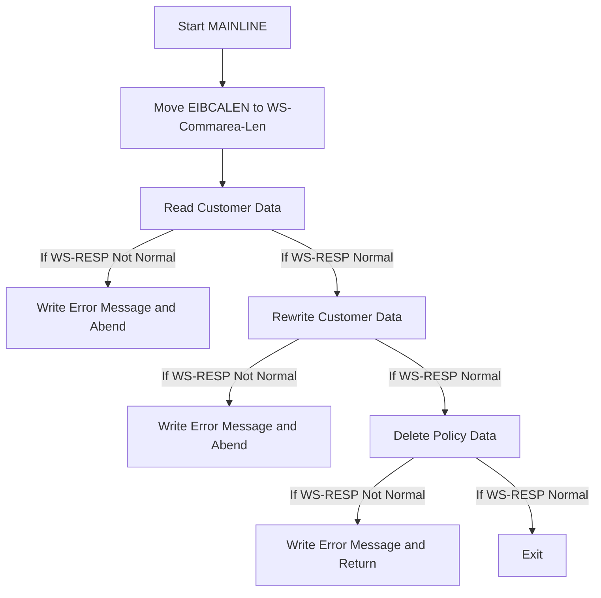

The <SwmToken path="base/src/lgdpvs01.cbl" pos="11:6:6" line-data="       PROGRAM-ID. LGDPVS01.">`LGDPVS01`</SwmToken> program is responsible for handling customer and policy data within the system. It starts by setting up the communication area length, then reads customer data, rewrites it if necessary, and finally deletes policy data. This flow ensures that customer and policy information is accurately managed and updated in the database.

The <SwmToken path="base/src/lgdpvs01.cbl" pos="11:6:6" line-data="       PROGRAM-ID. LGDPVS01.">`LGDPVS01`</SwmToken> program first sets up the communication area length, reads customer data, rewrites it if needed, and deletes policy data. This ensures that the customer and policy information is correctly handled in the database.

# Where is this program used?

This program is used once, in a flow starting from `LGDPDB01` as represented in the following diagram:



Lets' zoom into the flow:



<SwmSnippet path="/base/src/lgdpvs01.cbl" line="174">

---

## Moving EIBCALEN to <SwmToken path="base/src/lgdpvs01.cbl" pos="23:3:7" line-data="       01  WS-Commarea-Len           PIC S9(4) COMP.">`WS-Commarea-Len`</SwmToken>

First, the value of <SwmToken path="base/src/lgdpvs01.cbl" pos="75:3:3" line-data="           Move EIBCALEN To WS-Commarea-Len.">`EIBCALEN`</SwmToken> is moved to <SwmToken path="base/src/lgdpvs01.cbl" pos="23:3:7" line-data="       01  WS-Commarea-Len           PIC S9(4) COMP.">`WS-Commarea-Len`</SwmToken>. This sets up the length of the communication area for subsequent operations.

```cobol

```

---

</SwmSnippet>

<SwmSnippet path="/base/src/lgdpvs01.cbl" line="176">

---

## Reading Customer Data

Next, the customer data is read from the file 'KSDSCUST' into `WS-Customer-Area`. If the response code <SwmToken path="base/src/lgdpvs01.cbl" pos="18:3:5" line-data="       01  WS-RESP                   PIC S9(8) COMP.">`WS-RESP`</SwmToken> is not normal, an error message is written and the transaction is abended with code 'LGV1'.

```cobol

```

---

</SwmSnippet>

<SwmSnippet path="/base/src/lgdpvs01.cbl" line="184">

---

## Rewriting Customer Data

Then, the customer data is rewritten to the file 'KSDSCUST'. If the response code <SwmToken path="base/src/lgdpvs01.cbl" pos="18:3:5" line-data="       01  WS-RESP                   PIC S9(8) COMP.">`WS-RESP`</SwmToken> is not normal, an error message is written and the transaction is abended with code 'LGV2'.

```cobol

```

---

</SwmSnippet>

<SwmSnippet path="/base/src/lgdpvs01.cbl" line="192">

---

## Deleting Policy Data

Finally, the policy data is deleted from the file 'KSDSPOLY'. If the response code <SwmToken path="base/src/lgdpvs01.cbl" pos="18:3:5" line-data="       01  WS-RESP                   PIC S9(8) COMP.">`WS-RESP`</SwmToken> is not normal, an error message is written and the transaction returns.

```cobol

```

---

</SwmSnippet>

&nbsp;

*This is an auto-generated document by Swimm 🌊 and has not yet been verified by a human*

<SwmMeta version="3.0.0" repo-id="Z2l0aHViJTNBJTNBa3luZHJ5bC1jaWNzLWdlbmFwcCUzQSUzQVN3aW1tLURlbW8=" repo-name="kyndryl-cics-genapp"><sup>Powered by [Swimm](/)</sup></SwmMeta>
