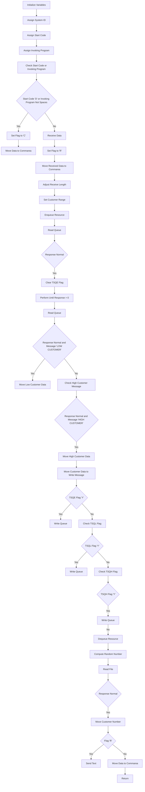

The <SwmToken path="base/src/lgicvs01.cbl" pos="17:6:6" line-data="       PROGRAM-ID. LGICVS01.">`LGICVS01`</SwmToken> program handles customer data transactions in the system. It assigns system IDs, start codes, and invoking programs, checks these values, and processes customer data accordingly. The program ensures that customer data is correctly enqueued, read, and updated in the queue, and retrieves customer information based on a random selection.

The flow starts by initializing variables and assigning system IDs, start codes, and invoking programs. It then checks these values to determine the next steps. Customer data is processed by setting customer ranges, enqueuing resources, reading queues, and updating data based on various flags. Finally, a random number is computed to read a file and retrieve customer information, and the appropriate response is sent or data is updated in the commarea.

Lets' zoom into the flow:



<SwmSnippet path="/base/src/lgicvs01.cbl" line="97">

---

## Assigning System ID, Start Code, and Invoking Program

First, the system ID, start code, and invoking program are assigned using CICS commands. This sets up the necessary context for the transaction.

```cobol
           EXEC CICS ASSIGN SYSID(WS-SYSID)
                RESP(WS-RESP)
           END-EXEC.

           EXEC CICS ASSIGN STARTCODE(WS-STARTCODE)
                RESP(WS-RESP)
           END-EXEC.

           EXEC CICS ASSIGN Invokingprog(WS-Invokeprog)
                RESP(WS-RESP)
           END-EXEC.
```

---

</SwmSnippet>

<SwmSnippet path="/base/src/lgicvs01.cbl" line="108">

---

## Checking Start Code and Invoking Program

Next, the start code and invoking program are checked. If the start code is 'D' or the invoking program is not spaces, the flag is set to 'C' and data is moved to the commarea. Otherwise, data is received and the flag is set to 'R'. This determines the flow of handling customer data.

```cobol
           IF WS-STARTCODE(1:1) = 'D' or
              WS-Invokeprog Not = Spaces
              MOVE 'C' To WS-FLAG
              MOVE COMMA-DATA  TO WS-COMMAREA
              MOVE EIBCALEN    TO WS-RECV-LEN
           ELSE
              EXEC CICS RECEIVE INTO(WS-RECV)
                  LENGTH(WS-RECV-LEN)
                  RESP(WS-RESP)
              END-EXEC
              MOVE 'R' To WS-FLAG
              MOVE WS-RECV-DATA  TO WS-COMMAREA
              SUBTRACT 5 FROM WS-RECV-LEN
           END-IF.
```

---

</SwmSnippet>

<SwmSnippet path="/base/src/lgicvs01.cbl" line="123">

---

## Handling Customer Data

Moving to handling customer data, the customer range is set, and the resource is enqueued. The queue is read, and based on the response, customer data is moved accordingly. This ensures that the correct customer data is processed based on the transaction context.

```cobol
           Move 0001000001 to WS-Cust-Low
           Move 0001000001 to WS-Cust-High
           Move 'Y'        to WS-FLAG-TSQE
           Move 'Y'        to WS-FLAG-TSQH
           Move 'Y'        to WS-FLAG-TSQL
      *
           EXEC CICS ENQ Resource(STSQ-NAME)
                         Length(Length Of STSQ-NAME)
           END-EXEC.
           Exec CICS ReadQ TS Queue(STSQ-NAME)
                     Into(READ-MSG)
                     Resp(WS-RESP)
                     Item(1)
           End-Exec.
           If WS-RESP = DFHRESP(NORMAL)
              Move Space to WS-FLAG-TSQE
              Perform With Test after Until WS-RESP > 0
                 Exec CICS ReadQ TS Queue(STSQ-NAME)
                     Into(READ-MSG)
                     Resp(WS-RESP)
                     Next
```

---

</SwmSnippet>

<SwmSnippet path="/base/src/lgicvs01.cbl" line="162">

---

## Writing to Queue and Dequeuing Resource

Then, based on various flags, data is written to the queue, and the resource is dequeued. This step ensures that the customer data is correctly updated in the queue.

```cobol
           If WS-FLAG-TSQE = 'Y'
             EXEC CICS WRITEQ TS QUEUE(STSQ-NAME)
                       FROM(WRITE-MSG-E)
                       RESP(WS-RESP)
                       NOSUSPEND
                       LENGTH(20)
             END-EXEC
           End-If.
      *
           If WS-FLAG-TSQL = 'Y'
             EXEC CICS WRITEQ TS QUEUE(STSQ-NAME)
                       FROM(WRITE-MSG-L)
                       RESP(WS-RESP)
                       NOSUSPEND
                       LENGTH(23)
             END-EXEC
           End-If.
      *
           If WS-FLAG-TSQH = 'Y'
             EXEC CICS WRITEQ TS QUEUE(STSQ-NAME)
                       FROM(WRITE-MSG-H)
```

---

</SwmSnippet>

<SwmSnippet path="/base/src/lgicvs01.cbl" line="193">

---

## Computing Random Number and Reading File

Next, a random number is computed and used to read a file. If the response is normal, the customer number is moved. This step is crucial for retrieving and updating customer information based on a random selection.

```cobol
           Compute WS-Random-Number = Function Integer((
                     Function Random(EIBTASKN) *
                       (ws-cust-high - ws-cust-low)) +
                          WS-Cust-Low)
           Move WS-Random-Number to WRITE-MSG-HIGH

           Exec CICS Read File('KSDSCUST')
                     Into(CA-AREA)
                     Length(F82)
                     Ridfld(WRITE-MSG-HIGH)
                     KeyLength(F10)
                     RESP(WS-RESP)
                     GTEQ
           End-Exec.
           If WS-RESP = DFHRESP(NORMAL)
             Move CA-Customer-Num to WRITE-MSG-HIGH
           End-if.
```

---

</SwmSnippet>

<SwmSnippet path="/base/src/lgicvs01.cbl" line="211">

---

## Sending Text or Moving Data to Commarea

Finally, if the flag is 'R', text is sent; otherwise, data is moved to the commarea. This determines the final action based on the transaction context, ensuring the correct response is sent or data is updated.

```cobol
           If WS-FLAG = 'R' Then
             EXEC CICS SEND TEXT FROM(WRITE-MSG-H)
              WAIT
              ERASE
              LENGTH(24)
              FREEKB
             END-EXEC
           Else
             Move Spaces To COMMA-Data
             Move Write-Msg-H    To COMMA-Data-H
             Move Write-Msg-High To COMMA-Data-High
           End-If.
```

---

</SwmSnippet>

&nbsp;

*This is an auto-generated document by Swimm 🌊 and has not yet been verified by a human*

<SwmMeta version="3.0.0" repo-id="Z2l0aHViJTNBJTNBa3luZHJ5bC1jaWNzLWdlbmFwcCUzQSUzQVN3aW1tLURlbW8=" repo-name="kyndryl-cics-genapp"><sup>Powered by [Swimm](/)</sup></SwmMeta>
