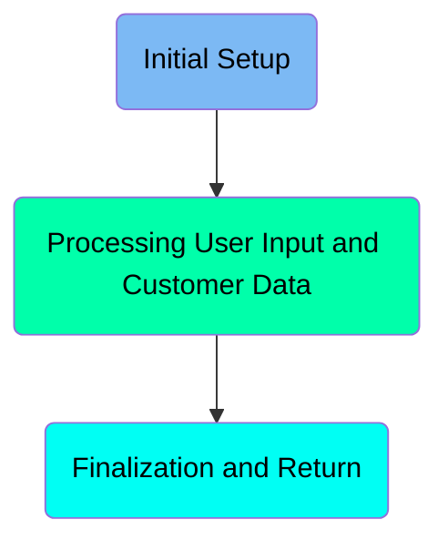
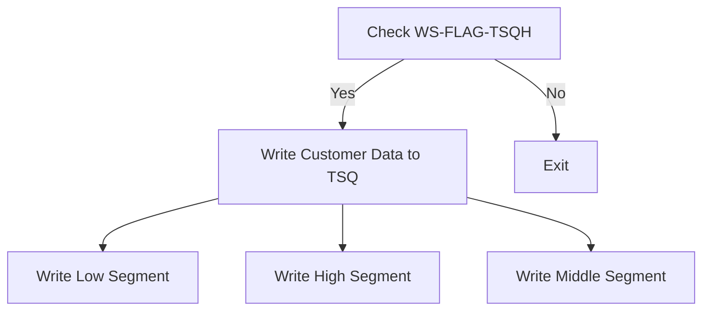

The <SwmToken path="base/src/lgtestc1.cbl" pos="11:6:6" line-data="       PROGRAM-ID. LGTESTC1.">`LGTESTC1`</SwmToken> program handles customer operations such as adding, inquiring, and updating customer information. It processes user input to determine the appropriate action and interacts with other programs like <SwmToken path="base/src/lgtestc1.cbl" pos="128:10:10" line-data="                 EXEC CICS LINK PROGRAM(&#39;LGACUS01&#39;)">`LGACUS01`</SwmToken> and <SwmToken path="base/src/lgtestc1.cbl" pos="89:10:10" line-data="                 EXEC CICS LINK PROGRAM(&#39;LGICUS01&#39;)">`LGICUS01`</SwmToken> to perform these operations. The program also manages error handling and finalizes the process by writing customer data to the temporary storage queue.

The <SwmToken path="base/src/lgtestc1.cbl" pos="11:6:6" line-data="       PROGRAM-ID. LGTESTC1.">`LGTESTC1`</SwmToken> program starts by initializing necessary fields and displaying the main menu. It then processes user input to determine whether to add, inquire, or update customer information. Depending on the input, it calls the appropriate subroutine and handles any errors that may occur. Finally, it writes the customer data to the temporary storage queue and manages resources to ensure system performance.

Here is a high level diagram of the program:



# Initial Setup

<SwmSnippet path="/base/src/lgtestc1.cbl" line="56">

---

## Sending Customer Details

First, the customer details such as first name, last name, date of birth, house name, house number, postcode, home phone, mobile phone, and email address are moved to the respective fields in the communication area.

```cobol
              GO TO A-GAIN.

           Initialize SSMAPC1I.
           Initialize SSMAPC1O.
           Initialize COMM-AREA.
           MOVE '0000000000'   To ENT1CNOO

      * Display Main Menu
           EXEC CICS SEND MAP ('SSMAPC1')
```

---

</SwmSnippet>

<SwmSnippet path="/base/src/lgtestc1.cbl" line="65">

---

## Sending Map

Next, the map <SwmToken path="base/src/lgtestc1.cbl" pos="64:11:11" line-data="           EXEC CICS SEND MAP (&#39;SSMAPC1&#39;)">`SSMAPC1`</SwmToken> is sent to the terminal using the CICS SEND MAP command, which displays the customer details on the screen.

```cobol
                     FROM(SSMAPC1O)
                     MAPSET ('SSMAP')
                     ERASE
                     END-EXEC.
```

---

</SwmSnippet>

<SwmSnippet path="/base/src/lgtestc1.cbl" line="69">

---

## Receiving Customer Details

Then, the updated customer details are received from the terminal using the CICS RECEIVE MAP command, which captures the input from the user.

```cobol

       A-GAIN.

```

---

</SwmSnippet>

<SwmSnippet path="/base/src/lgtestc1.cbl" line="73">

---

## Updating Customer Information

Moving to the next step, the received customer details are moved back to the communication area fields. The communication area is then inspected and any null characters are replaced with spaces. The postcode is converted to uppercase.

```cobol
                     CLEAR(CLEARIT)
                     PF3(ENDIT) END-EXEC.
           EXEC CICS HANDLE CONDITION
                     MAPFAIL(ENDIT)
                     END-EXEC.

           EXEC CICS RECEIVE MAP('SSMAPC1')
                     INTO(SSMAPC1I) ASIS
                     MAPSET('SSMAP') END-EXEC.


           EVALUATE ENT1OPTO

```

---

</SwmSnippet>

<SwmSnippet path="/base/src/lgtestc1.cbl" line="87">

---

## Linking to Update Program

Finally, the program links to <SwmToken path="base/src/lgtestc1.cbl" pos="190:10:10" line-data="                 EXEC CICS LINK PROGRAM(&#39;LGUCUS01&#39;)">`LGUCUS01`</SwmToken> to update the customer information in the database. The communication area is passed along with the length of the data.

More about <SwmToken path="base/src/lgtestc1.cbl" pos="190:10:10" line-data="                 EXEC CICS LINK PROGRAM(&#39;LGUCUS01&#39;)">`LGUCUS01`</SwmToken>: <SwmLink doc-title="Updating Customer Information (LGUCUS01)">[Updating Customer Information (LGUCUS01)](/.swm/updating-customer-information-lgucus01.5ep8jkr6.sw.md)</SwmLink>

```cobol
                 Move '01ICUS'   To CA-REQUEST-ID
                 Move ENT1CNOO   To CA-CUSTOMER-NUM
                 EXEC CICS LINK PROGRAM('LGICUS01')
                           COMMAREA(COMM-AREA)
```

---

</SwmSnippet>

# Processing User Input and Customer Data

```mermaid
graph TD
  id-1{{"User selects option '2'"}} -->|Yes| id-2["Call LGACUS01 to add customer"]
  id-1 -->|No| id-4{{"User selects option '4'"}}
  id-4 -->|Yes| id-5["Call LGICUS01 to inquire customer"]
  id-4 -->|No| id-9{{"User selects other option"}}
  id-9 -->|Yes| endit-startit["ENDIT-STARTIT: Write to CICS Queue"]
  id-5 --> id-6{{"Check if CA-RETURN-CODE > 0"}}
  id-6 -->|Yes| no-data["NO-DATA: Write to Temp Storage"]
  id-6 -->|And then| id-7["Call LGUCUS01 to update customer"]
  id-7 --> id-8{{"Check if CA-RETURN-CODE > 0"}}
  id-8 -->|Yes| no-upd["NO-UPD: Handle update error"]
  id-8 -->|And then| endit-startit["ENDIT-STARTIT: Write to CICS Queue"]
  id-2 --> id-3{{"Check if CA-RETURN-CODE > 0"}}
  id-3 -->|Yes| no-add["NO-ADD: Handle add error"]
  id-3 -->|And then| write-genacntl["WRITE-GENACNTL: Write to CICS Queue"]
  write-genacntl --> endit-startit["ENDIT-STARTIT: Write to CICS Queue"]

%% Swimm:
%% graph TD
%%   id-1{{"User selects option '2'"}} -->|Yes| id-2["Call <SwmToken path="base/src/lgtestc1.cbl" pos="128:10:10" line-data="                 EXEC CICS LINK PROGRAM(&#39;LGACUS01&#39;)">`LGACUS01`</SwmToken> to add customer"]
%%   id-1 -->|No| id-4{{"User selects option '4'"}}
%%   id-4 -->|Yes| id-5["Call <SwmToken path="base/src/lgtestc1.cbl" pos="89:10:10" line-data="                 EXEC CICS LINK PROGRAM(&#39;LGICUS01&#39;)">`LGICUS01`</SwmToken> to inquire customer"]
%%   id-4 -->|No| id-9{{"User selects other option"}}
%%   id-9 -->|Yes| endit-startit["ENDIT-STARTIT: Write to CICS Queue"]
%%   id-5 --> id-6{{"Check if <SwmToken path="base/src/lgtestc1.cbl" pos="94:3:7" line-data="                 IF CA-RETURN-CODE &gt; 0">`CA-RETURN-CODE`</SwmToken> > 0"}}
%%   id-6 -->|Yes| no-data["NO-DATA: Write to Temp Storage"]
%%   id-6 -->|And then| id-7["Call <SwmToken path="base/src/lgtestc1.cbl" pos="190:10:10" line-data="                 EXEC CICS LINK PROGRAM(&#39;LGUCUS01&#39;)">`LGUCUS01`</SwmToken> to update customer"]
%%   id-7 --> id-8{{"Check if <SwmToken path="base/src/lgtestc1.cbl" pos="94:3:7" line-data="                 IF CA-RETURN-CODE &gt; 0">`CA-RETURN-CODE`</SwmToken> > 0"}}
%%   id-8 -->|Yes| no-upd["NO-UPD: Handle update error"]
%%   id-8 -->|And then| endit-startit["ENDIT-STARTIT: Write to CICS Queue"]
%%   id-2 --> id-3{{"Check if <SwmToken path="base/src/lgtestc1.cbl" pos="94:3:7" line-data="                 IF CA-RETURN-CODE &gt; 0">`CA-RETURN-CODE`</SwmToken> > 0"}}
%%   id-3 -->|Yes| no-add["NO-ADD: Handle add error"]
%%   id-3 -->|And then| write-genacntl["WRITE-GENACNTL: Write to CICS Queue"]
%%   write-genacntl --> endit-startit["ENDIT-STARTIT: Write to CICS Queue"]
```



<SwmSnippet path="/base/src/lgtestc1.cbl" line="87">

---

## Handling customer operations based on user input

The MAINLINE function handles different customer operations based on user input. It evaluates the user's input and calls the appropriate subroutine to add, inquire, or update customer information. If the input is '2', it calls <SwmToken path="base/src/lgtestc1.cbl" pos="128:10:10" line-data="                 EXEC CICS LINK PROGRAM(&#39;LGACUS01&#39;)">`LGACUS01`</SwmToken> to add a customer. If the input is '4', it calls <SwmToken path="base/src/lgtestc1.cbl" pos="89:10:10" line-data="                 EXEC CICS LINK PROGRAM(&#39;LGICUS01&#39;)">`LGICUS01`</SwmToken> to inquire about a customer. For other inputs, it sends an error message and prompts the user to enter a valid option.

```cobol
                 Move '01ICUS'   To CA-REQUEST-ID
                 Move ENT1CNOO   To CA-CUSTOMER-NUM
                 EXEC CICS LINK PROGRAM('LGICUS01')
                           COMMAREA(COMM-AREA)
                           LENGTH(32500)
                 END-EXEC

                 IF CA-RETURN-CODE > 0
                   GO TO NO-DATA
                 END-IF

                 Move CA-FIRST-NAME to ENT1FNAI
                 Move CA-LAST-NAME  to ENT1LNAI
                 Move CA-DOB        to ENT1DOBI
                 Move CA-HOUSE-NAME to ENT1HNMI
                 Move CA-HOUSE-NUM  to ENT1HNOI
                 Move CA-POSTCODE   to ENT1HPCI
                 Move CA-PHONE-HOME    to ENT1HP1I
                 Move CA-PHONE-MOBILE  to ENT1HP2I
                 Move CA-EMAIL-ADDRESS to ENT1HMOI
                 EXEC CICS SEND MAP ('SSMAPC1')
```

---

</SwmSnippet>

<SwmSnippet path="/base/src/lgtestc1.cbl" line="87">

---

### Adding a customer

When the user selects option '2', the program calls <SwmToken path="base/src/lgtestc1.cbl" pos="128:10:10" line-data="                 EXEC CICS LINK PROGRAM(&#39;LGACUS01&#39;)">`LGACUS01`</SwmToken> to add a customer. If the <SwmToken path="base/src/lgtestc1.cbl" pos="94:3:7" line-data="                 IF CA-RETURN-CODE &gt; 0">`CA-RETURN-CODE`</SwmToken> is greater than 0, it goes to the <SwmToken path="base/src/lgtestc1.cbl" pos="134:5:7" line-data="                   GO TO NO-ADD">`NO-ADD`</SwmToken> section to handle the error. Otherwise, it proceeds to <SwmToken path="base/src/lgtestc1.cbl" pos="137:3:5" line-data="                 Perform WRITE-GENACNTL">`WRITE-GENACNTL`</SwmToken> to write the customer information to the CICS queue.

```cobol
                 Move '01ICUS'   To CA-REQUEST-ID
                 Move ENT1CNOO   To CA-CUSTOMER-NUM
                 EXEC CICS LINK PROGRAM('LGICUS01')
                           COMMAREA(COMM-AREA)
                           LENGTH(32500)
                 END-EXEC

                 IF CA-RETURN-CODE > 0
                   GO TO NO-DATA
                 END-IF

                 Move CA-FIRST-NAME to ENT1FNAI
                 Move CA-LAST-NAME  to ENT1LNAI
                 Move CA-DOB        to ENT1DOBI
                 Move CA-HOUSE-NAME to ENT1HNMI
                 Move CA-HOUSE-NUM  to ENT1HNOI
                 Move CA-POSTCODE   to ENT1HPCI
                 Move CA-PHONE-HOME    to ENT1HP1I
                 Move CA-PHONE-MOBILE  to ENT1HP2I
                 Move CA-EMAIL-ADDRESS to ENT1HMOI
                 EXEC CICS SEND MAP ('SSMAPC1')
```

---

</SwmSnippet>

<SwmSnippet path="/base/src/lgtestc1.cbl" line="87">

---

### Inquiring about a customer

When the user selects option '4', the program calls <SwmToken path="base/src/lgtestc1.cbl" pos="89:10:10" line-data="                 EXEC CICS LINK PROGRAM(&#39;LGICUS01&#39;)">`LGICUS01`</SwmToken> to inquire about a customer. If the <SwmToken path="base/src/lgtestc1.cbl" pos="94:3:7" line-data="                 IF CA-RETURN-CODE &gt; 0">`CA-RETURN-CODE`</SwmToken> is greater than 0, it goes to the <SwmToken path="base/src/lgtestc1.cbl" pos="95:5:7" line-data="                   GO TO NO-DATA">`NO-DATA`</SwmToken> section to handle the error. Otherwise, it calls <SwmToken path="base/src/lgtestc1.cbl" pos="190:10:10" line-data="                 EXEC CICS LINK PROGRAM(&#39;LGUCUS01&#39;)">`LGUCUS01`</SwmToken> to update the customer information if necessary.

```cobol
                 Move '01ICUS'   To CA-REQUEST-ID
                 Move ENT1CNOO   To CA-CUSTOMER-NUM
                 EXEC CICS LINK PROGRAM('LGICUS01')
                           COMMAREA(COMM-AREA)
                           LENGTH(32500)
                 END-EXEC

                 IF CA-RETURN-CODE > 0
                   GO TO NO-DATA
                 END-IF

                 Move CA-FIRST-NAME to ENT1FNAI
                 Move CA-LAST-NAME  to ENT1LNAI
                 Move CA-DOB        to ENT1DOBI
                 Move CA-HOUSE-NAME to ENT1HNMI
                 Move CA-HOUSE-NUM  to ENT1HNOI
                 Move CA-POSTCODE   to ENT1HPCI
                 Move CA-PHONE-HOME    to ENT1HP1I
                 Move CA-PHONE-MOBILE  to ENT1HP2I
                 Move CA-EMAIL-ADDRESS to ENT1HMOI
                 EXEC CICS SEND MAP ('SSMAPC1')
```

---

</SwmSnippet>

<SwmSnippet path="/base/src/lgtestc1.cbl" line="87">

---

### Handling other inputs

For any other input, the program sends an error message to the user, prompting them to enter a valid option. It then goes to the <SwmToken path="base/src/lgtestc1.cbl" pos="220:5:7" line-data="                 GO TO ENDIT-STARTIT">`ENDIT-STARTIT`</SwmToken> section to write the error message to the CICS queue and return control to the user.

```cobol
                 Move '01ICUS'   To CA-REQUEST-ID
                 Move ENT1CNOO   To CA-CUSTOMER-NUM
                 EXEC CICS LINK PROGRAM('LGICUS01')
                           COMMAREA(COMM-AREA)
                           LENGTH(32500)
                 END-EXEC

                 IF CA-RETURN-CODE > 0
                   GO TO NO-DATA
                 END-IF

                 Move CA-FIRST-NAME to ENT1FNAI
                 Move CA-LAST-NAME  to ENT1LNAI
                 Move CA-DOB        to ENT1DOBI
                 Move CA-HOUSE-NAME to ENT1HNMI
                 Move CA-HOUSE-NUM  to ENT1HNOI
                 Move CA-POSTCODE   to ENT1HPCI
                 Move CA-PHONE-HOME    to ENT1HP1I
                 Move CA-PHONE-MOBILE  to ENT1HP2I
                 Move CA-EMAIL-ADDRESS to ENT1HMOI
                 EXEC CICS SEND MAP ('SSMAPC1')
```

---

</SwmSnippet>

## Interim Summary

So far, we saw how the program handles different customer operations based on user input, including adding, inquiring, and updating customer information. We also covered how the program manages error handling for invalid inputs. Now, we will focus on the finalization process, including writing customer data to the temporary storage queue and managing resources.

# Finalization and Return



<SwmSnippet path="/base/src/lgtestc1.cbl" line="217">

---

## Checking <SwmToken path="base/src/lgtestc1.cbl" pos="20:3:7" line-data="       01  WS-FLAG-TSQH              PIC X.">`WS-FLAG-TSQH`</SwmToken>

First, the code checks if <SwmToken path="base/src/lgtestc1.cbl" pos="20:3:7" line-data="       01  WS-FLAG-TSQH              PIC X.">`WS-FLAG-TSQH`</SwmToken> is set to 'Y'. This flag indicates whether the customer data should be written to the temporary storage queue (TSQ).

```cobol
                           MAPSET ('SSMAP')
```

---

</SwmSnippet>

<SwmSnippet path="/base/src/lgtestc1.cbl" line="218">

---

## Writing Customer Data to TSQ

If <SwmToken path="base/src/lgtestc1.cbl" pos="20:3:7" line-data="       01  WS-FLAG-TSQH              PIC X.">`WS-FLAG-TSQH`</SwmToken> is 'Y', the code proceeds to write customer data to the TSQ. It writes three segments: <SwmToken path="base/src/lgtestc1.cbl" pos="31:3:7" line-data="         03 WRITE-MSG-E            PIC X(20) Value &#39;**** GENAPP CNTL&#39;.">`WRITE-MSG-E`</SwmToken>, <SwmToken path="base/src/lgtestc1.cbl" pos="32:3:7" line-data="         03 WRITE-MSG-L              PIC X(13) Value &#39;LOW CUSTOMER=&#39;.">`WRITE-MSG-L`</SwmToken>, and <SwmToken path="base/src/lgtestc1.cbl" pos="35:3:7" line-data="         03 WRITE-MSG-H              PIC X(14) Value &#39;HIGH CUSTOMER=&#39;.">`WRITE-MSG-H`</SwmToken>, each representing different parts of the customer data. This ensures that the data is stored in a structured manner for later retrieval.

```cobol
                           CURSOR
                 END-EXEC
                 GO TO ENDIT-STARTIT

           END-EVALUATE.


      *    Send message to terminal and return

           EXEC CICS RETURN
           END-EXEC.

       ENDIT-STARTIT.
           EXEC CICS RETURN
                TRANSID('SSC1')
                COMMAREA(COMM-AREA)
                END-EXEC.

       ENDIT.
           EXEC CICS SEND TEXT
```

---

</SwmSnippet>

<SwmSnippet path="/base/src/lgtestc1.cbl" line="240">

---

## Dequeuing the Resource

Finally, the code dequeues the resource <SwmToken path="base/src/lgtestc1.cbl" pos="38:3:5" line-data="         03  STSQ-NAME                 PIC X(8) Value &#39;GENACNTL&#39;.">`STSQ-NAME`</SwmToken> to ensure that the temporary storage queue is properly managed and resources are freed up. This step is crucial for maintaining system performance and avoiding resource leaks.

```cobol
                     ERASE
                     FREEKB
           END-EXEC
```

---

</SwmSnippet>

&nbsp;

*This is an auto-generated document by Swimm 🌊 and has not yet been verified by a human*

<SwmMeta version="3.0.0" repo-id="Z2l0aHViJTNBJTNBa3luZHJ5bC1jaWNzLWdlbmFwcCUzQSUzQVN3aW1tLURlbW8=" repo-name="kyndryl-cics-genapp"><sup>Powered by [Swimm](/)</sup></SwmMeta>
