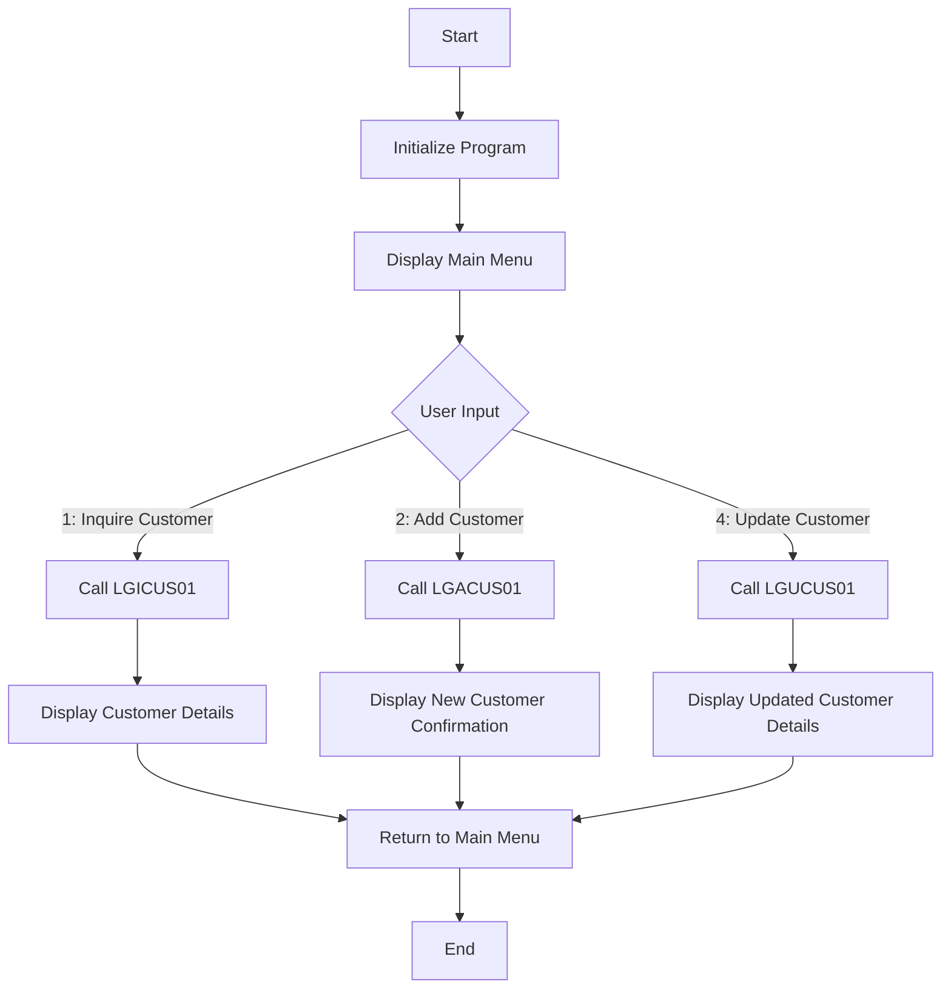

This document will cover the <SwmToken path="base/src/lgtestc1.cbl" pos="11:6:6" line-data="       PROGRAM-ID. LGTESTC1.">`LGTESTC1`</SwmToken> program. We'll cover:

1. What the Program Does
2. Program Flow
3. Program Sections

## What the Program Does

The <SwmToken path="base/src/lgtestc1.cbl" pos="11:6:6" line-data="       PROGRAM-ID. LGTESTC1.">`LGTESTC1`</SwmToken> program is designed to handle customer transactions within the general insurance application. It provides a menu for customer transactions, allowing users to inquire, add, and update customer information. The program interacts with various other programs to perform these operations, such as <SwmToken path="base/src/lgtestc1.cbl" pos="89:10:10" line-data="                 EXEC CICS LINK PROGRAM(&#39;LGICUS01&#39;)">`LGICUS01`</SwmToken> for customer inquiries, <SwmToken path="base/src/lgtestc1.cbl" pos="128:10:10" line-data="                 EXEC CICS LINK PROGRAM(&#39;LGACUS01&#39;)">`LGACUS01`</SwmToken> for adding new customers, and <SwmToken path="base/src/lgtestc1.cbl" pos="190:10:10" line-data="                 EXEC CICS LINK PROGRAM(&#39;LGUCUS01&#39;)">`LGUCUS01`</SwmToken> for updating customer details.

## Program Flow

The program flow of <SwmToken path="base/src/lgtestc1.cbl" pos="11:6:6" line-data="       PROGRAM-ID. LGTESTC1.">`LGTESTC1`</SwmToken> is as follows:

1. Initialize the program and display the main menu.
2. Handle user input and navigate to the appropriate section based on the user's choice.
3. Perform customer inquiry, add new customer, or update customer details based on the user's selection.
4. Display the results or error messages to the user.
5. Return control to the main menu or terminate the transaction.



<SwmSnippet path="/base/src/lgtestc1.cbl" line="53">

---

### MAINLINE SECTION

First, the program checks if it is being called again by checking the length of the communication area (EIBCALEN). If it is not being called again, it initializes various sections and displays the main menu.

```cobol
       MAINLINE SECTION.

           IF EIBCALEN > 0
              GO TO A-GAIN.

           Initialize SSMAPC1I.
           Initialize SSMAPC1O.
           Initialize COMM-AREA.
           MOVE '0000000000'   To ENT1CNOO

      * Display Main Menu
           EXEC CICS SEND MAP ('SSMAPC1')
                     FROM(SSMAPC1O)
                     MAPSET ('SSMAP')
                     ERASE
                     END-EXEC.

       A-GAIN.
```

---

</SwmSnippet>

<SwmSnippet path="/base/src/lgtestc1.cbl" line="70">

---

### <SwmToken path="base/src/lgtestc1.cbl" pos="70:1:3" line-data="       A-GAIN.">`A-GAIN`</SwmToken> SECTION

Next, the program sets up handlers for various user actions (e.g., pressing <SwmToken path="base/src/lgtestc1.cbl" pos="74:1:1" line-data="                     PF3(ENDIT) END-EXEC.">`PF3`</SwmToken> to end the transaction) and receives the user's input from the main menu.

```cobol
       A-GAIN.

           EXEC CICS HANDLE AID
                     CLEAR(CLEARIT)
                     PF3(ENDIT) END-EXEC.
           EXEC CICS HANDLE CONDITION
                     MAPFAIL(ENDIT)
                     END-EXEC.

           EXEC CICS RECEIVE MAP('SSMAPC1')
                     INTO(SSMAPC1I) ASIS
                     MAPSET('SSMAP') END-EXEC.
```

---

</SwmSnippet>

<SwmSnippet path="/base/src/lgtestc1.cbl" line="84">

---

### EVALUATE SECTION

Then, the program evaluates the user's input and performs the corresponding action. If the user selects option '1', it calls the <SwmToken path="base/src/lgtestc1.cbl" pos="89:10:10" line-data="                 EXEC CICS LINK PROGRAM(&#39;LGICUS01&#39;)">`LGICUS01`</SwmToken> program to inquire customer details. If the user selects option '2', it calls the <SwmToken path="base/src/lgtestc1.cbl" pos="128:10:10" line-data="                 EXEC CICS LINK PROGRAM(&#39;LGACUS01&#39;)">`LGACUS01`</SwmToken> program to add a new customer. If the user selects option '4', it calls the <SwmToken path="base/src/lgtestc1.cbl" pos="190:10:10" line-data="                 EXEC CICS LINK PROGRAM(&#39;LGUCUS01&#39;)">`LGUCUS01`</SwmToken> program to update customer details. For any other input, it displays an error message.

```cobol
           EVALUATE ENT1OPTO

             WHEN '1'
                 Move '01ICUS'   To CA-REQUEST-ID
                 Move ENT1CNOO   To CA-CUSTOMER-NUM
                 EXEC CICS LINK PROGRAM('LGICUS01')
                           COMMAREA(COMM-AREA)
                           LENGTH(32500)
                 END-EXEC

                 IF CA-RETURN-CODE > 0
                   GO TO NO-DATA
                 END-IF

                 Move CA-FIRST-NAME to ENT1FNAI
                 Move CA-LAST-NAME  to ENT1LNAI
                 Move CA-DOB        to ENT1DOBI
                 Move CA-HOUSE-NAME to ENT1HNMI
                 Move CA-HOUSE-NUM  to ENT1HNOI
                 Move CA-POSTCODE   to ENT1HPCI
                 Move CA-PHONE-HOME    to ENT1HP1I
```

---

</SwmSnippet>

<SwmSnippet path="/base/src/lgtestc1.cbl" line="230">

---

### <SwmToken path="base/src/lgtestc1.cbl" pos="230:1:3" line-data="       ENDIT-STARTIT.">`ENDIT-STARTIT`</SwmToken> SECTION

Finally, the program returns control to the main menu or terminates the transaction.

```cobol
       ENDIT-STARTIT.
           EXEC CICS RETURN
                TRANSID('SSC1')
                COMMAREA(COMM-AREA)
                END-EXEC.
```

---

</SwmSnippet>

<SwmSnippet path="/base/src/lgtestc1.cbl" line="283">

---

### <SwmToken path="base/src/lgtestc1.cbl" pos="283:1:3" line-data="       WRITE-GENACNTL.">`WRITE-GENACNTL`</SwmToken> SECTION

Going into this section, the program writes control information to a temporary storage queue (TSQ) named 'GENACNTL'. It ensures that the high and low customer numbers are correctly stored in the TSQ.

```cobol
       WRITE-GENACNTL.

           EXEC CICS ENQ Resource(STSQ-NAME)
                         Length(Length Of STSQ-NAME)
           END-EXEC.
           Move 'Y' To WS-FLAG-TSQH
           Move 1   To WS-Item-Count
           Exec CICS ReadQ TS Queue(STSQ-NAME)
                     Into(READ-MSG)
                     Resp(WS-RESP)
                     Item(1)
           End-Exec.
           If WS-RESP = DFHRESP(NORMAL)
              Perform With Test after Until WS-RESP > 0
                 Exec CICS ReadQ TS Queue(STSQ-NAME)
                     Into(READ-MSG)
                     Resp(WS-RESP)
                     Next
                 End-Exec
                 Add 1 To WS-Item-Count
                 If WS-RESP = DFHRESP(NORMAL) And
```

---

</SwmSnippet>

&nbsp;

*This is an auto-generated document by Swimm 🌊 and has not yet been verified by a human*

<SwmMeta version="3.0.0" repo-id="Z2l0aHViJTNBJTNBa3luZHJ5bC1jaWNzLWdlbmFwcCUzQSUzQVN3aW1tLURlbW8=" repo-name="kyndryl-cics-genapp"><sup>Powered by [Swimm](/)</sup></SwmMeta>
