This document will cover the <SwmToken path="base/src/lgtestp2.cbl" pos="11:6:6" line-data="       PROGRAM-ID. LGTESTP2.">`LGTESTP2`</SwmToken> program. We'll cover:

1. What the Program Does
2. Program Flow
3. Program Sections

## What the Program Does

The <SwmToken path="base/src/lgtestp2.cbl" pos="11:6:6" line-data="       PROGRAM-ID. LGTESTP2.">`LGTESTP2`</SwmToken> program is designed to handle various endowment policy transactions within the IBM CICS Transaction Server for z/OS. It provides a menu for users to perform operations such as querying, adding, updating, and deleting policy information. The program initializes necessary variables and displays a main menu to the user. Based on the user's input, it calls other programs to perform the specific operations and then displays the results back to the user.

## Program Flow

The program flow of <SwmToken path="base/src/lgtestp2.cbl" pos="11:6:6" line-data="       PROGRAM-ID. LGTESTP2.">`LGTESTP2`</SwmToken> is as follows:

1. Initialize variables and display the main menu.
2. Handle user input and call the appropriate program based on the selected option.
3. Display the results of the operation back to the user.
4. Repeat the process until the user decides to end the transaction.

```mermaid
graph TD
  A[Start] --> B[Initialize Variables]
  B --> C[Display Main Menu]
  C --> D{User Input}
  D --> |Option 1| E[Call LGIPOL01 for Inquiry]
  D --> |Option 2| F[Call LGAPOL01 for Addition]
  D --> |Option 3| G[Call LGDPOL01 for Deletion]
  D --> |Option 4| H[Call LGIPOL01 for Inquiry and then LGUPOL01 for Update]
  D --> |Other| I[Display Error Message]
  E --> J[Display Inquiry Results]
  F --> K[Display Addition Results]
  G --> L[Display Deletion Results]
  H --> M[Display Update Results]
  J --> C
  K --> C
  L --> C
  M --> C
  I --> C

%% Swimm:
%% graph TD
%%   A[Start] --> B[Initialize Variables]
%%   B --> C[Display Main Menu]
%%   C --> D{User Input}
%%   D --> |Option 1| E[Call <SwmToken path="base/src/lgtestp2.cbl" pos="67:10:10" line-data="                 EXEC CICS LINK PROGRAM(&#39;LGIPOL01&#39;)">`LGIPOL01`</SwmToken> for Inquiry]
%%   D --> |Option 2| F[Call <SwmToken path="base/src/lgtestp2.cbl" pos="105:10:10" line-data="                 EXEC CICS LINK PROGRAM(&#39;LGAPOL01&#39;)">`LGAPOL01`</SwmToken> for Addition]
%%   D --> |Option 3| G[Call <SwmToken path="base/src/lgtestp2.cbl" pos="129:10:10" line-data="                 EXEC CICS LINK PROGRAM(&#39;LGDPOL01&#39;)">`LGDPOL01`</SwmToken> for Deletion]
%%   D --> |Option 4| H[Call <SwmToken path="base/src/lgtestp2.cbl" pos="67:10:10" line-data="                 EXEC CICS LINK PROGRAM(&#39;LGIPOL01&#39;)">`LGIPOL01`</SwmToken> for Inquiry and then <SwmToken path="base/src/lgtestp2.cbl" pos="198:10:10" line-data="                 EXEC CICS LINK PROGRAM(&#39;LGUPOL01&#39;)">`LGUPOL01`</SwmToken> for Update]
%%   D --> |Other| I[Display Error Message]
%%   E --> J[Display Inquiry Results]
%%   F --> K[Display Addition Results]
%%   G --> L[Display Deletion Results]
%%   H --> M[Display Update Results]
%%   J --> C
%%   K --> C
%%   L --> C
%%   M --> C
%%   I --> C
```



<SwmSnippet path="/base/src/lgtestp2.cbl" line="30">

---

### MAINLINE SECTION

First, the program initializes the necessary variables and displays the main menu to the user.

```cobol
       MAINLINE SECTION.

           IF EIBCALEN > 0
              GO TO A-GAIN.

           Initialize SSMAPP2I.
           Initialize SSMAPP2O.
           Initialize COMM-AREA.
           MOVE '0000000000'   To ENP2CNOO.
           MOVE '0000000000'   To ENP2PNOO.

      * Display Main Menu
           EXEC CICS SEND MAP ('SSMAPP2')
                     MAPSET ('SSMAP')
                     ERASE
                     END-EXEC.
```

---

</SwmSnippet>

<SwmSnippet path="/base/src/lgtestp2.cbl" line="47">

---

### <SwmToken path="base/src/lgtestp2.cbl" pos="47:1:3" line-data="       A-GAIN.">`A-GAIN`</SwmToken> SECTION

Next, the program handles user input and sets up conditions for different options.

```cobol
       A-GAIN.

           EXEC CICS HANDLE AID
                     CLEAR(CLEARIT)
                     PF3(ENDIT) END-EXEC.
           EXEC CICS HANDLE CONDITION
                     MAPFAIL(ENDIT)
                     END-EXEC.

           EXEC CICS RECEIVE MAP('SSMAPP2')
                     INTO(SSMAPP2I)
                     MAPSET('SSMAP') END-EXEC.
```

---

</SwmSnippet>

<SwmSnippet path="/base/src/lgtestp2.cbl" line="61">

---

### EVALUATE SECTION

Then, based on the user's input, the program evaluates the selected option and calls the appropriate program to perform the operation. It handles options for inquiry, addition, deletion, and update of policy information.

```cobol
           EVALUATE ENP2OPTO

             WHEN '1'
                 Move '01IEND'   To CA-REQUEST-ID
                 Move ENP2CNOO   To CA-CUSTOMER-NUM
                 Move ENP2PNOO   To CA-POLICY-NUM
                 EXEC CICS LINK PROGRAM('LGIPOL01')
                           COMMAREA(COMM-AREA)
                           LENGTH(32500)
                 END-EXEC
                 IF CA-RETURN-CODE > 0
                   GO TO NO-DATA
                 END-IF

                 Move CA-ISSUE-DATE     To  ENP2IDAI
                 Move CA-EXPIRY-DATE    To  ENP2EDAI
                 Move CA-E-FUND-NAME    To  ENP2FNMI
                 Move CA-E-TERM         To  ENP2TERI
                 Move CA-E-SUM-ASSURED  To  ENP2SUMI
                 Move CA-E-LIFE-ASSURED To  ENP2LIFI
                 Move CA-E-WITH-PROFITS To  ENP2WPRI
```

---

</SwmSnippet>

<SwmSnippet path="/base/src/lgtestp2.cbl" line="239">

---

### <SwmToken path="base/src/lgtestp2.cbl" pos="239:1:3" line-data="       ENDIT-STARTIT.">`ENDIT-STARTIT`</SwmToken> SECTION

Finally, the program returns control to the user, allowing them to perform another transaction or end the session.

```cobol
       ENDIT-STARTIT.
           EXEC CICS RETURN
                TRANSID('SSP2')
                COMMAREA(COMM-AREA)
                END-EXEC.
```

---

</SwmSnippet>

&nbsp;

*This is an auto-generated document by Swimm 🌊 and has not yet been verified by a human*

<SwmMeta version="3.0.0" repo-id="Z2l0aHViJTNBJTNBa3luZHJ5bC1jaWNzLWdlbmFwcCUzQSUzQVN3aW1tLURlbW8=" repo-name="kyndryl-cics-genapp"><sup>Powered by [Swimm](/)</sup></SwmMeta>
