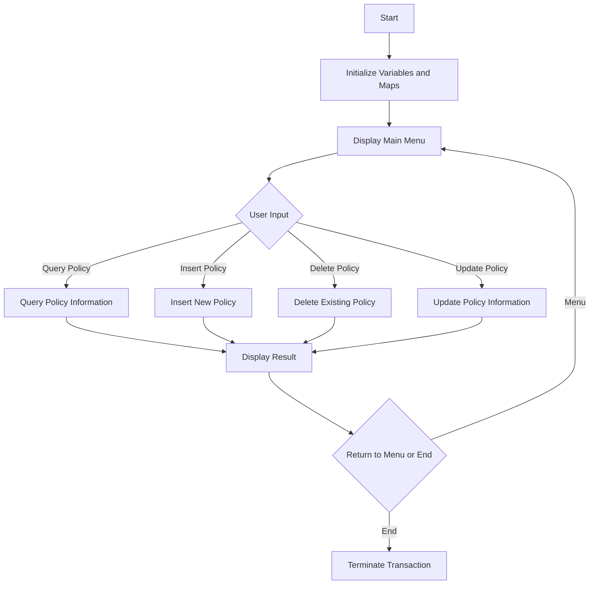

This document will cover the <SwmToken path="base/src/lgtestp2.cbl" pos="11:6:6" line-data="       PROGRAM-ID. LGTESTP2.">`LGTESTP2`</SwmToken> program. We'll cover:

1. What the Program Does
2. Program Flow
3. Program Sections

## What the Program Does

The <SwmToken path="base/src/lgtestp2.cbl" pos="11:6:6" line-data="       PROGRAM-ID. LGTESTP2.">`LGTESTP2`</SwmToken> program is designed to handle endowment policy transactions. It provides a menu for users to perform various operations such as querying, inserting, updating, and deleting policy information stored in an IBM Db2 database. The program initializes necessary variables and maps, displays the main menu, and handles user inputs to perform the respective operations.

## Program Flow

The program flow of <SwmToken path="base/src/lgtestp2.cbl" pos="11:6:6" line-data="       PROGRAM-ID. LGTESTP2.">`LGTESTP2`</SwmToken> is as follows:

1. Initialize variables and maps.
2. Display the main menu.
3. Handle user input and perform the corresponding operation:
   - Query policy information
   - Insert new policy
   - Delete existing policy
   - Update policy information
4. Display the result of the operation.
5. Return control to the main menu or terminate the transaction.



<SwmSnippet path="/base/src/lgtestp2.cbl" line="30">

---

### MAINLINE SECTION

First, the program initializes the necessary variables and maps, and then displays the main menu to the user.

```cobol
       MAINLINE SECTION.

           IF EIBCALEN > 0
              GO TO A-GAIN.

           Initialize SSMAPP2I.
           Initialize SSMAPP2O.
           Initialize COMM-AREA.
           MOVE '0000000000'   To ENP2CNOO.
           MOVE '0000000000'   To ENP2PNOO.

      * Display Main Menu
           EXEC CICS SEND MAP ('SSMAPP2')
                     MAPSET ('SSMAP')
                     ERASE
                     END-EXEC.

```

---

</SwmSnippet>

<SwmSnippet path="/base/src/lgtestp2.cbl" line="47">

---

### <SwmToken path="base/src/lgtestp2.cbl" pos="47:1:3" line-data="       A-GAIN.">`A-GAIN`</SwmToken>

Now, the program sets up handlers for user inputs and receives the input from the user.

```cobol
       A-GAIN.

           EXEC CICS HANDLE AID
                     CLEAR(CLEARIT)
                     PF3(ENDIT) END-EXEC.
           EXEC CICS HANDLE CONDITION
                     MAPFAIL(ENDIT)
                     END-EXEC.

           EXEC CICS RECEIVE MAP('SSMAPP2')
                     INTO(SSMAPP2I)
                     MAPSET('SSMAP') END-EXEC.
```

---

</SwmSnippet>

<SwmSnippet path="/base/src/lgtestp2.cbl" line="61">

---

### EVALUATE <SwmToken path="base/src/lgtestp2.cbl" pos="61:3:3" line-data="           EVALUATE ENP2OPTO">`ENP2OPTO`</SwmToken>

Then, the program evaluates the user input and performs the corresponding operation:

- Query policy information
- Insert new policy
- Delete existing policy
- Update policy information Each operation involves linking to another program and handling the response.

```cobol
           EVALUATE ENP2OPTO

             WHEN '1'
                 Move '01IEND'   To CA-REQUEST-ID
                 Move ENP2CNOO   To CA-CUSTOMER-NUM
                 Move ENP2PNOO   To CA-POLICY-NUM
                 EXEC CICS LINK PROGRAM('LGIPOL01')
                           COMMAREA(COMM-AREA)
                           LENGTH(32500)
                 END-EXEC
                 IF CA-RETURN-CODE > 0
                   GO TO NO-DATA
                 END-IF

                 Move CA-ISSUE-DATE     To  ENP2IDAI
                 Move CA-EXPIRY-DATE    To  ENP2EDAI
                 Move CA-E-FUND-NAME    To  ENP2FNMI
                 Move CA-E-TERM         To  ENP2TERI
                 Move CA-E-SUM-ASSURED  To  ENP2SUMI
                 Move CA-E-LIFE-ASSURED To  ENP2LIFI
                 Move CA-E-WITH-PROFITS To  ENP2WPRI
```

---

</SwmSnippet>

<SwmSnippet path="/base/src/lgtestp2.cbl" line="239">

---

### <SwmToken path="base/src/lgtestp2.cbl" pos="239:1:3" line-data="       ENDIT-STARTIT.">`ENDIT-STARTIT`</SwmToken>

Finally, the program returns control to the main menu or terminates the transaction.

```cobol
       ENDIT-STARTIT.
           EXEC CICS RETURN
                TRANSID('SSP2')
                COMMAREA(COMM-AREA)
                END-EXEC.
```

---

</SwmSnippet>

&nbsp;

*This is an auto-generated document by Swimm 🌊 and has not yet been verified by a human*

<SwmMeta version="3.0.0" repo-id="Z2l0aHViJTNBJTNBa3luZHJ5bC1jaWNzLWdlbmFwcCUzQSUzQVN3aW1tLURlbW8=" repo-name="kyndryl-cics-genapp"><sup>Powered by [Swimm](/)</sup></SwmMeta>
