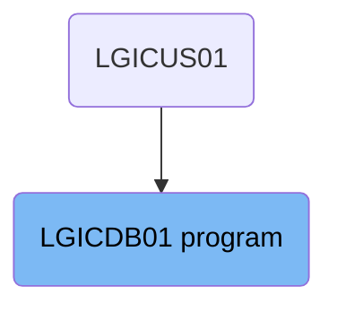

The <SwmToken path="base/src/lgicdb01.cbl" pos="12:6:6" line-data="       PROGRAM-ID. LGICDB01.">`LGICDB01`</SwmToken> program is responsible for handling error messages, retrieving customer information, and managing tools and namespaces. It is used in a flow starting from the <SwmToken path="base/src/lgicdb01.cbl" pos="44:16:16" line-data="           03 FILLER                   PIC X(9)  VALUE &#39; LGICUS01&#39;.">`LGICUS01`</SwmToken> program. The program ensures that errors are logged with relevant details, retrieves necessary customer data for further processing, and manages multiple functions in parallel while maintaining operational integrity.

The <SwmToken path="base/src/lgicdb01.cbl" pos="12:6:6" line-data="       PROGRAM-ID. LGICDB01.">`LGICDB01`</SwmToken> program starts by handling any error messages that occur, logging them with details like date, time, and SQLCODE. It then retrieves customer information needed for further operations. Finally, it manages tools and namespaces to run multiple functions simultaneously, ensuring all parameters are valid to maintain the integrity of the operations.

# Where is this program used?

This program is used once, in a flow starting from <SwmToken path="base/src/lgicdb01.cbl" pos="44:16:16" line-data="           03 FILLER                   PIC X(9)  VALUE &#39; LGICUS01&#39;.">`LGICUS01`</SwmToken> as represented in the following diagram:



Lets' zoom into the flow:

<SwmSnippet path="/base/src/lgicdb01.cbl" line="208">

---

## Writing Error Messages

First, the <SwmToken path="base/src/lgicdb01.cbl" pos="212:1:5" line-data="       WRITE-ERROR-MESSAGE.">`WRITE-ERROR-MESSAGE`</SwmToken> procedure is invoked to handle error messages. This involves saving the SQLCODE in the message, obtaining and formatting the current time and date, and writing the output message to the Transient Data Queue (TDQ). This ensures that any errors encountered are logged with relevant details such as date, time, program name, customer number, policy number, and SQLCODE.

```cobol
      * Procedure to write error message to Queues                     *
      *   message will include Date, Time, Program Name, Customer      *
      *   Number, Policy Number and SQLCODE.                           *
      *================================================================*
       WRITE-ERROR-MESSAGE.
      * Save SQLCODE in message
           MOVE SQLCODE TO EM-SQLRC
      * Obtain and format current time and date
           EXEC CICS ASKTIME ABSTIME(WS-ABSTIME)
           END-EXEC
           EXEC CICS FORMATTIME ABSTIME(WS-ABSTIME)
                     MMDDYYYY(WS-DATE)
                     TIME(WS-TIME)
           END-EXEC
           MOVE WS-DATE TO EM-DATE
           MOVE WS-TIME TO EM-TIME
      * Write output message to TDQ
           EXEC CICS LINK PROGRAM('LGSTSQ')
                     COMMAREA(ERROR-MSG)
                     LENGTH(LENGTH OF ERROR-MSG)
           END-EXEC.
```

---

</SwmSnippet>

<SwmSnippet path="/base/src/lgicdb01.cbl" line="229">

---

## Retrieving Customer Information

Moving to the <SwmToken path="base/src/lgicdb01.cbl" pos="154:3:7" line-data="           PERFORM GET-CUSTOMER-INFO.">`GET-CUSTOMER-INFO`</SwmToken> paragraph, this step retrieves customer information. This is crucial for operations that require customer-specific data. The retrieved information is then used in subsequent processing steps.

```cobol
      * Write 90 bytes or as much as we have of commarea to TDQ
           IF EIBCALEN > 0 THEN
             IF EIBCALEN < 91 THEN
               MOVE DFHCOMMAREA(1:EIBCALEN) TO CA-DATA
               EXEC CICS LINK PROGRAM('LGSTSQ')
                         COMMAREA(CA-ERROR-MSG)
                         LENGTH(LENGTH OF CA-ERROR-MSG)
               END-EXEC
             ELSE
               MOVE DFHCOMMAREA(1:90) TO CA-DATA
               EXEC CICS LINK PROGRAM('LGSTSQ')
                         COMMAREA(CA-ERROR-MSG)
                         LENGTH(LENGTH OF CA-ERROR-MSG)
               END-EXEC
             END-IF
           END-IF.
           EXIT.

```

---

</SwmSnippet>

<SwmSnippet path="/base/src/lgicdb01.cbl" line="251">

---

## Tool Management

Next, the <SwmToken path="base/src/lgicdb01.cbl" pos="159:1:3" line-data="       MAINLINE-END.">`MAINLINE-END`</SwmToken> section manages tools and namespaces for running and managing multiple functions in parallel. It includes error handling to ensure valid parameters are used, which is essential for maintaining the integrity of the operations.

```cobol

```

---

</SwmSnippet>

&nbsp;

*This is an auto-generated document by Swimm 🌊 and has not yet been verified by a human*

<SwmMeta version="3.0.0" repo-id="Z2l0aHViJTNBJTNBa3luZHJ5bC1jaWNzLWdlbmFwcCUzQSUzQVN3aW1tLURlbW8=" repo-name="kyndryl-cics-genapp"><sup>Powered by [Swimm](/)</sup></SwmMeta>
