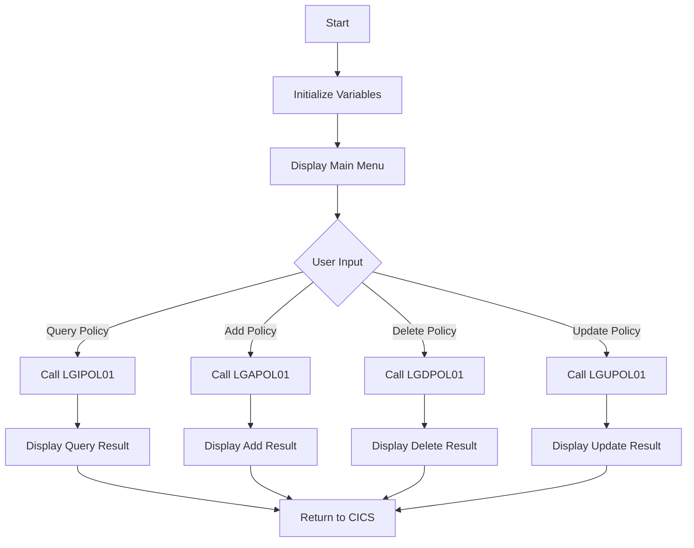

This document will cover the <SwmToken path="base/src/lgtestp3.cbl" pos="11:6:6" line-data="       PROGRAM-ID. LGTESTP3.">`LGTESTP3`</SwmToken> program. We'll cover:

1. What the Program Does
2. Program Flow
3. Program Sections

## What the Program Does

The <SwmToken path="base/src/lgtestp3.cbl" pos="11:6:6" line-data="       PROGRAM-ID. LGTESTP3.">`LGTESTP3`</SwmToken> program is designed to handle various house policy transactions within an insurance application. It provides a menu for users to perform operations such as querying, adding, deleting, and updating house policies. The program initializes necessary variables and displays a main menu to the user. Based on the user's input, it performs the corresponding operation by calling other programs like <SwmToken path="base/src/lgtestp3.cbl" pos="70:10:10" line-data="                 EXEC CICS LINK PROGRAM(&#39;LGIPOL01&#39;)">`LGIPOL01`</SwmToken>, <SwmToken path="base/src/lgtestp3.cbl" pos="106:10:10" line-data="                 EXEC CICS LINK PROGRAM(&#39;LGAPOL01&#39;)">`LGAPOL01`</SwmToken>, <SwmToken path="base/src/lgtestp3.cbl" pos="129:10:10" line-data="                 EXEC CICS LINK PROGRAM(&#39;LGDPOL01&#39;)">`LGDPOL01`</SwmToken>, and <SwmToken path="base/src/lgtestp3.cbl" pos="196:10:10" line-data="                 EXEC CICS LINK PROGRAM(&#39;LGUPOL01&#39;)">`LGUPOL01`</SwmToken>.

## Program Flow

The program flow of <SwmToken path="base/src/lgtestp3.cbl" pos="11:6:6" line-data="       PROGRAM-ID. LGTESTP3.">`LGTESTP3`</SwmToken> is as follows:

1. Initialize variables and display the main menu.
2. Handle user input and determine the requested operation.
3. Perform the requested operation by calling the appropriate program.
4. Display the result of the operation to the user.
5. Return control to CICS.



<SwmSnippet path="/base/src/lgtestp3.cbl" line="27">

---

### MAINLINE SECTION

First, the program initializes variables and displays the main menu to the user.

```cobol
       PROCEDURE DIVISION.

      *---------------------------------------------------------------*
       MAINLINE SECTION.

           IF EIBCALEN > 0
              GO TO A-GAIN.

           Initialize SSMAPP3I.
           Initialize SSMAPP3O.
           Initialize COMM-AREA.
           MOVE '0000000000'   To ENP3CNOO.
           MOVE '0000000000'   To ENP3PNOO.
           MOVE '00000000'     To ENP3VALO.
           MOVE '000'          To ENP3BEDO.


      * Display Main Menu
           EXEC CICS SEND MAP ('SSMAPP3')
                     MAPSET ('SSMAP')
                     ERASE
```

---

</SwmSnippet>

<SwmSnippet path="/base/src/lgtestp3.cbl" line="50">

---

### <SwmToken path="base/src/lgtestp3.cbl" pos="50:1:3" line-data="       A-GAIN.">`A-GAIN`</SwmToken> SECTION

Next, the program handles user input and determines the requested operation.

```cobol
       A-GAIN.

           EXEC CICS HANDLE AID
                     CLEAR(CLEARIT)
                     PF3(ENDIT) END-EXEC.
           EXEC CICS HANDLE CONDITION
                     MAPFAIL(ENDIT)
                     END-EXEC.

           EXEC CICS RECEIVE MAP('SSMAPP3')
                     INTO(SSMAPP3I)
                     MAPSET('SSMAP') END-EXEC.
```

---

</SwmSnippet>

<SwmSnippet path="/base/src/lgtestp3.cbl" line="64">

---

### EVALUATE SECTION

Then, the program evaluates the user input and performs the corresponding operation by calling the appropriate program (LGIPOL01, <SwmToken path="base/src/lgtestp3.cbl" pos="106:10:10" line-data="                 EXEC CICS LINK PROGRAM(&#39;LGAPOL01&#39;)">`LGAPOL01`</SwmToken>, <SwmToken path="base/src/lgtestp3.cbl" pos="129:10:10" line-data="                 EXEC CICS LINK PROGRAM(&#39;LGDPOL01&#39;)">`LGDPOL01`</SwmToken>, or <SwmToken path="base/src/lgtestp3.cbl" pos="196:10:10" line-data="                 EXEC CICS LINK PROGRAM(&#39;LGUPOL01&#39;)">`LGUPOL01`</SwmToken>).

```cobol
           EVALUATE ENP3OPTO

             WHEN '1'
                 Move '01IHOU'   To CA-REQUEST-ID
                 Move ENP3CNOO   To CA-CUSTOMER-NUM
                 Move ENP3PNOO   To CA-POLICY-NUM
                 EXEC CICS LINK PROGRAM('LGIPOL01')
                           COMMAREA(COMM-AREA)
                           LENGTH(32500)
                 END-EXEC
                 IF CA-RETURN-CODE > 0
                   GO TO NO-DATA
                 END-IF

                 Move CA-ISSUE-DATE      To  ENP3IDAI
                 Move CA-EXPIRY-DATE     To  ENP3EDAI
                 Move CA-H-PROPERTY-TYPE To  ENP3TYPI
                 Move CA-H-BEDROOMS      To  ENP3BEDI
                 Move CA-H-VALUE         To  ENP3VALI
                 Move CA-H-HOUSE-NAME    To  ENP3HNMI
                 Move CA-H-HOUSE-NUMBER  To  ENP3HNOI
```

---

</SwmSnippet>

<SwmSnippet path="/base/src/lgtestp3.cbl" line="238">

---

### <SwmToken path="base/src/lgtestp3.cbl" pos="238:1:3" line-data="       ENDIT-STARTIT.">`ENDIT-STARTIT`</SwmToken> SECTION

Finally, the program returns control to CICS.

```cobol
       ENDIT-STARTIT.
           EXEC CICS RETURN
                TRANSID('SSP3')
                COMMAREA(COMM-AREA)
                END-EXEC.
```

---

</SwmSnippet>

&nbsp;

*This is an auto-generated document by Swimm 🌊 and has not yet been verified by a human*

<SwmMeta version="3.0.0" repo-id="Z2l0aHViJTNBJTNBa3luZHJ5bC1jaWNzLWdlbmFwcCUzQSUzQVN3aW1tLURlbW8=" repo-name="kyndryl-cics-genapp"><sup>Powered by [Swimm](/)</sup></SwmMeta>
