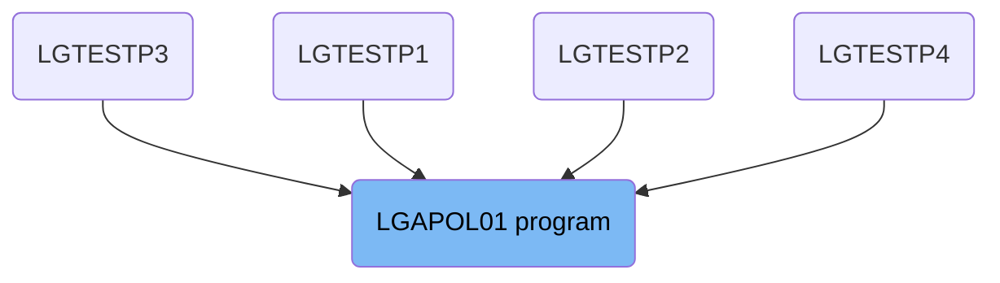
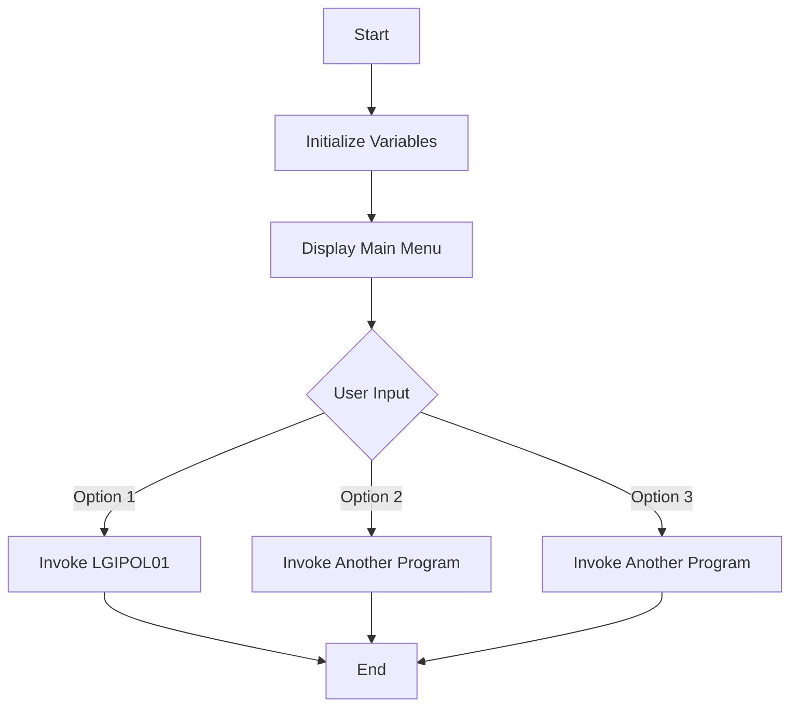

The <SwmToken path="base/src/lgapol01.cbl" pos="13:6:6" line-data="       PROGRAM-ID. LGAPOL01.">`LGAPOL01`</SwmToken> program is responsible for displaying the main menu and handling user input in the general insurance application. It initializes necessary variables, displays the main menu, and processes user input to determine the next steps. If the user selects option '1', the program links to the LGIPOL01 program to handle insurance policy details.

The <SwmToken path="base/src/lgapol01.cbl" pos="13:6:6" line-data="       PROGRAM-ID. LGAPOL01.">`LGAPOL01`</SwmToken> program starts by initializing variables and displaying the main menu to the user. It then waits for user input and evaluates the selected option. If the user chooses option '1', the program links to the LGIPOL01 program to process insurance policy details.

# Where is this program used?

This program is used multiple times in the codebase as represented in the following diagram:



Lets' zoom into the flow:



<SwmSnippet path="/base/src/lgapol01.cbl" line="182">

---

## Initializing Variables

First, the program initializes several variables such as `SSMAPP3I`, `SSMAPP3O`, and `COMM-AREA`. These variables are essential for storing input and output data, as well as communication area data used throughout the program.

```cobol

```

---

</SwmSnippet>

<SwmSnippet path="/base/src/lgapol01.cbl" line="192">

---

## Displaying Main Menu

Next, the program displays the main menu to the user by sending the `SSMAPP3` map. This allows the user to see the available options and make a selection.

```cobol

```

---

</SwmSnippet>

<SwmSnippet path="/base/src/lgapol01.cbl" line="196">

---

## Handling User Input

Moving to handling user input, the program sets up handlers for various user actions such as pressing PF3 or encountering a map failure. This ensures that the program can respond appropriately to different user interactions.

```cobol

```

---

</SwmSnippet>

<SwmSnippet path="/base/src/lgapol01.cbl" line="203">

---

## Receiving User Input

Then, the program receives the user's input from the `SSMAPP3` map and stores it in the `SSMAPP3I` variable. This input will determine the next steps in the program flow.

```cobol

```

---

</SwmSnippet>

<SwmSnippet path="/base/src/lgapol01.cbl" line="206">

---

## Evaluating User Input

Going into evaluating user input, the program checks the value of `ENP3OPTO` to determine which option the user selected. Based on this value, the program will invoke different sub-programs to handle the user's request.

```cobol

```

---

</SwmSnippet>

<SwmSnippet path="/base/src/lgapol01.cbl" line="212">

---

## Invoking LGIPOL01 Program

If the user selects option '1', the program moves specific values to the communication area and then links to the `LGIPOL01` program. This program handles the processing of insurance policy details.

More about LGIPOL01: <SwmLink doc-title="Handling Policy Inquiries (LGIPOL01)">[Handling Policy Inquiries (LGIPOL01)](/.swm/handling-policy-inquiries-lgipol01.q1xuxpj6.sw.md)</SwmLink>

```cobol

```

---

</SwmSnippet>

&nbsp;

*This is an auto-generated document by Swimm 🌊 and has not yet been verified by a human*

<SwmMeta version="3.0.0" repo-id="Z2l0aHViJTNBJTNBa3luZHJ5bC1jaWNzLWdlbmFwcCUzQSUzQVN3aW1tLURlbW8=" repo-name="kyndryl-cics-genapp"><sup>Powered by [Swimm](/)</sup></SwmMeta>
