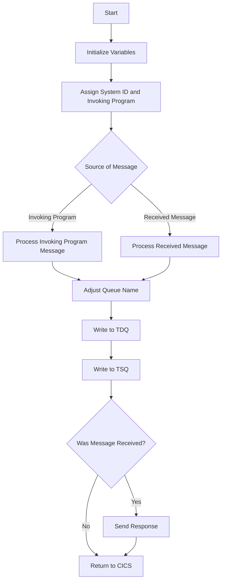

The LGSTSQ program is a COBOL application designed to handle specific tasks related to queue management in the IBM CICS Transaction Server for z/OS. This document will cover:

1. What the Program Does
2. Program Flow
3. Program Sections

## What the Program Does

The LGSTSQ program is responsible for handling messages and writing them to both a Transient Data Queue (TDQ) and a Temporary Storage Queue (TSQ). The program first determines the source of the message, either from an invoking program or a received message. It then processes the message, potentially modifying the queue name based on the message content, and writes the message to the appropriate queues.

## Program Flow

The program flow of LGSTSQ can be summarized as follows:

1. Initialize working storage variables.
2. Assign system ID and invoking program name.
3. Determine the source of the message (invoking program or received message).
4. Process the message and adjust the queue name if necessary.
5. Write the message to the TDQ.
6. Write the message to the TSQ.
7. If the message was received, send a response back.
8. Return control to CICS.



<SwmSnippet path="/base/src/lgstsq.cbl" line="55">

---

## Program Sections

First, the program initializes the working storage variables <SwmToken path="base/src/lgstsq.cbl" pos="57:7:9" line-data="           MOVE SPACES TO WRITE-MSG.">`WRITE-MSG`</SwmToken> and <SwmToken path="base/src/lgstsq.cbl" pos="58:7:9" line-data="           MOVE SPACES TO WS-RECV.">`WS-RECV`</SwmToken> to spaces. This prepares the variables for subsequent operations.

```cobol
       MAINLINE SECTION.

           MOVE SPACES TO WRITE-MSG.
           MOVE SPACES TO WS-RECV.

           EXEC CICS ASSIGN SYSID(WRITE-MSG-SYSID)
                RESP(WS-RESP)
           END-EXEC.
```

---

</SwmSnippet>

<SwmSnippet path="/base/src/lgstsq.cbl" line="63">

---

Next, the program assigns the system ID to <SwmToken path="base/src/lgstsq.cbl" pos="60:9:13" line-data="           EXEC CICS ASSIGN SYSID(WRITE-MSG-SYSID)">`WRITE-MSG-SYSID`</SwmToken> and captures the response in <SwmToken path="base/src/lgstsq.cbl" pos="65:3:5" line-data="                RESP(WS-RESP)">`WS-RESP`</SwmToken>. This step is crucial for identifying the system where the program is running.

```cobol

           EXEC CICS ASSIGN INVOKINGPROG(WS-INVOKEPROG)
                RESP(WS-RESP)
           END-EXEC.
```

---

</SwmSnippet>

<SwmSnippet path="/base/src/lgstsq.cbl" line="67">

---

Then, the program checks if it was invoked by another program. If so, it sets the flag <SwmToken path="base/src/lgstsq.cbl" pos="69:9:11" line-data="              MOVE &#39;C&#39; To WS-FLAG">`WS-FLAG`</SwmToken> to 'C', moves the communication area data to <SwmToken path="base/src/lgstsq.cbl" pos="70:9:13" line-data="              MOVE COMMA-DATA  TO WRITE-MSG-MSG">`WRITE-MSG-MSG`</SwmToken>, and sets the length of the received data. If not, it receives the message into <SwmToken path="base/src/lgstsq.cbl" pos="71:7:9" line-data="              MOVE EIBCALEN    TO WS-RECV-LEN">`WS-RECV`</SwmToken>, sets the flag <SwmToken path="base/src/lgstsq.cbl" pos="69:9:11" line-data="              MOVE &#39;C&#39; To WS-FLAG">`WS-FLAG`</SwmToken> to 'R', and moves the received data to <SwmToken path="base/src/lgstsq.cbl" pos="70:9:13" line-data="              MOVE COMMA-DATA  TO WRITE-MSG-MSG">`WRITE-MSG-MSG`</SwmToken>.

```cobol
           
           IF WS-INVOKEPROG NOT = SPACES
              MOVE 'C' To WS-FLAG
              MOVE COMMA-DATA  TO WRITE-MSG-MSG
              MOVE EIBCALEN    TO WS-RECV-LEN
           ELSE
              EXEC CICS RECEIVE INTO(WS-RECV)
                  LENGTH(WS-RECV-LEN)
                  RESP(WS-RESP)
              END-EXEC
              MOVE 'R' To WS-FLAG
              MOVE WS-RECV-DATA  TO WRITE-MSG-MSG
              SUBTRACT 5 FROM WS-RECV-LEN
           END-IF.
```

---

</SwmSnippet>

<SwmSnippet path="/base/src/lgstsq.cbl" line="81">

---

Going into the next step, the program sets the default TSQ name to 'GENAERRS'. If the message starts with 'Q=', it modifies the TSQ name based on the message content and adjusts the message length accordingly.

```cobol

           MOVE 'GENAERRS' TO STSQ-NAME.
           IF WRITE-MSG-MSG(1:2) = 'Q=' THEN
              MOVE WRITE-MSG-MSG(3:4) TO STSQ-EXT
              MOVE WRITE-MSG-REST TO TEMPO
              MOVE TEMPO          TO WRITE-MSG-MSG
              SUBTRACT 7 FROM WS-RECV-LEN
           END-IF.
```

---

</SwmSnippet>

<SwmSnippet path="/base/src/lgstsq.cbl" line="89">

---

Now, the program writes the message to the TDQ named 'CSMT'. This step ensures that the message is logged for further processing or auditing.

```cobol

           ADD 5 TO WS-RECV-LEN.

      * Write output message to TDQ CSMT
      *
           EXEC CICS WRITEQ TD QUEUE(STDQ-NAME)
                     FROM(WRITE-MSG)
                     RESP(WS-RESP)
                     LENGTH(WS-RECV-LEN)

           END-EXEC.
```

---

</SwmSnippet>

<SwmSnippet path="/base/src/lgstsq.cbl" line="100">

---

Next, the program writes the message to the TSQ. If no space is available in the TSQ, the task will not wait for storage to become available but will ignore the request.

```cobol

      * Write output message to Genapp TSQ
      * If no space is available then the task will not wait for
      *  storage to become available but will ignore the request...
      *
           EXEC CICS WRITEQ TS QUEUE(STSQ-NAME)
                     FROM(WRITE-MSG)
                     RESP(WS-RESP)
                     NOSUSPEND
                     LENGTH(WS-RECV-LEN)

```

---

</SwmSnippet>

<SwmSnippet path="/base/src/lgstsq.cbl" line="111">

---

If the message was received (indicated by <SwmToken path="base/src/lgstsq.cbl" pos="113:3:5" line-data="           If WS-FLAG = &#39;R&#39; Then">`WS-FLAG`</SwmToken> being 'R'), the program sends a response back to the terminal. This step ensures that the sender is notified of the message processing status.

```cobol
           END-EXEC.

           If WS-FLAG = 'R' Then
             EXEC CICS SEND TEXT FROM(FILLER-X)
              WAIT
              ERASE
              LENGTH(1)
              FREEKB
             END-EXEC.
```

---

</SwmSnippet>

<SwmSnippet path="/base/src/lgstsq.cbl" line="120">

---

Finally, the program returns control to CICS, indicating the end of the program execution.

```cobol

           EXEC CICS RETURN
           END-EXEC.
```

---

</SwmSnippet>

&nbsp;

*This is an auto-generated document by Swimm 🌊 and has not yet been verified by a human*

<SwmMeta version="3.0.0" repo-id="Z2l0aHViJTNBJTNBa3luZHJ5bC1jaWNzLWdlbmFwcCUzQSUzQVN3aW1tLURlbW8=" repo-name="kyndryl-cics-genapp"><sup>Powered by [Swimm](/)</sup></SwmMeta>
