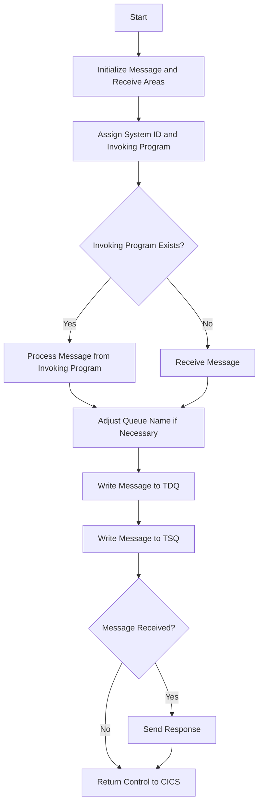

This document will cover the LGSTSQ program defined in <SwmPath>[base/src/lgstsq.cbl](base/src/lgstsq.cbl)</SwmPath>. We'll cover:

1. What the Program Does
2. Program Flow
3. Program Sections

## What the Program Does

The LGSTSQ program is designed to handle messages and write them to both a Transient Data Queue (TDQ) and a Temporary Storage Queue (TSQ) in a CICS environment. The program first determines the source of the message, either from an invoking program or a received message. It then processes the message, potentially modifying the queue name based on the message content, and writes the message to the specified queues.

## Program Flow

The program flow of LGSTSQ involves several key steps:

1. Initialize message and receive areas.
2. Assign system ID and invoking program.
3. Determine the source of the message.
4. Process the message and adjust the queue name if necessary.
5. Write the message to the TDQ.
6. Write the message to the TSQ.
7. Send a response if the message was received.
8. Return control to CICS.



<SwmSnippet path="/base/src/lgstsq.cbl" line="55">

---

### MAINLINE SECTION

First, the program initializes the message and receive areas by moving spaces to <SwmToken path="base/src/lgstsq.cbl" pos="57:7:9" line-data="           MOVE SPACES TO WRITE-MSG.">`WRITE-MSG`</SwmToken> and <SwmToken path="base/src/lgstsq.cbl" pos="58:7:9" line-data="           MOVE SPACES TO WS-RECV.">`WS-RECV`</SwmToken>. It then assigns the system ID to <SwmToken path="base/src/lgstsq.cbl" pos="60:9:13" line-data="           EXEC CICS ASSIGN SYSID(WRITE-MSG-SYSID)">`WRITE-MSG-SYSID`</SwmToken> and the invoking program to <SwmToken path="base/src/lgstsq.cbl" pos="64:9:11" line-data="           EXEC CICS ASSIGN INVOKINGPROG(WS-INVOKEPROG)">`WS-INVOKEPROG`</SwmToken>. If an invoking program exists, it processes the message from the invoking program; otherwise, it receives a message. The program then adjusts the queue name if the message contains a specific pattern, writes the message to the TDQ and TSQ, and sends a response if a message was received. Finally, it returns control to CICS.

```cobol
       MAINLINE SECTION.

           MOVE SPACES TO WRITE-MSG.
           MOVE SPACES TO WS-RECV.

           EXEC CICS ASSIGN SYSID(WRITE-MSG-SYSID)
                RESP(WS-RESP)
           END-EXEC.

           EXEC CICS ASSIGN INVOKINGPROG(WS-INVOKEPROG)
                RESP(WS-RESP)
           END-EXEC.
           
           IF WS-INVOKEPROG NOT = SPACES
              MOVE 'C' To WS-FLAG
              MOVE COMMA-DATA  TO WRITE-MSG-MSG
              MOVE EIBCALEN    TO WS-RECV-LEN
           ELSE
              EXEC CICS RECEIVE INTO(WS-RECV)
                  LENGTH(WS-RECV-LEN)
                  RESP(WS-RESP)
```

---

</SwmSnippet>

&nbsp;

*This is an auto-generated document by Swimm 🌊 and has not yet been verified by a human*

<SwmMeta version="3.0.0" repo-id="Z2l0aHViJTNBJTNBa3luZHJ5bC1jaWNzLWdlbmFwcCUzQSUzQVN3aW1tLURlbW8=" repo-name="kyndryl-cics-genapp"><sup>Powered by [Swimm](/)</sup></SwmMeta>
