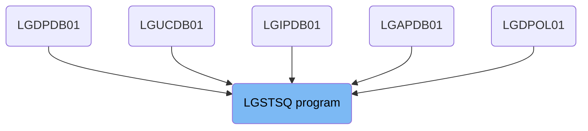
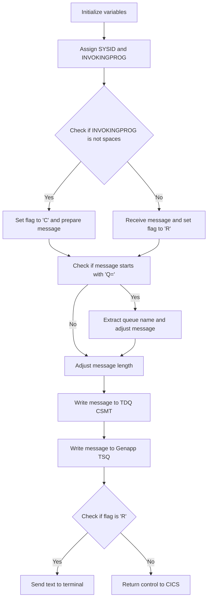

The LGSTSQ program is responsible for handling messages within the system. It initializes variables, assigns system IDs, receives messages, adjusts them, and writes them to queues. The program also sends feedback to the terminal and returns control to CICS. This document describes the flow and functionality of the LGSTSQ program (LGSTSQ).

The flow starts by initializing variables and assigning system IDs. It then checks if the message is from another program or received directly. Based on this, it sets a flag and prepares the message. The message is then adjusted if it starts with 'Q=', and written to the appropriate queues. If the flag indicates a received message, feedback is sent to the terminal. Finally, control is returned to CICS.

# Where is this program used?

This program is used multiple times in the codebase as represented in the following diagram:

(Note - these are only some of the usages of this flow)



Lets' zoom into the flow:



<SwmSnippet path="/base/src/lgstsq.cbl" line="57">

---

## Initializing Variables

First, the variables <SwmToken path="base/src/lgstsq.cbl" pos="57:7:9" line-data="           MOVE SPACES TO WRITE-MSG.">`WRITE-MSG`</SwmToken> and <SwmToken path="base/src/lgstsq.cbl" pos="58:7:9" line-data="           MOVE SPACES TO WS-RECV.">`WS-RECV`</SwmToken> are initialized to spaces. This ensures that any previous data is cleared before processing the new message.

```cobol
           MOVE SPACES TO WRITE-MSG.
           MOVE SPACES TO WS-RECV.
```

---

</SwmSnippet>

<SwmSnippet path="/base/src/lgstsq.cbl" line="60">

---

## Assigning SYSID and INVOKINGPROG

Next, the system ID and invoking program are assigned to <SwmToken path="base/src/lgstsq.cbl" pos="60:9:13" line-data="           EXEC CICS ASSIGN SYSID(WRITE-MSG-SYSID)">`WRITE-MSG-SYSID`</SwmToken> and <SwmToken path="base/src/lgstsq.cbl" pos="64:9:11" line-data="           EXEC CICS ASSIGN INVOKINGPROG(WS-INVOKEPROG)">`WS-INVOKEPROG`</SwmToken> respectively. This helps in identifying the source of the message.

```cobol
           EXEC CICS ASSIGN SYSID(WRITE-MSG-SYSID)
                RESP(WS-RESP)
           END-EXEC.

           EXEC CICS ASSIGN INVOKINGPROG(WS-INVOKEPROG)
                RESP(WS-RESP)
           END-EXEC.
```

---

</SwmSnippet>

<SwmSnippet path="/base/src/lgstsq.cbl" line="68">

---

## Handling the Received Message

Moving to the next step, if <SwmToken path="base/src/lgstsq.cbl" pos="68:3:5" line-data="           IF WS-INVOKEPROG NOT = SPACES">`WS-INVOKEPROG`</SwmToken> is not spaces, it indicates that the message is coming from another program. The flag <SwmToken path="base/src/lgstsq.cbl" pos="69:9:11" line-data="              MOVE &#39;C&#39; To WS-FLAG">`WS-FLAG`</SwmToken> is set to 'C', and the message is prepared accordingly. Otherwise, the message is received into <SwmToken path="base/src/lgstsq.cbl" pos="71:7:9" line-data="              MOVE EIBCALEN    TO WS-RECV-LEN">`WS-RECV`</SwmToken>, the flag is set to 'R', and the received data is moved to <SwmToken path="base/src/lgstsq.cbl" pos="70:9:13" line-data="              MOVE COMMA-DATA  TO WRITE-MSG-MSG">`WRITE-MSG-MSG`</SwmToken>.

```cobol
           IF WS-INVOKEPROG NOT = SPACES
              MOVE 'C' To WS-FLAG
              MOVE COMMA-DATA  TO WRITE-MSG-MSG
              MOVE EIBCALEN    TO WS-RECV-LEN
           ELSE
              EXEC CICS RECEIVE INTO(WS-RECV)
                  LENGTH(WS-RECV-LEN)
                  RESP(WS-RESP)
              END-EXEC
              MOVE 'R' To WS-FLAG
              MOVE WS-RECV-DATA  TO WRITE-MSG-MSG
              SUBTRACT 5 FROM WS-RECV-LEN
           END-IF.
```

---

</SwmSnippet>

<SwmSnippet path="/base/src/lgstsq.cbl" line="82">

---

## Adjusting the Message

Then, the message is checked to see if it starts with 'Q='. If it does, the queue name is extracted and the message is adjusted accordingly. This helps in routing the message to the correct queue.

```cobol
           MOVE 'GENAERRS' TO STSQ-NAME.
           IF WRITE-MSG-MSG(1:2) = 'Q=' THEN
              MOVE WRITE-MSG-MSG(3:4) TO STSQ-EXT
              MOVE WRITE-MSG-REST TO TEMPO
              MOVE TEMPO          TO WRITE-MSG-MSG
              SUBTRACT 7 FROM WS-RECV-LEN
           END-IF.
```

---

</SwmSnippet>

<SwmSnippet path="/base/src/lgstsq.cbl" line="94">

---

## Writing to Queues

Next, the message is written to the TDQ CSMT and the Genapp TSQ. If there is no space available in the TSQ, the task will not wait but will ignore the request. This ensures that the system does not hang due to lack of space.

```cobol
           EXEC CICS WRITEQ TD QUEUE(STDQ-NAME)
                     FROM(WRITE-MSG)
                     RESP(WS-RESP)
                     LENGTH(WS-RECV-LEN)

           END-EXEC.

      * Write output message to Genapp TSQ
      * If no space is available then the task will not wait for
      *  storage to become available but will ignore the request...
      *
           EXEC CICS WRITEQ TS QUEUE(STSQ-NAME)
                     FROM(WRITE-MSG)
                     RESP(WS-RESP)
                     NOSUSPEND
                     LENGTH(WS-RECV-LEN)

```

---

</SwmSnippet>

<SwmSnippet path="/base/src/lgstsq.cbl" line="113">

---

## Sending Text to Terminal

If the flag <SwmToken path="base/src/lgstsq.cbl" pos="113:3:5" line-data="           If WS-FLAG = &#39;R&#39; Then">`WS-FLAG`</SwmToken> is 'R', a text is sent to the terminal. This provides feedback to the user that their message has been received and processed.

```cobol
           If WS-FLAG = 'R' Then
             EXEC CICS SEND TEXT FROM(FILLER-X)
              WAIT
              ERASE
              LENGTH(1)
              FREEKB
             END-EXEC.
```

---

</SwmSnippet>

<SwmSnippet path="/base/src/lgstsq.cbl" line="121">

---

## Returning Control to CICS

Finally, control is returned to CICS, indicating that the processing of the message is complete.

```cobol
           EXEC CICS RETURN
           END-EXEC.
```

---

</SwmSnippet>

&nbsp;

*This is an auto-generated document by Swimm 🌊 and has not yet been verified by a human*

<SwmMeta version="3.0.0" repo-id="Z2l0aHViJTNBJTNBa3luZHJ5bC1jaWNzLWdlbmFwcCUzQSUzQVN3aW1tLURlbW8=" repo-name="kyndryl-cics-genapp"><sup>Powered by [Swimm](/)</sup></SwmMeta>
