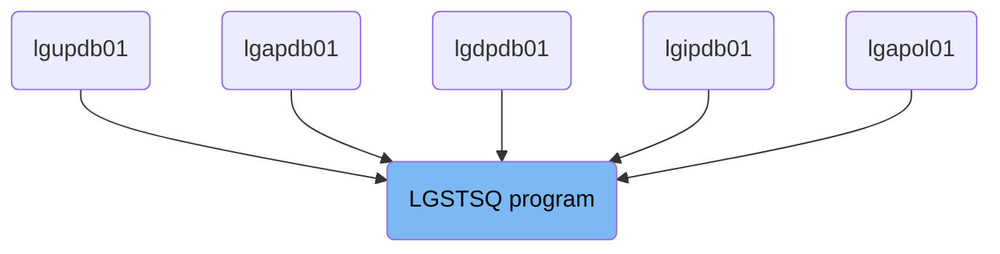
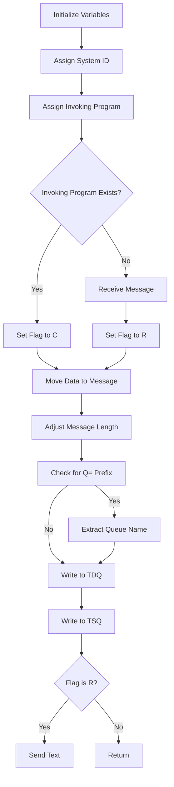

The LGSTSQ program is responsible for handling messages within the system. It achieves this by initializing variables, assigning system and invoking program IDs, checking the invoking program, adjusting message lengths, and writing messages to both Transient Data Queues (TDQ) and Temporary Storage Queues (TSQ). The program ensures that messages are correctly processed and stored for further use.

The LGSTSQ program starts by initializing variables to clear any previous data. It then assigns system and invoking program IDs to identify the source of the message. Depending on whether the message was invoked by another program, it sets a flag and processes the message accordingly. The program adjusts the message length, checks for specific prefixes, and writes the message to appropriate queues for temporary storage. Finally, it sends a text message if required and returns control to CICS.

# Where is this program used?

This program is used multiple times in the codebase as represented in the following diagram:

(Note - these are only some of the usages of this flow)



Lets' zoom into the flow:



<SwmSnippet path="/base/src/lgstsq.cbl" line="55">

---

## Initialize Variables

First, the variables <SwmToken path="base/src/lgstsq.cbl" pos="57:7:9" line-data="           MOVE SPACES TO WRITE-MSG.">`WRITE-MSG`</SwmToken> and <SwmToken path="base/src/lgstsq.cbl" pos="58:7:9" line-data="           MOVE SPACES TO WS-RECV.">`WS-RECV`</SwmToken> are initialized to spaces. This ensures that any previous data is cleared out before processing a new message.

```cobol
       MAINLINE SECTION.

           MOVE SPACES TO WRITE-MSG.
           MOVE SPACES TO WS-RECV.
```

---

</SwmSnippet>

<SwmSnippet path="/base/src/lgstsq.cbl" line="60">

---

## Assign System ID

Next, the system ID is assigned to <SwmToken path="base/src/lgstsq.cbl" pos="60:9:13" line-data="           EXEC CICS ASSIGN SYSID(WRITE-MSG-SYSID)">`WRITE-MSG-SYSID`</SwmToken> using the CICS ASSIGN command. This helps in identifying the system from which the message is received.

```cobol
           EXEC CICS ASSIGN SYSID(WRITE-MSG-SYSID)
                RESP(WS-RESP)
           END-EXEC.
```

---

</SwmSnippet>

<SwmSnippet path="/base/src/lgstsq.cbl" line="64">

---

## Assign Invoking Program

Then, the invoking program is assigned to <SwmToken path="base/src/lgstsq.cbl" pos="64:9:11" line-data="           EXEC CICS ASSIGN INVOKINGPROG(WS-INVOKEPROG)">`WS-INVOKEPROG`</SwmToken> using the CICS ASSIGN command. This helps in determining if the message was invoked by another program.

```cobol
           EXEC CICS ASSIGN INVOKINGPROG(WS-INVOKEPROG)
                RESP(WS-RESP)
           END-EXEC.
```

---

</SwmSnippet>

<SwmSnippet path="/base/src/lgstsq.cbl" line="68">

---

## Check Invoking Program

Moving to the conditional check, if <SwmToken path="base/src/lgstsq.cbl" pos="68:3:5" line-data="           IF WS-INVOKEPROG NOT = SPACES">`WS-INVOKEPROG`</SwmToken> is not spaces, it indicates that the message was invoked by another program. In this case, the flag <SwmToken path="base/src/lgstsq.cbl" pos="69:9:11" line-data="              MOVE &#39;C&#39; To WS-FLAG">`WS-FLAG`</SwmToken> is set to 'C', and the message data is moved to <SwmToken path="base/src/lgstsq.cbl" pos="70:9:13" line-data="              MOVE COMMA-DATA  TO WRITE-MSG-MSG">`WRITE-MSG-MSG`</SwmToken>. Otherwise, the program receives a message into <SwmToken path="base/src/lgstsq.cbl" pos="71:7:9" line-data="              MOVE EIBCALEN    TO WS-RECV-LEN">`WS-RECV`</SwmToken>, sets the flag <SwmToken path="base/src/lgstsq.cbl" pos="69:9:11" line-data="              MOVE &#39;C&#39; To WS-FLAG">`WS-FLAG`</SwmToken> to 'R', and moves the received data to <SwmToken path="base/src/lgstsq.cbl" pos="70:9:13" line-data="              MOVE COMMA-DATA  TO WRITE-MSG-MSG">`WRITE-MSG-MSG`</SwmToken>.

```cobol
           IF WS-INVOKEPROG NOT = SPACES
              MOVE 'C' To WS-FLAG
              MOVE COMMA-DATA  TO WRITE-MSG-MSG
              MOVE EIBCALEN    TO WS-RECV-LEN
           ELSE
              EXEC CICS RECEIVE INTO(WS-RECV)
                  LENGTH(WS-RECV-LEN)
                  RESP(WS-RESP)
              END-EXEC
              MOVE 'R' To WS-FLAG
              MOVE WS-RECV-DATA  TO WRITE-MSG-MSG
              SUBTRACT 5 FROM WS-RECV-LEN
           END-IF.
```

---

</SwmSnippet>

<SwmSnippet path="/base/src/lgstsq.cbl" line="81">

---

## Adjust Message Length

Next, the program adjusts the message length by adding 5 to <SwmToken path="base/src/lgstsq.cbl" pos="87:7:11" line-data="              SUBTRACT 7 FROM WS-RECV-LEN">`WS-RECV-LEN`</SwmToken>. This ensures that the message length is correctly set for further processing.

```cobol

           MOVE 'GENAERRS' TO STSQ-NAME.
           IF WRITE-MSG-MSG(1:2) = 'Q=' THEN
              MOVE WRITE-MSG-MSG(3:4) TO STSQ-EXT
              MOVE WRITE-MSG-REST TO TEMPO
              MOVE TEMPO          TO WRITE-MSG-MSG
              SUBTRACT 7 FROM WS-RECV-LEN
           END-IF.

           ADD 5 TO WS-RECV-LEN.
```

---

</SwmSnippet>

<SwmSnippet path="/base/src/lgstsq.cbl" line="82">

---

## Check for Q= Prefix

Then, the program checks if the message starts with 'Q='. If it does, it extracts the queue name and adjusts the message accordingly. This helps in routing the message to the correct queue.

```cobol
           MOVE 'GENAERRS' TO STSQ-NAME.
           IF WRITE-MSG-MSG(1:2) = 'Q=' THEN
              MOVE WRITE-MSG-MSG(3:4) TO STSQ-EXT
              MOVE WRITE-MSG-REST TO TEMPO
              MOVE TEMPO          TO WRITE-MSG-MSG
              SUBTRACT 7 FROM WS-RECV-LEN
           END-IF.
```

---

</SwmSnippet>

<SwmSnippet path="/base/src/lgstsq.cbl" line="94">

---

## Write to TDQ

The program then writes the output message to the Transient Data Queue (TDQ) named 'CSMT'. This is used for temporary storage of the message.

```cobol
           EXEC CICS WRITEQ TD QUEUE(STDQ-NAME)
                     FROM(WRITE-MSG)
                     RESP(WS-RESP)
                     LENGTH(WS-RECV-LEN)

           END-EXEC.
```

---

</SwmSnippet>

<SwmSnippet path="/base/src/lgstsq.cbl" line="105">

---

## Write to TSQ

Next, the program writes the output message to the Temporary Storage Queue (TSQ) named 'GENAERRS'. If no space is available, the task will not wait but will ignore the request. This ensures that the message is stored for later retrieval.

```cobol
           EXEC CICS WRITEQ TS QUEUE(STSQ-NAME)
                     FROM(WRITE-MSG)
                     RESP(WS-RESP)
                     NOSUSPEND
                     LENGTH(WS-RECV-LEN)

           END-EXEC.
```

---

</SwmSnippet>

<SwmSnippet path="/base/src/lgstsq.cbl" line="113">

---

## Send Text

If the flag <SwmToken path="base/src/lgstsq.cbl" pos="113:3:5" line-data="           If WS-FLAG = &#39;R&#39; Then">`WS-FLAG`</SwmToken> is 'R', the program sends a text message using the CICS SEND command. This is used to provide feedback to the user.

```cobol
           If WS-FLAG = 'R' Then
             EXEC CICS SEND TEXT FROM(FILLER-X)
              WAIT
              ERASE
              LENGTH(1)
              FREEKB
             END-EXEC.
```

---

</SwmSnippet>

<SwmSnippet path="/base/src/lgstsq.cbl" line="121">

---

## Return

Finally, the program returns control to CICS using the CICS RETURN command, indicating the end of the message processing.

```cobol
           EXEC CICS RETURN
           END-EXEC.
```

---

</SwmSnippet>

&nbsp;

*This is an auto-generated document by Swimm 🌊 and has not yet been verified by a human*

<SwmMeta version="3.0.0" repo-id="Z2l0aHViJTNBJTNBa3luZHJ5bC1jaWNzLWdlbmFwcCUzQSUzQVN3aW1tLURlbW8=" repo-name="kyndryl-cics-genapp"><sup>Powered by [Swimm](/)</sup></SwmMeta>
