The <SwmToken path="base/src/lgipvs01.cbl" pos="13:6:6" line-data="       PROGRAM-ID. LGIPVS01.">`LGIPVS01`</SwmToken> program is responsible for handling policy information in the system. It assigns system IDs, start codes, and invoking programs, checks conditions to determine the flow, reads policy files, and prepares or sends data based on the conditions. This ensures that the appropriate response is sent back to the user.

The <SwmToken path="base/src/lgipvs01.cbl" pos="13:6:6" line-data="       PROGRAM-ID. LGIPVS01.">`LGIPVS01`</SwmToken> program starts by assigning system IDs, start codes, and invoking programs. It then checks certain conditions to determine the flow of the program. Depending on these conditions, it either sets a flag and prepares the communication area or receives data. The program then reads the policy file and checks if the policy type matches the key type and if the response is normal. Based on these checks, it either prepares an error message or moves the policy data to the message key. Finally, it checks the flag and either sends the message text or prepares the communication data with the message text and key.

Lets' zoom into the flow:

```mermaid
graph TD
  A[Start] --> B[Assign SYSID, STARTCODE, Invokingprog]
  B --> C{Check STARTCODE or Invokingprog}
  C -->|STARTCODE = 'D' or Invokingprog Not = Spaces| D[Set FLAG to 'C']
  C -->|Else| E[Receive data into WS-RECV]
  D --> F[Move COMMA-DATA to WS-COMMAREA]
  E --> G[Set FLAG to 'R']
  G --> H[Move WS-RECV-DATA to WS-COMMAREA]
  F --> I[Read File 'KSDSPOLY']
  H --> I[Read File 'KSDSPOLY']
  I --> J{Check Policy Type and Response}
  J -->|Policy Bad| K[Move 'Policy Bad=' to Write-Msg-Text]
  J -->|Else| L[Move CA-Area to WRITE-MSG-Key]
  K --> M{Check FLAG}
  L --> M{Check FLAG}
  M -->|FLAG = 'R'| N[Send Text from WRITE-MSG]
  M -->|Else| O[Move Write-Msg-Text to COMMA-Data-Text]
  N --> P[Return]
  O --> P[Return]

%% Swimm:
%% graph TD
%%   A[Start] --> B[Assign SYSID, STARTCODE, Invokingprog]
%%   B --> C{Check STARTCODE or Invokingprog}
%%   C -->|STARTCODE = 'D' or Invokingprog Not = Spaces| D[Set FLAG to 'C']
%%   C -->|Else| E[Receive data into WS-RECV]
%%   D --> F[Move <SwmToken path="base/src/lgipvs01.cbl" pos="93:3:5" line-data="              MOVE COMMA-DATA  TO WS-COMMAREA">`COMMA-DATA`</SwmToken> to WS-COMMAREA]
%%   E --> G[Set FLAG to 'R']
%%   G --> H[Move <SwmToken path="base/src/lgipvs01.cbl" pos="103:3:7" line-data="              MOVE WS-RECV-DATA  TO WS-COMMAREA">`WS-RECV-DATA`</SwmToken> to WS-COMMAREA]
%%   F --> I[Read File 'KSDSPOLY']
%%   H --> I[Read File 'KSDSPOLY']
%%   I --> J{Check Policy Type and Response}
%%   J -->|Policy Bad| K[Move 'Policy Bad=' to Write-Msg-Text]
%%   J -->|Else| L[Move <SwmToken path="base/src/lgipvs01.cbl" pos="127:3:5" line-data="             Move CA-Area to WRITE-MSG-Key">`CA-Area`</SwmToken> to WRITE-MSG-Key]
%%   K --> M{Check FLAG}
%%   L --> M{Check FLAG}
%%   M -->|FLAG = 'R'| N[Send Text from WRITE-MSG]
%%   M -->|Else| O[Move <SwmToken path="base/src/lgipvs01.cbl" pos="123:12:16" line-data="             Move &#39;Policy Bad=&#39;   To Write-Msg-Text">`Write-Msg-Text`</SwmToken> to COMMA-Data-Text]
%%   N --> P[Return]
%%   O --> P[Return]
```



<SwmSnippet path="/base/src/lgipvs01.cbl" line="79">

---

## Initial CICS Assignments

First, the program assigns the system ID, start code, and invoking program using CICS ASSIGN commands. These assignments are crucial for determining the subsequent flow of the program based on the start code and invoking program.

```cobol
           EXEC CICS ASSIGN SYSID(WS-SYSID)
                RESP(WS-RESP)
           END-EXEC.

           EXEC CICS ASSIGN STARTCODE(WS-STARTCODE)
                RESP(WS-RESP)
           END-EXEC.

           EXEC CICS ASSIGN Invokingprog(WS-Invokeprog)
                RESP(WS-RESP)
           END-EXEC.
```

---

</SwmSnippet>

<SwmSnippet path="/base/src/lgipvs01.cbl" line="90">

---

## Determining the Flow

Next, the program checks if the start code is 'D' or if the invoking program is not empty. If either condition is true, it sets the flag to 'C' and prepares the communication area. Otherwise, it receives data into <SwmToken path="base/src/lgipvs01.cbl" pos="94:7:9" line-data="              MOVE EIBCALEN    TO WS-RECV-LEN">`WS-RECV`</SwmToken> and sets the flag to 'R'. This decision determines whether the program will process a new transaction or continue an existing one.

```cobol
           IF WS-STARTCODE(1:1) = 'D' or
              WS-Invokeprog Not = Spaces
              MOVE 'C' To WS-FLAG
              MOVE COMMA-DATA  TO WS-COMMAREA
              MOVE EIBCALEN    TO WS-RECV-LEN
              MOVE 11          TO WS-RECV-LEN
              SUBTRACT 1 FROM WS-RECV-LEN
           ELSE
              EXEC CICS RECEIVE INTO(WS-RECV)
                  LENGTH(WS-RECV-LEN)
                  RESP(WS-RESP)
              END-EXEC
              MOVE 'R' To WS-FLAG
              MOVE WS-RECV-DATA  TO WS-COMMAREA
              SUBTRACT 6 FROM WS-RECV-LEN
           END-IF.
```

---

</SwmSnippet>

<SwmSnippet path="/base/src/lgipvs01.cbl" line="111">

---

## Reading the Policy File

Then, the program reads the policy file 'KSDSPOLY' into the communication area. This step is essential for retrieving the policy information based on the key provided in the communication area.

```cobol
           Exec CICS Read File('KSDSPOLY')
                     Into(CA-AREA)
                     Length(F64)
                     Ridfld(PART-KEY)
                     KeyLength(F11)
                     Generic
                     RESP(WS-RESP)
                     GTEQ
           End-Exec.
```

---

</SwmSnippet>

<SwmSnippet path="/base/src/lgipvs01.cbl" line="121">

---

## Checking Policy and Response

Moving to the next step, the program checks if the policy type matches the key type and if the response is normal. If either condition fails, it prepares an error message. Otherwise, it moves the policy data to the message key.

```cobol
           If CA-Policy-Type   Not = Part-Key-Type Or
              WS-RESP NOT          = DFHRESP(NORMAL)
             Move 'Policy Bad='   To Write-Msg-Text
             Move 13              To WRITE-Msg-CustNum
             Move 13              To WRITE-Msg-PolNum
           Else
             Move CA-Area to WRITE-MSG-Key
           End-If
```

---

</SwmSnippet>

<SwmSnippet path="/base/src/lgipvs01.cbl" line="130">

---

## Sending or Preparing Data

Finally, the program checks the flag. If the flag is 'R', it sends the message text. Otherwise, it prepares the communication data with the message text and key. This step ensures that the appropriate response is sent back to the user based on the initial conditions.

```cobol
           If WS-FLAG = 'R' Then
             EXEC CICS SEND TEXT FROM(WRITE-MSG)
              WAIT
              ERASE
              LENGTH(80)
              FREEKB
             END-EXEC
           Else
             Move Spaces          To COMMA-Data
             Move Write-Msg-Text  To COMMA-Data-Text
             Move Write-Msg-Key   To COMMA-Data-Key
           End-If.
```

---

</SwmSnippet>

&nbsp;

*This is an auto-generated document by Swimm 🌊 and has not yet been verified by a human*

<SwmMeta version="3.0.0" repo-id="Z2l0aHViJTNBJTNBa3luZHJ5bC1jaWNzLWdlbmFwcCUzQSUzQVN3aW1tLURlbW8=" repo-name="kyndryl-cics-genapp"><sup>Powered by [Swimm](/)</sup></SwmMeta>
