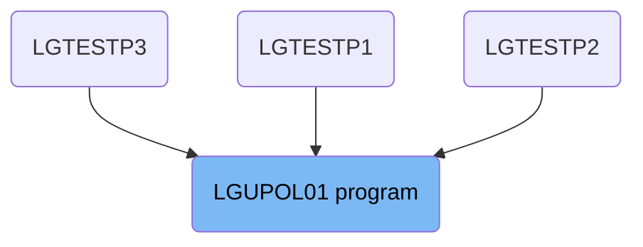
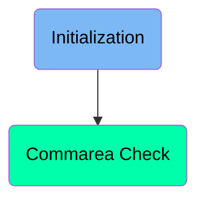
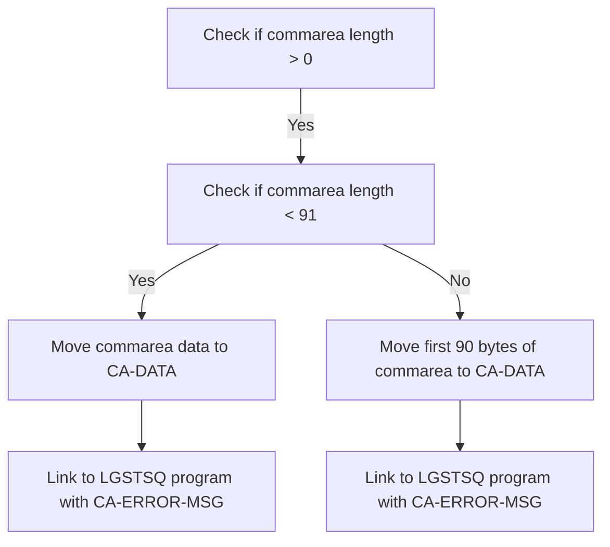

The <SwmToken path="base/src/lgupol01.cbl" pos="11:6:6" line-data="       PROGRAM-ID. LGUPOL01.">`LGUPOL01`</SwmToken> program is responsible for handling policy information within the general insurance application. It ensures that the communication area (commarea) data is correctly processed and linked to the LGSTSQ program for further handling. This is achieved by checking the length of the commarea, moving the data to appropriate variables, and linking to the LGSTSQ program.

The <SwmToken path="base/src/lgupol01.cbl" pos="11:6:6" line-data="       PROGRAM-ID. LGUPOL01.">`LGUPOL01`</SwmToken> program starts by checking if there is data in the commarea. If there is data, it moves the data to a variable called <SwmToken path="base/src/lgupol01.cbl" pos="53:3:5" line-data="           03 CA-DATA                  PIC X(90) VALUE SPACES.">`CA-DATA`</SwmToken>. Depending on the length of the data, it either moves all of it or just the first 90 bytes. Then, it links to another program called LGSTSQ to process the data further.

# Where is this program used?

This program is used multiple times in the codebase as represented in the following diagram:



Here is a high level diagram of the program:



# Initialization



<SwmSnippet path="/base/src/lgupol01.cbl" line="83">

---

## Checking Commarea Length

First, the code checks if the length of the communication area (<SwmToken path="base/src/lgupol01.cbl" pos="99:3:3" line-data="           IF EIBCALEN IS EQUAL TO ZERO">`EIBCALEN`</SwmToken>) is greater than 0. This ensures that there is data to process.

```cobol
       MAINLINE SECTION.
```

---

</SwmSnippet>

<SwmSnippet path="/base/src/lgupol01.cbl" line="84">

---

## Handling Commarea Data

Next, if the length of the communication area is less than 91, it moves the data from <SwmToken path="base/src/lgupol01.cbl" pos="30:7:7" line-data="           03 WS-ADDR-DFHCOMMAREA      USAGE is POINTER.">`DFHCOMMAREA`</SwmToken> to <SwmToken path="base/src/lgupol01.cbl" pos="53:3:5" line-data="           03 CA-DATA                  PIC X(90) VALUE SPACES.">`CA-DATA`</SwmToken>. This prepares the data for further processing.

```cobol

      *----------------------------------------------------------------*
```

---

</SwmSnippet>

<SwmSnippet path="/base/src/lgupol01.cbl" line="86">

---

## Linking to LGSTSQ Program

Then, the code links to the <SwmToken path="base/src/lgupol01.cbl" pos="181:10:10" line-data="           EXEC CICS LINK PROGRAM(&#39;LGSTSQ&#39;)">`LGSTSQ`</SwmToken> program using the <SwmToken path="base/src/lgupol01.cbl" pos="157:1:5" line-data="           EXEC CICS LINK Program(LGUPDB01)">`EXEC CICS LINK`</SwmToken> command, passing <SwmToken path="base/src/lgupol01.cbl" pos="51:3:7" line-data="       01  CA-ERROR-MSG.">`CA-ERROR-MSG`</SwmToken> as the communication area. This step sends the data to the <SwmToken path="base/src/lgupol01.cbl" pos="181:10:10" line-data="           EXEC CICS LINK PROGRAM(&#39;LGSTSQ&#39;)">`LGSTSQ`</SwmToken> program for further processing.

More about LGSTSQ: <SwmLink doc-title="Handling Messages (LGSTSQ)">[Handling Messages (LGSTSQ)](/.swm/handling-messages-lgstsq.di7or3tb.sw.md)</SwmLink>

```cobol
      * Common code                                                    *
      *----------------------------------------------------------------*
      * initialize working storage variables
           INITIALIZE WS-HEADER.
```

---

</SwmSnippet>

<SwmSnippet path="/base/src/lgupol01.cbl" line="90">

---

## Handling Larger Commarea Data

If the length of the communication area is 91 or more, it moves the first 90 bytes of <SwmToken path="base/src/lgupol01.cbl" pos="30:7:7" line-data="           03 WS-ADDR-DFHCOMMAREA      USAGE is POINTER.">`DFHCOMMAREA`</SwmToken> to <SwmToken path="base/src/lgupol01.cbl" pos="53:3:5" line-data="           03 CA-DATA                  PIC X(90) VALUE SPACES.">`CA-DATA`</SwmToken>. This ensures that only the relevant portion of the data is processed.

```cobol
      * set up general variable
           MOVE EIBTRNID TO WS-TRANSID.
```

---

</SwmSnippet>

<SwmSnippet path="/base/src/lgupol01.cbl" line="92">

---

## Linking to LGSTSQ Program Again

Finally, the code links to the <SwmToken path="base/src/lgupol01.cbl" pos="181:10:10" line-data="           EXEC CICS LINK PROGRAM(&#39;LGSTSQ&#39;)">`LGSTSQ`</SwmToken> program again using the <SwmToken path="base/src/lgupol01.cbl" pos="157:1:5" line-data="           EXEC CICS LINK Program(LGUPDB01)">`EXEC CICS LINK`</SwmToken> command, passing <SwmToken path="base/src/lgupol01.cbl" pos="51:3:7" line-data="       01  CA-ERROR-MSG.">`CA-ERROR-MSG`</SwmToken> as the communication area. This step sends the truncated data to the <SwmToken path="base/src/lgupol01.cbl" pos="181:10:10" line-data="           EXEC CICS LINK PROGRAM(&#39;LGSTSQ&#39;)">`LGSTSQ`</SwmToken> program for further processing.

More about LGSTSQ: <SwmLink doc-title="Handling Messages (LGSTSQ)">[Handling Messages (LGSTSQ)](/.swm/handling-messages-lgstsq.di7or3tb.sw.md)</SwmLink>

```cobol
           MOVE EIBTRMID TO WS-TERMID.
           MOVE EIBTASKN TO WS-TASKNUM.

      *----------------------------------------------------------------*
```

---

</SwmSnippet>

# Commarea Check

This is the next section of the flow.

<SwmSnippet path="/base/src/lgupol01.cbl" line="97">

---

## Exiting the Program

Next, the program reaches the end of the main logic and prepares to exit. This is indicated by the <SwmToken path="base/src/lgupol01.cbl" pos="103:1:3" line-data="           END-IF">`END-IF`</SwmToken> statement, which signifies the end of a conditional block, followed by the <SwmToken path="base/src/lgupol01.cbl" pos="149:3:3" line-data="       MAINLINE-EXIT.">`EXIT`</SwmToken> statement, which terminates the program's execution.

```cobol
      *----------------------------------------------------------------*
      * If NO commarea received issue an ABEND
           IF EIBCALEN IS EQUAL TO ZERO
```

---

</SwmSnippet>

&nbsp;

*This is an auto-generated document by Swimm 🌊 and has not yet been verified by a human*

<SwmMeta version="3.0.0" repo-id="Z2l0aHViJTNBJTNBa3luZHJ5bC1jaWNzLWdlbmFwcCUzQSUzQVN3aW1tLURlbW8=" repo-name="kyndryl-cics-genapp"><sup>Powered by [Swimm](/)</sup></SwmMeta>
