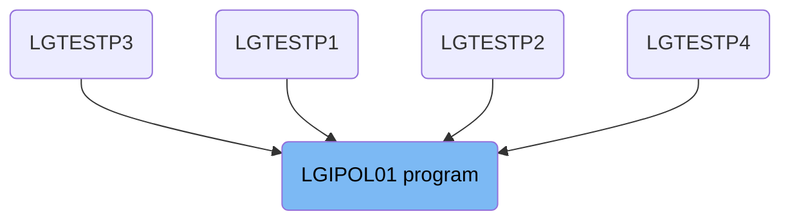
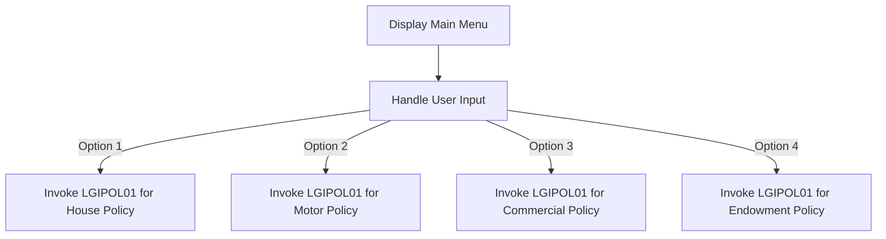

The <SwmToken path="base/src/lgipol01.cbl" pos="13:6:6" line-data="       PROGRAM-ID. LGIPOL01.">`LGIPOL01`</SwmToken> program is responsible for handling various types of insurance policy inquiries. It is invoked based on user input from the main menu, allowing users to inquire about house, motor, commercial, and endowment policies. The program achieves this by initializing fields, displaying the main menu, handling user inputs, and invoking the appropriate sub-programs based on the user's selection.

The <SwmToken path="base/src/lgipol01.cbl" pos="13:6:6" line-data="       PROGRAM-ID. LGIPOL01.">`LGIPOL01`</SwmToken> program starts by displaying a main menu to the user. The user selects an option, and the program handles the input to determine which type of policy inquiry to perform. It then invokes the appropriate sub-program to process the inquiry and provide the necessary information to the user.

# Where is this program used?

This program is used multiple times in the codebase as represented in the following diagram:



Lets' zoom into the flow:



<SwmSnippet path="/base/src/lgipol01.cbl" line="279">

---

## Display Main Menu

First, the program initializes various fields and then displays the main menu to the user using the <SwmToken path="base/src/lgipol01.cbl" pos="82:1:1" line-data="               EXEC CICS ABEND ABCODE(&#39;LGCA&#39;) NODUMP END-EXEC">`EXEC`</SwmToken>` `<SwmToken path="base/src/lgipol01.cbl" pos="82:3:3" line-data="               EXEC CICS ABEND ABCODE(&#39;LGCA&#39;) NODUMP END-EXEC">`CICS`</SwmToken>` SEND MAP` command. This allows the user to see the available options for policy inquiries.

```cobol

```

---

</SwmSnippet>

<SwmSnippet path="/base/src/lgipol01.cbl" line="288">

---

## Handle User Input

Next, the program sets up handlers for user actions and conditions using <SwmToken path="base/src/lgipol01.cbl" pos="82:1:1" line-data="               EXEC CICS ABEND ABCODE(&#39;LGCA&#39;) NODUMP END-EXEC">`EXEC`</SwmToken>` `<SwmToken path="base/src/lgipol01.cbl" pos="82:3:3" line-data="               EXEC CICS ABEND ABCODE(&#39;LGCA&#39;) NODUMP END-EXEC">`CICS`</SwmToken>` HANDLE AID` and <SwmToken path="base/src/lgipol01.cbl" pos="82:1:1" line-data="               EXEC CICS ABEND ABCODE(&#39;LGCA&#39;) NODUMP END-EXEC">`EXEC`</SwmToken>` `<SwmToken path="base/src/lgipol01.cbl" pos="82:3:3" line-data="               EXEC CICS ABEND ABCODE(&#39;LGCA&#39;) NODUMP END-EXEC">`CICS`</SwmToken>` HANDLE CONDITION`. This ensures that the program can properly respond to user inputs and errors.

```cobol

```

---

</SwmSnippet>

<SwmSnippet path="/base/src/lgipol01.cbl" line="294">

---

## Receive User Input

Then, the program receives the user's input from the main menu using the <SwmToken path="base/src/lgipol01.cbl" pos="82:1:1" line-data="               EXEC CICS ABEND ABCODE(&#39;LGCA&#39;) NODUMP END-EXEC">`EXEC`</SwmToken>` `<SwmToken path="base/src/lgipol01.cbl" pos="82:3:3" line-data="               EXEC CICS ABEND ABCODE(&#39;LGCA&#39;) NODUMP END-EXEC">`CICS`</SwmToken>` RECEIVE MAP` command. This input determines which policy inquiry the user wants to perform.

```cobol

```

---

</SwmSnippet>

<SwmSnippet path="/base/src/lgipol01.cbl" line="297">

---

## Invoke Appropriate Program

Going into the evaluation of the user's input, the program uses the `EVALUATE` statement to check the selected option. Depending on the option, it sets the appropriate request ID and customer/policy numbers, and then invokes the <SwmToken path="base/src/lgipol01.cbl" pos="13:6:6" line-data="       PROGRAM-ID. LGIPOL01.">`LGIPOL01`</SwmToken> program using the <SwmToken path="base/src/lgipol01.cbl" pos="119:1:7" line-data="           EXEC CICS LINK PROGRAM(&#39;LGSTSQ&#39;)">`EXEC CICS LINK PROGRAM`</SwmToken> command. This allows the user to inquire about different types of insurance policies.

```cobol

```

---

</SwmSnippet>

&nbsp;

*This is an auto-generated document by Swimm 🌊 and has not yet been verified by a human*

<SwmMeta version="3.0.0" repo-id="Z2l0aHViJTNBJTNBa3luZHJ5bC1jaWNzLWdlbmFwcCUzQSUzQVN3aW1tLURlbW8=" repo-name="kyndryl-cics-genapp"><sup>Powered by [Swimm](/)</sup></SwmMeta>
