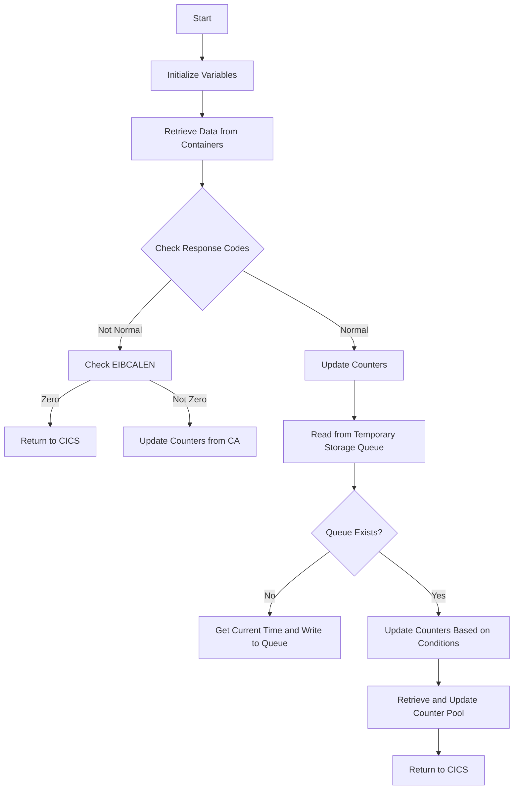

This document will cover the <SwmToken path="base/src/lgastat1.cbl" pos="7:6:6" line-data="       PROGRAM-ID. LGASTAT1.">`LGASTAT1`</SwmToken> program. We'll cover:

1. What the Program Does
2. Program Flow
3. Program Sections

## What the Program Does

The <SwmToken path="base/src/lgastat1.cbl" pos="7:6:6" line-data="       PROGRAM-ID. LGASTAT1.">`LGASTAT1`</SwmToken> program is designed to handle transaction statistics and manage counters for a general insurance application. It initializes various working storage variables, retrieves data from containers, reads and writes to a temporary storage queue, and updates counters based on specific conditions.

## Program Flow

The program follows these high-level steps:

1. Initialize working storage variables.
2. Retrieve data from containers.
3. Check response codes and update counters accordingly.
4. Read from a temporary storage queue.
5. If the queue does not exist, get the current time and write to the queue.
6. Update counters based on specific conditions.
7. Retrieve and update a counter pool.
8. Return control to CICS.



<SwmSnippet path="/base/src/lgastat1.cbl" line="67">

---

### MAINLINE SECTION

First, the program initializes the working storage variables and retrieves data from containers <SwmToken path="base/src/lgastat1.cbl" pos="79:9:11" line-data="           Exec CICS Get Container(WS-CHANname1)">`WS-CHANname1`</SwmToken> and <SwmToken path="base/src/lgastat1.cbl" pos="84:9:11" line-data="           Exec CICS Get Container(WS-CHANname2)">`WS-CHANname2`</SwmToken>. It then checks the response code and updates the counters accordingly. If the response code is not normal and <SwmToken path="base/src/lgastat1.cbl" pos="77:3:3" line-data="           MOVE EIBCALEN TO WS-CALEN.">`EIBCALEN`</SwmToken> is zero, it returns control to CICS. Otherwise, it updates the counters from the common area.

```cobol
       PROCEDURE DIVISION.

       MAINLINE SECTION.

      *
           INITIALIZE WS-HEADER.
      *
           MOVE EIBTRNID TO WS-TRANSID.
           MOVE EIBTRMID TO WS-TERMID.
           MOVE EIBTASKN TO WS-TASKNUM.
           MOVE EIBCALEN TO WS-CALEN.
      *
           Exec CICS Get Container(WS-CHANname1)
                         Into(WS-Data-Req)
                         Resp(WS-RESP)
           End-Exec.
      *
           Exec CICS Get Container(WS-CHANname2)
                         Into(WS-Data-RC)
                         Resp(WS-RESP)
           End-Exec.
```

---

</SwmSnippet>

<SwmSnippet path="/base/src/lgastat1.cbl" line="101">

---

Next, the program reads from the temporary storage queue <SwmToken path="base/src/lgastat1.cbl" pos="101:11:13" line-data="           Exec Cics ReadQ TS Queue(WS-Qname)">`WS-Qname`</SwmToken>. If the queue does not exist, it gets the current time and writes to the queue.

```cobol
           Exec Cics ReadQ TS Queue(WS-Qname)
                     Into(WS-Qarea)
                     Length(Length of WS-Qarea)
                     Resp(WS-RESP)
           End-Exec.
           If WS-RESP     = DFHRESP(QIDERR) Then
             EXEC CICS ASKTIME ABSTIME(WS-ABSTIME)
             END-EXEC
             EXEC CICS FORMATTIME ABSTIME(WS-ABSTIME)
                       DDMMYYYY(WS-DATE)
                       TIME(WS-TIME)
             END-EXEC
             Move WS-Date To WS-area-D
             Move WS-Time To WS-area-T
             Exec Cics WriteQ TS Queue(WS-Qname)
                       From(WS-Qarea)
                       Length(Length of WS-Qarea)
                       Resp(WS-RESP)
             End-Exec
```

---

</SwmSnippet>

<SwmSnippet path="/base/src/lgastat1.cbl" line="122">

---

Then, the program updates the counters based on specific conditions. If <SwmToken path="base/src/lgastat1.cbl" pos="122:3:3" line-data="           If GENAcounter = &#39;02ACUS&#39;">`GENAcounter`</SwmToken> equals <SwmToken path="base/src/lgastat1.cbl" pos="122:8:8" line-data="           If GENAcounter = &#39;02ACUS&#39;">`02ACUS`</SwmToken>, it changes it to <SwmToken path="base/src/lgastat1.cbl" pos="123:4:4" line-data="                                     Move &#39;01ACUS&#39; to GENAcounter.">`01ACUS`</SwmToken>. Similarly, it updates other counters and types based on predefined conditions.

```cobol
           If GENAcounter = '02ACUS'
                                     Move '01ACUS' to GENAcounter.
           If GENAcounter = '02ICOM' or
              GENAcounter = '03ICOM' or
              GENAcounter = '05ICOM' Move '01ICOM' to GENAcounter.
           If GENAType Not = '00' Move '99' To GENAtype.

               Exec CICS Get Counter(GENAcount)
                             Pool(GENApool)
                             Value(Trancount)
                             Resp(WS-RESP)
               End-Exec
```

---

</SwmSnippet>

<SwmSnippet path="/base/src/lgastat1.cbl" line="129">

---

Finally, the program retrieves and updates the counter pool <SwmToken path="base/src/lgastat1.cbl" pos="130:3:3" line-data="                             Pool(GENApool)">`GENApool`</SwmToken> and returns control to CICS.

```cobol
               Exec CICS Get Counter(GENAcount)
                             Pool(GENApool)
                             Value(Trancount)
                             Resp(WS-RESP)
               End-Exec
```

---

</SwmSnippet>

&nbsp;

*This is an auto-generated document by Swimm 🌊 and has not yet been verified by a human*

<SwmMeta version="3.0.0" repo-id="Z2l0aHViJTNBJTNBa3luZHJ5bC1jaWNzLWdlbmFwcCUzQSUzQVN3aW1tLURlbW8=" repo-name="kyndryl-cics-genapp"><sup>Powered by [Swimm](/)</sup></SwmMeta>
