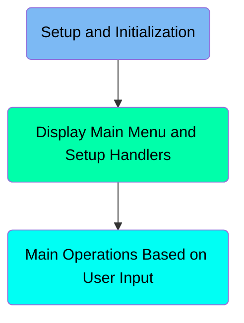
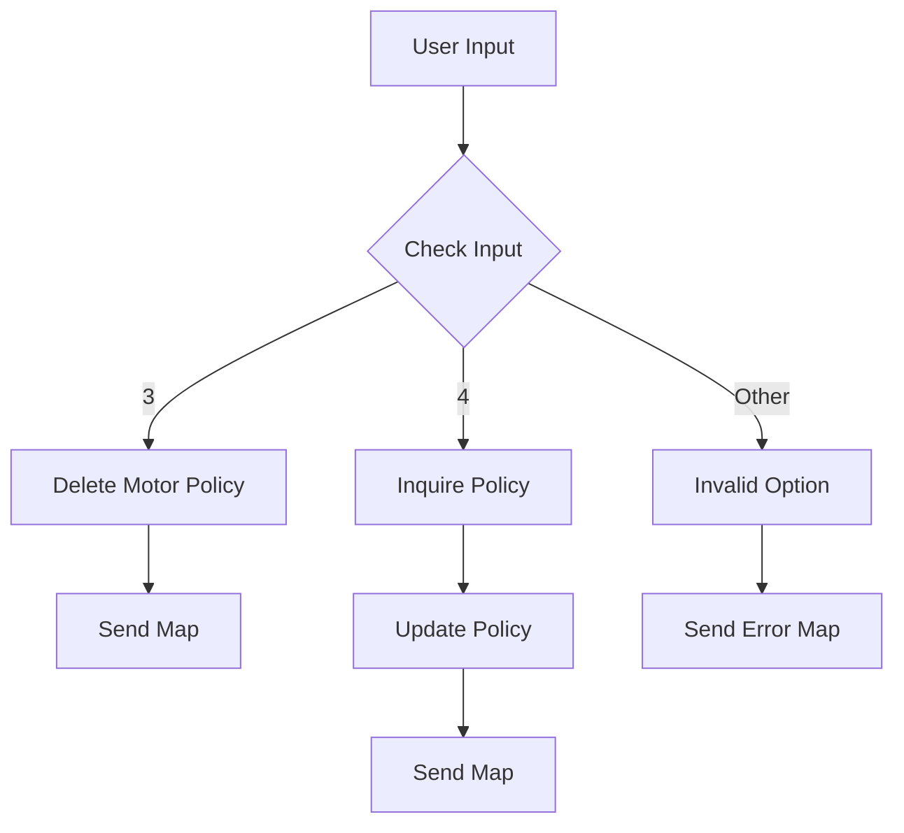

The <SwmToken path="base/src/lgtestp1.cbl" pos="11:6:6" line-data="       PROGRAM-ID. LGTESTP1.">`LGTESTP1`</SwmToken> program handles various user inputs to perform operations such as deleting, inquiring, and updating policy information. It achieves this by setting up necessary parameters, calling specific programs like <SwmToken path="base/src/lgtestp1.cbl" pos="139:10:10" line-data="                 EXEC CICS LINK PROGRAM(&#39;LGDPOL01&#39;)">`LGDPOL01`</SwmToken>, <SwmToken path="base/src/lgtestp1.cbl" pos="72:10:10" line-data="                 EXEC CICS LINK PROGRAM(&#39;LGIPOL01&#39;)">`LGIPOL01`</SwmToken>, and <SwmToken path="base/src/lgtestp1.cbl" pos="216:10:10" line-data="                 EXEC CICS LINK PROGRAM(&#39;LGUPOL01&#39;)">`LGUPOL01`</SwmToken>, and handling errors appropriately.

The <SwmToken path="base/src/lgtestp1.cbl" pos="11:6:6" line-data="       PROGRAM-ID. LGTESTP1.">`LGTESTP1`</SwmToken> program starts by initializing fields and displaying the main menu. Based on user input, it performs operations like deleting a motor policy, inquiring about a policy, or updating policy details. It sets up parameters, calls the relevant programs, and handles any errors that occur during these operations.

Here is a high level diagram of the program:



# Setup and Initialization



<SwmSnippet path="/base/src/lgtestp1.cbl" line="30">

---

## Handling CICS operations based on user input

First, the code checks if the user input is '3'. If it is, it sets up the necessary parameters to delete a motor policy by moving values to <SwmToken path="base/src/lgtestp1.cbl" pos="69:9:13" line-data="                 Move &#39;01IMOT&#39;   To CA-REQUEST-ID">`CA-REQUEST-ID`</SwmToken>, <SwmToken path="base/src/lgtestp1.cbl" pos="70:7:11" line-data="                 Move ENP1CNOO   To CA-CUSTOMER-NUM">`CA-CUSTOMER-NUM`</SwmToken>, and <SwmToken path="base/src/lgtestp1.cbl" pos="71:7:11" line-data="                 Move ENP1PNOO   To CA-POLICY-NUM">`CA-POLICY-NUM`</SwmToken>. Then, it links to the <SwmToken path="base/src/lgtestp1.cbl" pos="139:10:10" line-data="                 EXEC CICS LINK PROGRAM(&#39;LGDPOL01&#39;)">`LGDPOL01`</SwmToken> program to perform the deletion.

More about <SwmToken path="base/src/lgtestp1.cbl" pos="139:10:10" line-data="                 EXEC CICS LINK PROGRAM(&#39;LGDPOL01&#39;)">`LGDPOL01`</SwmToken>: <SwmLink doc-title="Deleting Policy Information (LGDPOL01)">[Deleting Policy Information (LGDPOL01)](/.swm/deleting-policy-information-lgdpol01.sf6u0vqb.sw.md)</SwmLink>

```cobol
       MAINLINE SECTION.

           IF EIBCALEN > 0
              GO TO A-GAIN.

           Initialize SSMAPP1I.
           Initialize SSMAPP1O.
           Initialize COMM-AREA.
           MOVE '0000000000'   To ENP1CNOO.
           MOVE '0000000000'   To ENP1PNOO.
           MOVE '000000'       To ENP1VALO.
           MOVE '00000'        To ENP1CCO.
           MOVE '000000'       To ENP1ACCO.
           MOVE '000000'       To ENP1PREO.


```

---

</SwmSnippet>

<SwmSnippet path="/base/src/lgtestp1.cbl" line="40">

---

## Handling errors during deletion

Next, the code checks if the <SwmToken path="base/src/lgtestp1.cbl" pos="76:3:7" line-data="                 IF CA-RETURN-CODE &gt; 0">`CA-RETURN-CODE`</SwmToken> is greater than 0, indicating an error during the deletion process. If an error is detected, it performs a rollback using <SwmToken path="base/src/lgtestp1.cbl" pos="120:3:7" line-data="                   Exec CICS Syncpoint Rollback End-Exec">`CICS Syncpoint Rollback`</SwmToken> and then goes to the <SwmToken path="base/src/lgtestp1.cbl" pos="145:5:7" line-data="                   GO TO NO-DELETE">`NO-DELETE`</SwmToken> section to handle the error.

```cobol
           MOVE '000000'       To ENP1VALO.
           MOVE '00000'        To ENP1CCO.
           MOVE '000000'       To ENP1ACCO.
           MOVE '000000'       To ENP1PREO.
```

---

</SwmSnippet>

# Display Main Menu and Setup Handlers

This is the next section of the flow.

<SwmSnippet path="/base/src/lgtestp1.cbl" line="47">

---

## Initializing Fields

First, we initialize several fields (<SwmToken path="base/src/lgtestp1.cbl" pos="105:3:3" line-data="                 Move ENP1CMKI          To CA-M-MAKE">`ENP1CMKI`</SwmToken>, <SwmToken path="base/src/lgtestp1.cbl" pos="106:3:3" line-data="                 Move ENP1CMOI          To CA-M-MODEL">`ENP1CMOI`</SwmToken>, <SwmToken path="base/src/lgtestp1.cbl" pos="107:3:3" line-data="                 Move ENP1VALI          To CA-M-VALUE">`ENP1VALI`</SwmToken>, <SwmToken path="base/src/lgtestp1.cbl" pos="108:3:3" line-data="                 Move ENP1REGI          To CA-M-REGNUMBER">`ENP1REGI`</SwmToken>, <SwmToken path="base/src/lgtestp1.cbl" pos="109:3:3" line-data="                 Move ENP1COLI          To CA-M-COLOUR">`ENP1COLI`</SwmToken>, <SwmToken path="base/src/lgtestp1.cbl" pos="110:3:3" line-data="                 Move ENP1CCI           To CA-M-CC">`ENP1CCI`</SwmToken>, <SwmToken path="base/src/lgtestp1.cbl" pos="111:3:3" line-data="                 Move ENP1MANI          To CA-M-MANUFACTURED">`ENP1MANI`</SwmToken>) to spaces. This ensures that any previous data in these fields is cleared before proceeding.

```cobol
           EXEC CICS SEND MAP ('SSMAPP1')
                     MAPSET ('SSMAP')
                     ERASE
                     END-EXEC.

       A-GAIN.

```

---

</SwmSnippet>

<SwmSnippet path="/base/src/lgtestp1.cbl" line="54">

---

## Setting Deletion Message

Next, we set the field <SwmToken path="base/src/lgtestp1.cbl" pos="128:3:3" line-data="                   To  ERP1FLDO">`ERP1FLDO`</SwmToken> to 'Motor Policy Deleted'. This message will be displayed to the user to confirm that the motor policy has been successfully deleted.

```cobol
           EXEC CICS HANDLE AID
                     CLEAR(CLEARIT)
```

---

</SwmSnippet>

<SwmSnippet path="/base/src/lgtestp1.cbl" line="56">

---

## Sending Map to User Interface

Then, we send the map <SwmToken path="base/src/lgtestp1.cbl" pos="47:11:11" line-data="           EXEC CICS SEND MAP (&#39;SSMAPP1&#39;)">`SSMAPP1`</SwmToken> from <SwmToken path="base/src/lgtestp1.cbl" pos="36:3:3" line-data="           Initialize SSMAPP1O.">`SSMAPP1O`</SwmToken> using the mapset <SwmToken path="base/src/lgtestp1.cbl" pos="48:5:5" line-data="                     MAPSET (&#39;SSMAP&#39;)">`SSMAP`</SwmToken> to the user interface. This action updates the user interface with the current state and the deletion confirmation message.

```cobol
                     PF3(ENDIT) END-EXEC.
           EXEC CICS HANDLE CONDITION
                     MAPFAIL(ENDIT)
                     END-EXEC.
```

---

</SwmSnippet>

## Interim Summary

So far, we saw how to handle CICS operations based on user input, including deleting a motor policy and handling errors during deletion. Now, we will focus on displaying the main menu and setting up handlers.

# Main Operations Based on User Input

```mermaid
graph TD
  A[User Input] -->|Option 2| B[Call LGAPOL01 to Add Policy]
  A -->|Option 3| C[Call LGDPOL01 to Delete Policy]
  A -->|Option 4| D[Call LGIPOL01 to Inquire Policy]
  D --> E{Check CA-RETURN-CODE}
  E -->|> 0| F[No Data Found]
  E -->|<= 0| G[Call LGUPOL01 to Update Policy]

%% Swimm:
%% graph TD
%%   A[User Input] -->|Option 2| B[Call <SwmToken path="base/src/lgtestp1.cbl" pos="115:10:10" line-data="                 EXEC CICS LINK PROGRAM(&#39;LGAPOL01&#39;)">`LGAPOL01`</SwmToken> to Add Policy]
%%   A -->|Option 3| C[Call <SwmToken path="base/src/lgtestp1.cbl" pos="139:10:10" line-data="                 EXEC CICS LINK PROGRAM(&#39;LGDPOL01&#39;)">`LGDPOL01`</SwmToken> to Delete Policy]
%%   A -->|Option 4| D[Call <SwmToken path="base/src/lgtestp1.cbl" pos="72:10:10" line-data="                 EXEC CICS LINK PROGRAM(&#39;LGIPOL01&#39;)">`LGIPOL01`</SwmToken> to Inquire Policy]
%%   D --> E{Check CA-RETURN-CODE}
%%   E -->|> 0| F[No Data Found]
%%   E -->|<= 0| G[Call <SwmToken path="base/src/lgtestp1.cbl" pos="216:10:10" line-data="                 EXEC CICS LINK PROGRAM(&#39;LGUPOL01&#39;)">`LGUPOL01`</SwmToken> to Update Policy]
```



<SwmSnippet path="/base/src/lgtestp1.cbl" line="66">

---

## Handling Option 4: Inquire Policy

First, we handle the case when the user selects option 4 to inquire about a policy. The program sets the request ID and customer and policy numbers, then calls the <SwmToken path="base/src/lgtestp1.cbl" pos="72:10:10" line-data="                 EXEC CICS LINK PROGRAM(&#39;LGIPOL01&#39;)">`LGIPOL01`</SwmToken> program to retrieve policy details. If the return code indicates an error, it redirects to the <SwmToken path="base/src/lgtestp1.cbl" pos="77:5:7" line-data="                   GO TO NO-DATA">`NO-DATA`</SwmToken> section.

More about <SwmToken path="base/src/lgtestp1.cbl" pos="72:10:10" line-data="                 EXEC CICS LINK PROGRAM(&#39;LGIPOL01&#39;)">`LGIPOL01`</SwmToken>: <SwmLink doc-title="Handling Policy Inquiries (LGIPOL01)">[Handling Policy Inquiries (LGIPOL01)](/.swm/handling-policy-inquiries-lgipol01.q1xuxpj6.sw.md)</SwmLink>

```cobol
           EVALUATE ENP1OPTO

             WHEN '1'
                 Move '01IMOT'   To CA-REQUEST-ID
                 Move ENP1CNOO   To CA-CUSTOMER-NUM
                 Move ENP1PNOO   To CA-POLICY-NUM
                 EXEC CICS LINK PROGRAM('LGIPOL01')
                           COMMAREA(COMM-AREA)
                           LENGTH(32500)
                 END-EXEC
                 IF CA-RETURN-CODE > 0
```

---

</SwmSnippet>

<SwmSnippet path="/base/src/lgtestp1.cbl" line="97">

---

## Updating Policy Details

Next, after successfully retrieving the policy details, the program prepares to update the policy by setting the request ID and other relevant fields. It then calls the <SwmToken path="base/src/lgtestp1.cbl" pos="216:10:10" line-data="                 EXEC CICS LINK PROGRAM(&#39;LGUPOL01&#39;)">`LGUPOL01`</SwmToken> program to update the policy information.

More about <SwmToken path="base/src/lgtestp1.cbl" pos="216:10:10" line-data="                 EXEC CICS LINK PROGRAM(&#39;LGUPOL01&#39;)">`LGUPOL01`</SwmToken>: <SwmLink doc-title="Handling Policy Information (LGUPOL01)">[Handling Policy Information (LGUPOL01)](/.swm/handling-policy-information-lgupol01.uutnl1xi.sw.md)</SwmLink>

```cobol
             WHEN '2'
                 Move '01AMOT'          To CA-REQUEST-ID
                 Move ENP1CNOI          To CA-CUSTOMER-NUM
                 Move 0                 To CA-PAYMENT
                 Move 0                 To CA-BROKERID
                 Move '        '        To CA-BROKERSREF
                 Move ENP1IDAI          To CA-ISSUE-DATE
                 Move ENP1EDAI          To CA-EXPIRY-DATE
                 Move ENP1CMKI          To CA-M-MAKE
                 Move ENP1CMOI          To CA-M-MODEL
                 Move ENP1VALI          To CA-M-VALUE
                 Move ENP1REGI          To CA-M-REGNUMBER
                 Move ENP1COLI          To CA-M-COLOUR
                 Move ENP1CCI           To CA-M-CC
                 Move ENP1MANI          To CA-M-MANUFACTURED
                 Move ENP1PREI          To CA-M-PREMIUM
                 Move ENP1ACCI          To CA-M-ACCIDENTS
      **********
                 EXEC CICS LINK PROGRAM('LGAPOL01')
                           COMMAREA(COMM-AREA)
```

---

</SwmSnippet>

<SwmSnippet path="/base/src/lgtestp1.cbl" line="117">

---

## Handling Errors

If there is an error during the update process, the program redirects to the <SwmToken path="base/src/lgtestp1.cbl" pos="221:5:7" line-data="                   GO TO NO-UPD">`NO-UPD`</SwmToken> section to handle the error appropriately.

```cobol
                           LENGTH(32500)
                 END-EXEC
                 IF CA-RETURN-CODE > 0
```

---

</SwmSnippet>

&nbsp;

*This is an auto-generated document by Swimm 🌊 and has not yet been verified by a human*

<SwmMeta version="3.0.0" repo-id="Z2l0aHViJTNBJTNBa3luZHJ5bC1jaWNzLWdlbmFwcCUzQSUzQVN3aW1tLURlbW8=" repo-name="kyndryl-cics-genapp"><sup>Powered by [Swimm](/)</sup></SwmMeta>
