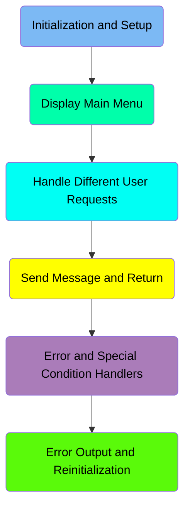
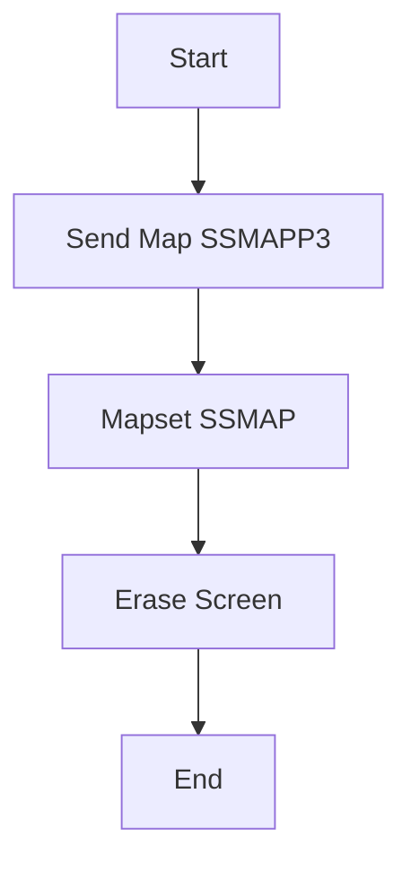
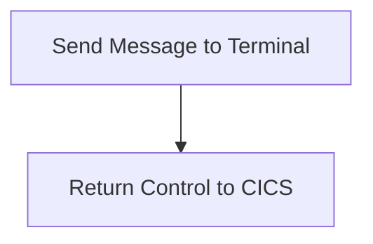
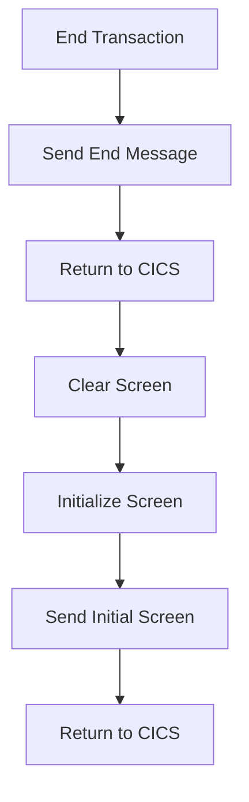
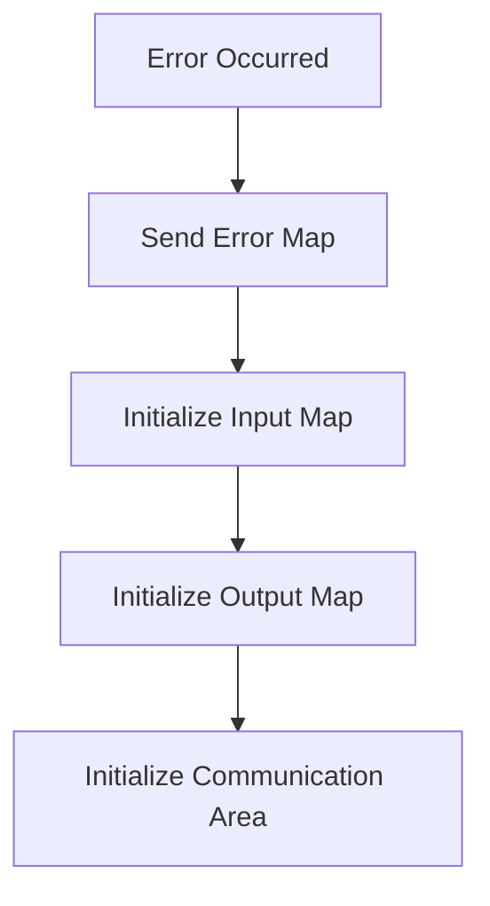

The <SwmToken path="base/src/lgtestp3.cbl" pos="11:6:6" line-data="       PROGRAM-ID. LGTESTP3.">`LGTESTP3`</SwmToken> program is responsible for handling various user requests related to insurance policies. It achieves this by initializing necessary structures, displaying the main menu, and processing user inputs to add, delete, inquire, or update insurance policies.

The flow starts with the initialization and setup of necessary structures and values. Then, the main menu is displayed to the user. Depending on the user's selection, the program either adds, deletes, inquires, or updates an insurance policy by calling the respective sub-programs. If any errors occur during these operations, the program handles them by displaying appropriate error messages and reinitializing the necessary structures.

Here is a high level diagram of the program:



# Initialization and Setup

```mermaid
graph TD
  A[Check if EIBCALEN > 0] --> |Yes| B[Go to A-GAIN]
  A --> |No| C[Initialize SSMAPP3I]
  C --> D[Initialize SSMAPP3O]
  D --> E[Initialize COMM-AREA]
  E --> F[Set ENP3CNOO to '0000000000']
  F --> G[Set ENP3PNOO to '0000000000']
  G --> H[Set ENP3VALO to '00000000']
  H --> I[Set ENP3BEDO to '000']

%% Swimm:
%% graph TD
%%   A[Check if EIBCALEN > 0] --> |Yes| B[Go to A-GAIN]
%%   A --> |No| C[Initialize SSMAPP3I]
%%   C --> D[Initialize SSMAPP3O]
%%   D --> E[Initialize COMM-AREA]
%%   E --> F[Set <SwmToken path="base/src/lgtestp3.cbl" pos="38:9:9" line-data="           MOVE &#39;0000000000&#39;   To ENP3CNOO.">`ENP3CNOO`</SwmToken> to '0000000000']
%%   F --> G[Set <SwmToken path="base/src/lgtestp3.cbl" pos="39:9:9" line-data="           MOVE &#39;0000000000&#39;   To ENP3PNOO.">`ENP3PNOO`</SwmToken> to '0000000000']
%%   G --> H[Set <SwmToken path="base/src/lgtestp3.cbl" pos="40:9:9" line-data="           MOVE &#39;00000000&#39;     To ENP3VALO.">`ENP3VALO`</SwmToken> to '00000000']
%%   H --> I[Set <SwmToken path="base/src/lgtestp3.cbl" pos="41:9:9" line-data="           MOVE &#39;000&#39;          To ENP3BEDO.">`ENP3BEDO`</SwmToken> to '000']
```



<SwmSnippet path="/base/src/lgtestp3.cbl" line="32">

---

## Checking EIBCALEN

First, the program checks if <SwmToken path="base/src/lgtestp3.cbl" pos="32:3:3" line-data="           IF EIBCALEN &gt; 0">`EIBCALEN`</SwmToken> (which indicates the length of the communication area) is greater than 0. If it is, the program jumps to the <SwmToken path="base/src/lgtestp3.cbl" pos="33:5:7" line-data="              GO TO A-GAIN.">`A-GAIN`</SwmToken> section to handle the existing communication area.

```cobol
           IF EIBCALEN > 0
              GO TO A-GAIN.
```

---

</SwmSnippet>

<SwmSnippet path="/base/src/lgtestp3.cbl" line="35">

---

## Initializing <SwmToken path="base/src/lgtestp3.cbl" pos="35:3:3" line-data="           Initialize SSMAPP3I.">`SSMAPP3I`</SwmToken>

Next, the program initializes <SwmToken path="base/src/lgtestp3.cbl" pos="35:3:3" line-data="           Initialize SSMAPP3I.">`SSMAPP3I`</SwmToken>, which is likely a structure or area used for input data in the application.

```cobol
           Initialize SSMAPP3I.
```

---

</SwmSnippet>

<SwmSnippet path="/base/src/lgtestp3.cbl" line="36">

---

## Initializing <SwmToken path="base/src/lgtestp3.cbl" pos="36:3:3" line-data="           Initialize SSMAPP3O.">`SSMAPP3O`</SwmToken>

Then, the program initializes <SwmToken path="base/src/lgtestp3.cbl" pos="36:3:3" line-data="           Initialize SSMAPP3O.">`SSMAPP3O`</SwmToken>, which is likely a structure or area used for output data in the application.

```cobol
           Initialize SSMAPP3O.
```

---

</SwmSnippet>

<SwmSnippet path="/base/src/lgtestp3.cbl" line="37">

---

## Initializing <SwmToken path="base/src/lgtestp3.cbl" pos="37:3:5" line-data="           Initialize COMM-AREA.">`COMM-AREA`</SwmToken>

The program initializes <SwmToken path="base/src/lgtestp3.cbl" pos="37:3:5" line-data="           Initialize COMM-AREA.">`COMM-AREA`</SwmToken>, which is a common area used for communication between different parts of the application.

```cobol
           Initialize COMM-AREA.
```

---

</SwmSnippet>

<SwmSnippet path="/base/src/lgtestp3.cbl" line="38">

---

## Setting Initial Values

Finally, the program sets initial values for various fields: <SwmToken path="base/src/lgtestp3.cbl" pos="38:9:9" line-data="           MOVE &#39;0000000000&#39;   To ENP3CNOO.">`ENP3CNOO`</SwmToken>, <SwmToken path="base/src/lgtestp3.cbl" pos="39:9:9" line-data="           MOVE &#39;0000000000&#39;   To ENP3PNOO.">`ENP3PNOO`</SwmToken>, <SwmToken path="base/src/lgtestp3.cbl" pos="40:9:9" line-data="           MOVE &#39;00000000&#39;     To ENP3VALO.">`ENP3VALO`</SwmToken>, and <SwmToken path="base/src/lgtestp3.cbl" pos="41:9:9" line-data="           MOVE &#39;000&#39;          To ENP3BEDO.">`ENP3BEDO`</SwmToken> to '0000000000', '0000000000', '00000000', and '000' respectively. These fields likely represent customer number, policy number, value, and number of bedrooms.

```cobol
           MOVE '0000000000'   To ENP3CNOO.
           MOVE '0000000000'   To ENP3PNOO.
           MOVE '00000000'     To ENP3VALO.
           MOVE '000'          To ENP3BEDO.
```

---

</SwmSnippet>

# Display Main Menu

This is the next section of the flow.



<SwmSnippet path="/base/src/lgtestp3.cbl" line="45">

---

## Sending the Map

First, the <SwmToken path="base/src/lgtestp3.cbl" pos="45:1:13" line-data="           EXEC CICS SEND MAP (&#39;SSMAPP3&#39;)">`EXEC CICS SEND MAP ('SSMAPP3')`</SwmToken> command is used to send the map named <SwmToken path="base/src/lgtestp3.cbl" pos="45:11:11" line-data="           EXEC CICS SEND MAP (&#39;SSMAPP3&#39;)">`SSMAPP3`</SwmToken> to the user's terminal. This map contains the layout and fields for the insurance policy information form that the user will interact with.

```cobol
           EXEC CICS SEND MAP ('SSMAPP3')
```

---

</SwmSnippet>

<SwmSnippet path="/base/src/lgtestp3.cbl" line="46">

---

## Specifying the Mapset

Next, the <SwmToken path="base/src/lgtestp3.cbl" pos="46:1:7" line-data="                     MAPSET (&#39;SSMAP&#39;)">`MAPSET ('SSMAP')`</SwmToken> command specifies the mapset that contains the <SwmToken path="base/src/lgtestp3.cbl" pos="45:11:11" line-data="           EXEC CICS SEND MAP (&#39;SSMAPP3&#39;)">`SSMAPP3`</SwmToken> map. A mapset is a collection of maps, and in this case, 'SSMAP' is the mapset that includes the insurance policy information form.

```cobol
                     MAPSET ('SSMAP')
```

---

</SwmSnippet>

<SwmSnippet path="/base/src/lgtestp3.cbl" line="47">

---

## Erasing the Screen

Then, the <SwmToken path="base/src/lgtestp3.cbl" pos="47:1:1" line-data="                     ERASE">`ERASE`</SwmToken> command is used to clear the screen before displaying the new map. This ensures that any previous data on the screen is removed, providing a clean slate for the insurance policy information form.

```cobol
                     ERASE
```

---

</SwmSnippet>

## Interim Summary

So far, we saw the initialization and setup process, including checking <SwmToken path="base/src/lgtestp3.cbl" pos="32:3:3" line-data="           IF EIBCALEN &gt; 0">`EIBCALEN`</SwmToken>, initializing various structures, and setting initial values for fields. Now, we will focus on displaying the main menu and handling different user requests.

# Handle Different User Requests

```mermaid
graph TD
  id-1{{"User selects option '2'"}} -->|Yes| id-2["Call LGAPOL01 to add policy"]
  id-1 -->|No| id-4{{"User selects option '3'"}}
  id-4 -->|Yes| id-5["Call LGDPOL01 to delete policy"]
  id-4 -->|No| id-7{{"User selects option '4'"}}
  id-7 -->|Yes| id-8["Call LGIPOL01 to inquire policy"]
  id-7 -->|No| id-12{{"User selects other option"}}
  id-12 -->|Yes| endit-startit["ENDIT-STARTIT: End transaction"]
  id-8 --> id-9{{"Check if CA-RETURN-CODE > 0"}}
  id-9 -->|Yes| no-data["NO-DATA: Handle no data error"]
  id-9 -->|No| id-10["Call LGUPOL01 to update policy"]
  id-10 --> id-11{{"Check if CA-RETURN-CODE > 0"}}
  id-11 -->|Yes| no-upd["NO-UPD: Handle update error"]
  id-11 -->|No| endit-startit
  id-5 --> id-6{{"Check if CA-RETURN-CODE > 0"}}
  id-6 -->|Yes| no-delete["NO-DELETE: Handle delete error"]
  id-6 -->|No| endit-startit
  id-2 --> id-3{{"Check if CA-RETURN-CODE > 0"}}
  id-3 -->|Yes| no-add["NO-ADD: Handle add error"]
  id-3 -->|No| endit-startit

%% Swimm:
%% graph TD
%%   id-1{{"User selects option '2'"}} -->|Yes| id-2["Call <SwmToken path="base/src/lgtestp3.cbl" pos="106:10:10" line-data="                 EXEC CICS LINK PROGRAM(&#39;LGAPOL01&#39;)">`LGAPOL01`</SwmToken> to add policy"]
%%   id-1 -->|No| id-4{{"User selects option '3'"}}
%%   id-4 -->|Yes| id-5["Call <SwmToken path="base/src/lgtestp3.cbl" pos="129:10:10" line-data="                 EXEC CICS LINK PROGRAM(&#39;LGDPOL01&#39;)">`LGDPOL01`</SwmToken> to delete policy"]
%%   id-4 -->|No| id-7{{"User selects option '4'"}}
%%   id-7 -->|Yes| id-8["Call <SwmToken path="base/src/lgtestp3.cbl" pos="159:10:10" line-data="                 EXEC CICS LINK PROGRAM(&#39;LGIPOL01&#39;)">`LGIPOL01`</SwmToken> to inquire policy"]
%%   id-7 -->|No| id-12{{"User selects other option"}}
%%   id-12 -->|Yes| endit-startit["ENDIT-STARTIT: End transaction"]
%%   id-8 --> id-9{{"Check if <SwmToken path="base/src/lgtestp3.cbl" pos="110:3:7" line-data="                 IF CA-RETURN-CODE &gt; 0">`CA-RETURN-CODE`</SwmToken> > 0"}}
%%   id-9 -->|Yes| no-data["NO-DATA: Handle no data error"]
%%   id-9 -->|No| id-10["Call <SwmToken path="base/src/lgtestp3.cbl" pos="196:10:10" line-data="                 EXEC CICS LINK PROGRAM(&#39;LGUPOL01&#39;)">`LGUPOL01`</SwmToken> to update policy"]
%%   id-10 --> id-11{{"Check if <SwmToken path="base/src/lgtestp3.cbl" pos="110:3:7" line-data="                 IF CA-RETURN-CODE &gt; 0">`CA-RETURN-CODE`</SwmToken> > 0"}}
%%   id-11 -->|Yes| no-upd["NO-UPD: Handle update error"]
%%   id-11 -->|No| endit-startit
%%   id-5 --> id-6{{"Check if <SwmToken path="base/src/lgtestp3.cbl" pos="110:3:7" line-data="                 IF CA-RETURN-CODE &gt; 0">`CA-RETURN-CODE`</SwmToken> > 0"}}
%%   id-6 -->|Yes| no-delete["NO-DELETE: Handle delete error"]
%%   id-6 -->|No| endit-startit
%%   id-2 --> id-3{{"Check if <SwmToken path="base/src/lgtestp3.cbl" pos="110:3:7" line-data="                 IF CA-RETURN-CODE &gt; 0">`CA-RETURN-CODE`</SwmToken> > 0"}}
%%   id-3 -->|Yes| no-add["NO-ADD: Handle add error"]
%%   id-3 -->|No| endit-startit
```



<SwmSnippet path="/base/src/lgtestp3.cbl" line="92">

---

## User selects option '2'

When the user selects option '2', the system prepares to add a new house policy. It sets the request ID to <SwmToken path="base/src/lgtestp3.cbl" pos="93:4:4" line-data="                 Move &#39;01AHOU&#39;          To CA-REQUEST-ID">`01AHOU`</SwmToken> and initializes various fields related to the policy. The system then calls the <SwmToken path="base/src/lgtestp3.cbl" pos="106:10:10" line-data="                 EXEC CICS LINK PROGRAM(&#39;LGAPOL01&#39;)">`LGAPOL01`</SwmToken> program to add the policy. If the return code indicates an error, it rolls back the transaction and goes to the <SwmToken path="base/src/lgtestp3.cbl" pos="112:5:7" line-data="                   GO TO NO-ADD">`NO-ADD`</SwmToken> paragraph to handle the error. Otherwise, it updates the user interface to indicate that a new house policy has been inserted.

```cobol
             WHEN '2'
                 Move '01AHOU'          To CA-REQUEST-ID
                 Move ENP3CNOI          To CA-CUSTOMER-NUM
                 Move 0                 To CA-PAYMENT
                 Move 0                 To CA-BROKERID
                 Move '        '        To CA-BROKERSREF
                 Move ENP3IDAI          To CA-ISSUE-DATE
                 Move ENP3EDAI          To CA-EXPIRY-DATE
                 Move ENP3TYPI          To CA-H-PROPERTY-TYPE
                 Move ENP3BEDI          To CA-H-BEDROOMS
                 Move ENP3VALI          To CA-H-VALUE
                 Move ENP3HNMI          To CA-H-HOUSE-NAME
                 Move ENP3HNOI          To CA-H-HOUSE-NUMBER
                 Move ENP3HPCI          To CA-H-POSTCODE
                 EXEC CICS LINK PROGRAM('LGAPOL01')
                           COMMAREA(COMM-AREA)
                           LENGTH(32500)
                 END-EXEC
                 IF CA-RETURN-CODE > 0
                   Exec CICS Syncpoint Rollback End-Exec
                   GO TO NO-ADD
```

---

</SwmSnippet>

<SwmSnippet path="/base/src/lgtestp3.cbl" line="125">

---

## User selects option '3'

When the user selects option '3', the system prepares to delete an existing house policy. It sets the request ID to <SwmToken path="base/src/lgtestp3.cbl" pos="126:4:4" line-data="                 Move &#39;01DHOU&#39;   To CA-REQUEST-ID">`01DHOU`</SwmToken> and initializes various fields related to the policy. The system then calls the <SwmToken path="base/src/lgtestp3.cbl" pos="129:10:10" line-data="                 EXEC CICS LINK PROGRAM(&#39;LGDPOL01&#39;)">`LGDPOL01`</SwmToken> program to delete the policy. If the return code indicates an error, it rolls back the transaction and goes to the <SwmToken path="base/src/lgtestp3.cbl" pos="135:5:7" line-data="                   GO TO NO-DELETE">`NO-DELETE`</SwmToken> paragraph to handle the error. Otherwise, it updates the user interface to indicate that the house policy has been deleted.

More about <SwmToken path="base/src/lgtestp3.cbl" pos="129:10:10" line-data="                 EXEC CICS LINK PROGRAM(&#39;LGDPOL01&#39;)">`LGDPOL01`</SwmToken>: <SwmLink doc-title="Deleting Insurance Policies (LGDPOL01)">[Deleting Insurance Policies (LGDPOL01)](/.swm/deleting-insurance-policies-lgdpol01.1gbfsqsp.sw.md)</SwmLink>

```cobol
             WHEN '3'
                 Move '01DHOU'   To CA-REQUEST-ID
                 Move ENP3CNOO   To CA-CUSTOMER-NUM
                 Move ENP3PNOO   To CA-POLICY-NUM
                 EXEC CICS LINK PROGRAM('LGDPOL01')
                           COMMAREA(COMM-AREA)
                           LENGTH(32500)
                 END-EXEC
                 IF CA-RETURN-CODE > 0
                   Exec CICS Syncpoint Rollback End-Exec
                   GO TO NO-DELETE
                 END-IF

                 Move Spaces             To  ENP3IDAI
                 Move Spaces             To  ENP3EDAI
                 Move Spaces             To  ENP3TYPI
                 Move Spaces             To  ENP3BEDI
                 Move Spaces             To  ENP3VALI
                 Move Spaces             To  ENP3HNMI
                 Move Spaces             To  ENP3HNOI
                 Move Spaces             To  ENP3HPCI
```

---

</SwmSnippet>

<SwmSnippet path="/base/src/lgtestp3.cbl" line="155">

---

## User selects option '4'

When the user selects option '4', the system prepares to inquire about an existing house policy. It sets the request ID to <SwmToken path="base/src/lgtestp3.cbl" pos="156:4:4" line-data="                 Move &#39;01IHOU&#39;   To CA-REQUEST-ID">`01IHOU`</SwmToken> and initializes various fields related to the policy. The system then calls the <SwmToken path="base/src/lgtestp3.cbl" pos="159:10:10" line-data="                 EXEC CICS LINK PROGRAM(&#39;LGIPOL01&#39;)">`LGIPOL01`</SwmToken> program to inquire about the policy. If the return code indicates an error, it goes to the <SwmToken path="base/src/lgtestp3.cbl" pos="164:5:7" line-data="                   GO TO NO-DATA">`NO-DATA`</SwmToken> paragraph to handle the error. Otherwise, it updates the user interface with the policy details and allows the user to update the policy. The system then calls the <SwmToken path="base/src/lgtestp3.cbl" pos="196:10:10" line-data="                 EXEC CICS LINK PROGRAM(&#39;LGUPOL01&#39;)">`LGUPOL01`</SwmToken> program to update the policy. If the return code indicates an error, it goes to the <SwmToken path="base/src/lgtestp3.cbl" pos="277:1:3" line-data="       NO-UPD.">`NO-UPD`</SwmToken> paragraph to handle the error. Otherwise, it updates the user interface to indicate that the house policy has been updated.

More about <SwmToken path="base/src/lgtestp3.cbl" pos="159:10:10" line-data="                 EXEC CICS LINK PROGRAM(&#39;LGIPOL01&#39;)">`LGIPOL01`</SwmToken>: <SwmLink doc-title="Inquiring Policy Details (LGIPOL01)">[Inquiring Policy Details (LGIPOL01)](/.swm/inquiring-policy-details-lgipol01.a4iime4v.sw.md)</SwmLink>

```cobol
             WHEN '4'
                 Move '01IHOU'   To CA-REQUEST-ID
                 Move ENP3CNOO   To CA-CUSTOMER-NUM
                 Move ENP3PNOO   To CA-POLICY-NUM
                 EXEC CICS LINK PROGRAM('LGIPOL01')
                           COMMAREA(COMM-AREA)
                           LENGTH(32500)
                 END-EXEC
                 IF CA-RETURN-CODE > 0
                   GO TO NO-DATA
                 END-IF

                 Move CA-ISSUE-DATE      To  ENP3IDAI
                 Move CA-EXPIRY-DATE     To  ENP3EDAI
                 Move CA-H-PROPERTY-TYPE To  ENP3TYPI
                 Move CA-H-BEDROOMS      To  ENP3BEDI
                 Move CA-H-VALUE         To  ENP3VALI
                 Move CA-H-HOUSE-NAME    To  ENP3HNMI
                 Move CA-H-HOUSE-NUMBER  To  ENP3HNOI
                 Move CA-H-POSTCODE      To  ENP3HPCI
                 EXEC CICS SEND MAP ('SSMAPP3')
```

---

</SwmSnippet>

<SwmSnippet path="/base/src/lgtestp3.cbl" line="217">

---

## User selects other option

When the user selects an invalid option, the system updates the user interface to prompt the user to enter a valid option.

```cobol
             WHEN OTHER

                 Move 'Please enter a valid option'
                   To  ERP3FLDO
                 Move -1 To ENP3OPTL

                 EXEC CICS SEND MAP ('SSMAPP3')
                           FROM(SSMAPP3O)
                           MAPSET ('SSMAP')
                           CURSOR
                 END-EXEC
```

---

</SwmSnippet>

<SwmSnippet path="/base/src/lgtestp3.cbl" line="238">

---

### <SwmToken path="base/src/lgtestp3.cbl" pos="238:1:3" line-data="       ENDIT-STARTIT.">`ENDIT-STARTIT`</SwmToken>

The <SwmToken path="base/src/lgtestp3.cbl" pos="238:1:3" line-data="       ENDIT-STARTIT.">`ENDIT-STARTIT`</SwmToken> paragraph ends the transaction and returns control to the CICS system.

```cobol
       ENDIT-STARTIT.
           EXEC CICS RETURN
                TRANSID('SSP3')
                COMMAREA(COMM-AREA)
                END-EXEC.
```

---

</SwmSnippet>

<SwmSnippet path="/base/src/lgtestp3.cbl" line="267">

---

### <SwmToken path="base/src/lgtestp3.cbl" pos="267:1:3" line-data="       NO-ADD.">`NO-ADD`</SwmToken>

The <SwmToken path="base/src/lgtestp3.cbl" pos="267:1:3" line-data="       NO-ADD.">`NO-ADD`</SwmToken> paragraph handles errors that occur when adding a new house policy. It evaluates the return code and updates the user interface with an appropriate error message.

```cobol
       NO-ADD.
           Evaluate CA-RETURN-CODE
             When 70
               Move 'Customer does not exist'          To  ERP1FLDO
               Go To ERROR-OUT
             When Other
               Move 'Error Adding House Policy'        To  ERP1FLDO
               Go To ERROR-OUT
           End-Evaluate.
```

---

</SwmSnippet>

<SwmSnippet path="/base/src/lgtestp3.cbl" line="277">

---

### <SwmToken path="base/src/lgtestp3.cbl" pos="277:1:3" line-data="       NO-UPD.">`NO-UPD`</SwmToken>

The <SwmToken path="base/src/lgtestp3.cbl" pos="277:1:3" line-data="       NO-UPD.">`NO-UPD`</SwmToken> paragraph handles errors that occur when updating a house policy. It updates the user interface with an appropriate error message.

```cobol
       NO-UPD.
           Move 'Error Updating House Policy'      To  ERP3FLDO
           Go To ERROR-OUT.
```

---

</SwmSnippet>

<SwmSnippet path="/base/src/lgtestp3.cbl" line="285">

---

### <SwmToken path="base/src/lgtestp3.cbl" pos="285:1:3" line-data="       NO-DATA.">`NO-DATA`</SwmToken>

The <SwmToken path="base/src/lgtestp3.cbl" pos="285:1:3" line-data="       NO-DATA.">`NO-DATA`</SwmToken> paragraph handles errors that occur when no data is returned from an inquiry. It updates the user interface with an appropriate error message.

```cobol
       NO-DATA.
           Move 'No data was returned.'            To  ERP3FLDO
           Go To ERROR-OUT.
```

---

</SwmSnippet>

<SwmSnippet path="/base/src/lgtestp3.cbl" line="281">

---

### <SwmToken path="base/src/lgtestp3.cbl" pos="281:1:3" line-data="       NO-DELETE.">`NO-DELETE`</SwmToken>

The <SwmToken path="base/src/lgtestp3.cbl" pos="281:1:3" line-data="       NO-DELETE.">`NO-DELETE`</SwmToken> paragraph handles errors that occur when deleting a house policy. It updates the user interface with an appropriate error message.

```cobol
       NO-DELETE.
           Move 'Error Deleting House Policy'      To  ERP3FLDO
           Go To ERROR-OUT.
```

---

</SwmSnippet>

# Send Message and Return

This is the next section of the flow.



<SwmSnippet path="/base/src/lgtestp3.cbl" line="233">

---

## Sending Message to Terminal

First, we prepare to send a message to the terminal. This step ensures that the user receives the necessary information before the transaction ends.

```cobol
      *    Send message to terminal and return

```

---

</SwmSnippet>

<SwmSnippet path="/base/src/lgtestp3.cbl" line="235">

---

## Return Control to CICS

Next, we use the <SwmToken path="base/src/lgtestp3.cbl" pos="235:1:5" line-data="           EXEC CICS RETURN">`EXEC CICS RETURN`</SwmToken> command to return control to CICS. This marks the end of the transaction and allows CICS to manage the next steps.

```cobol
           EXEC CICS RETURN
           END-EXEC.
```

---

</SwmSnippet>

<SwmSnippet path="/base/src/lgtestp3.cbl" line="244">

---

## ENDIT Function

The <SwmToken path="base/src/lgtestp3.cbl" pos="244:1:1" line-data="       ENDIT.">`ENDIT`</SwmToken> function is responsible for sending a specific end message to the terminal. It uses the <SwmToken path="base/src/lgtestp3.cbl" pos="245:1:7" line-data="           EXEC CICS SEND TEXT">`EXEC CICS SEND TEXT`</SwmToken> command to send the message stored in <SwmToken path="base/src/lgtestp3.cbl" pos="246:3:3" line-data="                     FROM(MSGEND)">`MSGEND`</SwmToken>, specifying its length and ensuring the terminal is ready for new input by erasing the screen and freeing the keyboard.

```cobol
       ENDIT.
           EXEC CICS SEND TEXT
                     FROM(MSGEND)
                     LENGTH(LENGTH OF MSGEND)
                     ERASE
                     FREEKB
           END-EXEC
           EXEC CICS RETURN
           END-EXEC.
```

---

</SwmSnippet>

# Error and Special Condition Handlers



<SwmSnippet path="/base/src/lgtestp3.cbl" line="239">

---

## End Transaction

First, the transaction ends by returning control to CICS with the transaction ID <SwmToken path="base/src/lgtestp3.cbl" pos="240:4:4" line-data="                TRANSID(&#39;SSP3&#39;)">`SSP3`</SwmToken> and passing the communication area <SwmToken path="base/src/lgtestp3.cbl" pos="241:3:5" line-data="                COMMAREA(COMM-AREA)">`COMM-AREA`</SwmToken>.

```cobol
           EXEC CICS RETURN
                TRANSID('SSP3')
                COMMAREA(COMM-AREA)
                END-EXEC.
```

---

</SwmSnippet>

<SwmSnippet path="/base/src/lgtestp3.cbl" line="245">

---

## Send End Message

Next, an end message is sent to the user. This message is stored in <SwmToken path="base/src/lgtestp3.cbl" pos="246:3:3" line-data="                     FROM(MSGEND)">`MSGEND`</SwmToken> and is sent with the <SwmToken path="base/src/lgtestp3.cbl" pos="248:1:1" line-data="                     ERASE">`ERASE`</SwmToken> and <SwmToken path="base/src/lgtestp3.cbl" pos="249:1:1" line-data="                     FREEKB">`FREEKB`</SwmToken> options to clear the screen and free the keyboard.

```cobol
           EXEC CICS SEND TEXT
                     FROM(MSGEND)
                     LENGTH(LENGTH OF MSGEND)
                     ERASE
                     FREEKB
           END-EXEC
```

---

</SwmSnippet>

<SwmSnippet path="/base/src/lgtestp3.cbl" line="251">

---

## Return to CICS

Then, control is returned to CICS again.

```cobol
           EXEC CICS RETURN
           END-EXEC.
```

---

</SwmSnippet>

<SwmSnippet path="/base/src/lgtestp3.cbl" line="254">

---

## Clear Screen

Moving to the <SwmToken path="base/src/lgtestp3.cbl" pos="254:1:1" line-data="       CLEARIT.">`CLEARIT`</SwmToken> paragraph, the screen is cleared to prepare for the next operation.

```cobol
       CLEARIT.

```

---

</SwmSnippet>

<SwmSnippet path="/base/src/lgtestp3.cbl" line="256">

---

## Initialize Screen

The screen map <SwmToken path="base/src/lgtestp3.cbl" pos="256:3:3" line-data="           Initialize SSMAPP3I.">`SSMAPP3I`</SwmToken> is initialized to set up the initial state for the next transaction.

```cobol
           Initialize SSMAPP3I.
```

---

</SwmSnippet>

<SwmSnippet path="/base/src/lgtestp3.cbl" line="257">

---

## Send Initial Screen

The initial screen map <SwmToken path="base/src/lgtestp3.cbl" pos="257:11:11" line-data="           EXEC CICS SEND MAP (&#39;SSMAPP3&#39;)">`SSMAPP3`</SwmToken> from the mapset <SwmToken path="base/src/lgtestp3.cbl" pos="258:5:5" line-data="                     MAPSET (&#39;SSMAP&#39;)">`SSMAP`</SwmToken> is sent to the user with the <SwmToken path="base/src/lgtestp3.cbl" pos="259:1:1" line-data="                     MAPONLY">`MAPONLY`</SwmToken> option, which displays the map without any data.

```cobol
           EXEC CICS SEND MAP ('SSMAPP3')
                     MAPSET ('SSMAP')
                     MAPONLY
           END-EXEC
```

---

</SwmSnippet>

<SwmSnippet path="/base/src/lgtestp3.cbl" line="262">

---

## Return to CICS

Finally, control is returned to CICS with the transaction ID <SwmToken path="base/src/lgtestp3.cbl" pos="263:4:4" line-data="                TRANSID(&#39;SSP3&#39;)">`SSP3`</SwmToken> and the communication area <SwmToken path="base/src/lgtestp3.cbl" pos="264:3:5" line-data="                COMMAREA(COMM-AREA)">`COMM-AREA`</SwmToken>.

```cobol
           EXEC CICS RETURN
                TRANSID('SSP3')
                COMMAREA(COMM-AREA)
                END-EXEC.
```

---

</SwmSnippet>

# Error Output and Reinitialization

This is the next section of the flow.



<SwmSnippet path="/base/src/lgtestp3.cbl" line="287">

---

## Handling Error Output

First, the code directs the flow to the <SwmToken path="base/src/lgtestp3.cbl" pos="287:5:7" line-data="           Go To ERROR-OUT.">`ERROR-OUT`</SwmToken> section when an error occurs. This ensures that any error encountered will be handled appropriately.

```cobol
           Go To ERROR-OUT.

```

---

</SwmSnippet>

<SwmSnippet path="/base/src/lgtestp3.cbl" line="289">

---

## Sending Error Map

Next, the code sends an error map using the <SwmToken path="base/src/lgtestp3.cbl" pos="290:1:7" line-data="           EXEC CICS SEND MAP (&#39;SSMAPP3&#39;)">`EXEC CICS SEND MAP`</SwmToken> command. This displays the error information to the user by sending the map <SwmToken path="base/src/lgtestp3.cbl" pos="290:11:11" line-data="           EXEC CICS SEND MAP (&#39;SSMAPP3&#39;)">`SSMAPP3`</SwmToken> from <SwmToken path="base/src/lgtestp3.cbl" pos="291:3:3" line-data="                     FROM(SSMAPP3O)">`SSMAPP3O`</SwmToken> and using the mapset <SwmToken path="base/src/lgtestp3.cbl" pos="292:5:5" line-data="                     MAPSET (&#39;SSMAP&#39;)">`SSMAP`</SwmToken>.

```cobol
       ERROR-OUT.
           EXEC CICS SEND MAP ('SSMAPP3')
                     FROM(SSMAPP3O)
                     MAPSET ('SSMAP')
           END-EXEC.
```

---

</SwmSnippet>

<SwmSnippet path="/base/src/lgtestp3.cbl" line="295">

---

## Initializing Input Map

Then, the code initializes the input map <SwmToken path="base/src/lgtestp3.cbl" pos="295:3:3" line-data="           Initialize SSMAPP3I.">`SSMAPP3I`</SwmToken>. This step prepares the input map for any subsequent operations or error handling procedures.

```cobol
           Initialize SSMAPP3I.
```

---

</SwmSnippet>

<SwmSnippet path="/base/src/lgtestp3.cbl" line="296">

---

## Initializing Output Map

Following that, the code initializes the output map <SwmToken path="base/src/lgtestp3.cbl" pos="296:3:3" line-data="           Initialize SSMAPP3O.">`SSMAPP3O`</SwmToken>. This ensures that the output map is ready for any further processing or error display.

```cobol
           Initialize SSMAPP3O.
```

---

</SwmSnippet>

<SwmSnippet path="/base/src/lgtestp3.cbl" line="297">

---

## Initializing Communication Area

Finally, the code initializes the <SwmToken path="base/src/lgtestp3.cbl" pos="297:3:5" line-data="           Initialize COMM-AREA.">`COMM-AREA`</SwmToken>. This step is crucial for setting up the communication area for any inter-program communication or error handling.

```cobol
           Initialize COMM-AREA.
```

---

</SwmSnippet>

&nbsp;

*This is an auto-generated document by Swimm 🌊 and has not yet been verified by a human*

<SwmMeta version="3.0.0" repo-id="Z2l0aHViJTNBJTNBa3luZHJ5bC1jaWNzLWdlbmFwcCUzQSUzQVN3aW1tLURlbW8=" repo-name="kyndryl-cics-genapp"><sup>Powered by [Swimm](/)</sup></SwmMeta>
