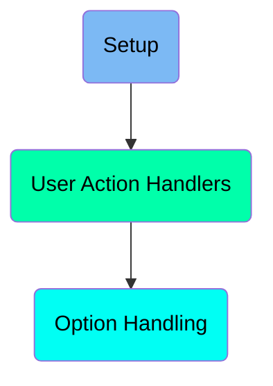
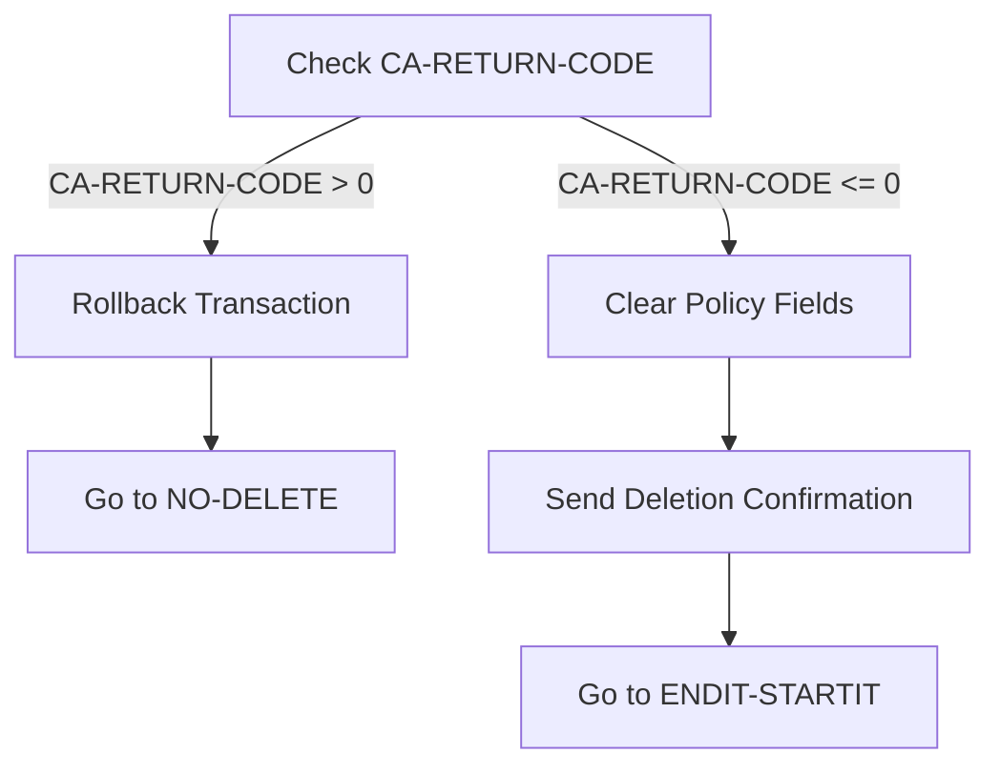
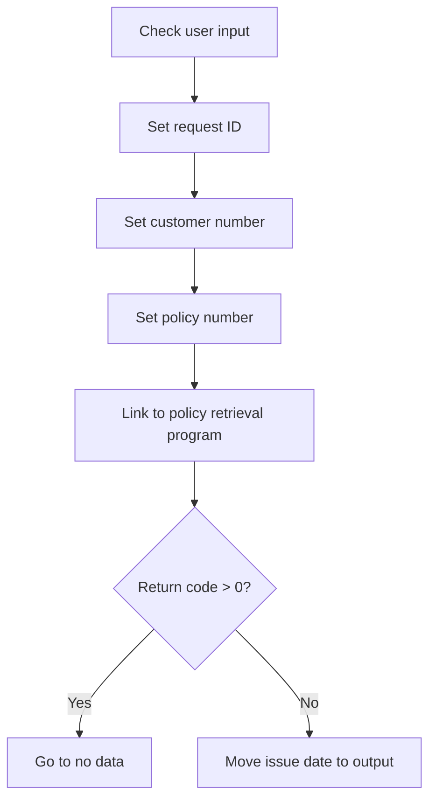

The <SwmToken path="base/src/lgtestp3.cbl" pos="11:6:6" line-data="       PROGRAM-ID. LGTESTP3.">`LGTESTP3`</SwmToken> program handles user actions for policy operations such as adding, deleting, and inquiring about policies. It achieves this by evaluating user inputs and calling the appropriate programs to perform the requested operations, ensuring data consistency and providing feedback to the user.

The <SwmToken path="base/src/lgtestp3.cbl" pos="11:6:6" line-data="       PROGRAM-ID. LGTESTP3.">`LGTESTP3`</SwmToken> program starts by setting up the environment and initializing necessary fields. It then waits for user input and handles different actions based on the input. For example, if the user wants to delete a policy, the program calls the <SwmToken path="base/src/lgtestp3.cbl" pos="129:10:10" line-data="                 EXEC CICS LINK PROGRAM(&#39;LGDPOL01&#39;)">`LGDPOL01`</SwmToken> program to perform the deletion and checks the return code to ensure the operation was successful. If there are any errors, it displays an appropriate error message to the user. The program continues to handle other user actions similarly, ensuring that each operation is performed correctly and providing feedback to the user.

Here is a high level diagram of the program:



# Setup



<SwmSnippet path="/base/src/lgtestp3.cbl" line="30">

---

## Handling house policy deletion and sending confirmation

First, the code checks if <SwmToken path="base/src/lgtestp3.cbl" pos="74:3:7" line-data="                 IF CA-RETURN-CODE &gt; 0">`CA-RETURN-CODE`</SwmToken> (which holds the return code from the previous operation) is greater than 0. If it is, it rolls back the transaction to ensure data consistency and then jumps to the <SwmToken path="base/src/lgtestp3.cbl" pos="135:5:7" line-data="                   GO TO NO-DELETE">`NO-DELETE`</SwmToken> section to handle the error.

```cobol
       MAINLINE SECTION.

           IF EIBCALEN > 0
              GO TO A-GAIN.

           Initialize SSMAPP3I.
           Initialize SSMAPP3O.
           Initialize COMM-AREA.
           MOVE '0000000000'   To ENP3CNOO.
           MOVE '0000000000'   To ENP3PNOO.
           MOVE '00000000'     To ENP3VALO.
           MOVE '000'          To ENP3BEDO.


      * Display Main Menu
           EXEC CICS SEND MAP ('SSMAPP3')
                     MAPSET ('SSMAP')
                     ERASE
                     END-EXEC.

       A-GAIN.
```

---

</SwmSnippet>

<SwmSnippet path="/base/src/lgtestp3.cbl" line="35">

---

Next, the code clears various fields related to the house policy (<SwmToken path="base/src/lgtestp3.cbl" pos="78:11:11" line-data="                 Move CA-ISSUE-DATE      To  ENP3IDAI">`ENP3IDAI`</SwmToken>, <SwmToken path="base/src/lgtestp3.cbl" pos="79:11:11" line-data="                 Move CA-EXPIRY-DATE     To  ENP3EDAI">`ENP3EDAI`</SwmToken>, <SwmToken path="base/src/lgtestp3.cbl" pos="80:13:13" line-data="                 Move CA-H-PROPERTY-TYPE To  ENP3TYPI">`ENP3TYPI`</SwmToken>, <SwmToken path="base/src/lgtestp3.cbl" pos="81:11:11" line-data="                 Move CA-H-BEDROOMS      To  ENP3BEDI">`ENP3BEDI`</SwmToken>, <SwmToken path="base/src/lgtestp3.cbl" pos="82:11:11" line-data="                 Move CA-H-VALUE         To  ENP3VALI">`ENP3VALI`</SwmToken>, <SwmToken path="base/src/lgtestp3.cbl" pos="83:13:13" line-data="                 Move CA-H-HOUSE-NAME    To  ENP3HNMI">`ENP3HNMI`</SwmToken>, <SwmToken path="base/src/lgtestp3.cbl" pos="84:13:13" line-data="                 Move CA-H-HOUSE-NUMBER  To  ENP3HNOI">`ENP3HNOI`</SwmToken>, <SwmToken path="base/src/lgtestp3.cbl" pos="85:11:11" line-data="                 Move CA-H-POSTCODE      To  ENP3HPCI">`ENP3HPCI`</SwmToken>, <SwmToken path="base/src/lgtestp3.cbl" pos="116:9:9" line-data="                 Move &#39; &#39;             To ENP3OPTI">`ENP3OPTI`</SwmToken>) to ensure that no residual data is left.

```cobol
           Initialize SSMAPP3I.
           Initialize SSMAPP3O.
           Initialize COMM-AREA.
           MOVE '0000000000'   To ENP3CNOO.
           MOVE '0000000000'   To ENP3PNOO.
           MOVE '00000000'     To ENP3VALO.
           MOVE '000'          To ENP3BEDO.


```

---

</SwmSnippet>

<SwmSnippet path="/base/src/lgtestp3.cbl" line="44">

---

Then, the code sets the message <SwmToken path="base/src/lgtestp3.cbl" pos="147:4:8" line-data="                 Move &#39;House Policy Deleted&#39;">`House Policy Deleted`</SwmToken> to <SwmToken path="base/src/lgtestp3.cbl" pos="118:3:3" line-data="                   To  ERP3FLDO">`ERP3FLDO`</SwmToken> (which holds the field data for the map) and sends the map <SwmToken path="base/src/lgtestp3.cbl" pos="45:11:11" line-data="           EXEC CICS SEND MAP (&#39;SSMAPP3&#39;)">`SSMAPP3`</SwmToken> to the user to confirm the deletion.

```cobol
      * Display Main Menu
           EXEC CICS SEND MAP ('SSMAPP3')
                     MAPSET ('SSMAP')
                     ERASE
                     END-EXEC.

```

---

</SwmSnippet>

<SwmSnippet path="/base/src/lgtestp3.cbl" line="50">

---

Finally, the code jumps to the <SwmToken path="base/src/lgtestp3.cbl" pos="90:5:7" line-data="                 GO TO ENDIT-STARTIT">`ENDIT-STARTIT`</SwmToken> section to continue the program flow.

```cobol
       A-GAIN.

```

---

</SwmSnippet>

# User Action Handlers

This is the next section of the flow.



<SwmSnippet path="/base/src/lgtestp3.cbl" line="52">

---

## Handling policy information retrieval

First, we check if the user input is '4', which indicates a request to retrieve policy information. We then set the request ID to <SwmToken path="base/src/lgtestp3.cbl" pos="67:4:4" line-data="                 Move &#39;01IHOU&#39;   To CA-REQUEST-ID">`01IHOU`</SwmToken>, which is used to identify the type of request being made. Next, we move the customer number (<SwmToken path="base/src/lgtestp3.cbl" pos="38:9:9" line-data="           MOVE &#39;0000000000&#39;   To ENP3CNOO.">`ENP3CNOO`</SwmToken>) and policy number (<SwmToken path="base/src/lgtestp3.cbl" pos="39:9:9" line-data="           MOVE &#39;0000000000&#39;   To ENP3PNOO.">`ENP3PNOO`</SwmToken>) to the communication area (<SwmToken path="base/src/lgtestp3.cbl" pos="68:7:11" line-data="                 Move ENP3CNOO   To CA-CUSTOMER-NUM">`CA-CUSTOMER-NUM`</SwmToken> and <SwmToken path="base/src/lgtestp3.cbl" pos="69:7:11" line-data="                 Move ENP3PNOO   To CA-POLICY-NUM">`CA-POLICY-NUM`</SwmToken> respectively).

```cobol
           EXEC CICS HANDLE AID
                     CLEAR(CLEARIT)
                     PF3(ENDIT) END-EXEC.
           EXEC CICS HANDLE CONDITION
                     MAPFAIL(ENDIT)
                     END-EXEC.

           EXEC CICS RECEIVE MAP('SSMAPP3')
                     INTO(SSMAPP3I)
                     MAPSET('SSMAP') END-EXEC.


           EVALUATE ENP3OPTO

```

---

</SwmSnippet>

<SwmSnippet path="/base/src/lgtestp3.cbl" line="56">

---

### Linking to policy retrieval program

Next, we link to the policy retrieval program <SwmToken path="base/src/lgtestp3.cbl" pos="70:10:10" line-data="                 EXEC CICS LINK PROGRAM(&#39;LGIPOL01&#39;)">`LGIPOL01`</SwmToken> using the <SwmToken path="base/src/lgtestp3.cbl" pos="70:1:5" line-data="                 EXEC CICS LINK PROGRAM(&#39;LGIPOL01&#39;)">`EXEC CICS LINK`</SwmToken> command. This program processes the request and returns the policy information in the communication area (<SwmToken path="base/src/lgtestp3.cbl" pos="37:3:5" line-data="           Initialize COMM-AREA.">`COMM-AREA`</SwmToken>).

More about <SwmToken path="base/src/lgtestp3.cbl" pos="70:10:10" line-data="                 EXEC CICS LINK PROGRAM(&#39;LGIPOL01&#39;)">`LGIPOL01`</SwmToken>: <SwmLink doc-title="Handling Policy Inquiries (LGIPOL01)">[Handling Policy Inquiries (LGIPOL01)](/.swm/handling-policy-inquiries-lgipol01.q1xuxpj6.sw.md)</SwmLink>

```cobol
                     MAPFAIL(ENDIT)
                     END-EXEC.

           EXEC CICS RECEIVE MAP('SSMAPP3')
```

---

</SwmSnippet>

<SwmSnippet path="/base/src/lgtestp3.cbl" line="60">

---

### Handling the return code

Then, we check the return code (<SwmToken path="base/src/lgtestp3.cbl" pos="74:3:7" line-data="                 IF CA-RETURN-CODE &gt; 0">`CA-RETURN-CODE`</SwmToken>). If the return code is greater than 0, it indicates an error or no data found, and we go to the <SwmToken path="base/src/lgtestp3.cbl" pos="75:5:7" line-data="                   GO TO NO-DATA">`NO-DATA`</SwmToken> section to handle this scenario.

```cobol
                     INTO(SSMAPP3I)
                     MAPSET('SSMAP') END-EXEC.

```

---

</SwmSnippet>

<SwmSnippet path="/base/src/lgtestp3.cbl" line="64">

---

### Moving issue date to output

Finally, if the return code is 0, indicating success, we move the issue date (<SwmToken path="base/src/lgtestp3.cbl" pos="78:3:7" line-data="                 Move CA-ISSUE-DATE      To  ENP3IDAI">`CA-ISSUE-DATE`</SwmToken>) to the output field (<SwmToken path="base/src/lgtestp3.cbl" pos="78:11:11" line-data="                 Move CA-ISSUE-DATE      To  ENP3IDAI">`ENP3IDAI`</SwmToken>). This completes the policy information retrieval process.

```cobol
           EVALUATE ENP3OPTO

```

---

</SwmSnippet>

## Interim Summary

So far, we saw how the program handles house policy deletion and sends confirmation to the user. We also covered the process of retrieving policy information based on user input. Now, we will focus on handling different user inputs for various policy operations such as adding, deleting, and inquiring about policies.

# Option Handling

```mermaid
graph TD
  A[User Input] --> B{Check Input}
  B -->|2| C[Call LGAPOL01 to Add Policy]
  B -->|3| D[Call LGDPOL01 to Delete Policy]
  B -->|4| E[Call LGIPOL01 to Inquire Policy]
  C --> F{Check CA-RETURN-CODE}
  F -->|>0| G[NO-ADD: Display Add Error]
  F -->|<=0| H[ENDIT-STARTIT: End Operation]
  D --> I{Check CA-RETURN-CODE}
  I -->|>0| J[NO-DELETE: Display Delete Error]
  I -->|<=0| H
  E --> K{Check CA-RETURN-CODE}
  K -->|>0| L[NO-DATA: Display No Data Error]
  K -->|<=0| M[Call LGUPOL01 to Update Policy]
  M --> N{Check CA-RETURN-CODE}
  N -->|>0| O[NO-UPD: Display Update Error]
  N -->|<=0| H

%% Swimm:
%% graph TD
%%   A[User Input] --> B{Check Input}
%%   B -->|2| C[Call <SwmToken path="base/src/lgtestp3.cbl" pos="106:10:10" line-data="                 EXEC CICS LINK PROGRAM(&#39;LGAPOL01&#39;)">`LGAPOL01`</SwmToken> to Add Policy]
%%   B -->|3| D[Call <SwmToken path="base/src/lgtestp3.cbl" pos="129:10:10" line-data="                 EXEC CICS LINK PROGRAM(&#39;LGDPOL01&#39;)">`LGDPOL01`</SwmToken> to Delete Policy]
%%   B -->|4| E[Call <SwmToken path="base/src/lgtestp3.cbl" pos="70:10:10" line-data="                 EXEC CICS LINK PROGRAM(&#39;LGIPOL01&#39;)">`LGIPOL01`</SwmToken> to Inquire Policy]
%%   C --> F{Check CA-RETURN-CODE}
%%   F -->|>0| G[NO-ADD: Display Add Error]
%%   F -->|<=0| H[ENDIT-STARTIT: End Operation]
%%   D --> I{Check CA-RETURN-CODE}
%%   I -->|>0| J[NO-DELETE: Display Delete Error]
%%   I -->|<=0| H
%%   E --> K{Check CA-RETURN-CODE}
%%   K -->|>0| L[NO-DATA: Display No Data Error]
%%   K -->|<=0| M[Call <SwmToken path="base/src/lgtestp3.cbl" pos="196:10:10" line-data="                 EXEC CICS LINK PROGRAM(&#39;LGUPOL01&#39;)">`LGUPOL01`</SwmToken> to Update Policy]
%%   M --> N{Check CA-RETURN-CODE}
%%   N -->|>0| O[NO-UPD: Display Update Error]
%%   N -->|<=0| H
```



<SwmSnippet path="/base/src/lgtestp3.cbl" line="66">

---

## Handling User Input for Policy Operations

The MAINLINE function handles different policy operations based on user input. It evaluates the user input and calls the appropriate program to add, delete, or inquire about a policy. Depending on the result of these operations, it either displays an error message or proceeds to update the policy.

```cobol
             WHEN '1'
                 Move '01IHOU'   To CA-REQUEST-ID
                 Move ENP3CNOO   To CA-CUSTOMER-NUM
                 Move ENP3PNOO   To CA-POLICY-NUM
                 EXEC CICS LINK PROGRAM('LGIPOL01')
                           COMMAREA(COMM-AREA)
                           LENGTH(32500)
                 END-EXEC
                 IF CA-RETURN-CODE > 0
                   GO TO NO-DATA
                 END-IF

                 Move CA-ISSUE-DATE      To  ENP3IDAI
                 Move CA-EXPIRY-DATE     To  ENP3EDAI
                 Move CA-H-PROPERTY-TYPE To  ENP3TYPI
                 Move CA-H-BEDROOMS      To  ENP3BEDI
                 Move CA-H-VALUE         To  ENP3VALI
                 Move CA-H-HOUSE-NAME    To  ENP3HNMI
                 Move CA-H-HOUSE-NUMBER  To  ENP3HNOI
                 Move CA-H-POSTCODE      To  ENP3HPCI
                 EXEC CICS SEND MAP ('SSMAPP3')
```

---

</SwmSnippet>

<SwmSnippet path="/base/src/lgtestp3.cbl" line="66">

---

### Adding a Policy

First, if the user input is '2', the program calls <SwmToken path="base/src/lgtestp3.cbl" pos="106:10:10" line-data="                 EXEC CICS LINK PROGRAM(&#39;LGAPOL01&#39;)">`LGAPOL01`</SwmToken> to add a policy. If the <SwmToken path="base/src/lgtestp3.cbl" pos="74:3:7" line-data="                 IF CA-RETURN-CODE &gt; 0">`CA-RETURN-CODE`</SwmToken> is greater than 0, it goes to the <SwmToken path="base/src/lgtestp3.cbl" pos="112:5:7" line-data="                   GO TO NO-ADD">`NO-ADD`</SwmToken> paragraph to display an error message indicating that the customer does not exist or there was an error adding the policy.

More about <SwmToken path="base/src/lgtestp3.cbl" pos="106:10:10" line-data="                 EXEC CICS LINK PROGRAM(&#39;LGAPOL01&#39;)">`LGAPOL01`</SwmToken>: <SwmLink doc-title="Handling Main Menu and User Input (LGAPOL01)">[Handling Main Menu and User Input (LGAPOL01)](/.swm/handling-main-menu-and-user-input-lgapol01.ju6hxncq.sw.md)</SwmLink>

```cobol
             WHEN '1'
                 Move '01IHOU'   To CA-REQUEST-ID
                 Move ENP3CNOO   To CA-CUSTOMER-NUM
                 Move ENP3PNOO   To CA-POLICY-NUM
                 EXEC CICS LINK PROGRAM('LGIPOL01')
                           COMMAREA(COMM-AREA)
                           LENGTH(32500)
                 END-EXEC
                 IF CA-RETURN-CODE > 0
                   GO TO NO-DATA
                 END-IF

                 Move CA-ISSUE-DATE      To  ENP3IDAI
                 Move CA-EXPIRY-DATE     To  ENP3EDAI
                 Move CA-H-PROPERTY-TYPE To  ENP3TYPI
                 Move CA-H-BEDROOMS      To  ENP3BEDI
                 Move CA-H-VALUE         To  ENP3VALI
                 Move CA-H-HOUSE-NAME    To  ENP3HNMI
                 Move CA-H-HOUSE-NUMBER  To  ENP3HNOI
                 Move CA-H-POSTCODE      To  ENP3HPCI
                 EXEC CICS SEND MAP ('SSMAPP3')
```

---

</SwmSnippet>

<SwmSnippet path="/base/src/lgtestp3.cbl" line="66">

---

### Deleting a Policy

Next, if the user input is '3', the program calls <SwmToken path="base/src/lgtestp3.cbl" pos="129:10:10" line-data="                 EXEC CICS LINK PROGRAM(&#39;LGDPOL01&#39;)">`LGDPOL01`</SwmToken> to delete a policy. If the <SwmToken path="base/src/lgtestp3.cbl" pos="74:3:7" line-data="                 IF CA-RETURN-CODE &gt; 0">`CA-RETURN-CODE`</SwmToken> is greater than 0, it goes to the <SwmToken path="base/src/lgtestp3.cbl" pos="135:5:7" line-data="                   GO TO NO-DELETE">`NO-DELETE`</SwmToken> paragraph to display an error message indicating that there was an error deleting the policy.

More about <SwmToken path="base/src/lgtestp3.cbl" pos="129:10:10" line-data="                 EXEC CICS LINK PROGRAM(&#39;LGDPOL01&#39;)">`LGDPOL01`</SwmToken>: <SwmLink doc-title="Deleting Policy Information (LGDPOL01)">[Deleting Policy Information (LGDPOL01)](/.swm/deleting-policy-information-lgdpol01.sf6u0vqb.sw.md)</SwmLink>

```cobol
             WHEN '1'
                 Move '01IHOU'   To CA-REQUEST-ID
                 Move ENP3CNOO   To CA-CUSTOMER-NUM
                 Move ENP3PNOO   To CA-POLICY-NUM
                 EXEC CICS LINK PROGRAM('LGIPOL01')
                           COMMAREA(COMM-AREA)
                           LENGTH(32500)
                 END-EXEC
                 IF CA-RETURN-CODE > 0
                   GO TO NO-DATA
                 END-IF

                 Move CA-ISSUE-DATE      To  ENP3IDAI
                 Move CA-EXPIRY-DATE     To  ENP3EDAI
                 Move CA-H-PROPERTY-TYPE To  ENP3TYPI
                 Move CA-H-BEDROOMS      To  ENP3BEDI
                 Move CA-H-VALUE         To  ENP3VALI
                 Move CA-H-HOUSE-NAME    To  ENP3HNMI
                 Move CA-H-HOUSE-NUMBER  To  ENP3HNOI
                 Move CA-H-POSTCODE      To  ENP3HPCI
                 EXEC CICS SEND MAP ('SSMAPP3')
```

---

</SwmSnippet>

<SwmSnippet path="/base/src/lgtestp3.cbl" line="66">

---

### Inquiring and Updating a Policy

Then, if the user input is '4', the program calls <SwmToken path="base/src/lgtestp3.cbl" pos="70:10:10" line-data="                 EXEC CICS LINK PROGRAM(&#39;LGIPOL01&#39;)">`LGIPOL01`</SwmToken> to inquire about a policy. If the <SwmToken path="base/src/lgtestp3.cbl" pos="74:3:7" line-data="                 IF CA-RETURN-CODE &gt; 0">`CA-RETURN-CODE`</SwmToken> is greater than 0, it goes to the <SwmToken path="base/src/lgtestp3.cbl" pos="75:5:7" line-data="                   GO TO NO-DATA">`NO-DATA`</SwmToken> paragraph to display an error message indicating that no data was returned. Otherwise, it proceeds to call <SwmToken path="base/src/lgtestp3.cbl" pos="196:10:10" line-data="                 EXEC CICS LINK PROGRAM(&#39;LGUPOL01&#39;)">`LGUPOL01`</SwmToken> to update the policy. If the <SwmToken path="base/src/lgtestp3.cbl" pos="74:3:7" line-data="                 IF CA-RETURN-CODE &gt; 0">`CA-RETURN-CODE`</SwmToken> is greater than 0 after updating, it goes to the <SwmToken path="base/src/lgtestp3.cbl" pos="201:5:7" line-data="                   GO TO NO-UPD">`NO-UPD`</SwmToken> paragraph to display an error message indicating that there was an error updating the policy.

More about <SwmToken path="base/src/lgtestp3.cbl" pos="70:10:10" line-data="                 EXEC CICS LINK PROGRAM(&#39;LGIPOL01&#39;)">`LGIPOL01`</SwmToken>: <SwmLink doc-title="Handling Policy Inquiries (LGIPOL01)">[Handling Policy Inquiries (LGIPOL01)](/.swm/handling-policy-inquiries-lgipol01.q1xuxpj6.sw.md)</SwmLink>

```cobol
             WHEN '1'
                 Move '01IHOU'   To CA-REQUEST-ID
                 Move ENP3CNOO   To CA-CUSTOMER-NUM
                 Move ENP3PNOO   To CA-POLICY-NUM
                 EXEC CICS LINK PROGRAM('LGIPOL01')
                           COMMAREA(COMM-AREA)
                           LENGTH(32500)
                 END-EXEC
                 IF CA-RETURN-CODE > 0
                   GO TO NO-DATA
                 END-IF

                 Move CA-ISSUE-DATE      To  ENP3IDAI
                 Move CA-EXPIRY-DATE     To  ENP3EDAI
                 Move CA-H-PROPERTY-TYPE To  ENP3TYPI
                 Move CA-H-BEDROOMS      To  ENP3BEDI
                 Move CA-H-VALUE         To  ENP3VALI
                 Move CA-H-HOUSE-NAME    To  ENP3HNMI
                 Move CA-H-HOUSE-NUMBER  To  ENP3HNOI
                 Move CA-H-POSTCODE      To  ENP3HPCI
                 EXEC CICS SEND MAP ('SSMAPP3')
```

---

</SwmSnippet>

<SwmSnippet path="/base/src/lgtestp3.cbl" line="66">

---

### Ending the Operation

Finally, if all operations are successful, the program goes to the <SwmToken path="base/src/lgtestp3.cbl" pos="90:5:7" line-data="                 GO TO ENDIT-STARTIT">`ENDIT-STARTIT`</SwmToken> paragraph to end the operation and return control to the main menu.

```cobol
             WHEN '1'
                 Move '01IHOU'   To CA-REQUEST-ID
                 Move ENP3CNOO   To CA-CUSTOMER-NUM
                 Move ENP3PNOO   To CA-POLICY-NUM
                 EXEC CICS LINK PROGRAM('LGIPOL01')
                           COMMAREA(COMM-AREA)
                           LENGTH(32500)
                 END-EXEC
                 IF CA-RETURN-CODE > 0
                   GO TO NO-DATA
                 END-IF

                 Move CA-ISSUE-DATE      To  ENP3IDAI
                 Move CA-EXPIRY-DATE     To  ENP3EDAI
                 Move CA-H-PROPERTY-TYPE To  ENP3TYPI
                 Move CA-H-BEDROOMS      To  ENP3BEDI
                 Move CA-H-VALUE         To  ENP3VALI
                 Move CA-H-HOUSE-NAME    To  ENP3HNMI
                 Move CA-H-HOUSE-NUMBER  To  ENP3HNOI
                 Move CA-H-POSTCODE      To  ENP3HPCI
                 EXEC CICS SEND MAP ('SSMAPP3')
```

---

</SwmSnippet>

&nbsp;

*This is an auto-generated document by Swimm 🌊 and has not yet been verified by a human*

<SwmMeta version="3.0.0" repo-id="Z2l0aHViJTNBJTNBa3luZHJ5bC1jaWNzLWdlbmFwcCUzQSUzQVN3aW1tLURlbW8=" repo-name="kyndryl-cics-genapp"><sup>Powered by [Swimm](https://app.swimm.io/)</sup></SwmMeta>
