This document describes the <SwmToken path="base/src/lgtestp3.cbl" pos="11:6:6" line-data="       PROGRAM-ID. LGTESTP3.">`LGTESTP3`</SwmToken> program, which manages house policy transactions through a user interface menu. The program facilitates various operations such as inquiries, additions, deletions, and updates of house policies.

For example, if a user selects 'Add Policy', the program prepares the necessary data, links to the <SwmToken path="base/src/lgtestp3.cbl" pos="106:10:10" line-data="                 EXEC CICS LINK PROGRAM(&#39;LGAPOL01&#39;)">`LGAPOL01`</SwmToken> program, and outputs a confirmation message 'New House Policy Inserted'.

The main steps are:

- Initialize transaction fields and send initial map to terminal
- Handle user input and conditions
- Evaluate user choice and link to appropriate program
- Send policy details to terminal
- Prepare data for addition, deletion, or update operations
- Link to respective program for transaction handling
- Send confirmation message to terminal

```mermaid
sequenceDiagram
  participant User
  participant LGTESTP3
  participant LGIPOL01
  participant LGAPOL01
  participant LGDPOL01
  participant LGUPOL01
  User->>LGTESTP3: Select transaction type
  LGTESTP3->>User: Display initial map
  LGTESTP3->>LGIPOL01: Link for inquiry
  LGTESTP3->>LGAPOL01: Link for addition
  LGTESTP3->>LGDPOL01: Link for deletion
  LGTESTP3->>LGUPOL01: Link for update
  LGTESTP3->>User: Display confirmation message

%% Swimm:
%% sequenceDiagram
%%   participant User
%%   participant <SwmToken path="base/src/lgtestp3.cbl" pos="11:6:6" line-data="       PROGRAM-ID. LGTESTP3.">`LGTESTP3`</SwmToken>
%%   participant <SwmToken path="base/src/lgtestp3.cbl" pos="70:10:10" line-data="                 EXEC CICS LINK PROGRAM(&#39;LGIPOL01&#39;)">`LGIPOL01`</SwmToken>
%%   participant <SwmToken path="base/src/lgtestp3.cbl" pos="106:10:10" line-data="                 EXEC CICS LINK PROGRAM(&#39;LGAPOL01&#39;)">`LGAPOL01`</SwmToken>
%%   participant <SwmToken path="base/src/lgtestp3.cbl" pos="129:10:10" line-data="                 EXEC CICS LINK PROGRAM(&#39;LGDPOL01&#39;)">`LGDPOL01`</SwmToken>
%%   participant <SwmToken path="base/src/lgtestp3.cbl" pos="196:10:10" line-data="                 EXEC CICS LINK PROGRAM(&#39;LGUPOL01&#39;)">`LGUPOL01`</SwmToken>
%%   User->><SwmToken path="base/src/lgtestp3.cbl" pos="11:6:6" line-data="       PROGRAM-ID. LGTESTP3.">`LGTESTP3`</SwmToken>: Select transaction type
%%   <SwmToken path="base/src/lgtestp3.cbl" pos="11:6:6" line-data="       PROGRAM-ID. LGTESTP3.">`LGTESTP3`</SwmToken>->>User: Display initial map
%%   <SwmToken path="base/src/lgtestp3.cbl" pos="11:6:6" line-data="       PROGRAM-ID. LGTESTP3.">`LGTESTP3`</SwmToken>->><SwmToken path="base/src/lgtestp3.cbl" pos="70:10:10" line-data="                 EXEC CICS LINK PROGRAM(&#39;LGIPOL01&#39;)">`LGIPOL01`</SwmToken>: Link for inquiry
%%   <SwmToken path="base/src/lgtestp3.cbl" pos="11:6:6" line-data="       PROGRAM-ID. LGTESTP3.">`LGTESTP3`</SwmToken>->><SwmToken path="base/src/lgtestp3.cbl" pos="106:10:10" line-data="                 EXEC CICS LINK PROGRAM(&#39;LGAPOL01&#39;)">`LGAPOL01`</SwmToken>: Link for addition
%%   <SwmToken path="base/src/lgtestp3.cbl" pos="11:6:6" line-data="       PROGRAM-ID. LGTESTP3.">`LGTESTP3`</SwmToken>->><SwmToken path="base/src/lgtestp3.cbl" pos="129:10:10" line-data="                 EXEC CICS LINK PROGRAM(&#39;LGDPOL01&#39;)">`LGDPOL01`</SwmToken>: Link for deletion
%%   <SwmToken path="base/src/lgtestp3.cbl" pos="11:6:6" line-data="       PROGRAM-ID. LGTESTP3.">`LGTESTP3`</SwmToken>->><SwmToken path="base/src/lgtestp3.cbl" pos="196:10:10" line-data="                 EXEC CICS LINK PROGRAM(&#39;LGUPOL01&#39;)">`LGUPOL01`</SwmToken>: Link for update
%%   <SwmToken path="base/src/lgtestp3.cbl" pos="11:6:6" line-data="       PROGRAM-ID. LGTESTP3.">`LGTESTP3`</SwmToken>->>User: Display confirmation message
```



## Dependencies

### Programs

- <SwmToken path="base/src/lgtestp3.cbl" pos="70:10:10" line-data="                 EXEC CICS LINK PROGRAM(&#39;LGIPOL01&#39;)">`LGIPOL01`</SwmToken> (<SwmPath>[base/src/lgipol01.cbl](base/src/lgipol01.cbl)</SwmPath>) - <SwmLink doc-title="Policy Inquiry Logic (LGIPOL01)">[Policy Inquiry Logic (LGIPOL01)](/.swm/policy-inquiry-logic-lgipol01.9ezlc51y.sw.md)</SwmLink>
- LGIPDB01 (<SwmPath>[base/src/lgipdb01.cbl](base/src/lgipdb01.cbl)</SwmPath>) - <SwmLink doc-title="Policy Inquiry (LGIPDB01)">[Policy Inquiry (LGIPDB01)](/.swm/policy-inquiry-lgipdb01.183np482.sw.md)</SwmLink>
- LGSTSQ (<SwmPath>[base/src/lgstsq.cbl](base/src/lgstsq.cbl)</SwmPath>) - <SwmLink doc-title="Message Queue Handler (LGSTSQ)">[Message Queue Handler (LGSTSQ)](/.swm/message-queue-handler-lgstsq.e7y8uelv.sw.md)</SwmLink>
- <SwmToken path="base/src/lgtestp3.cbl" pos="106:10:10" line-data="                 EXEC CICS LINK PROGRAM(&#39;LGAPOL01&#39;)">`LGAPOL01`</SwmToken> (<SwmPath>[base/src/lgapol01.cbl](base/src/lgapol01.cbl)</SwmPath>) - <SwmLink doc-title="Adding Policy Details (LGAPOL01)">[Adding Policy Details (LGAPOL01)](/.swm/adding-policy-details-lgapol01.kinp27r0.sw.md)</SwmLink>
- LGAPDB01 (<SwmPath>[base/src/lgapdb01.cbl](base/src/lgapdb01.cbl)</SwmPath>) - <SwmLink doc-title="Adding Policy Details (LGAPDB01)">[Adding Policy Details (LGAPDB01)](/.swm/adding-policy-details-lgapdb01.9o8n772r.sw.md)</SwmLink>
- LGAPVS01 (<SwmPath>[base/src/lgapvs01.cbl](base/src/lgapvs01.cbl)</SwmPath>) - <SwmLink doc-title="Adding Policy Records (LGAPVS01)">[Adding Policy Records (LGAPVS01)](/.swm/adding-policy-records-lgapvs01.hs8lg2t7.sw.md)</SwmLink>
- <SwmToken path="base/src/lgtestp3.cbl" pos="129:10:10" line-data="                 EXEC CICS LINK PROGRAM(&#39;LGDPOL01&#39;)">`LGDPOL01`</SwmToken> (<SwmPath>[base/src/lgdpol01.cbl](base/src/lgdpol01.cbl)</SwmPath>) - <SwmLink doc-title="Deleting Policy (LGDPOL01)">[Deleting Policy (LGDPOL01)](/.swm/deleting-policy-lgdpol01.m4xoedhy.sw.md)</SwmLink>
- LGDPDB01 (<SwmPath>[base/src/lgdpdb01.cbl](base/src/lgdpdb01.cbl)</SwmPath>) - <SwmLink doc-title="Deleting Policy Records (LGDPDB01)">[Deleting Policy Records (LGDPDB01)](/.swm/deleting-policy-records-lgdpdb01.t1v6h4u2.sw.md)</SwmLink>
- LGDPVS01 (<SwmPath>[base/src/lgdpvs01.cbl](base/src/lgdpvs01.cbl)</SwmPath>) - <SwmLink doc-title="Deleting Policy Records (LGDPVS01)">[Deleting Policy Records (LGDPVS01)](/.swm/deleting-policy-records-lgdpvs01.c9cypss1.sw.md)</SwmLink>
- <SwmToken path="base/src/lgtestp3.cbl" pos="196:10:10" line-data="                 EXEC CICS LINK PROGRAM(&#39;LGUPOL01&#39;)">`LGUPOL01`</SwmToken> (<SwmPath>[base/src/lgupol01.cbl](base/src/lgupol01.cbl)</SwmPath>) - <SwmLink doc-title="Updating Policy Details (LGUPOL01)">[Updating Policy Details (LGUPOL01)](/.swm/updating-policy-details-lgupol01.5nve4qbm.sw.md)</SwmLink>
- LGUPDB01 (<SwmPath>[base/src/lgupdb01.cbl](base/src/lgupdb01.cbl)</SwmPath>) - <SwmLink doc-title="Updating Policy Details (LGUPDB01)">[Updating Policy Details (LGUPDB01)](/.swm/updating-policy-details-lgupdb01.17dw3gy8.sw.md)</SwmLink>
- LGUPVS01 (<SwmPath>[base/src/lgupvs01.cbl](base/src/lgupvs01.cbl)</SwmPath>) - <SwmLink doc-title="Updating Policy Records (LGUPVS01)">[Updating Policy Records (LGUPVS01)](/.swm/updating-policy-records-lgupvs01.j9n26r47.sw.md)</SwmLink>

### Copybooks

- SQLCA
- LGPOLICY (<SwmPath>[base/src/lgpolicy.cpy](base/src/lgpolicy.cpy)</SwmPath>)
- LGCMAREA (<SwmPath>[base/src/lgcmarea.cpy](base/src/lgcmarea.cpy)</SwmPath>)
- SSMAP

# Initiating Transaction Flow

## Handling User Input and Transaction Completion

<SwmSnippet path="/base/src/lgtestp3.cbl" line="238">

---

<SwmToken path="base/src/lgtestp3.cbl" pos="238:1:3" line-data="       ENDIT-STARTIT.">`ENDIT-STARTIT`</SwmToken> ends the transaction and hands control back to CICS with a specified transaction ID.

```cobol
       ENDIT-STARTIT.
           EXEC CICS RETURN
                TRANSID('SSP3')
                COMMAREA(COMM-AREA)
                END-EXEC.
```

---

</SwmSnippet>

<SwmSnippet path="/base/src/lgtestp3.cbl" line="50">

---

In <SwmToken path="base/src/lgtestp3.cbl" pos="50:1:3" line-data="       A-GAIN.">`A-GAIN`</SwmToken>, the program sets up handling for user actions and conditions. It uses EXEC CICS HANDLE AID for keys like CLEAR and <SwmToken path="base/src/lgtestp3.cbl" pos="54:1:1" line-data="                     PF3(ENDIT) END-EXEC.">`PF3`</SwmToken>, and EXEC CICS HANDLE CONDITION for errors like MAPFAIL. Then, it receives user input via EXEC CICS RECEIVE MAP.

```cobol
       A-GAIN.

           EXEC CICS HANDLE AID
                     CLEAR(CLEARIT)
                     PF3(ENDIT) END-EXEC.
           EXEC CICS HANDLE CONDITION
                     MAPFAIL(ENDIT)
                     END-EXEC.

           EXEC CICS RECEIVE MAP('SSMAPP3')
                     INTO(SSMAPP3I)
                     MAPSET('SSMAP') END-EXEC.
```

---

</SwmSnippet>

<SwmSnippet path="/base/src/lgtestp3.cbl" line="64">

---

<SwmToken path="base/src/lgtestp3.cbl" pos="64:1:3" line-data="           EVALUATE ENP3OPTO">`EVALUATE ENP3OPTO`</SwmToken> checks the user's choice and links to the appropriate program, like <SwmToken path="base/src/lgtestp3.cbl" pos="70:10:10" line-data="                 EXEC CICS LINK PROGRAM(&#39;LGIPOL01&#39;)">`LGIPOL01`</SwmToken> for inquiries, using EXEC CICS LINK to exchange data via COMMAREA.

```cobol
           EVALUATE ENP3OPTO

             WHEN '1'
                 Move '01IHOU'   To CA-REQUEST-ID
                 Move ENP3CNOO   To CA-CUSTOMER-NUM
                 Move ENP3PNOO   To CA-POLICY-NUM
                 EXEC CICS LINK PROGRAM('LGIPOL01')
                           COMMAREA(COMM-AREA)
                           LENGTH(32500)
                 END-EXEC
```

---

</SwmSnippet>

<SwmSnippet path="/base/src/lgtestp3.cbl" line="78">

---

This snippet sends policy details to the terminal using EXEC CICS SEND MAP, updating the user interface with information like issue date and property type.

```cobol
                 Move CA-ISSUE-DATE      To  ENP3IDAI
                 Move CA-EXPIRY-DATE     To  ENP3EDAI
                 Move CA-H-PROPERTY-TYPE To  ENP3TYPI
                 Move CA-H-BEDROOMS      To  ENP3BEDI
                 Move CA-H-VALUE         To  ENP3VALI
                 Move CA-H-HOUSE-NAME    To  ENP3HNMI
                 Move CA-H-HOUSE-NUMBER  To  ENP3HNOI
                 Move CA-H-POSTCODE      To  ENP3HPCI
                 EXEC CICS SEND MAP ('SSMAPP3')
                           FROM(SSMAPP3O)
                           MAPSET ('SSMAP')
                 END-EXEC
```

---

</SwmSnippet>

<SwmSnippet path="/base/src/lgtestp3.cbl" line="92">

---

This snippet prepares data for the addition operation by moving relevant fields to the communication area, setting up for the next step.

```cobol
             WHEN '2'
                 Move '01AHOU'          To CA-REQUEST-ID
                 Move ENP3CNOI          To CA-CUSTOMER-NUM
                 Move 0                 To CA-PAYMENT
                 Move 0                 To CA-BROKERID
                 Move '        '        To CA-BROKERSREF
                 Move ENP3IDAI          To CA-ISSUE-DATE
                 Move ENP3EDAI          To CA-EXPIRY-DATE
                 Move ENP3TYPI          To CA-H-PROPERTY-TYPE
                 Move ENP3BEDI          To CA-H-BEDROOMS
                 Move ENP3VALI          To CA-H-VALUE
                 Move ENP3HNMI          To CA-H-HOUSE-NAME
                 Move ENP3HNOI          To CA-H-HOUSE-NUMBER
                 Move ENP3HPCI          To CA-H-POSTCODE
```

---

</SwmSnippet>

<SwmSnippet path="/base/src/lgtestp3.cbl" line="106">

---

This snippet links to <SwmToken path="base/src/lgtestp3.cbl" pos="106:10:10" line-data="                 EXEC CICS LINK PROGRAM(&#39;LGAPOL01&#39;)">`LGAPOL01`</SwmToken> to handle policy addition, using EXEC CICS LINK with the communication area for data exchange.

```cobol
                 EXEC CICS LINK PROGRAM('LGAPOL01')
                           COMMAREA(COMM-AREA)
                           LENGTH(32500)
                 END-EXEC
```

---

</SwmSnippet>

<SwmSnippet path="/base/src/lgtestp3.cbl" line="114">

---

This snippet sends a confirmation message to the terminal after a successful addition, updating the user interface with new policy details.

```cobol
                 Move CA-CUSTOMER-NUM To ENP3CNOI
                 Move CA-POLICY-NUM   To ENP3PNOI
                 Move ' '             To ENP3OPTI
                 Move 'New House Policy Inserted'
                   To  ERP3FLDO
                 EXEC CICS SEND MAP ('SSMAPP3')
                           FROM(SSMAPP3O)
                           MAPSET ('SSMAP')
                 END-EXEC
```

---

</SwmSnippet>

<SwmSnippet path="/base/src/lgtestp3.cbl" line="125">

---

This snippet sets up data for the deletion operation by moving relevant fields to the communication area, preparing for the next step.

```cobol
             WHEN '3'
                 Move '01DHOU'   To CA-REQUEST-ID
                 Move ENP3CNOO   To CA-CUSTOMER-NUM
                 Move ENP3PNOO   To CA-POLICY-NUM
                 EXEC CICS LINK PROGRAM('LGDPOL01')
                           COMMAREA(COMM-AREA)
                           LENGTH(32500)
                 END-EXEC
```

---

</SwmSnippet>

<SwmSnippet path="/base/src/lgtestp3.cbl" line="138">

---

This snippet links to <SwmToken path="base/src/lgtestp3.cbl" pos="129:10:10" line-data="                 EXEC CICS LINK PROGRAM(&#39;LGDPOL01&#39;)">`LGDPOL01`</SwmToken> to handle policy deletion, using EXEC CICS LINK with the communication area for data exchange.

```cobol
                 Move Spaces             To  ENP3IDAI
                 Move Spaces             To  ENP3EDAI
                 Move Spaces             To  ENP3TYPI
                 Move Spaces             To  ENP3BEDI
                 Move Spaces             To  ENP3VALI
                 Move Spaces             To  ENP3HNMI
                 Move Spaces             To  ENP3HNOI
                 Move Spaces             To  ENP3HPCI
                 Move ' '             To ENP3OPTI
                 Move 'House Policy Deleted'
                   To  ERP3FLDO
```

---

</SwmSnippet>

<SwmSnippet path="/base/src/lgtestp3.cbl" line="149">

---

This snippet sends a confirmation message to the terminal after a successful deletion, updating the user interface with policy deletion details.

```cobol
                 EXEC CICS SEND MAP ('SSMAPP3')
                           FROM(SSMAPP3O)
                           MAPSET ('SSMAP')
                 END-EXEC
```

---

</SwmSnippet>

<SwmSnippet path="/base/src/lgtestp3.cbl" line="155">

---

This snippet sets up data for the update operation by moving relevant fields to the communication area, preparing for the next step.

```cobol
             WHEN '4'
                 Move '01IHOU'   To CA-REQUEST-ID
                 Move ENP3CNOO   To CA-CUSTOMER-NUM
                 Move ENP3PNOO   To CA-POLICY-NUM
                 EXEC CICS LINK PROGRAM('LGIPOL01')
                           COMMAREA(COMM-AREA)
                           LENGTH(32500)
                 END-EXEC
```

---

</SwmSnippet>

<SwmSnippet path="/base/src/lgtestp3.cbl" line="167">

---

This snippet links to <SwmToken path="base/src/lgtestp3.cbl" pos="70:10:10" line-data="                 EXEC CICS LINK PROGRAM(&#39;LGIPOL01&#39;)">`LGIPOL01`</SwmToken> to retrieve current policy details, using EXEC CICS LINK with the communication area for data exchange.

```cobol
                 Move CA-ISSUE-DATE      To  ENP3IDAI
                 Move CA-EXPIRY-DATE     To  ENP3EDAI
                 Move CA-H-PROPERTY-TYPE To  ENP3TYPI
                 Move CA-H-BEDROOMS      To  ENP3BEDI
                 Move CA-H-VALUE         To  ENP3VALI
                 Move CA-H-HOUSE-NAME    To  ENP3HNMI
                 Move CA-H-HOUSE-NUMBER  To  ENP3HNOI
                 Move CA-H-POSTCODE      To  ENP3HPCI
                 EXEC CICS SEND MAP ('SSMAPP3')
                           FROM(SSMAPP3O)
                           MAPSET ('SSMAP')
                 END-EXEC
                 EXEC CICS RECEIVE MAP('SSMAPP3')
                           INTO(SSMAPP3I)
                           MAPSET('SSMAP') END-EXEC
```

---

</SwmSnippet>

<SwmSnippet path="/base/src/lgtestp3.cbl" line="183">

---

This snippet updates the terminal with current policy details using EXEC CICS SEND MAP and EXEC CICS RECEIVE MAP, allowing user input for updates.

```cobol
                 Move '01UHOU'          To CA-REQUEST-ID
                 Move ENP3CNOI          To CA-CUSTOMER-NUM
                 Move 0                 To CA-PAYMENT
                 Move 0                 To CA-BROKERID
                 Move '        '        To CA-BROKERSREF
                 Move ENP3IDAI          To CA-ISSUE-DATE
                 Move ENP3EDAI          To CA-EXPIRY-DATE
                 Move ENP3TYPI          To CA-H-PROPERTY-TYPE
                 Move ENP3BEDI          To CA-H-BEDROOMS
                 Move ENP3VALI          To CA-H-VALUE
                 Move ENP3HNMI          To CA-H-HOUSE-NAME
                 Move ENP3HNOI          To CA-H-HOUSE-NUMBER
                 Move ENP3HPCI          To CA-H-POSTCODE
```

---

</SwmSnippet>

<SwmSnippet path="/base/src/lgtestp3.cbl" line="196">

---

This snippet links to <SwmToken path="base/src/lgtestp3.cbl" pos="196:10:10" line-data="                 EXEC CICS LINK PROGRAM(&#39;LGUPOL01&#39;)">`LGUPOL01`</SwmToken> to handle policy updates, using EXEC CICS LINK with the communication area for data exchange.

```cobol
                 EXEC CICS LINK PROGRAM('LGUPOL01')
                           COMMAREA(COMM-AREA)
                           LENGTH(32500)
                 END-EXEC
```

---

</SwmSnippet>

<SwmSnippet path="/base/src/lgtestp3.cbl" line="204">

---

This snippet sends a confirmation message to the terminal after a successful update, updating the user interface with policy update details.

```cobol
                 Move CA-CUSTOMER-NUM To ENP3CNOI
                 Move CA-POLICY-NUM   To ENP3PNOI
                 Move ' '             To ENP3OPTI
                 Move 'House Policy Updated'
                   To  ERP3FLDO
                 EXEC CICS SEND MAP ('SSMAPP3')
                           FROM(SSMAPP3O)
                           MAPSET ('SSMAP')
                 END-EXEC
```

---

</SwmSnippet>

<SwmSnippet path="/base/src/lgtestp3.cbl" line="217">

---

This snippet handles invalid user input by sending an error message to the terminal and prompting for a valid option.

```cobol
             WHEN OTHER

                 Move 'Please enter a valid option'
                   To  ERP3FLDO
                 Move -1 To ENP3OPTL

                 EXEC CICS SEND MAP ('SSMAPP3')
                           FROM(SSMAPP3O)
                           MAPSET ('SSMAP')
                           CURSOR
                 END-EXEC
                 GO TO ENDIT-STARTIT

           END-EVALUATE.


      *    Send message to terminal and return

           EXEC CICS RETURN
           END-EXEC.
```

---

</SwmSnippet>

## Initializing and Sending Initial Map

<SwmSnippet path="/base/src/lgtestp3.cbl" line="30">

---

In <SwmToken path="base/src/lgtestp3.cbl" pos="30:1:1" line-data="       MAINLINE SECTION.">`MAINLINE`</SwmToken>, the program checks EIBCALEN to see if there's data from a previous transaction, jumping to <SwmToken path="base/src/lgtestp3.cbl" pos="33:5:7" line-data="              GO TO A-GAIN.">`A-GAIN`</SwmToken> if true.

```cobol
       MAINLINE SECTION.

           IF EIBCALEN > 0
              GO TO A-GAIN.
```

---

</SwmSnippet>

<SwmSnippet path="/base/src/lgtestp3.cbl" line="35">

---

This snippet initializes transaction fields like customer and policy numbers to default values, setting up for a new transaction.

```cobol
           Initialize SSMAPP3I.
           Initialize SSMAPP3O.
           Initialize COMM-AREA.
           MOVE '0000000000'   To ENP3CNOO.
           MOVE '0000000000'   To ENP3PNOO.
           MOVE '00000000'     To ENP3VALO.
           MOVE '000'          To ENP3BEDO.
```

---

</SwmSnippet>

<SwmSnippet path="/base/src/lgtestp3.cbl" line="45">

---

This snippet sends an initial user interface screen to the terminal using EXEC CICS SEND MAP, clearing the previous display with ERASE.

```cobol
           EXEC CICS SEND MAP ('SSMAPP3')
                     MAPSET ('SSMAP')
                     ERASE
                     END-EXEC.
```

---

</SwmSnippet>

&nbsp;

*This is an auto-generated document by Swimm 🌊 and has not yet been verified by a human*

<SwmMeta version="3.0.0" repo-id="Z2l0aHViJTNBJTNBa3luZHJ5bC1jaWNzLWdlbmFwcCUzQSUzQVN3aW1tLURlbW8=" repo-name="kyndryl-cics-genapp"><sup>Powered by [Swimm](/)</sup></SwmMeta>
