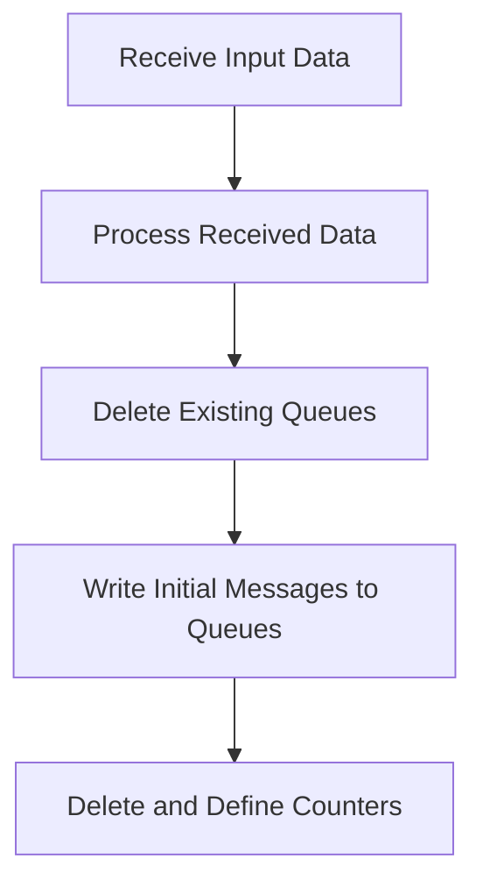

The LGSETUP program is responsible for setting up initial data and states for customer-related operations in the system. This is achieved by receiving input data, processing it, deleting existing queues, writing initial messages to queues, and defining counters.

The flow involves receiving input data, processing it to extract relevant information, deleting any existing queues to ensure a clean state, writing initial messages to the queues to set up the initial state, and finally, deleting and defining counters to initialize them for tracking customer-related operations.

Lets' zoom into the flow:



<SwmSnippet path="/base/src/lgsetup.cbl" line="128">

---

## Receive Input Data

First, the program receives input data into <SwmToken path="base/src/lgsetup.cbl" pos="128:9:11" line-data="           EXEC CICS RECEIVE INTO(WS-RECV)">`WS-RECV`</SwmToken> and stores the length in <SwmToken path="base/src/lgsetup.cbl" pos="129:3:7" line-data="               LENGTH(WS-RECV-LEN)">`WS-RECV-LEN`</SwmToken>. This step is crucial as it initializes the data that will be processed in subsequent steps.

```cobol
           EXEC CICS RECEIVE INTO(WS-RECV)
               LENGTH(WS-RECV-LEN)
               RESP(WS-RESP)
           END-EXEC
```

---

</SwmSnippet>

<SwmSnippet path="/base/src/lgsetup.cbl" line="132">

---

## Process Received Data

Next, if the length of the received data is greater than 5, it subtracts 5 from <SwmToken path="base/src/lgsetup.cbl" pos="132:3:7" line-data="           If WS-RECV-LEN &gt; 5">`WS-RECV-LEN`</SwmToken> and moves the relevant portion of <SwmToken path="base/src/lgsetup.cbl" pos="134:3:7" line-data="             Move WS-RECV-DATA(1:WS-RECV-LEN)  To LastCustNum">`WS-RECV-DATA`</SwmToken> to <SwmToken path="base/src/lgsetup.cbl" pos="134:20:20" line-data="             Move WS-RECV-DATA(1:WS-RECV-LEN)  To LastCustNum">`LastCustNum`</SwmToken>. This step ensures that only the necessary part of the data is processed.

```cobol
           If WS-RECV-LEN > 5
             Subtract 5 From WS-RECV-LEN
             Move WS-RECV-DATA(1:WS-RECV-LEN)  To LastCustNum
           End-if
```

---

</SwmSnippet>

<SwmSnippet path="/base/src/lgsetup.cbl" line="138">

---

## Delete Existing Queues

Then, the program deletes any existing queues (<SwmToken path="base/src/lgsetup.cbl" pos="138:11:13" line-data="           Exec CICS DeleteQ TS Queue(STSQ-ERRS)">`STSQ-ERRS`</SwmToken>, <SwmToken path="base/src/lgsetup.cbl" pos="142:11:13" line-data="           Exec CICS DeleteQ TS Queue(STSQ-STRT)">`STSQ-STRT`</SwmToken>, <SwmToken path="base/src/lgsetup.cbl" pos="146:11:13" line-data="           Exec CICS DeleteQ TS Queue(STSQ-STAT)">`STSQ-STAT`</SwmToken>, <SwmToken path="base/src/lgsetup.cbl" pos="150:11:13" line-data="           Exec CICS DeleteQ TS Queue(STSQ-NAME)">`STSQ-NAME`</SwmToken>). This step clears any previous data to ensure a clean state for new operations.

```cobol
           Exec CICS DeleteQ TS Queue(STSQ-ERRS)
                     Resp(WS-RESP)
           End-Exec.
      **************************************************
           Exec CICS DeleteQ TS Queue(STSQ-STRT)
                     Resp(WS-RESP)
           End-Exec.
      **************************************************
           Exec CICS DeleteQ TS Queue(STSQ-STAT)
                     Resp(WS-RESP)
           End-Exec.
      **************************************************
           Exec CICS DeleteQ TS Queue(STSQ-NAME)
                     Resp(WS-RESP)
           End-Exec.
```

---

</SwmSnippet>

<SwmSnippet path="/base/src/lgsetup.cbl" line="154">

---

## Write Initial Messages to Queues

Moving to the next step, the program writes initial messages to the <SwmToken path="base/src/lgsetup.cbl" pos="157:11:13" line-data="             EXEC CICS WRITEQ TS QUEUE(STSQ-NAME)">`STSQ-NAME`</SwmToken> queue. It uses <SwmToken path="base/src/lgsetup.cbl" pos="158:3:7" line-data="                       FROM(WRITE-MSG-E)">`WRITE-MSG-E`</SwmToken>, <SwmToken path="base/src/lgsetup.cbl" pos="165:3:7" line-data="                       FROM(WRITE-MSG-L)">`WRITE-MSG-L`</SwmToken>, and <SwmToken path="base/src/lgsetup.cbl" pos="172:3:7" line-data="                       FROM(WRITE-MSG-H)">`WRITE-MSG-H`</SwmToken> to store different parts of the message. This step sets up the initial state of the queue with relevant customer information.

```cobol
           Move FrstCustNum  to WRITE-MSG-LOW
           Move LastCustNum  to WRITE-MSG-HIGH

             EXEC CICS WRITEQ TS QUEUE(STSQ-NAME)
                       FROM(WRITE-MSG-E)
                       RESP(WS-RESP)
                       NOSUSPEND
                       LENGTH(20)
             END-EXEC

             EXEC CICS WRITEQ TS QUEUE(STSQ-NAME)
                       FROM(WRITE-MSG-L)
                       RESP(WS-RESP)
                       NOSUSPEND
                       LENGTH(23)
             END-EXEC

             EXEC CICS WRITEQ TS QUEUE(STSQ-NAME)
                       FROM(WRITE-MSG-H)
                       RESP(WS-RESP)
                       NOSUSPEND
```

---

</SwmSnippet>

<SwmSnippet path="/base/src/lgsetup.cbl" line="179">

---

## Delete and Define Counters

Finally, the program deletes and defines various counters (<SwmToken path="base/src/lgsetup.cbl" pos="179:9:9" line-data="           Exec CICS Delete Counter(GENAcount)">`GENAcount`</SwmToken>, <SwmToken path="base/src/lgsetup.cbl" pos="189:9:9" line-data="           Exec CICS Delete Counter(GENACNT100)">`GENACNT100`</SwmToken>, <SwmToken path="base/src/lgsetup.cbl" pos="198:9:9" line-data="           Exec CICS Delete Counter(GENACNT199)">`GENACNT199`</SwmToken>, etc.) with initial values. This step is essential for initializing the counters that will be used for tracking customer-related operations.

```cobol
           Exec CICS Delete Counter(GENAcount)
                            Pool(GENApool)
                            Resp(WS-RESP)
           End-Exec.
           Exec CICS Define Counter(GENAcount)
                            Pool(GENApool)
                            Value(LastCustNum)
                            Resp(WS-RESP)
           End-Exec.
      *
           Exec CICS Delete Counter(GENACNT100)
                            Pool(GENApool)
                            Resp(WS-RESP)
           End-Exec.
           Exec CICS Define Counter(GENACNT100)
                            Pool(GENApool)
                            Value(0)
                            Resp(WS-RESP)
           End-Exec.
           Exec CICS Delete Counter(GENACNT199)
                            Pool(GENApool)
```

---

</SwmSnippet>

&nbsp;

*This is an auto-generated document by Swimm 🌊 and has not yet been verified by a human*

<SwmMeta version="3.0.0" repo-id="Z2l0aHViJTNBJTNBa3luZHJ5bC1jaWNzLWdlbmFwcCUzQSUzQVN3aW1tLURlbW8=" repo-name="kyndryl-cics-genapp"><sup>Powered by [Swimm](/)</sup></SwmMeta>
