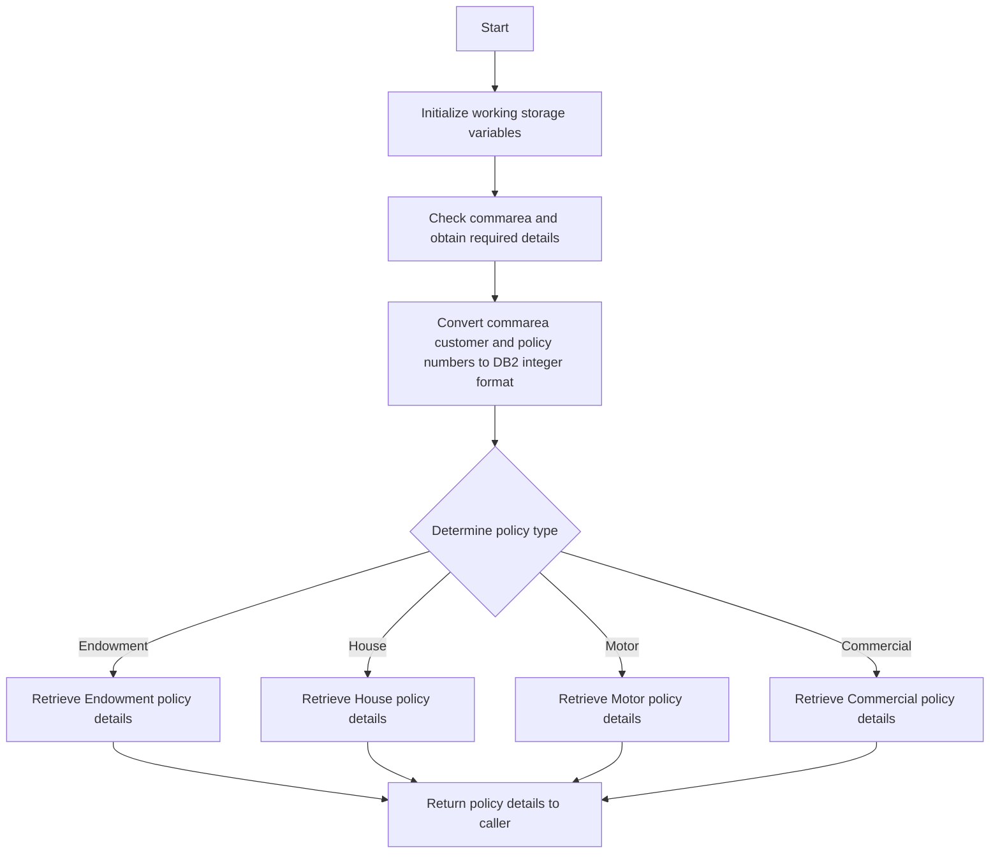

The <SwmToken path="base/src/lgipdb01.cbl" pos="13:6:6" line-data="       PROGRAM-ID. LGIPDB01.">`LGIPDB01`</SwmToken> program is a COBOL application designed to inquire policy details in an insurance system. This document will cover:

1. What the Program Does
2. Program Flow
3. Program Sections

## What the Program Does

The <SwmToken path="base/src/lgipdb01.cbl" pos="13:6:6" line-data="       PROGRAM-ID. LGIPDB01.">`LGIPDB01`</SwmToken> program is designed to obtain full details of an individual policy, including Endowment, House, Motor, and Commercial policies. It initializes working storage variables, checks the communication area (commarea), converts customer and policy numbers to <SwmToken path="base/src/lgipdb01.cbl" pos="242:5:5" line-data="      * initialize DB2 host variables">`DB2`</SwmToken> integer format, and then retrieves the requested policy details from the database based on the policy type.

## Program Flow

The program follows these high-level steps:

1. Initialize working storage variables.
2. Check the commarea and obtain required details.
3. Convert commarea customer and policy numbers to <SwmToken path="base/src/lgipdb01.cbl" pos="242:5:5" line-data="      * initialize DB2 host variables">`DB2`</SwmToken> integer format.
4. Determine the policy type being requested.
5. Retrieve policy details from the database based on the policy type.
6. Return the policy details to the caller.



<SwmSnippet path="/base/src/lgipdb01.cbl" line="230">

---

### MAINLINE SECTION

First, the MAINLINE SECTION initializes working storage variables, sets up general variables, and initializes <SwmToken path="base/src/lgipdb01.cbl" pos="242:5:5" line-data="      * initialize DB2 host variables">`DB2`</SwmToken> host variables. It then checks the commarea and obtains the required details, converting customer and policy numbers to <SwmToken path="base/src/lgipdb01.cbl" pos="242:5:5" line-data="      * initialize DB2 host variables">`DB2`</SwmToken> integer format. Finally, it determines the policy type being requested and performs the corresponding section to retrieve policy details.

```cobol
       MAINLINE SECTION.

      *----------------------------------------------------------------*
      * Common code                                                    *
      *----------------------------------------------------------------*
      * initialize working storage variables
           INITIALIZE WS-HEADER.
      * set up general variable
           MOVE EIBTRNID TO WS-TRANSID.
           MOVE EIBTRMID TO WS-TERMID.
           MOVE EIBTASKN TO WS-TASKNUM.
      *----------------------------------------------------------------*
      * initialize DB2 host variables
           INITIALIZE DB2-IN-INTEGERS.
           INITIALIZE DB2-OUT-INTEGERS.
           INITIALIZE DB2-POLICY.

      *---------------------------------------------------------------*
      * Check commarea and obtain required details                    *
      *---------------------------------------------------------------*
      * If NO commarea received issue an ABEND
```

---

</SwmSnippet>

<SwmSnippet path="/base/src/lgipdb01.cbl" line="327">

---

### <SwmToken path="base/src/lgipdb01.cbl" pos="327:1:7" line-data="       GET-ENDOW-DB2-INFO.">`GET-ENDOW-DB2-INFO`</SwmToken>

Next, the <SwmToken path="base/src/lgipdb01.cbl" pos="327:1:7" line-data="       GET-ENDOW-DB2-INFO.">`GET-ENDOW-DB2-INFO`</SwmToken> section retrieves Endowment policy details from the database. It selects the required fields from the POLICY and ENDOWMENT tables, calculates the size of the commarea required to return all data, and moves the data to the commarea if the length is sufficient.

```cobol
       GET-ENDOW-DB2-INFO.

           MOVE ' SELECT ENDOW ' TO EM-SQLREQ
           EXEC SQL
             SELECT  ISSUEDATE,
                     EXPIRYDATE,
                     LASTCHANGED,
                     BROKERID,
                     BROKERSREFERENCE,
                     PAYMENT,
                     WITHPROFITS,
                     EQUITIES,
                     MANAGEDFUND,
                     FUNDNAME,
                     TERM,
                     SUMASSURED,
                     LIFEASSURED,
                     PADDINGDATA,
                     LENGTH(PADDINGDATA)
             INTO  :DB2-ISSUEDATE,
                   :DB2-EXPIRYDATE,
```

---

</SwmSnippet>

<SwmSnippet path="/base/src/lgipdb01.cbl" line="441">

---

### <SwmToken path="base/src/lgipdb01.cbl" pos="441:1:7" line-data="       GET-HOUSE-DB2-INFO.">`GET-HOUSE-DB2-INFO`</SwmToken>

Then, the <SwmToken path="base/src/lgipdb01.cbl" pos="441:1:7" line-data="       GET-HOUSE-DB2-INFO.">`GET-HOUSE-DB2-INFO`</SwmToken> section retrieves House policy details from the database. It selects the required fields from the POLICY and HOUSE tables, calculates the size of the commarea required to return all data, and moves the data to the commarea if the length is sufficient.

```cobol
       GET-HOUSE-DB2-INFO.

           MOVE ' SELECT HOUSE ' TO EM-SQLREQ
           EXEC SQL
             SELECT  ISSUEDATE,
                     EXPIRYDATE,
                     LASTCHANGED,
                     BROKERID,
                     BROKERSREFERENCE,
                     PAYMENT,
                     PROPERTYTYPE,
                     BEDROOMS,
                     VALUE,
                     HOUSENAME,
                     HOUSENUMBER,
                     POSTCODE
             INTO  :DB2-ISSUEDATE,
                   :DB2-EXPIRYDATE,
                   :DB2-LASTCHANGED,
                   :DB2-BROKERID-INT INDICATOR :IND-BROKERID,
                   :DB2-BROKERSREF INDICATOR :IND-BROKERSREF,
```

---

</SwmSnippet>

<SwmSnippet path="/base/src/lgipdb01.cbl" line="529">

---

### <SwmToken path="base/src/lgipdb01.cbl" pos="529:1:7" line-data="       GET-MOTOR-DB2-INFO.">`GET-MOTOR-DB2-INFO`</SwmToken>

Following that, the <SwmToken path="base/src/lgipdb01.cbl" pos="529:1:7" line-data="       GET-MOTOR-DB2-INFO.">`GET-MOTOR-DB2-INFO`</SwmToken> section retrieves Motor policy details from the database. It selects the required fields from the POLICY and MOTOR tables, calculates the size of the commarea required to return all data, and moves the data to the commarea if the length is sufficient.

```cobol
       GET-MOTOR-DB2-INFO.

           MOVE ' SELECT MOTOR ' TO EM-SQLREQ
           EXEC SQL
             SELECT  ISSUEDATE,
                     EXPIRYDATE,
                     LASTCHANGED,
                     BROKERID,
                     BROKERSREFERENCE,
                     PAYMENT,
                     MAKE,
                     MODEL,
                     VALUE,
                     REGNUMBER,
                     COLOUR,
                     CC,
                     YEAROFMANUFACTURE,
                     PREMIUM,
                     ACCIDENTS
             INTO  :DB2-ISSUEDATE,
                   :DB2-EXPIRYDATE,
```

---

</SwmSnippet>

<SwmSnippet path="/base/src/lgipdb01.cbl" line="627">

---

### <SwmToken path="base/src/lgipdb01.cbl" pos="627:1:9" line-data="       GET-Commercial-DB2-INFO-1.">`GET-Commercial-DB2-INFO-1`</SwmToken>

Next, the <SwmToken path="base/src/lgipdb01.cbl" pos="627:1:9" line-data="       GET-Commercial-DB2-INFO-1.">`GET-Commercial-DB2-INFO-1`</SwmToken> section retrieves Commercial policy details from the database using the first method. It selects the required fields from the POLICY and COMMERCIAL tables, calculates the size of the commarea required to return all data, and moves the data to the commarea if the length is sufficient.

```cobol
       GET-Commercial-DB2-INFO-1.

           MOVE ' SELECT Commercial ' TO EM-SQLREQ

           EXEC SQL
             SELECT
                   RequestDate,
                   StartDate,
                   RenewalDate,
                   Address,
                   Zipcode,
                   LatitudeN,
                   LongitudeW,
                   Customer,
                   PropertyType,
                   FirePeril,
                   FirePremium,
                   CrimePeril,
                   CrimePremium,
                   FloodPeril,
                   FloodPremium,
```

---

</SwmSnippet>

<SwmSnippet path="/base/src/lgipdb01.cbl" line="730">

---

### <SwmToken path="base/src/lgipdb01.cbl" pos="730:1:9" line-data="       GET-Commercial-DB2-INFO-2.">`GET-Commercial-DB2-INFO-2`</SwmToken>

Then, the <SwmToken path="base/src/lgipdb01.cbl" pos="730:1:9" line-data="       GET-Commercial-DB2-INFO-2.">`GET-Commercial-DB2-INFO-2`</SwmToken> section retrieves Commercial policy details from the database using the second method. It selects the required fields from the POLICY and COMMERCIAL tables, calculates the size of the commarea required to return all data, and moves the data to the commarea if the length is sufficient.

```cobol
       GET-Commercial-DB2-INFO-2.

           MOVE ' SELECT Commercial ' TO EM-SQLREQ

           EXEC SQL
             SELECT
                   CustomerNumber,
                   RequestDate,
                   StartDate,
                   RenewalDate,
                   Address,
                   Zipcode,
                   LatitudeN,
                   LongitudeW,
                   Customer,
                   PropertyType,
                   FirePeril,
                   FirePremium,
                   CrimePeril,
                   CrimePremium,
                   FloodPeril,
```

---

</SwmSnippet>

<SwmSnippet path="/base/src/lgipdb01.cbl" line="835">

---

### <SwmToken path="base/src/lgipdb01.cbl" pos="835:1:9" line-data="       GET-Commercial-DB2-INFO-3.">`GET-Commercial-DB2-INFO-3`</SwmToken>

Following that, the <SwmToken path="base/src/lgipdb01.cbl" pos="835:1:9" line-data="       GET-Commercial-DB2-INFO-3.">`GET-Commercial-DB2-INFO-3`</SwmToken> section retrieves Commercial policy details from the database using a cursor. It opens the cursor, fetches the required fields from the POLICY and COMMERCIAL tables, and moves the data to the commarea if the length is sufficient.

```cobol
       GET-Commercial-DB2-INFO-3.

           MOVE ' SELECT Commercial ' TO EM-SQLREQ
           Move 0 To ICOM-Record-Count

           EXEC SQL
             OPEN Cust_Cursor
           END-EXEC.
           IF SQLCODE NOT EQUAL 0
             MOVE '89' TO CA-RETURN-CODE
             PERFORM WRITE-ERROR-MESSAGE
             PERFORM END-PROGRAM
           END-IF.

           Perform GET-Commercial-DB2-INFO-3-Cur
                     With Test after Until SQLCODE > 0

           EXEC SQL
             Close Cust_Cursor
           END-EXEC.
           IF SQLCODE NOT EQUAL 0
```

---

</SwmSnippet>

<SwmSnippet path="/base/src/lgipdb01.cbl" line="919">

---

### <SwmToken path="base/src/lgipdb01.cbl" pos="919:1:9" line-data="       GET-Commercial-DB2-INFO-5.">`GET-Commercial-DB2-INFO-5`</SwmToken>

Finally, the <SwmToken path="base/src/lgipdb01.cbl" pos="919:1:9" line-data="       GET-Commercial-DB2-INFO-5.">`GET-Commercial-DB2-INFO-5`</SwmToken> section retrieves Commercial policy details from the database using a different cursor. It opens the cursor, fetches the required fields from the POLICY and COMMERCIAL tables, and moves the data to the commarea if the length is sufficient.

```cobol
       GET-Commercial-DB2-INFO-5.

           MOVE ' SELECT Commercial ' TO EM-SQLREQ

           EXEC SQL
             OPEN Zip_Cursor
           END-EXEC.
           IF SQLCODE NOT EQUAL 0
             MOVE '89' TO CA-RETURN-CODE
             PERFORM WRITE-ERROR-MESSAGE
             PERFORM END-PROGRAM
           END-IF.

           Perform GET-Commercial-DB2-INFO-5-Cur
                     With Test after Until SQLCODE > 0

           EXEC SQL
             Close Zip_Cursor
           END-EXEC.
           IF SQLCODE NOT EQUAL 0
             MOVE '88' TO CA-RETURN-CODE
```

---

</SwmSnippet>

&nbsp;

*This is an auto-generated document by Swimm 🌊 and has not yet been verified by a human*

<SwmMeta version="3.0.0" repo-id="Z2l0aHViJTNBJTNBa3luZHJ5bC1jaWNzLWdlbmFwcCUzQSUzQVN3aW1tLURlbW8=" repo-name="kyndryl-cics-genapp"><sup>Powered by [Swimm](/)</sup></SwmMeta>
