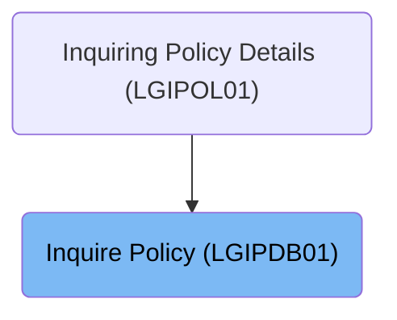
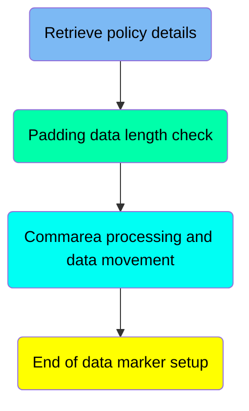
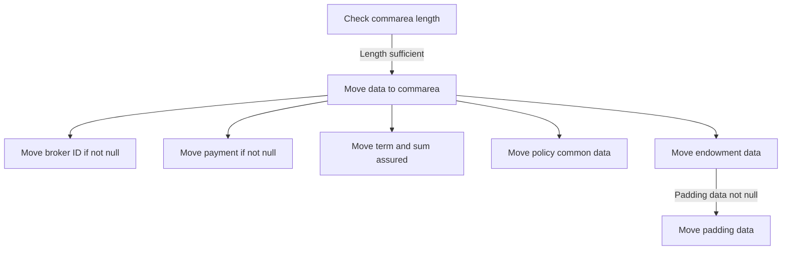
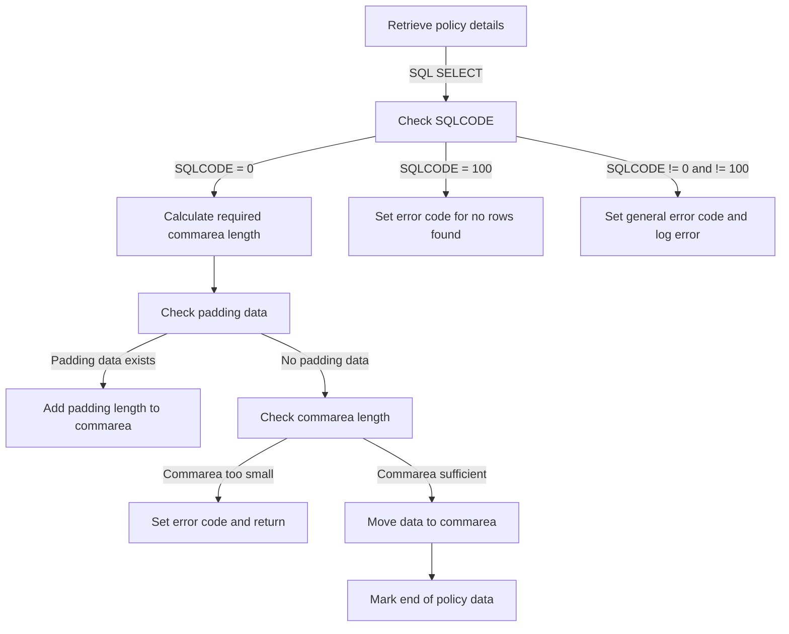
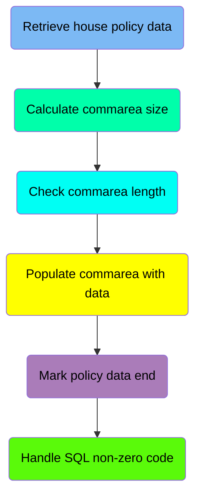
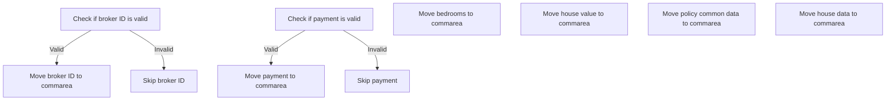
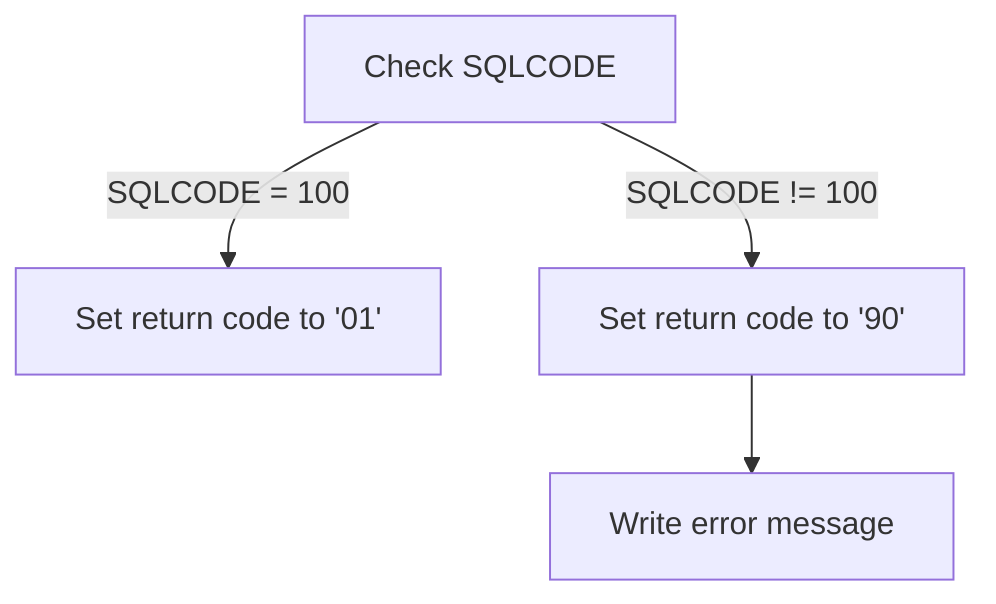
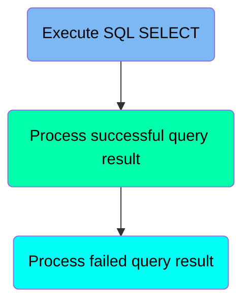
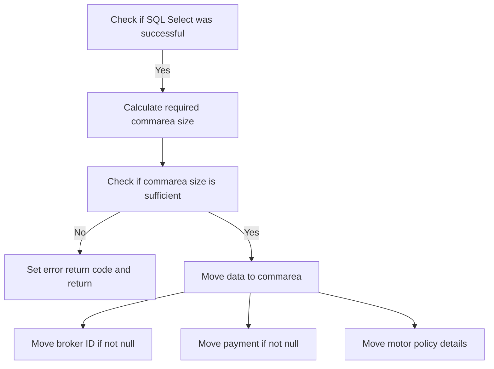

The document describes the process of inquiring policy details using the <SwmToken path="base/src/lgipdb01.cbl" pos="13:6:6" line-data="       PROGRAM-ID. LGIPDB01.">`LGIPDB01`</SwmToken> program. This program is used to obtain full details of an individual policy, including endowment, house, motor, and commercial policies. The process involves initializing various working storage and <SwmToken path="base/src/lgipdb01.cbl" pos="242:5:5" line-data="      * initialize DB2 host variables">`DB2`</SwmToken> host variables, retrieving policy details from the database, and populating the communication area with the retrieved data.

For example, when inquiring about an endowment policy, the program retrieves details such as issue date, expiry date, broker ID, and payment details based on the provided policy number and customer number.

# Where is this program used?

This program is used once, as represented in the following diagram:



# Process Policy Type Request (MAINLINE)

<SwmSnippet path="/base/src/lgipdb01.cbl" line="230">

---

Going into the MAINLINE section, the code initializes various working storage variables and <SwmToken path="base/src/lgipdb01.cbl" pos="242:5:5" line-data="      * initialize DB2 host variables">`DB2`</SwmToken> host variables. This includes setting up general variables such as the transaction ID, terminal ID, and task number. Additionally, it initializes <SwmToken path="base/src/lgipdb01.cbl" pos="242:5:5" line-data="      * initialize DB2 host variables">`DB2`</SwmToken> host variables to prepare for subsequent database interactions.

```cobol
       MAINLINE SECTION.

      *----------------------------------------------------------------*
      * Common code                                                    *
      *----------------------------------------------------------------*
      * initialize working storage variables
           INITIALIZE WS-HEADER.
      * set up general variable
           MOVE EIBTRNID TO WS-TRANSID.
           MOVE EIBTRMID TO WS-TERMID.
           MOVE EIBTASKN TO WS-TASKNUM.
      *----------------------------------------------------------------*
      * initialize DB2 host variables
           INITIALIZE DB2-IN-INTEGERS.
           INITIALIZE DB2-OUT-INTEGERS.
           INITIALIZE DB2-POLICY.
```

---

</SwmSnippet>

# Get Endowment Info (<SwmToken path="base/src/lgipdb01.cbl" pos="281:3:9" line-data="               PERFORM GET-ENDOW-DB2-INFO">`GET-ENDOW-DB2-INFO`</SwmToken>)

Let's split this section into smaller parts:



## Retrieve policy details

<SwmSnippet path="/base/src/lgipdb01.cbl" line="329">

---

### Retrieving Policy Details

The code snippet retrieves various details of an endowment policy from the database. It selects fields such as issue date, expiry date, broker ID, payment details, and other relevant information. These details are fetched based on the policy number and customer number provided.

```cobol
           MOVE ' SELECT ENDOW ' TO EM-SQLREQ
           EXEC SQL
             SELECT  ISSUEDATE,
                     EXPIRYDATE,
                     LASTCHANGED,
                     BROKERID,
                     BROKERSREFERENCE,
                     PAYMENT,
                     WITHPROFITS,
                     EQUITIES,
                     MANAGEDFUND,
                     FUNDNAME,
                     TERM,
                     SUMASSURED,
                     LIFEASSURED,
                     PADDINGDATA,
                     LENGTH(PADDINGDATA)
             INTO  :DB2-ISSUEDATE,
                   :DB2-EXPIRYDATE,
                   :DB2-LASTCHANGED,
                   :DB2-BROKERID-INT INDICATOR :IND-BROKERID,
                   :DB2-BROKERSREF INDICATOR :IND-BROKERSREF,
                   :DB2-PAYMENT-INT INDICATOR :IND-PAYMENT,
                   :DB2-E-WITHPROFITS,
                   :DB2-E-EQUITIES,
                   :DB2-E-MANAGEDFUND,
                   :DB2-E-FUNDNAME,
                   :DB2-E-TERM-SINT,
                   :DB2-E-SUMASSURED-INT,
                   :DB2-E-LIFEASSURED,
                   :DB2-E-PADDINGDATA INDICATOR :IND-E-PADDINGDATA,
                   :DB2-E-PADDING-LEN INDICATOR :IND-E-PADDINGDATAL
             FROM  POLICY,ENDOWMENT
             WHERE ( POLICY.POLICYNUMBER =
                        ENDOWMENT.POLICYNUMBER   AND
                     POLICY.CUSTOMERNUMBER =
                        :DB2-CUSTOMERNUM-INT             AND
                     POLICY.POLICYNUMBER =
                        :DB2-POLICYNUM-INT               )
           END-EXEC
```

---

</SwmSnippet>

## Padding data length check

<SwmSnippet path="/base/src/lgipdb01.cbl" line="383">

---

### Calculating Communication Area Length

The code checks if the padding data length is valid. If it is, it adjusts the required length for the communication area and updates the position for the end of the policy data.

```cobol
             IF IND-E-PADDINGDATAL NOT EQUAL MINUS-ONE
               ADD DB2-E-PADDING-LEN TO WS-REQUIRED-CA-LEN
               ADD DB2-E-PADDING-LEN TO END-POLICY-POS
             END-IF
```

---

</SwmSnippet>

## Commarea processing and data movement

Now, lets zoom into this section of the flow:



<SwmSnippet path="/base/src/lgipdb01.cbl" line="390">

---

### Checking commarea length

Going into the first snippet, the code checks if the provided communication area is large enough to hold the required data. If it is not, it indicates an error and stops further processing. Otherwise, it proceeds to move the necessary data to the communication area.

```cobol
             IF EIBCALEN IS LESS THAN WS-REQUIRED-CA-LEN
               MOVE '98' TO CA-RETURN-CODE
               EXEC CICS RETURN END-EXEC
             ELSE
      *        Length is sufficent so move data to commarea
      *        Move Integer fields to required length numerics
      *        Don't move null fields
               IF IND-BROKERID NOT EQUAL MINUS-ONE
                 MOVE DB2-BROKERID-INT    TO DB2-BROKERID
               END-IF
```

---

</SwmSnippet>

<SwmSnippet path="/base/src/lgipdb01.cbl" line="400">

---

### Moving payment data

Next, the code checks if the payment data is valid. If it is, it moves the payment data from the database to the appropriate field in the communication area.

```cobol
               IF IND-PAYMENT NOT EQUAL MINUS-ONE
                 MOVE DB2-PAYMENT-INT TO DB2-PAYMENT
               END-IF
```

---

</SwmSnippet>

<SwmSnippet path="/base/src/lgipdb01.cbl" line="404">

---

### Moving term and sum assured data

Then, the code moves the term and sum assured data from the database to the communication area. It also moves common policy data and endowment data to their respective fields. If the padding data is valid, it moves the padding data as well.

```cobol
               MOVE DB2-E-TERM-SINT       TO DB2-E-TERM
               MOVE DB2-E-SUMASSURED-INT  TO DB2-E-SUMASSURED

               MOVE DB2-POLICY-COMMON     TO CA-POLICY-COMMON
               MOVE DB2-ENDOW-FIXED
                   TO CA-ENDOWMENT(1:WS-ENDOW-LEN)
               IF IND-E-PADDINGDATA NOT EQUAL MINUS-ONE
                 MOVE DB2-E-PADDINGDATA TO
                     CA-E-PADDING-DATA(1:DB2-E-PADDING-LEN)
               END-IF
```

---

</SwmSnippet>

## End of data marker setup

Now, lets zoom into this section of the flow:



# Get House Data (<SwmToken path="base/src/lgipdb01.cbl" pos="441:1:7" line-data="       GET-HOUSE-DB2-INFO.">`GET-HOUSE-DB2-INFO`</SwmToken>)

Let's split this section into smaller parts:



## Retrieve house policy data

<SwmSnippet path="/base/src/lgipdb01.cbl" line="441">

---

### Retrieving House Policy Details

The <SwmToken path="base/src/lgipdb01.cbl" pos="441:1:7" line-data="       GET-HOUSE-DB2-INFO.">`GET-HOUSE-DB2-INFO`</SwmToken> function starts by constructing an SQL query to retrieve house policy details from the database. It selects various fields such as issue date, expiry date, last changed date, broker ID, broker's reference, payment, property type, number of bedrooms, value, house name, house number, and postcode. These details are fetched from the POLICY and HOUSE tables where the policy number and customer number match the provided input values.

```cobol
       GET-HOUSE-DB2-INFO.

           MOVE ' SELECT HOUSE ' TO EM-SQLREQ
           EXEC SQL
             SELECT  ISSUEDATE,
                     EXPIRYDATE,
                     LASTCHANGED,
                     BROKERID,
                     BROKERSREFERENCE,
                     PAYMENT,
                     PROPERTYTYPE,
                     BEDROOMS,
                     VALUE,
                     HOUSENAME,
                     HOUSENUMBER,
                     POSTCODE
             INTO  :DB2-ISSUEDATE,
                   :DB2-EXPIRYDATE,
                   :DB2-LASTCHANGED,
                   :DB2-BROKERID-INT INDICATOR :IND-BROKERID,
                   :DB2-BROKERSREF INDICATOR :IND-BROKERSREF,
                   :DB2-PAYMENT-INT INDICATOR :IND-PAYMENT,
                   :DB2-H-PROPERTYTYPE,
                   :DB2-H-BEDROOMS-SINT,
                   :DB2-H-VALUE-INT,
                   :DB2-H-HOUSENAME,
                   :DB2-H-HOUSENUMBER,
                   :DB2-H-POSTCODE
             FROM  POLICY,HOUSE
             WHERE ( POLICY.POLICYNUMBER =
                        HOUSE.POLICYNUMBER   AND
                     POLICY.CUSTOMERNUMBER =
                        :DB2-CUSTOMERNUM-INT             AND
                     POLICY.POLICYNUMBER =
                        :DB2-POLICYNUM-INT               )
           END-EXEC
```

---

</SwmSnippet>

## Calculate commarea size

<SwmSnippet path="/base/src/lgipdb01.cbl" line="478">

---

### Handling successful SQL query

Going into the snippet, the code first checks if the SQL query was successful. If the query was successful, it proceeds to calculate the size of the communication area required to return all the retrieved data by adding the lengths of the header/trailer and the full house data.

```cobol
           IF SQLCODE = 0
      *      Select was successful

      *      Calculate size of commarea required to return all data
             ADD WS-CA-HEADERTRAILER-LEN TO WS-REQUIRED-CA-LEN
             ADD WS-FULL-HOUSE-LEN       TO WS-REQUIRED-CA-LEN
```

---

</SwmSnippet>

## Check commarea length

<SwmSnippet path="/base/src/lgipdb01.cbl" line="487">

---

### Validating Communication Area Length

The code snippet checks if the communication area length is sufficient. If not, it sets an error code and returns control to the caller.

```cobol
             IF EIBCALEN IS LESS THAN WS-REQUIRED-CA-LEN
               MOVE '98' TO CA-RETURN-CODE
               EXEC CICS RETURN END-EXEC
```

---

</SwmSnippet>

## Populate commarea with data

Now, lets zoom into this section of the flow:



<SwmSnippet path="/base/src/lgipdb01.cbl" line="490">

---

### Processing broker ID and payment

Going into the first snippet, the code checks if the broker ID is valid by comparing it to a specific value. If the broker ID is valid, it moves the broker ID to the communication area. Similarly, it checks if the payment information is valid and, if so, moves the payment information to the communication area.

```cobol
             ELSE
      *        Length is sufficent so move data to commarea
      *        Move Integer fields to required length numerics
      *        Don't move null fields
               IF IND-BROKERID NOT EQUAL MINUS-ONE
                 MOVE DB2-BROKERID-INT  TO DB2-BROKERID
               END-IF
               IF IND-PAYMENT NOT EQUAL MINUS-ONE
                 MOVE DB2-PAYMENT-INT TO DB2-PAYMENT
               END-IF
```

---

</SwmSnippet>

<SwmSnippet path="/base/src/lgipdb01.cbl" line="500">

---

### Moving house details to commarea

Next, the code moves the number of bedrooms and the house value to the communication area. It then moves the common policy data and the house data to the communication area, ensuring that all relevant information is included for further processing.

```cobol
               MOVE DB2-H-BEDROOMS-SINT TO DB2-H-BEDROOMS
               MOVE DB2-H-VALUE-INT     TO DB2-H-VALUE

               MOVE DB2-POLICY-COMMON   TO CA-POLICY-COMMON
               MOVE DB2-HOUSE           TO CA-HOUSE(1:WS-HOUSE-LEN)
             END-IF
```

---

</SwmSnippet>

## Mark policy data end

<SwmSnippet path="/base/src/lgipdb01.cbl" line="508">

---

### Marking the end of policy data

The code snippet moves the string 'FINAL' to the <SwmToken path="base/src/lgipdb01.cbl" pos="508:9:13" line-data="             MOVE &#39;FINAL&#39; TO CA-H-FILLER(1:5)">`CA-H-FILLER`</SwmToken> field, indicating the end of the policy data in the communication area.

```cobol
             MOVE 'FINAL' TO CA-H-FILLER(1:5)
```

---

</SwmSnippet>

## Handle SQL non-zero code

Now, lets zoom into this section of the flow:



<SwmSnippet path="/base/src/lgipdb01.cbl" line="510">

---

### Handling SQL Query Results

The code snippet handles the results of a SQL query. If the SQL query returns a code of 100, indicating no rows were found, it sets the return code to '01'. Otherwise, if the SQL query returns any other non-zero code, it sets the return code to '90' and writes an error message to the transient data queue.

```cobol
           ELSE
      *      Non-zero SQLCODE from first SQL FETCH statement
             IF SQLCODE EQUAL 100
      *        No rows found - invalid customer / policy number
               MOVE '01' TO CA-RETURN-CODE
             ELSE
      *        something has gone wrong
               MOVE '90' TO CA-RETURN-CODE
      *        Write error message to TD QUEUE(CSMT)
               PERFORM WRITE-ERROR-MESSAGE
```

---

</SwmSnippet>

# Fetch motor details (<SwmToken path="base/src/lgipdb01.cbl" pos="289:3:9" line-data="               PERFORM GET-MOTOR-DB2-INFO">`GET-MOTOR-DB2-INFO`</SwmToken>)

Let's split this section into smaller parts:



## Execute SQL SELECT

<SwmSnippet path="/base/src/lgipdb01.cbl" line="549">

---

### Retrieving Motor Policy Details

The code snippet retrieves various details of a motor policy from the database. It fetches these details from the <SwmToken path="base/src/lgipdb01.cbl" pos="563:3:3" line-data="             FROM  POLICY,MOTOR">`POLICY`</SwmToken> and <SwmToken path="base/src/lgipdb01.cbl" pos="563:5:5" line-data="             FROM  POLICY,MOTOR">`MOTOR`</SwmToken> tables where the policy number and customer number match the provided values.

```cobol
                   :DB2-EXPIRYDATE,
                   :DB2-LASTCHANGED,
                   :DB2-BROKERID-INT INDICATOR :IND-BROKERID,
                   :DB2-BROKERSREF INDICATOR :IND-BROKERSREF,
                   :DB2-PAYMENT-INT INDICATOR :IND-PAYMENT,
                   :DB2-M-MAKE,
                   :DB2-M-MODEL,
                   :DB2-M-VALUE-INT,
                   :DB2-M-REGNUMBER,
                   :DB2-M-COLOUR,
                   :DB2-M-CC-SINT,
                   :DB2-M-MANUFACTURED,
                   :DB2-M-PREMIUM-INT,
                   :DB2-M-ACCIDENTS-INT
             FROM  POLICY,MOTOR
             WHERE ( POLICY.POLICYNUMBER =
                        MOTOR.POLICYNUMBER   AND
                     POLICY.CUSTOMERNUMBER =
                        :DB2-CUSTOMERNUM-INT             AND
                     POLICY.POLICYNUMBER =
                        :DB2-POLICYNUM-INT               )
           END-EXEC
```

---

</SwmSnippet>

## Process successful query result

Now, lets zoom into this section of the flow:



<SwmSnippet path="/base/src/lgipdb01.cbl" line="572">

---

### Checking SQL Select Success

Going into the first snippet, the code checks if the SQL Select operation was successful by evaluating the <SwmToken path="base/src/lgipdb01.cbl" pos="572:3:3" line-data="           IF SQLCODE = 0">`SQLCODE`</SwmToken>. If the operation was successful, it proceeds to calculate the required size of the communication area (commarea) to return all the retrieved data. If the commarea received is not large enough, it sets an error return code and returns to the caller.

```cobol
           IF SQLCODE = 0
      *      Select was successful

      *      Calculate size of commarea required to return all data
             ADD WS-CA-HEADERTRAILER-LEN TO WS-REQUIRED-CA-LEN
             ADD WS-FULL-MOTOR-LEN       TO WS-REQUIRED-CA-LEN

      *      if commarea received is not large enough ...
      *        set error return code and return to caller
             IF EIBCALEN IS LESS THAN WS-REQUIRED-CA-LEN
               MOVE '98' TO CA-RETURN-CODE
               EXEC CICS RETURN END-EXEC
             ELSE
      *        Length is sufficent so move data to commarea
      *        Move Integer fields to required length numerics
      *        Don't move null fields
               IF IND-BROKERID NOT EQUAL MINUS-ONE
                 MOVE DB2-BROKERID-INT TO DB2-BROKERID
               END-IF
```

---

</SwmSnippet>

<SwmSnippet path="/base/src/lgipdb01.cbl" line="591">

---

### Moving Payment Data

Next, the code checks if the payment indicator is not equal to minus one, which means the payment data is not null. If this condition is met, it moves the payment data from the database to the corresponding field in the commarea.

```cobol
               IF IND-PAYMENT NOT EQUAL MINUS-ONE
                 MOVE DB2-PAYMENT-INT    TO DB2-PAYMENT
               END-IF
```

---

</SwmSnippet>

<SwmSnippet path="/base/src/lgipdb01.cbl" line="594">

---

### Moving Motor Policy Details

Then, the code moves various motor policy details from the database to the commarea. This includes fields such as the motor's cubic capacity, value, premium, and accident information. Additionally, it moves common policy data and motor-specific data to their respective fields in the commarea.

```cobol
               MOVE DB2-M-CC-SINT      TO DB2-M-CC
               MOVE DB2-M-VALUE-INT    TO DB2-M-VALUE
               MOVE DB2-M-PREMIUM-INT  TO DB2-M-PREMIUM
               MOVE DB2-M-ACCIDENTS-INT TO DB2-M-ACCIDENTS
               MOVE DB2-M-PREMIUM-INT  TO CA-M-PREMIUM
               MOVE DB2-M-ACCIDENTS-INT TO CA-M-ACCIDENTS

               MOVE DB2-POLICY-COMMON  TO CA-POLICY-COMMON
               MOVE DB2-MOTOR          TO CA-MOTOR(1:WS-MOTOR-LEN)
             END-IF
```

---

</SwmSnippet>

## Process failed query result

<SwmSnippet path="/base/src/lgipdb01.cbl" line="608">

---

### Handling SQL Query Results

The code snippet handles the result of the SQL query for retrieving policy details. If no rows are found, it sets the return code to indicate an invalid customer or policy number. Otherwise, it sets the return code to indicate an error and logs the error.

```cobol
           ELSE
      *      Non-zero SQLCODE from first SQL FETCH statement
             IF SQLCODE EQUAL 100
      *        No rows found - invalid customer / policy number
               MOVE '01' TO CA-RETURN-CODE
             ELSE
      *        something has gone wrong
               MOVE '90' TO CA-RETURN-CODE
      *        Write error message to TD QUEUE(CSMT)
               PERFORM WRITE-ERROR-MESSAGE
             END-IF

           END-IF.
```

---

</SwmSnippet>

&nbsp;

*This is an auto-generated document by Swimm 🌊 and has not yet been verified by a human*

<SwmMeta version="3.0.0" repo-id="Z2l0aHViJTNBJTNBa3luZHJ5bC1jaWNzLWdlbmFwcCUzQSUzQVN3aW1tLURlbW8=" repo-name="kyndryl-cics-genapp"><sup>Powered by [Swimm](/)</sup></SwmMeta>
