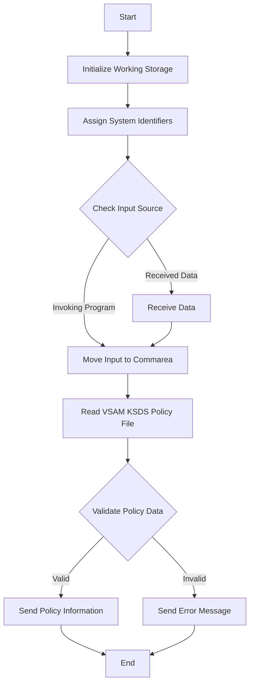

This document will cover the <SwmToken path="base/src/lgipvs01.cbl" pos="13:6:6" line-data="       PROGRAM-ID. LGIPVS01.">`LGIPVS01`</SwmToken> program. We'll cover:

1. What the Program Does
2. Program Flow
3. Program Sections

## What the Program Does

The <SwmToken path="base/src/lgipvs01.cbl" pos="13:6:6" line-data="       PROGRAM-ID. LGIPVS01.">`LGIPVS01`</SwmToken> program is designed to return a random <SwmToken path="base/src/lgipvs01.cbl" pos="7:15:17" line-data="      * This program will return a random Policy/customer number from  *">`Policy/customer`</SwmToken> number from the VSAM KSDS Policy file based on the input parameter of policy type, which determines the key. The program initializes various working storage variables, assigns system identifiers, and processes the input to read from the VSAM file and return the appropriate policy information.

## Program Flow

The program flow involves several key steps:

1. Initialize working storage variables.
2. Assign system identifiers and start codes.
3. Determine the input source (either from invoking program or received data).
4. Move input data to the communication area.
5. Read the VSAM KSDS Policy file using the key derived from the input data.
6. Validate the retrieved policy data.
7. Send the policy information back to the invoking program or terminal.



<SwmSnippet path="/base/src/lgipvs01.cbl" line="75">

---

### MAINLINE SECTION

First, the MAINLINE SECTION initializes the working storage variables and assigns system identifiers and start codes. It then determines the input source, either from the invoking program or received data, and moves the input data to the communication area. Next, it reads the VSAM KSDS Policy file using the key derived from the input data. The retrieved policy data is then validated, and the appropriate policy information or error message is sent back to the invoking program or terminal.

```cobol
       MAINLINE SECTION.
      *
           MOVE SPACES TO WS-RECV.

           EXEC CICS ASSIGN SYSID(WS-SYSID)
                RESP(WS-RESP)
           END-EXEC.

           EXEC CICS ASSIGN STARTCODE(WS-STARTCODE)
                RESP(WS-RESP)
           END-EXEC.

           EXEC CICS ASSIGN Invokingprog(WS-Invokeprog)
                RESP(WS-RESP)
           END-EXEC.
           IF WS-STARTCODE(1:1) = 'D' or
              WS-Invokeprog Not = Spaces
              MOVE 'C' To WS-FLAG
              MOVE COMMA-DATA  TO WS-COMMAREA
              MOVE EIBCALEN    TO WS-RECV-LEN
              MOVE 11          TO WS-RECV-LEN
```

---

</SwmSnippet>

&nbsp;

*This is an auto-generated document by Swimm 🌊 and has not yet been verified by a human*

<SwmMeta version="3.0.0" repo-id="Z2l0aHViJTNBJTNBa3luZHJ5bC1jaWNzLWdlbmFwcCUzQSUzQVN3aW1tLURlbW8=" repo-name="kyndryl-cics-genapp"><sup>Powered by [Swimm](/)</sup></SwmMeta>
