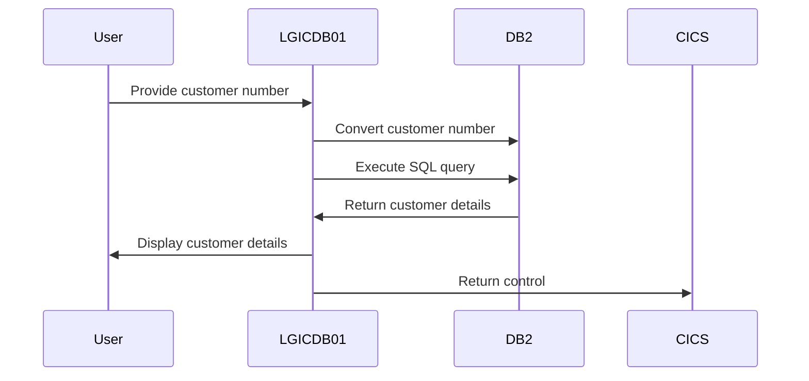

This document describes the process of retrieving customer details using the <SwmToken path="base/src/lgicdb01.cbl" pos="12:6:6" line-data="       PROGRAM-ID. LGICDB01.">`LGICDB01`</SwmToken> program. The program selects customer information from a <SwmToken path="base/src/lgicdb01.cbl" pos="146:11:11" line-data="           MOVE CA-CUSTOMER-NUM TO DB2-CUSTOMERNUMBER-INT">`DB2`</SwmToken> table based on the provided customer number. It is used within the customer inquiry process to access and display relevant customer data.

For example, if the input customer number is 12345, the output will include the customer's first name, last name, date of birth, address, and contact details.

The main steps are:

- Convert customer number for <SwmToken path="base/src/lgicdb01.cbl" pos="146:11:11" line-data="           MOVE CA-CUSTOMER-NUM TO DB2-CUSTOMERNUMBER-INT">`DB2`</SwmToken> operations
- Execute SQL query to fetch customer details
- Evaluate SQLCODE for query success
- Set return code based on SQLCODE
- End transaction and return control to CICS



## Dependencies

### Program

- LGSTSQ (<SwmPath>[base/src/lgstsq.cbl](base/src/lgstsq.cbl)</SwmPath>) - <SwmLink doc-title="Message Queue Handler (LGSTSQ)">[Message Queue Handler (LGSTSQ)](/.swm/message-queue-handler-lgstsq.e7y8uelv.sw.md)</SwmLink>

### Copybooks

- SQLCA
- LGCMAREA (<SwmPath>[base/src/lgcmarea.cpy](base/src/lgcmarea.cpy)</SwmPath>)
- LGPOLICY (<SwmPath>[base/src/lgpolicy.cpy](base/src/lgpolicy.cpy)</SwmPath>)

# Where is this program used?

This program is used once, as represented in the following diagram:

```mermaid
graph TD
  dj72y("Inquiring Customer Details (LGICUS01)") --> c2tb8("Inquiring Customer Details (LGICDB01)"):::currentEntity
click dj72y openCode "base/src/lgicus01.cbl:1"
  
  
click c2tb8 openCode "base/src/lgicdb01.cbl:1"
    classDef currentEntity color:#000000,fill:#7CB9F4

%% Swimm:
%% graph TD
%%   dj72y("Inquiring Customer Details (<SwmToken path="base/src/lgicdb01.cbl" pos="44:16:16" line-data="           03 FILLER                   PIC X(9)  VALUE &#39; LGICUS01&#39;.">`LGICUS01`</SwmToken>)") --> c2tb8("Inquiring Customer Details (<SwmToken path="base/src/lgicdb01.cbl" pos="12:6:6" line-data="       PROGRAM-ID. LGICDB01.">`LGICDB01`</SwmToken>)"):::currentEntity
%% click dj72y openCode "<SwmPath>[base/src/lgicus01.cbl](base/src/lgicus01.cbl)</SwmPath>:1"
%%   
%%   
%% click c2tb8 openCode "<SwmPath>[base/src/lgicdb01.cbl](base/src/lgicdb01.cbl)</SwmPath>:1"
%%     classDef currentEntity color:#000000,fill:#7CB9F4
```



# Initiating Customer Data Retrieval

<SwmSnippet path="/base/src/lgicdb01.cbl" line="146">

---

<SwmToken path="base/src/lgicdb01.cbl" pos="159:1:1" line-data="       MAINLINE-END.">`MAINLINE`</SwmToken> converts the customer number for <SwmToken path="base/src/lgicdb01.cbl" pos="146:11:11" line-data="           MOVE CA-CUSTOMER-NUM TO DB2-CUSTOMERNUMBER-INT">`DB2`</SwmToken> operations and calls <SwmToken path="base/src/lgicdb01.cbl" pos="154:3:7" line-data="           PERFORM GET-CUSTOMER-INFO.">`GET-CUSTOMER-INFO`</SwmToken> to fetch customer data from the database.

```cobol
           MOVE CA-CUSTOMER-NUM TO DB2-CUSTOMERNUMBER-INT
      * and save in error msg field incase required
           MOVE CA-CUSTOMER-NUM TO EM-CUSNUM

      *----------------------------------------------------------------*
      * Obtain details from DB2                                        *
      *----------------------------------------------------------------*
      *    Call routine to issue SQL to obtain info from DB2
           PERFORM GET-CUSTOMER-INFO.
```

---

</SwmSnippet>

## Executing Customer Data Query

<SwmSnippet path="/base/src/lgicdb01.cbl" line="167">

---

In <SwmToken path="base/src/lgicdb01.cbl" pos="167:1:5" line-data="       GET-CUSTOMER-INFO.">`GET-CUSTOMER-INFO`</SwmToken>, the procedure executes an SQL query to fetch customer details like name, address, and contact information from the <SwmToken path="base/src/lgicdb01.cbl" pos="189:8:8" line-data="               WHERE CUSTOMERNUMBER = :DB2-CUSTOMERNUMBER-INT">`DB2`</SwmToken> database. It uses the customer number to filter and select the correct data, storing it in COBOL variables prefixed with CA-.

```cobol
       GET-CUSTOMER-INFO.

           EXEC SQL
               SELECT FIRSTNAME,
                      LASTNAME,
                      DATEOFBIRTH,
                      HOUSENAME,
                      HOUSENUMBER,
                      POSTCODE,
                      PHONEMOBILE,
                      PHONEHOME,
                      EMAILADDRESS
               INTO  :CA-FIRST-NAME,
                     :CA-LAST-NAME,
                     :CA-DOB,
                     :CA-HOUSE-NAME,
                     :CA-HOUSE-NUM,
                     :CA-POSTCODE,
                     :CA-PHONE-MOBILE,
                     :CA-PHONE-HOME,
                     :CA-EMAIL-ADDRESS
               FROM CUSTOMER
               WHERE CUSTOMERNUMBER = :DB2-CUSTOMERNUMBER-INT
           END-EXEC.
```

---

</SwmSnippet>

<SwmSnippet path="/base/src/lgicdb01.cbl" line="192">

---

After executing the SQL query in <SwmToken path="base/src/lgicdb01.cbl" pos="154:3:7" line-data="           PERFORM GET-CUSTOMER-INFO.">`GET-CUSTOMER-INFO`</SwmToken>, the system evaluates SQLCODE to check the query's success. It sets a return code based on SQLCODE values, handling errors or confirming successful data retrieval.

```cobol
           Evaluate SQLCODE
             When 0
               MOVE '00' TO CA-RETURN-CODE
             When 100
               MOVE '01' TO CA-RETURN-CODE
             When -913
               MOVE '01' TO CA-RETURN-CODE
```

---

</SwmSnippet>

## Completing Transaction and Returning Control

<SwmSnippet path="/base/src/lgicdb01.cbl" line="159">

---

<SwmToken path="base/src/lgicdb01.cbl" pos="159:1:3" line-data="       MAINLINE-END.">`MAINLINE-END`</SwmToken> ends the transaction with EXEC CICS RETURN, handing control back to CICS.

```cobol
       MAINLINE-END.

           EXEC CICS RETURN END-EXEC.
```

---

</SwmSnippet>

&nbsp;

*This is an auto-generated document by Swimm 🌊 and has not yet been verified by a human*

<SwmMeta version="3.0.0" repo-id="Z2l0aHViJTNBJTNBa3luZHJ5bC1jaWNzLWdlbmFwcCUzQSUzQVN3aW1tLURlbW8=" repo-name="kyndryl-cics-genapp"><sup>Powered by [Swimm](/)</sup></SwmMeta>
