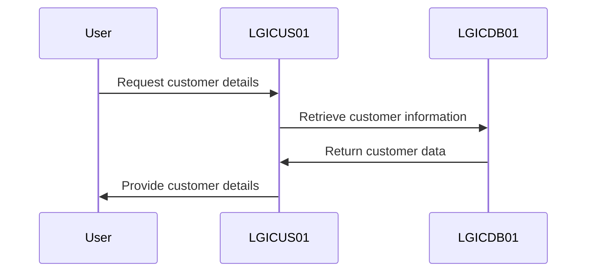
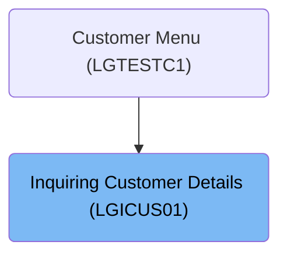

This document describes the process of retrieving customer details using the <SwmToken path="base/src/lgicus01.cbl" pos="13:6:6" line-data="       PROGRAM-ID. LGICUS01.">`LGICUS01`</SwmToken> program. The program is designed to obtain customer information from the database, which is essential for various operations within the insurance application.

For example, if a user requests information for customer ID 12345, the program retrieves and returns the customer's details such as name, address, and policy information.

The main steps are:

- Verify input data
- Retrieve customer details
- Return results



## Dependencies

### Programs

- <SwmToken path="base/src/lgicus01.cbl" pos="122:9:9" line-data="           EXEC CICS LINK Program(LGICDB01)">`LGICDB01`</SwmToken> (<SwmPath>[base/src/lgicdb01.cbl](base/src/lgicdb01.cbl)</SwmPath>) - <SwmLink doc-title="Inquiring Customer Details (LGICDB01)">[Inquiring Customer Details (LGICDB01)](/.swm/inquiring-customer-details-lgicdb01.vmdteps1.sw.md)</SwmLink>
- LGSTSQ (<SwmPath>[base/src/lgstsq.cbl](base/src/lgstsq.cbl)</SwmPath>) - <SwmLink doc-title="Message Queue Handler (LGSTSQ)">[Message Queue Handler (LGSTSQ)](/.swm/message-queue-handler-lgstsq.e7y8uelv.sw.md)</SwmLink>

### Copybooks

- SQLCA
- LGCMAREA (<SwmPath>[base/src/lgcmarea.cpy](base/src/lgcmarea.cpy)</SwmPath>)
- LGPOLICY (<SwmPath>[base/src/lgpolicy.cpy](base/src/lgpolicy.cpy)</SwmPath>)

# Where is this program used?

This program is used once, as represented in the following diagram:



# Processing Customer Information Flow

<SwmSnippet path="/base/src/lgicus01.cbl" line="104">

---

<SwmToken path="base/src/lgicus01.cbl" pos="114:1:1" line-data="       MAINLINE-END.">`MAINLINE`</SwmToken> checks commarea length and either exits or calls <SwmToken path="base/src/lgicus01.cbl" pos="109:3:7" line-data="           PERFORM GET-CUSTOMER-INFO.">`GET-CUSTOMER-INFO`</SwmToken> to get customer data.

```cobol
           IF EIBCALEN IS LESS THAN WS-REQUIRED-CA-LEN
             MOVE '98' TO CA-RETURN-CODE
             EXEC CICS RETURN END-EXEC
           END-IF

           PERFORM GET-CUSTOMER-INFO.
```

---

</SwmSnippet>

<SwmSnippet path="/base/src/lgicus01.cbl" line="120">

---

<SwmToken path="base/src/lgicus01.cbl" pos="120:1:5" line-data="       GET-CUSTOMER-INFO.">`GET-CUSTOMER-INFO`</SwmToken> calls <SwmToken path="base/src/lgicus01.cbl" pos="122:9:9" line-data="           EXEC CICS LINK Program(LGICDB01)">`LGICDB01`</SwmToken> to get customer info using CICS LINK.

```cobol
       GET-CUSTOMER-INFO.

           EXEC CICS LINK Program(LGICDB01)
               Commarea(DFHCOMMAREA)
               LENGTH(32500)
           END-EXEC
      

           EXIT.
```

---

</SwmSnippet>

<SwmSnippet path="/base/src/lgicus01.cbl" line="114">

---

<SwmToken path="base/src/lgicus01.cbl" pos="114:1:3" line-data="       MAINLINE-END.">`MAINLINE-END`</SwmToken> returns control to CICS after processing.

```cobol
       MAINLINE-END.
           EXEC CICS RETURN END-EXEC.
```

---

</SwmSnippet>

&nbsp;

*This is an auto-generated document by Swimm 🌊 and has not yet been verified by a human*

<SwmMeta version="3.0.0" repo-id="Z2l0aHViJTNBJTNBa3luZHJ5bC1jaWNzLWdlbmFwcCUzQSUzQVN3aW1tLURlbW8=" repo-name="kyndryl-cics-genapp"><sup>Powered by [Swimm](/)</sup></SwmMeta>
