The document describes the process of inquiring policy details using the <SwmToken path="base/src/lgipol01.cbl" pos="13:6:6" line-data="       PROGRAM-ID. LGIPOL01.">`LGIPOL01`</SwmToken> program. This program handles the business logic for retrieving full details of individual policies, including Endowment, House, or Motor policies. It initializes transaction data, prepares the communication area, and links to the <SwmToken path="base/src/lgipol01.cbl" pos="91:9:9" line-data="           EXEC CICS LINK Program(LGIPDB01)">`LGIPDB01`</SwmToken> program to fetch the policy details.

For instance, when a user wants to inquire about a specific motor policy, the <SwmToken path="base/src/lgipol01.cbl" pos="13:6:6" line-data="       PROGRAM-ID. LGIPOL01.">`LGIPOL01`</SwmToken> program is invoked to gather and return the complete policy details.

# Where is this program used?

This program is used multiple times in the codebase as represented in the following diagram:

```mermaid
graph TD
  n1v91("House Policy Menu (LGTESTP3)") --> n4b38("Inquiring Policy Details (LGIPOL01)"):::currentEntity
click n1v91 openCode "base/src/lgtestp3.cbl:1"
hd7dp("Commercial Policy Operations (LGTESTP4)") --> n4b38("Inquiring Policy Details (LGIPOL01)"):::currentEntity
click hd7dp openCode "base/src/lgtestp4.cbl:1"
nwhsd("Endowment Policy Menu (LGTESTP2)") --> n4b38("Inquiring Policy Details (LGIPOL01)"):::currentEntity
click nwhsd openCode "base/src/lgtestp2.cbl:1"
su8nb("Motor Policy Menu (LGTESTP1)") --> n4b38("Inquiring Policy Details (LGIPOL01)"):::currentEntity
click su8nb openCode "base/src/lgtestp1.cbl:1"
  
  
click n4b38 openCode "base/src/lgipol01.cbl:1"
    classDef currentEntity color:#000000,fill:#7CB9F4

%% Swimm:
%% graph TD
%%   n1v91("House Policy Menu (LGTESTP3)") --> n4b38("Inquiring Policy Details (<SwmToken path="base/src/lgipol01.cbl" pos="13:6:6" line-data="       PROGRAM-ID. LGIPOL01.">`LGIPOL01`</SwmToken>)"):::currentEntity
%% click n1v91 openCode "<SwmPath>[base/src/lgtestp3.cbl](base/src/lgtestp3.cbl)</SwmPath>:1"
%% hd7dp("Commercial Policy Operations (LGTESTP4)") --> n4b38("Inquiring Policy Details (<SwmToken path="base/src/lgipol01.cbl" pos="13:6:6" line-data="       PROGRAM-ID. LGIPOL01.">`LGIPOL01`</SwmToken>)"):::currentEntity
%% click hd7dp openCode "<SwmPath>[base/src/lgtestp4.cbl](base/src/lgtestp4.cbl)</SwmPath>:1"
%% nwhsd("Endowment Policy Menu (LGTESTP2)") --> n4b38("Inquiring Policy Details (<SwmToken path="base/src/lgipol01.cbl" pos="13:6:6" line-data="       PROGRAM-ID. LGIPOL01.">`LGIPOL01`</SwmToken>)"):::currentEntity
%% click nwhsd openCode "<SwmPath>[base/src/lgtestp2.cbl](base/src/lgtestp2.cbl)</SwmPath>:1"
%% su8nb("Motor Policy Menu (LGTESTP1)") --> n4b38("Inquiring Policy Details (<SwmToken path="base/src/lgipol01.cbl" pos="13:6:6" line-data="       PROGRAM-ID. LGIPOL01.">`LGIPOL01`</SwmToken>)"):::currentEntity
%% click su8nb openCode "<SwmPath>[base/src/lgtestp1.cbl](base/src/lgtestp1.cbl)</SwmPath>:1"
%%   
%%   
%% click n4b38 openCode "<SwmPath>[base/src/lgipol01.cbl](base/src/lgipol01.cbl)</SwmPath>:1"
%%     classDef currentEntity color:#000000,fill:#7CB9F4
```



# Policy Inquiry Processing (MAINLINE)

<SwmSnippet path="/base/src/lgipol01.cbl" line="70">

---

### Initializing transaction data

Going into the MAINLINE section, the code initializes various transaction-related data fields. It sets the transaction ID, terminal ID, and task number to their respective values. If no communication area is received, it logs an error message and issues an abend to terminate the transaction.

```cobol
       MAINLINE SECTION.
      *
           INITIALIZE WS-HEADER.
      *
           MOVE EIBTRNID TO WS-TRANSID.
           MOVE EIBTRMID TO WS-TERMID.
           MOVE EIBTASKN TO WS-TASKNUM.
      *
      * If NO commarea received issue an ABEND
           IF EIBCALEN IS EQUAL TO ZERO
               MOVE ' NO COMMAREA RECEIVED' TO EM-VARIABLE
               PERFORM WRITE-ERROR-MESSAGE
               EXEC CICS ABEND ABCODE('LGCA') NODUMP END-EXEC
           END-IF
```

---

</SwmSnippet>

<SwmSnippet path="/base/src/lgipol01.cbl" line="86">

---

### Linking to policy retrieval program

Next, the code sets the return code to '00' and prepares the communication area for the next program call. It then links to the <SwmToken path="base/src/lgipol01.cbl" pos="91:9:9" line-data="           EXEC CICS LINK Program(LGIPDB01)">`LGIPDB01`</SwmToken> program, which retrieves full details of individual policies. Finally, it returns control to the calling program.

More about <SwmToken path="base/src/lgipol01.cbl" pos="91:9:9" line-data="           EXEC CICS LINK Program(LGIPDB01)">`LGIPDB01`</SwmToken>: <SwmLink doc-title="Inquire Policy (LGIPDB01)">[Inquire Policy (LGIPDB01)](/.swm/inquire-policy-lgipdb01.dhjt8qkb.sw.md)</SwmLink>

```cobol
           MOVE '00' TO CA-RETURN-CODE
           MOVE EIBCALEN TO WS-CALEN.
           SET WS-ADDR-DFHCOMMAREA TO ADDRESS OF DFHCOMMAREA.
      *

           EXEC CICS LINK Program(LGIPDB01)
               Commarea(DFHCOMMAREA)
               Length(32500)
           END-EXEC.

           EXEC CICS RETURN END-EXEC.
```

---

</SwmSnippet>

&nbsp;

*This is an auto-generated document by Swimm 🌊 and has not yet been verified by a human*

<SwmMeta version="3.0.0" repo-id="Z2l0aHViJTNBJTNBa3luZHJ5bC1jaWNzLWdlbmFwcCUzQSUzQVN3aW1tLURlbW8=" repo-name="kyndryl-cics-genapp"><sup>Powered by [Swimm](/)</sup></SwmMeta>
