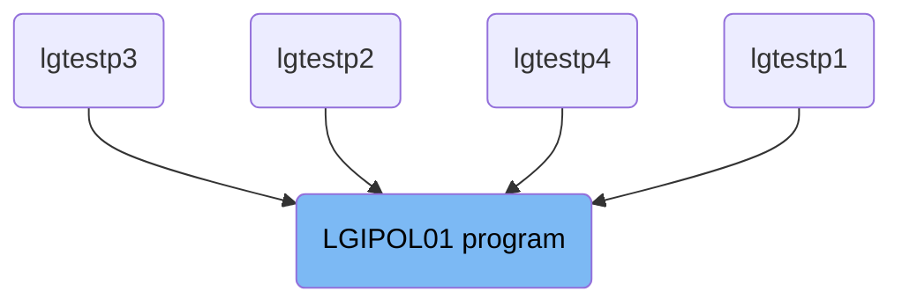
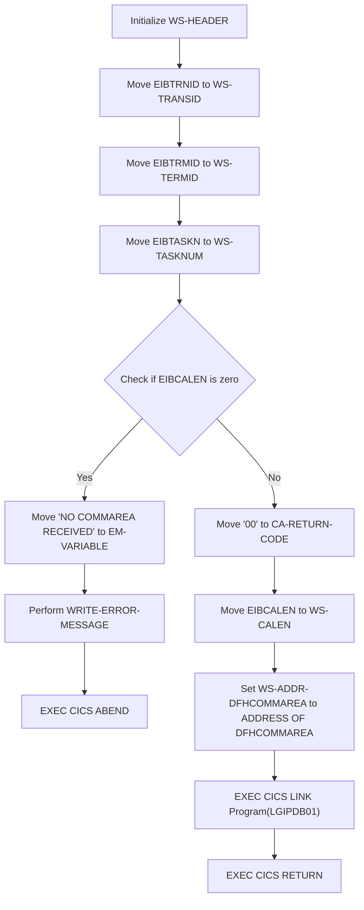

The <SwmToken path="base/src/lgipol01.cbl" pos="13:6:6" line-data="       PROGRAM-ID. LGIPOL01.">`LGIPOL01`</SwmToken> program is responsible for initializing transaction context, checking for communication area, and linking to the database program <SwmToken path="base/src/lgipol01.cbl" pos="91:9:9" line-data="           EXEC CICS LINK Program(LGIPDB01)">`LGIPDB01`</SwmToken>. It achieves this by moving necessary data from the Execute Interface Block (EIB) to working storage fields, verifying the presence of a communication area, and linking to the database program to perform operations related to insurance policy information.

The <SwmToken path="base/src/lgipol01.cbl" pos="13:6:6" line-data="       PROGRAM-ID. LGIPOL01.">`LGIPOL01`</SwmToken> program starts by setting up the transaction context using data from the EIB. It then checks if a communication area is present; if not, it logs an error and stops. If the communication area is present, it prepares it for further processing and links to the <SwmToken path="base/src/lgipol01.cbl" pos="91:9:9" line-data="           EXEC CICS LINK Program(LGIPDB01)">`LGIPDB01`</SwmToken> program to handle database operations. Finally, it returns control to the calling program or terminal.

# Where is this program used?

This program is used multiple times in the codebase as represented in the following diagram:



Lets' zoom into the flow:



<SwmSnippet path="/base/src/lgipol01.cbl" line="70">

---

## Initialization

First, the program initializes the <SwmToken path="base/src/lgipol01.cbl" pos="72:3:5" line-data="           INITIALIZE WS-HEADER.">`WS-HEADER`</SwmToken> and moves the transaction ID, terminal ID, and task number from the `EIB` (Execute Interface Block) to the respective working storage fields (<SwmToken path="base/src/lgipol01.cbl" pos="74:7:9" line-data="           MOVE EIBTRNID TO WS-TRANSID.">`WS-TRANSID`</SwmToken>, <SwmToken path="base/src/lgipol01.cbl" pos="75:7:9" line-data="           MOVE EIBTRMID TO WS-TERMID.">`WS-TERMID`</SwmToken>, <SwmToken path="base/src/lgipol01.cbl" pos="76:7:9" line-data="           MOVE EIBTASKN TO WS-TASKNUM.">`WS-TASKNUM`</SwmToken>). This sets up the necessary context for the transaction.

```cobol
       MAINLINE SECTION.
      *
           INITIALIZE WS-HEADER.
      *
           MOVE EIBTRNID TO WS-TRANSID.
           MOVE EIBTRMID TO WS-TERMID.
           MOVE EIBTASKN TO WS-TASKNUM.
```

---

</SwmSnippet>

<SwmSnippet path="/base/src/lgipol01.cbl" line="78">

---

## Checking for Commarea

Next, the program checks if the <SwmToken path="base/src/lgipol01.cbl" pos="79:3:3" line-data="           IF EIBCALEN IS EQUAL TO ZERO">`EIBCALEN`</SwmToken> (length of the communication area) is zero. If it is, it moves an error message to <SwmToken path="base/src/lgipol01.cbl" pos="80:14:16" line-data="               MOVE &#39; NO COMMAREA RECEIVED&#39; TO EM-VARIABLE">`EM-VARIABLE`</SwmToken>, performs the <SwmToken path="base/src/lgipol01.cbl" pos="81:3:7" line-data="               PERFORM WRITE-ERROR-MESSAGE">`WRITE-ERROR-MESSAGE`</SwmToken> procedure, and issues an <SwmToken path="base/src/lgipol01.cbl" pos="78:15:15" line-data="      * If NO commarea received issue an ABEND">`ABEND`</SwmToken> (abnormal end) with code 'LGCA'. This ensures that the program does not proceed without a valid communication area.

```cobol
      * If NO commarea received issue an ABEND
           IF EIBCALEN IS EQUAL TO ZERO
               MOVE ' NO COMMAREA RECEIVED' TO EM-VARIABLE
               PERFORM WRITE-ERROR-MESSAGE
               EXEC CICS ABEND ABCODE('LGCA') NODUMP END-EXEC
           END-IF
```

---

</SwmSnippet>

<SwmSnippet path="/base/src/lgipol01.cbl" line="85">

---

## Initializing Commarea Return Code

Then, the program initializes the communication area return code to '00', moves the length of the communication area to <SwmToken path="base/src/lgipol01.cbl" pos="87:7:9" line-data="           MOVE EIBCALEN TO WS-CALEN.">`WS-CALEN`</SwmToken>, and sets the address of <SwmToken path="base/src/lgipol01.cbl" pos="88:7:7" line-data="           SET WS-ADDR-DFHCOMMAREA TO ADDRESS OF DFHCOMMAREA.">`DFHCOMMAREA`</SwmToken> to <SwmToken path="base/src/lgipol01.cbl" pos="88:3:7" line-data="           SET WS-ADDR-DFHCOMMAREA TO ADDRESS OF DFHCOMMAREA.">`WS-ADDR-DFHCOMMAREA`</SwmToken>. This prepares the communication area for further processing.

```cobol
      * initialize commarea return code to zero
           MOVE '00' TO CA-RETURN-CODE
           MOVE EIBCALEN TO WS-CALEN.
           SET WS-ADDR-DFHCOMMAREA TO ADDRESS OF DFHCOMMAREA.
```

---

</SwmSnippet>

<SwmSnippet path="/base/src/lgipol01.cbl" line="91">

---

## Linking to Database Program

Moving to the next step, the program links to another CICS program <SwmToken path="base/src/lgipol01.cbl" pos="91:9:9" line-data="           EXEC CICS LINK Program(LGIPDB01)">`LGIPDB01`</SwmToken> using the <SwmToken path="base/src/lgipol01.cbl" pos="91:1:5" line-data="           EXEC CICS LINK Program(LGIPDB01)">`EXEC CICS LINK`</SwmToken> command, passing the communication area <SwmToken path="base/src/lgipol01.cbl" pos="92:3:3" line-data="               Commarea(DFHCOMMAREA)">`DFHCOMMAREA`</SwmToken> with a length of 32500. This step is crucial as it calls the database program to perform operations related to the insurance policy information.

More about LGIPDB01: <SwmLink doc-title="Retrieving Policy Information (LGIPDB01)">[Retrieving Policy Information (LGIPDB01)](/.swm/retrieving-policy-information-lgipdb01.q633bzop.sw.md)</SwmLink>

```cobol
           EXEC CICS LINK Program(LGIPDB01)
               Commarea(DFHCOMMAREA)
               Length(32500)
           END-EXEC.
```

---

</SwmSnippet>

<SwmSnippet path="/base/src/lgipol01.cbl" line="96">

---

## Returning Control

Finally, the program executes <SwmToken path="base/src/lgipol01.cbl" pos="96:1:5" line-data="           EXEC CICS RETURN END-EXEC.">`EXEC CICS RETURN`</SwmToken> to return control to the calling program or terminal. This marks the end of the mainline processing.

```cobol
           EXEC CICS RETURN END-EXEC.
```

---

</SwmSnippet>

&nbsp;

*This is an auto-generated document by Swimm 🌊 and has not yet been verified by a human*

<SwmMeta version="3.0.0" repo-id="Z2l0aHViJTNBJTNBa3luZHJ5bC1jaWNzLWdlbmFwcCUzQSUzQVN3aW1tLURlbW8=" repo-name="kyndryl-cics-genapp"><sup>Powered by [Swimm](https://app.swimm.io/)</sup></SwmMeta>
