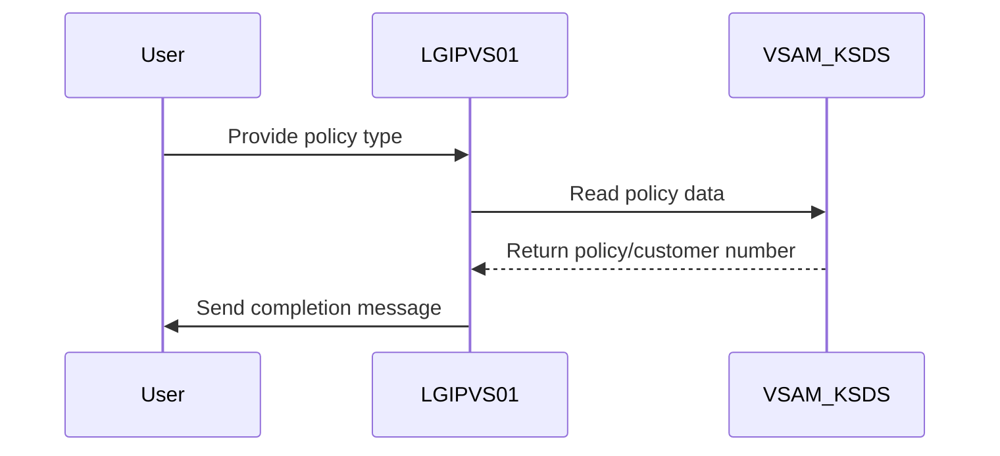

This document explains the <SwmToken path="base/src/lgipvs01.cbl" pos="13:6:6" line-data="       PROGRAM-ID. LGIPVS01.">`LGIPVS01`</SwmToken> program which retrieves a random policy/customer number based on the policy type. Within the insurance application, this program facilitates policy inquiries by accessing the VSAM KSDS Policy file and determining the key using the input policy type.

For example, if the input policy type is 'Auto', the program retrieves a random policy/customer number associated with auto insurance.

The main steps are:

- Initialize transaction context
- Determine transaction start method
- Read policy data using a generic key
- Validate policy type and read response
- Send completion message or prepare error message
- Return control to CICS



## Dependencies

# Initializing Transaction Context

<SwmSnippet path="/base/src/lgipvs01.cbl" line="75">

---

In <SwmToken path="base/src/lgipvs01.cbl" pos="75:1:1" line-data="       MAINLINE SECTION.">`MAINLINE`</SwmToken>, we start by assigning system ID, start code, and invoking program to understand the transaction's context and decide its flow.

```cobol
       MAINLINE SECTION.
      *
           MOVE SPACES TO WS-RECV.

           EXEC CICS ASSIGN SYSID(WS-SYSID)
                RESP(WS-RESP)
           END-EXEC.

           EXEC CICS ASSIGN STARTCODE(WS-STARTCODE)
                RESP(WS-RESP)
           END-EXEC.

           EXEC CICS ASSIGN Invokingprog(WS-Invokeprog)
                RESP(WS-RESP)
           END-EXEC.
```

---

</SwmSnippet>

<SwmSnippet path="/base/src/lgipvs01.cbl" line="90">

---

Here we check how the transaction started. If it's from a distributed program or another program, we set <SwmToken path="base/src/lgipvs01.cbl" pos="92:9:11" line-data="              MOVE &#39;C&#39; To WS-FLAG">`WS-FLAG`</SwmToken> to 'C' and prep the communication area. Otherwise, we use CICS RECEIVE to get terminal input, setting <SwmToken path="base/src/lgipvs01.cbl" pos="92:9:11" line-data="              MOVE &#39;C&#39; To WS-FLAG">`WS-FLAG`</SwmToken> to 'R'. This determines how we handle incoming data.

```cobol
           IF WS-STARTCODE(1:1) = 'D' or
              WS-Invokeprog Not = Spaces
              MOVE 'C' To WS-FLAG
              MOVE COMMA-DATA  TO WS-COMMAREA
              MOVE EIBCALEN    TO WS-RECV-LEN
              MOVE 11          TO WS-RECV-LEN
              SUBTRACT 1 FROM WS-RECV-LEN
           ELSE
              EXEC CICS RECEIVE INTO(WS-RECV)
                  LENGTH(WS-RECV-LEN)
                  RESP(WS-RESP)
              END-EXEC
              MOVE 'R' To WS-FLAG
              MOVE WS-RECV-DATA  TO WS-COMMAREA
              SUBTRACT 6 FROM WS-RECV-LEN
           END-IF.
```

---

</SwmSnippet>

<SwmSnippet path="/base/src/lgipvs01.cbl" line="107">

---

We read policy data from 'KSDSPOLY' into <SwmToken path="base/src/lgipvs01.cbl" pos="112:3:5" line-data="                     Into(CA-AREA)">`CA-AREA`</SwmToken> using a generic key.

```cobol
           Move Spaces                      To CA-Area
           Move WS-Commarea(1:1)            To Part-Key-Type
           Move WS-Commarea(2:WS-RECV-LEN)  To Part-Key-Num
      *
           Exec CICS Read File('KSDSPOLY')
                     Into(CA-AREA)
                     Length(F64)
                     Ridfld(PART-KEY)
                     KeyLength(F11)
                     Generic
                     RESP(WS-RESP)
                     GTEQ
           End-Exec.
```

---

</SwmSnippet>

<SwmSnippet path="/base/src/lgipvs01.cbl" line="126">

---

Here we validate the policy type and check the read response. If there's a mismatch or an error, we prep an error message. Otherwise, we get the key ready for the next message.

```cobol
           Else
             Move CA-Area to WRITE-MSG-Key
           End-If
```

---

</SwmSnippet>

<SwmSnippet path="/base/src/lgipvs01.cbl" line="130">

---

Finally, if <SwmToken path="base/src/lgipvs01.cbl" pos="130:3:5" line-data="           If WS-FLAG = &#39;R&#39; Then">`WS-FLAG`</SwmToken> is 'R', we send a completion message to the terminal. Regardless of the flag, we wrap up by returning control to CICS, marking the end of the transaction.

```cobol
           If WS-FLAG = 'R' Then
             EXEC CICS SEND TEXT FROM(WRITE-MSG)
              WAIT
              ERASE
              LENGTH(80)
              FREEKB
             END-EXEC
           Else
             Move Spaces          To COMMA-Data
             Move Write-Msg-Text  To COMMA-Data-Text
             Move Write-Msg-Key   To COMMA-Data-Key
           End-If.

           EXEC CICS RETURN
           END-EXEC.
```

---

</SwmSnippet>

&nbsp;

*This is an auto-generated document by Swimm 🌊 and has not yet been verified by a human*

<SwmMeta version="3.0.0" repo-id="Z2l0aHViJTNBJTNBa3luZHJ5bC1jaWNzLWdlbmFwcCUzQSUzQVN3aW1tLURlbW8=" repo-name="kyndryl-cics-genapp"><sup>Powered by [Swimm](/)</sup></SwmMeta>
