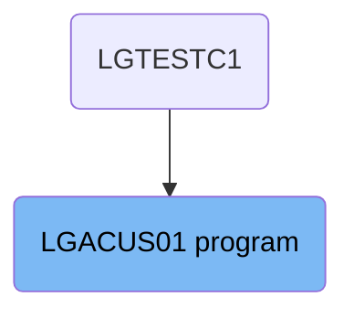

The <SwmToken path="base/src/lgacus01.cbl" pos="11:6:6" line-data="       PROGRAM-ID. LGACUS01.">`LGACUS01`</SwmToken> program is responsible for inserting customer details into the system. This is achieved by initializing the environment, handling the main menu display, evaluating user input, and preparing customer details for insertion into the Db2 database. The program calls the <SwmToken path="base/src/lgacus01.cbl" pos="58:3:3" line-data="       77  LGACDB01                    PIC X(8)       VALUE &#39;LGACDB01&#39;.">`LGACDB01`</SwmToken> program to add the new customer entry, including the customer's name, address, and date of birth.

The <SwmToken path="base/src/lgacus01.cbl" pos="11:6:6" line-data="       PROGRAM-ID. LGACUS01.">`LGACUS01`</SwmToken> program starts by setting up the environment and displaying the main menu. When a user chooses to insert a new customer, the program gathers the necessary details and calls the <SwmToken path="base/src/lgacus01.cbl" pos="58:3:3" line-data="       77  LGACDB01                    PIC X(8)       VALUE &#39;LGACDB01&#39;.">`LGACDB01`</SwmToken> program to save the information in the database.

# Where is this program used?

This program is used once, in a flow starting from `LGTESTC1` as represented in the following diagram:



Lets' zoom into the flow:

<SwmSnippet path="base/src/lgacus01.cbl" line="78">

---

## Inserting Customer Details

First, the <SwmToken path="base/src/lgacus01.cbl" pos="78:1:1" line-data="       MAINLINE SECTION.">`MAINLINE`</SwmToken> function initializes the environment and handles the main menu display. It then evaluates the user input to determine the next action. If the user opts to insert a new customer, the flow moves to the <SwmToken path="base/src/lgacus01.cbl" pos="119:3:5" line-data="           PERFORM INSERT-CUSTOMER.">`INSERT-CUSTOMER`</SwmToken> paragraph.

```
       MAINLINE SECTION.

      *----------------------------------------------------------------*
      * Common code                                                    *
      *----------------------------------------------------------------*
      * initialize working storage variables
           INITIALIZE WS-HEADER.
      * set up general variable
           MOVE EIBTRNID TO WS-TRANSID.
           MOVE EIBTRMID TO WS-TERMID.
           MOVE EIBTASKN TO WS-TASKNUM.
      *----------------------------------------------------------------*

      *----------------------------------------------------------------*
      * Process incoming commarea                                      *
      *----------------------------------------------------------------*
      * If NO commarea received issue an ABEND
           IF EIBCALEN IS EQUAL TO ZERO
               MOVE ' NO COMMAREA RECEIVED' TO EM-VARIABLE
               PERFORM WRITE-ERROR-MESSAGE
               EXEC CICS ABEND ABCODE('LGCA') NODUMP END-EXEC
           END-IF

      * initialize commarea return code to zero
           MOVE '00' TO CA-RETURN-CODE
           MOVE '00' TO CA-NUM-POLICIES
           MOVE EIBCALEN TO WS-CALEN.
           SET WS-ADDR-DFHCOMMAREA TO ADDRESS OF DFHCOMMAREA.

      * check commarea length
           ADD WS-CA-HEADER-LEN TO WS-REQUIRED-CA-LEN
           ADD WS-CUSTOMER-LEN  TO WS-REQUIRED-CA-LEN

      * if less set error return code and return to caller
           IF EIBCALEN IS LESS THAN WS-REQUIRED-CA-LEN
             MOVE '98' TO CA-RETURN-CODE
             EXEC CICS RETURN END-EXEC
           END-IF

      *----------------------------------------------------------------*
      * Call routine to Insert row in DB2 Customer table               *
           PERFORM INSERT-CUSTOMER.
```

---

</SwmSnippet>

<SwmSnippet path="base/src/lgacus01.cbl" line="132">

---

## Calling <SwmToken path="base/src/lgacus01.cbl" pos="58:3:3" line-data="       77  LGACDB01                    PIC X(8)       VALUE &#39;LGACDB01&#39;.">`LGACDB01`</SwmToken>

Next, within the <SwmToken path="base/src/lgacus01.cbl" pos="119:3:5" line-data="           PERFORM INSERT-CUSTOMER.">`INSERT-CUSTOMER`</SwmToken> paragraph, the program prepares the customer details and calls the <SwmToken path="base/src/lgacus01.cbl" pos="58:3:3" line-data="       77  LGACDB01                    PIC X(8)       VALUE &#39;LGACDB01&#39;.">`LGACDB01`</SwmToken> program. This program is responsible for adding the new customer entry to the Db2 database, including the customer's name, address, and date of birth.

More about <SwmToken path="base/src/lgacus01.cbl" pos="58:3:3" line-data="       77  LGACDB01                    PIC X(8)       VALUE &#39;LGACDB01&#39;.">`LGACDB01`</SwmToken>: <SwmLink doc-title="Managing Customer Information (LGACDB01)">[Managing Customer Information (LGACDB01)](/.swm/managing-customer-information-lgacdb01.z0s7skqm.sw.md)</SwmLink>

```
       INSERT-CUSTOMER.

           EXEC CICS LINK Program(LGACDB01)
                Commarea(DFHCOMMAREA)
                LENGTH(32500)
           END-EXEC.
```

---

</SwmSnippet>

&nbsp;

*This is an auto-generated document by Swimm 🌊 and has not yet been verified by a human*

<SwmMeta version="3.0.0" repo-id="Z2l0aHViJTNBJTNBa3luZHJ5bC1jaWNzLWdlbmFwcCUzQSUzQVN3aW1tLURlbW8=" repo-name="kyndryl-cics-genapp"><sup>Powered by [Swimm](https://app.swimm.io/)</sup></SwmMeta>
