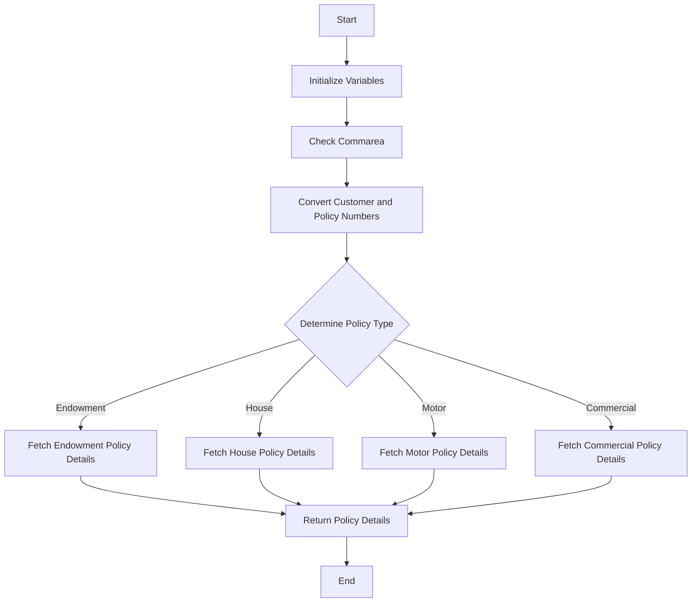

This document will cover the <SwmToken path="base/src/lgipdb01.cbl" pos="13:6:6" line-data="       PROGRAM-ID. LGIPDB01.">`LGIPDB01`</SwmToken> program defined in <SwmPath>[base/src/lgipdb01.cbl](base/src/lgipdb01.cbl)</SwmPath>. We'll cover:

1. What the Program Does
2. Program Flow
3. Program Sections

## What the Program Does

The <SwmToken path="base/src/lgipdb01.cbl" pos="13:6:6" line-data="       PROGRAM-ID. LGIPDB01.">`LGIPDB01`</SwmToken> program is designed to inquire about policy details for various types of insurance policies such as Endowment, House, Motor, and Commercial. It retrieves detailed information about a specific policy from the database based on the customer and policy numbers provided in the communication area (commarea). The program initializes necessary variables, checks the commarea, converts customer and policy numbers to <SwmToken path="base/src/lgipdb01.cbl" pos="242:5:5" line-data="      * initialize DB2 host variables">`DB2`</SwmToken> integer format, and then determines the type of policy requested. Depending on the policy type, it performs specific database queries to fetch the required policy details and returns them in the commarea.

## Program Flow

The program flow of <SwmToken path="base/src/lgipdb01.cbl" pos="13:6:6" line-data="       PROGRAM-ID. LGIPDB01.">`LGIPDB01`</SwmToken> is as follows:

1. Initialize working storage variables and <SwmToken path="base/src/lgipdb01.cbl" pos="242:5:5" line-data="      * initialize DB2 host variables">`DB2`</SwmToken> host variables.
2. Check the commarea and obtain required details.
3. Convert commarea customer and policy numbers to <SwmToken path="base/src/lgipdb01.cbl" pos="242:5:5" line-data="      * initialize DB2 host variables">`DB2`</SwmToken> integer format.
4. Determine the type of policy requested based on the request ID.
5. Perform specific database queries to fetch policy details based on the policy type.
6. Return the fetched policy details in the commarea.



<SwmSnippet path="/base/src/lgipdb01.cbl" line="230">

---

### MAINLINE SECTION

First, the MAINLINE SECTION initializes working storage variables and <SwmToken path="base/src/lgipdb01.cbl" pos="242:5:5" line-data="      * initialize DB2 host variables">`DB2`</SwmToken> host variables, checks the commarea, converts customer and policy numbers to <SwmToken path="base/src/lgipdb01.cbl" pos="242:5:5" line-data="      * initialize DB2 host variables">`DB2`</SwmToken> integer format, and determines the type of policy requested based on the request ID. It then performs specific database queries to fetch policy details based on the policy type and returns the fetched policy details in the commarea.

```cobol
       MAINLINE SECTION.

      *----------------------------------------------------------------*
      * Common code                                                    *
      *----------------------------------------------------------------*
      * initialize working storage variables
           INITIALIZE WS-HEADER.
      * set up general variable
           MOVE EIBTRNID TO WS-TRANSID.
           MOVE EIBTRMID TO WS-TERMID.
           MOVE EIBTASKN TO WS-TASKNUM.
      *----------------------------------------------------------------*
      * initialize DB2 host variables
           INITIALIZE DB2-IN-INTEGERS.
           INITIALIZE DB2-OUT-INTEGERS.
           INITIALIZE DB2-POLICY.

      *---------------------------------------------------------------*
      * Check commarea and obtain required details                    *
      *---------------------------------------------------------------*
      * If NO commarea received issue an ABEND
```

---

</SwmSnippet>

<SwmSnippet path="/base/src/lgipdb01.cbl" line="327">

---

### <SwmToken path="base/src/lgipdb01.cbl" pos="327:1:7" line-data="       GET-ENDOW-DB2-INFO.">`GET-ENDOW-DB2-INFO`</SwmToken>

Now, the <SwmToken path="base/src/lgipdb01.cbl" pos="327:1:7" line-data="       GET-ENDOW-DB2-INFO.">`GET-ENDOW-DB2-INFO`</SwmToken> section fetches details of an Endowment policy from the database. It calculates the size of the commarea required to return all data, checks if the commarea received is large enough, and moves the fetched data to the commarea.

```cobol
       GET-ENDOW-DB2-INFO.

           MOVE ' SELECT ENDOW ' TO EM-SQLREQ
           EXEC SQL
             SELECT  ISSUEDATE,
                     EXPIRYDATE,
                     LASTCHANGED,
                     BROKERID,
                     BROKERSREFERENCE,
                     PAYMENT,
                     WITHPROFITS,
                     EQUITIES,
                     MANAGEDFUND,
                     FUNDNAME,
                     TERM,
                     SUMASSURED,
                     LIFEASSURED,
                     PADDINGDATA,
                     LENGTH(PADDINGDATA)
             INTO  :DB2-ISSUEDATE,
                   :DB2-EXPIRYDATE,
```

---

</SwmSnippet>

<SwmSnippet path="/base/src/lgipdb01.cbl" line="441">

---

### <SwmToken path="base/src/lgipdb01.cbl" pos="441:1:7" line-data="       GET-HOUSE-DB2-INFO.">`GET-HOUSE-DB2-INFO`</SwmToken>

Then, the <SwmToken path="base/src/lgipdb01.cbl" pos="441:1:7" line-data="       GET-HOUSE-DB2-INFO.">`GET-HOUSE-DB2-INFO`</SwmToken> section fetches details of a House policy from the database. It calculates the size of the commarea required to return all data, checks if the commarea received is large enough, and moves the fetched data to the commarea.

```cobol
       GET-HOUSE-DB2-INFO.

           MOVE ' SELECT HOUSE ' TO EM-SQLREQ
           EXEC SQL
             SELECT  ISSUEDATE,
                     EXPIRYDATE,
                     LASTCHANGED,
                     BROKERID,
                     BROKERSREFERENCE,
                     PAYMENT,
                     PROPERTYTYPE,
                     BEDROOMS,
                     VALUE,
                     HOUSENAME,
                     HOUSENUMBER,
                     POSTCODE
             INTO  :DB2-ISSUEDATE,
                   :DB2-EXPIRYDATE,
                   :DB2-LASTCHANGED,
                   :DB2-BROKERID-INT INDICATOR :IND-BROKERID,
                   :DB2-BROKERSREF INDICATOR :IND-BROKERSREF,
```

---

</SwmSnippet>

<SwmSnippet path="/base/src/lgipdb01.cbl" line="529">

---

### <SwmToken path="base/src/lgipdb01.cbl" pos="529:1:7" line-data="       GET-MOTOR-DB2-INFO.">`GET-MOTOR-DB2-INFO`</SwmToken>

Going into the <SwmToken path="base/src/lgipdb01.cbl" pos="529:1:7" line-data="       GET-MOTOR-DB2-INFO.">`GET-MOTOR-DB2-INFO`</SwmToken> section, it fetches details of a Motor policy from the database. It calculates the size of the commarea required to return all data, checks if the commarea received is large enough, and moves the fetched data to the commarea.

```cobol
       GET-MOTOR-DB2-INFO.

           MOVE ' SELECT MOTOR ' TO EM-SQLREQ
           EXEC SQL
             SELECT  ISSUEDATE,
                     EXPIRYDATE,
                     LASTCHANGED,
                     BROKERID,
                     BROKERSREFERENCE,
                     PAYMENT,
                     MAKE,
                     MODEL,
                     VALUE,
                     REGNUMBER,
                     COLOUR,
                     CC,
                     YEAROFMANUFACTURE,
                     PREMIUM,
                     ACCIDENTS
             INTO  :DB2-ISSUEDATE,
                   :DB2-EXPIRYDATE,
```

---

</SwmSnippet>

<SwmSnippet path="/base/src/lgipdb01.cbl" line="627">

---

### <SwmToken path="base/src/lgipdb01.cbl" pos="627:1:9" line-data="       GET-Commercial-DB2-INFO-1.">`GET-Commercial-DB2-INFO-1`</SwmToken>

Next, the <SwmToken path="base/src/lgipdb01.cbl" pos="627:1:9" line-data="       GET-Commercial-DB2-INFO-1.">`GET-Commercial-DB2-INFO-1`</SwmToken> section fetches details of a Commercial policy from the database using the first method. It calculates the size of the commarea required to return all data, checks if the commarea received is large enough, and moves the fetched data to the commarea.

```cobol
       GET-Commercial-DB2-INFO-1.

           MOVE ' SELECT Commercial ' TO EM-SQLREQ

           EXEC SQL
             SELECT
                   RequestDate,
                   StartDate,
                   RenewalDate,
                   Address,
                   Zipcode,
                   LatitudeN,
                   LongitudeW,
                   Customer,
                   PropertyType,
                   FirePeril,
                   FirePremium,
                   CrimePeril,
                   CrimePremium,
                   FloodPeril,
                   FloodPremium,
```

---

</SwmSnippet>

<SwmSnippet path="/base/src/lgipdb01.cbl" line="730">

---

### <SwmToken path="base/src/lgipdb01.cbl" pos="730:1:9" line-data="       GET-Commercial-DB2-INFO-2.">`GET-Commercial-DB2-INFO-2`</SwmToken>

Then, the <SwmToken path="base/src/lgipdb01.cbl" pos="730:1:9" line-data="       GET-Commercial-DB2-INFO-2.">`GET-Commercial-DB2-INFO-2`</SwmToken> section fetches details of a Commercial policy from the database using the second method. It calculates the size of the commarea required to return all data, checks if the commarea received is large enough, and moves the fetched data to the commarea.

```cobol
       GET-Commercial-DB2-INFO-2.

           MOVE ' SELECT Commercial ' TO EM-SQLREQ

           EXEC SQL
             SELECT
                   CustomerNumber,
                   RequestDate,
                   StartDate,
                   RenewalDate,
                   Address,
                   Zipcode,
                   LatitudeN,
                   LongitudeW,
                   Customer,
                   PropertyType,
                   FirePeril,
                   FirePremium,
                   CrimePeril,
                   CrimePremium,
                   FloodPeril,
```

---

</SwmSnippet>

<SwmSnippet path="/base/src/lgipdb01.cbl" line="835">

---

### <SwmToken path="base/src/lgipdb01.cbl" pos="835:1:9" line-data="       GET-Commercial-DB2-INFO-3.">`GET-Commercial-DB2-INFO-3`</SwmToken>

Now, the <SwmToken path="base/src/lgipdb01.cbl" pos="835:1:9" line-data="       GET-Commercial-DB2-INFO-3.">`GET-Commercial-DB2-INFO-3`</SwmToken> section fetches details of a Commercial policy from the database using the third method. It uses a cursor to obtain matching customer policy records from the commercial table and moves the fetched data to the commarea.

```cobol
       GET-Commercial-DB2-INFO-3.

           MOVE ' SELECT Commercial ' TO EM-SQLREQ
           Move 0 To ICOM-Record-Count

           EXEC SQL
             OPEN Cust_Cursor
           END-EXEC.
           IF SQLCODE NOT EQUAL 0
             MOVE '89' TO CA-RETURN-CODE
             PERFORM WRITE-ERROR-MESSAGE
             PERFORM END-PROGRAM
           END-IF.

           Perform GET-Commercial-DB2-INFO-3-Cur
                     With Test after Until SQLCODE > 0

           EXEC SQL
             Close Cust_Cursor
           END-EXEC.
           IF SQLCODE NOT EQUAL 0
```

---

</SwmSnippet>

<SwmSnippet path="/base/src/lgipdb01.cbl" line="919">

---

### <SwmToken path="base/src/lgipdb01.cbl" pos="919:1:9" line-data="       GET-Commercial-DB2-INFO-5.">`GET-Commercial-DB2-INFO-5`</SwmToken>

Finally, the <SwmToken path="base/src/lgipdb01.cbl" pos="919:1:9" line-data="       GET-Commercial-DB2-INFO-5.">`GET-Commercial-DB2-INFO-5`</SwmToken> section fetches details of a Commercial policy from the database using the fifth method. It uses a cursor to obtain matching rows from the commercial table and moves the fetched data to the commarea.

```cobol
       GET-Commercial-DB2-INFO-5.

           MOVE ' SELECT Commercial ' TO EM-SQLREQ

           EXEC SQL
             OPEN Zip_Cursor
           END-EXEC.
           IF SQLCODE NOT EQUAL 0
             MOVE '89' TO CA-RETURN-CODE
             PERFORM WRITE-ERROR-MESSAGE
             PERFORM END-PROGRAM
           END-IF.

           Perform GET-Commercial-DB2-INFO-5-Cur
                     With Test after Until SQLCODE > 0

           EXEC SQL
             Close Zip_Cursor
           END-EXEC.
           IF SQLCODE NOT EQUAL 0
             MOVE '88' TO CA-RETURN-CODE
```

---

</SwmSnippet>

&nbsp;

*This is an auto-generated document by Swimm 🌊 and has not yet been verified by a human*

<SwmMeta version="3.0.0" repo-id="Z2l0aHViJTNBJTNBa3luZHJ5bC1jaWNzLWdlbmFwcCUzQSUzQVN3aW1tLURlbW8=" repo-name="kyndryl-cics-genapp"><sup>Powered by [Swimm](/)</sup></SwmMeta>
