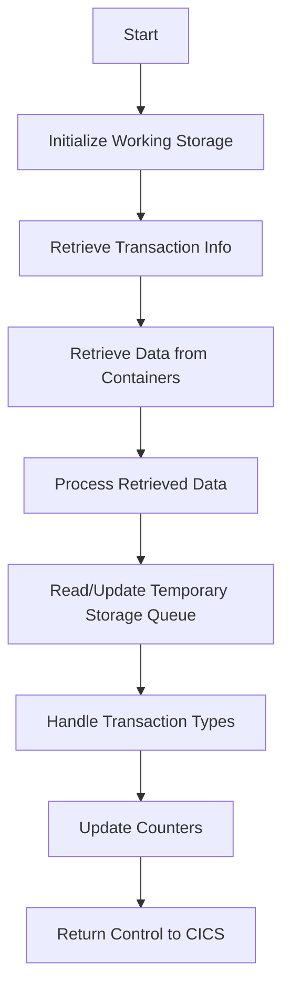

This document will cover the <SwmToken path="base/src/lgastat1.cbl" pos="7:6:6" line-data="       PROGRAM-ID. LGASTAT1.">`LGASTAT1`</SwmToken> program. We'll cover:

1. What the Program Does
2. Program Flow
3. Program Sections

## What the Program Does

The <SwmToken path="base/src/lgastat1.cbl" pos="7:6:6" line-data="       PROGRAM-ID. LGASTAT1.">`LGASTAT1`</SwmToken> program is designed to interact with CICS containers and temporary storage queues to retrieve and update transaction data. It initializes various working storage variables, retrieves data from CICS containers, processes the data, and updates a temporary storage queue with the current date and time if necessary. The program also handles specific transaction types and updates a counter in the CICS system.

## Program Flow

The program flow of <SwmToken path="base/src/lgastat1.cbl" pos="7:6:6" line-data="       PROGRAM-ID. LGASTAT1.">`LGASTAT1`</SwmToken> involves several key steps:

1. Initialize working storage variables.
2. Retrieve transaction and terminal information from the CICS environment.
3. Retrieve data from CICS containers.
4. Process the retrieved data and update working storage variables accordingly.
5. Read from a temporary storage queue and update it with the current date and time if it does not exist.
6. Handle specific transaction types and update counters.
7. Return control to CICS.



<SwmSnippet path="/base/src/lgastat1.cbl" line="67">

---

### MAINLINE SECTION

First, the program initializes the working storage header and moves transaction and terminal information from the CICS environment into working storage variables. It then retrieves data from two CICS containers and processes the data based on the response code. If the response code is normal, it moves the data into specific working storage variables. If the response code is not normal and the communication area length is zero, it returns control to CICS. Otherwise, it moves data from the communication area into working storage variables.

```cobol
       PROCEDURE DIVISION.

       MAINLINE SECTION.

      *
           INITIALIZE WS-HEADER.
      *
           MOVE EIBTRNID TO WS-TRANSID.
           MOVE EIBTRMID TO WS-TERMID.
           MOVE EIBTASKN TO WS-TASKNUM.
           MOVE EIBCALEN TO WS-CALEN.
      *
           Exec CICS Get Container(WS-CHANname1)
                         Into(WS-Data-Req)
                         Resp(WS-RESP)
           End-Exec.
      *
           Exec CICS Get Container(WS-CHANname2)
                         Into(WS-Data-RC)
                         Resp(WS-RESP)
           End-Exec.
```

---

</SwmSnippet>

<SwmSnippet path="/base/src/lgastat1.cbl" line="101">

---

Now, the program reads from a temporary storage queue. If the queue does not exist, it retrieves the current date and time, formats them, and writes them into the temporary storage queue.

```cobol
           Exec Cics ReadQ TS Queue(WS-Qname)
                     Into(WS-Qarea)
                     Length(Length of WS-Qarea)
                     Resp(WS-RESP)
           End-Exec.
           If WS-RESP     = DFHRESP(QIDERR) Then
             EXEC CICS ASKTIME ABSTIME(WS-ABSTIME)
             END-EXEC
             EXEC CICS FORMATTIME ABSTIME(WS-ABSTIME)
                       DDMMYYYY(WS-DATE)
                       TIME(WS-TIME)
             END-EXEC
             Move WS-Date To WS-area-D
             Move WS-Time To WS-area-T
             Exec Cics WriteQ TS Queue(WS-Qname)
                       From(WS-Qarea)
                       Length(Length of WS-Qarea)
                       Resp(WS-RESP)
             End-Exec
```

---

</SwmSnippet>

<SwmSnippet path="/base/src/lgastat1.cbl" line="122">

---

Then, the program handles specific transaction types by checking the value of the transaction counter and type. It updates the counter and type based on predefined conditions. Finally, it retrieves and updates a counter in the CICS system and returns control to CICS.

```cobol
           If GENAcounter = '02ACUS'
                                     Move '01ACUS' to GENAcounter.
           If GENAcounter = '02ICOM' or
              GENAcounter = '03ICOM' or
              GENAcounter = '05ICOM' Move '01ICOM' to GENAcounter.
           If GENAType Not = '00' Move '99' To GENAtype.

               Exec CICS Get Counter(GENAcount)
                             Pool(GENApool)
                             Value(Trancount)
                             Resp(WS-RESP)
               End-Exec

           EXEC CICS RETURN END-EXEC.
```

---

</SwmSnippet>

&nbsp;

*This is an auto-generated document by Swimm 🌊 and has not yet been verified by a human*

<SwmMeta version="3.0.0" repo-id="Z2l0aHViJTNBJTNBa3luZHJ5bC1jaWNzLWdlbmFwcCUzQSUzQVN3aW1tLURlbW8=" repo-name="kyndryl-cics-genapp"><sup>Powered by [Swimm](/)</sup></SwmMeta>
