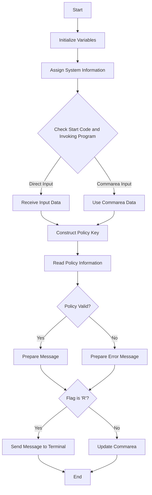

This document will cover the <SwmToken path="base/src/lgipvs01.cbl" pos="13:6:6" line-data="       PROGRAM-ID. LGIPVS01.">`LGIPVS01`</SwmToken> program. We'll cover:

1. What the Program Does
2. Program Flow
3. Program Sections

## What the Program Does

The <SwmToken path="base/src/lgipvs01.cbl" pos="13:6:6" line-data="       PROGRAM-ID. LGIPVS01.">`LGIPVS01`</SwmToken> program is designed to return a random <SwmToken path="base/src/lgipvs01.cbl" pos="7:15:17" line-data="      * This program will return a random Policy/customer number from  *">`Policy/customer`</SwmToken> number from the VSAM KSDS Policy file. The input parameter of policy type determines the key. The program reads the policy file and retrieves the policy information based on the provided key.

## Program Flow

The program starts by initializing the working storage variables and assigning system information. It then checks the start code and invoking program to determine the source of the input data. Based on this, it either receives the input data or uses the data from the communication area. The program then constructs the key for the policy file and reads the policy information. If the policy information is valid, it prepares the message to be sent back. Finally, it either sends the message back to the terminal or updates the communication area with the policy information.



<SwmSnippet path="/base/src/lgipvs01.cbl" line="72">

---

## Program Sections

First, the program begins with the MAINLINE SECTION, which is the main entry point of the program.

```cobol
       PROCEDURE DIVISION.

      *---------------------------------------------------------------*
       MAINLINE SECTION.
```

---

</SwmSnippet>

<SwmSnippet path="/base/src/lgipvs01.cbl" line="77">

---

Now, the program initializes the working storage variables and assigns system information such as SYSID, STARTCODE, and Invokingprog.

```cobol
           MOVE SPACES TO WS-RECV.

           EXEC CICS ASSIGN SYSID(WS-SYSID)
                RESP(WS-RESP)
           END-EXEC.

           EXEC CICS ASSIGN STARTCODE(WS-STARTCODE)
                RESP(WS-RESP)
           END-EXEC.

           EXEC CICS ASSIGN Invokingprog(WS-Invokeprog)
                RESP(WS-RESP)
           END-EXEC.
```

---

</SwmSnippet>

<SwmSnippet path="/base/src/lgipvs01.cbl" line="90">

---

Then, the program checks the start code and invoking program to determine the source of the input data. Based on this, it either receives the input data or uses the data from the communication area.

```cobol
           IF WS-STARTCODE(1:1) = 'D' or
              WS-Invokeprog Not = Spaces
              MOVE 'C' To WS-FLAG
              MOVE COMMA-DATA  TO WS-COMMAREA
              MOVE EIBCALEN    TO WS-RECV-LEN
              MOVE 11          TO WS-RECV-LEN
              SUBTRACT 1 FROM WS-RECV-LEN
           ELSE
              EXEC CICS RECEIVE INTO(WS-RECV)
                  LENGTH(WS-RECV-LEN)
                  RESP(WS-RESP)
              END-EXEC
              MOVE 'R' To WS-FLAG
              MOVE WS-RECV-DATA  TO WS-COMMAREA
              SUBTRACT 6 FROM WS-RECV-LEN
           END-IF.
```

---

</SwmSnippet>

<SwmSnippet path="/base/src/lgipvs01.cbl" line="107">

---

Going into the next step, the program constructs the key for the policy file using the input data.

```cobol
           Move Spaces                      To CA-Area
           Move WS-Commarea(1:1)            To Part-Key-Type
           Move WS-Commarea(2:WS-RECV-LEN)  To Part-Key-Num
      *
```

---

</SwmSnippet>

<SwmSnippet path="/base/src/lgipvs01.cbl" line="111">

---

Now, the program reads the policy information from the VSAM KSDS Policy file using the constructed key.

```cobol
           Exec CICS Read File('KSDSPOLY')
                     Into(CA-AREA)
                     Length(F64)
                     Ridfld(PART-KEY)
                     KeyLength(F11)
                     Generic
                     RESP(WS-RESP)
                     GTEQ
           End-Exec.
```

---

</SwmSnippet>

<SwmSnippet path="/base/src/lgipvs01.cbl" line="121">

---

Then, the program checks if the policy information is valid. If it is, it prepares the message with the policy information.

```cobol
           If CA-Policy-Type   Not = Part-Key-Type Or
              WS-RESP NOT          = DFHRESP(NORMAL)
             Move 'Policy Bad='   To Write-Msg-Text
             Move 13              To WRITE-Msg-CustNum
             Move 13              To WRITE-Msg-PolNum
           Else
             Move CA-Area to WRITE-MSG-Key
           End-If
```

---

</SwmSnippet>

<SwmSnippet path="/base/src/lgipvs01.cbl" line="130">

---

Next, the program checks the flag to determine if it should send the message back to the terminal or update the communication area with the policy information.

```cobol
           If WS-FLAG = 'R' Then
             EXEC CICS SEND TEXT FROM(WRITE-MSG)
              WAIT
              ERASE
              LENGTH(80)
              FREEKB
             END-EXEC
           Else
             Move Spaces          To COMMA-Data
             Move Write-Msg-Text  To COMMA-Data-Text
             Move Write-Msg-Key   To COMMA-Data-Key
           End-If.
```

---

</SwmSnippet>

<SwmSnippet path="/base/src/lgipvs01.cbl" line="143">

---

Finally, the program returns control to CICS.

```cobol
           EXEC CICS RETURN
           END-EXEC.
```

---

</SwmSnippet>

&nbsp;

*This is an auto-generated document by Swimm 🌊 and has not yet been verified by a human*

<SwmMeta version="3.0.0" repo-id="Z2l0aHViJTNBJTNBa3luZHJ5bC1jaWNzLWdlbmFwcCUzQSUzQVN3aW1tLURlbW8=" repo-name="kyndryl-cics-genapp"><sup>Powered by [Swimm](/)</sup></SwmMeta>
