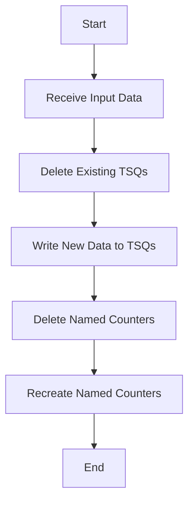

This document will cover the LGSETUP program defined in <SwmPath>[base/src/lgsetup.cbl](base/src/lgsetup.cbl)</SwmPath>. We'll cover:

1. What the Program Does
2. Program Flow
3. Program Sections

## What the Program Does

The LGSETUP program is designed to delete and recreate certain Temporary Storage Queues (TSQs) and Named Counters in a CICS environment. It ensures that the TSQs and counters are reset to match the restored state of the associated Db2 database. The program receives input data, deletes existing TSQs, writes new data to the TSQs, and then deletes and recreates the Named Counters with initial values.

## Program Flow

The program follows a structured flow to achieve its objectives. It starts by receiving input data, then proceeds to delete existing TSQs, writes new data to the TSQs, and finally deletes and recreates Named Counters with initial values.



<SwmSnippet path="/base/src/lgsetup.cbl" line="123">

---

## Program Sections

First, the program receives input data into the <SwmToken path="base/src/lgsetup.cbl" pos="128:9:11" line-data="           EXEC CICS RECEIVE INTO(WS-RECV)">`WS-RECV`</SwmToken> structure. If the length of the received data is greater than 5, it extracts the last customer number from the received data.

```cobol
       PROCEDURE DIVISION.

      *---------------------------------------------------------------*
       MAINLINE SECTION.
      *
           EXEC CICS RECEIVE INTO(WS-RECV)
               LENGTH(WS-RECV-LEN)
               RESP(WS-RESP)
           END-EXEC
           If WS-RECV-LEN > 5
             Subtract 5 From WS-RECV-LEN
             Move WS-RECV-DATA(1:WS-RECV-LEN)  To LastCustNum
           End-if
```

---

</SwmSnippet>

<SwmSnippet path="/base/src/lgsetup.cbl" line="138">

---

Now, the program deletes the existing TSQs named <SwmToken path="base/src/lgsetup.cbl" pos="58:17:17" line-data="       01  STSQ-ERRS                 PIC X(8)  Value &#39;GENAERRS&#39;.">`GENAERRS`</SwmToken>, <SwmToken path="base/src/lgsetup.cbl" pos="56:17:17" line-data="       01  STSQ-STRT                 PIC X(8)  Value &#39;GENASTRT&#39;.">`GENASTRT`</SwmToken>, <SwmToken path="base/src/lgsetup.cbl" pos="57:17:17" line-data="       01  STSQ-STAT                 PIC X(8)  Value &#39;GENASTAT&#39;.">`GENASTAT`</SwmToken>, and <SwmToken path="base/src/lgsetup.cbl" pos="5:7:7" line-data="      * Delete TSQ GENACNTL and put new low/high customer values       *">`GENACNTL`</SwmToken> using the <SwmToken path="base/src/lgsetup.cbl" pos="128:1:1" line-data="           EXEC CICS RECEIVE INTO(WS-RECV)">`EXEC`</SwmToken>` `<SwmToken path="base/src/lgsetup.cbl" pos="138:3:3" line-data="           Exec CICS DeleteQ TS Queue(STSQ-ERRS)">`CICS`</SwmToken>` DELETEQ `<SwmToken path="base/src/lgsetup.cbl" pos="138:7:7" line-data="           Exec CICS DeleteQ TS Queue(STSQ-ERRS)">`TS`</SwmToken> command.

```cobol
           Exec CICS DeleteQ TS Queue(STSQ-ERRS)
                     Resp(WS-RESP)
           End-Exec.
      **************************************************
           Exec CICS DeleteQ TS Queue(STSQ-STRT)
                     Resp(WS-RESP)
           End-Exec.
      **************************************************
           Exec CICS DeleteQ TS Queue(STSQ-STAT)
                     Resp(WS-RESP)
           End-Exec.
      **************************************************
           Exec CICS DeleteQ TS Queue(STSQ-NAME)
                     Resp(WS-RESP)
           End-Exec.
```

---

</SwmSnippet>

<SwmSnippet path="/base/src/lgsetup.cbl" line="154">

---

Then, the program writes new data to the TSQ <SwmToken path="base/src/lgsetup.cbl" pos="5:7:7" line-data="      * Delete TSQ GENACNTL and put new low/high customer values       *">`GENACNTL`</SwmToken>. It moves the first and last customer numbers to the <SwmToken path="base/src/lgsetup.cbl" pos="154:7:9" line-data="           Move FrstCustNum  to WRITE-MSG-LOW">`WRITE-MSG`</SwmToken> structure and writes three different messages to the TSQ using the <SwmToken path="base/src/lgsetup.cbl" pos="157:1:7" line-data="             EXEC CICS WRITEQ TS QUEUE(STSQ-NAME)">`EXEC CICS WRITEQ TS`</SwmToken> command.

```cobol
           Move FrstCustNum  to WRITE-MSG-LOW
           Move LastCustNum  to WRITE-MSG-HIGH

             EXEC CICS WRITEQ TS QUEUE(STSQ-NAME)
                       FROM(WRITE-MSG-E)
                       RESP(WS-RESP)
                       NOSUSPEND
                       LENGTH(20)
             END-EXEC

             EXEC CICS WRITEQ TS QUEUE(STSQ-NAME)
                       FROM(WRITE-MSG-L)
                       RESP(WS-RESP)
                       NOSUSPEND
                       LENGTH(23)
             END-EXEC

             EXEC CICS WRITEQ TS QUEUE(STSQ-NAME)
                       FROM(WRITE-MSG-H)
                       RESP(WS-RESP)
                       NOSUSPEND
```

---

</SwmSnippet>

<SwmSnippet path="/base/src/lgsetup.cbl" line="179">

---

Going into the next section, the program deletes and recreates the Named Counter <SwmToken path="base/src/lgsetup.cbl" pos="8:9:9" line-data="      * Recreate Named Counter GENACUSTNUM for next available customer *">`GENACUSTNUM`</SwmToken> with the last customer number as its initial value using the <SwmToken path="base/src/lgsetup.cbl" pos="128:1:1" line-data="           EXEC CICS RECEIVE INTO(WS-RECV)">`EXEC`</SwmToken>` `<SwmToken path="base/src/lgsetup.cbl" pos="179:3:3" line-data="           Exec CICS Delete Counter(GENAcount)">`CICS`</SwmToken>` DELETE COUNTER` and <SwmToken path="base/src/lgsetup.cbl" pos="128:1:1" line-data="           EXEC CICS RECEIVE INTO(WS-RECV)">`EXEC`</SwmToken>` `<SwmToken path="base/src/lgsetup.cbl" pos="179:3:3" line-data="           Exec CICS Delete Counter(GENAcount)">`CICS`</SwmToken>` DEFINE COUNTER` commands.

```cobol
           Exec CICS Delete Counter(GENAcount)
                            Pool(GENApool)
                            Resp(WS-RESP)
           End-Exec.
           Exec CICS Define Counter(GENAcount)
                            Pool(GENApool)
                            Value(LastCustNum)
                            Resp(WS-RESP)
           End-Exec.
```

---

</SwmSnippet>

<SwmSnippet path="/base/src/lgsetup.cbl" line="189">

---

Next, the program deletes and recreates a series of Named Counters (<SwmToken path="base/src/lgsetup.cbl" pos="189:9:9" line-data="           Exec CICS Delete Counter(GENACNT100)">`GENACNT100`</SwmToken> to <SwmToken path="base/src/lgsetup.cbl" pos="70:3:3" line-data="       01  GENACNT699                PIC X(16) Value &#39;GENA01UMOT99&#39;.">`GENACNT699`</SwmToken>) with an initial value of 0 using the <SwmToken path="base/src/lgsetup.cbl" pos="128:1:1" line-data="           EXEC CICS RECEIVE INTO(WS-RECV)">`EXEC`</SwmToken>` `<SwmToken path="base/src/lgsetup.cbl" pos="189:3:3" line-data="           Exec CICS Delete Counter(GENACNT100)">`CICS`</SwmToken>` DELETE COUNTER` and <SwmToken path="base/src/lgsetup.cbl" pos="128:1:1" line-data="           EXEC CICS RECEIVE INTO(WS-RECV)">`EXEC`</SwmToken>` `<SwmToken path="base/src/lgsetup.cbl" pos="189:3:3" line-data="           Exec CICS Delete Counter(GENACNT100)">`CICS`</SwmToken>` DEFINE COUNTER` commands.

```cobol
           Exec CICS Delete Counter(GENACNT100)
                            Pool(GENApool)
                            Resp(WS-RESP)
           End-Exec.
           Exec CICS Define Counter(GENACNT100)
                            Pool(GENApool)
                            Value(0)
                            Resp(WS-RESP)
           End-Exec.
           Exec CICS Delete Counter(GENACNT199)
                            Pool(GENApool)
                            Resp(WS-RESP)
           End-Exec.
           Exec CICS Define Counter(GENACNT199)
                            Pool(GENApool)
                            Value(0)
                            Resp(WS-RESP)
           End-Exec.
           Exec CICS Delete Counter(GENACNT200)
                            Pool(GENApool)
                            Resp(WS-RESP)
```

---

</SwmSnippet>

<SwmSnippet path="/base/src/lgsetup.cbl" line="299">

---

Finally, the program continues to delete and recreate the remaining Named Counters (<SwmToken path="base/src/lgsetup.cbl" pos="299:9:9" line-data="           Exec CICS Delete Counter(GENACNT700)">`GENACNT700`</SwmToken> to <SwmToken path="base/src/lgsetup.cbl" pos="94:3:3" line-data="       01  GENACNTI99                PIC X(16) Value &#39;GENA01UCUS99&#39;.">`GENACNTI99`</SwmToken>) with an initial value of 0 using the <SwmToken path="base/src/lgsetup.cbl" pos="128:1:1" line-data="           EXEC CICS RECEIVE INTO(WS-RECV)">`EXEC`</SwmToken>` `<SwmToken path="base/src/lgsetup.cbl" pos="299:3:3" line-data="           Exec CICS Delete Counter(GENACNT700)">`CICS`</SwmToken>` DELETE COUNTER` and <SwmToken path="base/src/lgsetup.cbl" pos="128:1:1" line-data="           EXEC CICS RECEIVE INTO(WS-RECV)">`EXEC`</SwmToken>` `<SwmToken path="base/src/lgsetup.cbl" pos="299:3:3" line-data="           Exec CICS Delete Counter(GENACNT700)">`CICS`</SwmToken>` DEFINE COUNTER` commands.

```cobol
           Exec CICS Delete Counter(GENACNT700)
                            Pool(GENApool)
                            Resp(WS-RESP)
           End-Exec.
           Exec CICS Define Counter(GENACNT700)
                            Pool(GENApool)
                            Value(0)
                            Resp(WS-RESP)
           End-Exec.
           Exec CICS Delete Counter(GENACNT799)
                            Pool(GENApool)
                            Resp(WS-RESP)
           End-Exec.
           Exec CICS Define Counter(GENACNT799)
                            Pool(GENApool)
                            Value(0)
                            Resp(WS-RESP)
           End-Exec.
           Exec CICS Delete Counter(GENACNT800)
                            Pool(GENApool)
                            Resp(WS-RESP)
```

---

</SwmSnippet>

&nbsp;

*This is an auto-generated document by Swimm 🌊 and has not yet been verified by a human*

<SwmMeta version="3.0.0" repo-id="Z2l0aHViJTNBJTNBa3luZHJ5bC1jaWNzLWdlbmFwcCUzQSUzQVN3aW1tLURlbW8=" repo-name="kyndryl-cics-genapp"><sup>Powered by [Swimm](/)</sup></SwmMeta>
