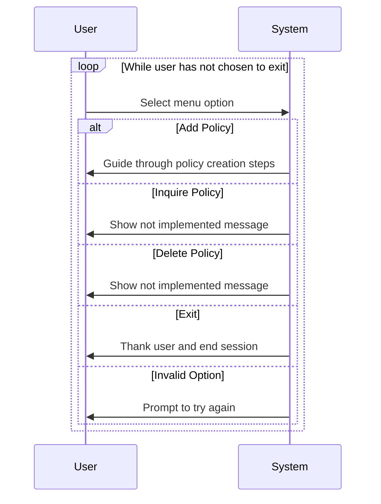
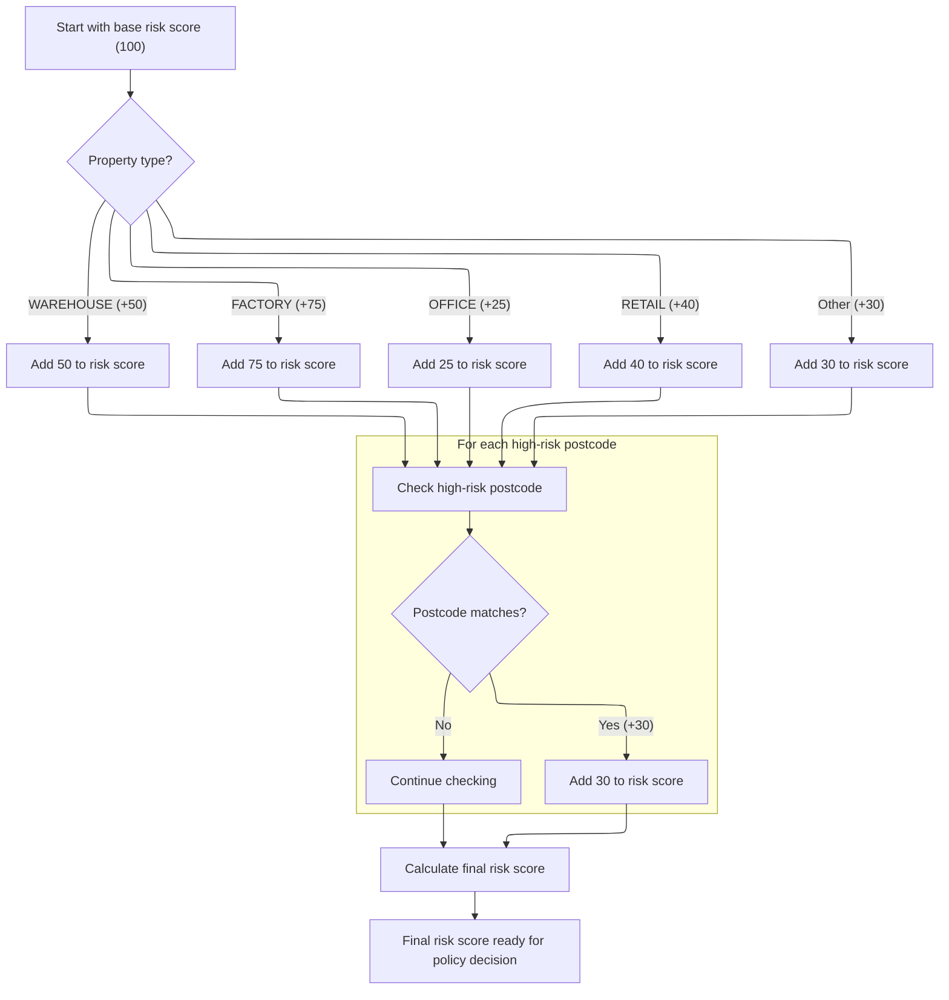
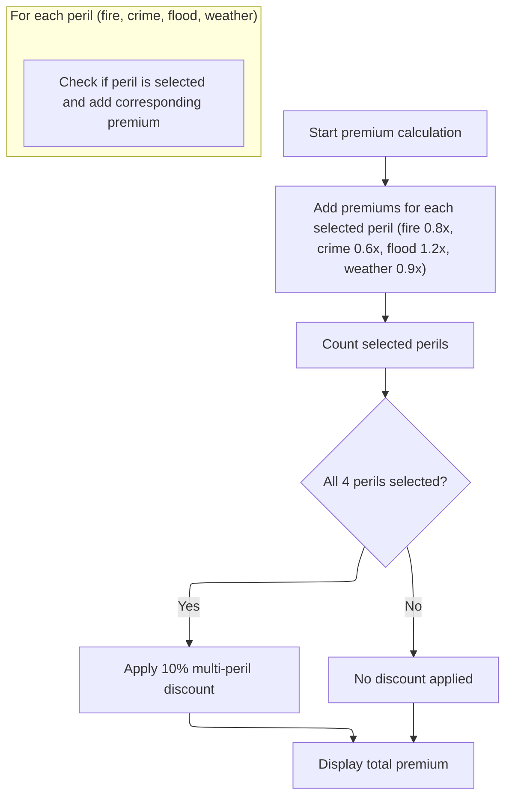
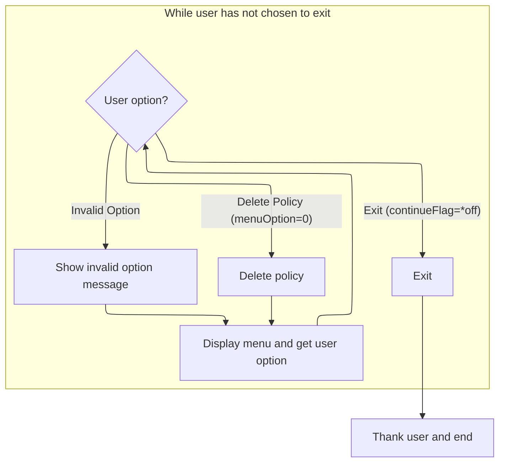

The main menu flow offers users a straightforward way to manage insurance policies by selecting from options to add, inquire, delete, or exit. When adding a policy, the system guides the user through entering property details, selecting perils, calculating risk and premium, determining policy status, storing the policy, and displaying a summary. Inquiry and deletion currently show placeholder messages. The menu continues to prompt the user until they choose to exit.



# Spec

## Detailed View of the Program's Functionality

### a. Menu Navigation and Entry Points

The program starts by initializing and entering a loop that displays a menu to the user. The menu offers options for policy inquiry, policy addition, policy deletion, and exit. The user is prompted to enter their choice. Based on the input:

- If the user selects policy inquiry, a message is displayed indicating that this feature is not implemented.
- If the user selects policy addition, the workflow for creating a new insurance policy begins.
- If the user selects policy deletion, a message is displayed indicating that this feature is not implemented.
- If the user selects exit, the loop ends and a thank you message is displayed.
- If the user enters an invalid option, an error message is shown and the menu is displayed again.

### b. Policy Creation Workflow

When the user chooses to add a new policy, the following sequence occurs:

1. A header is displayed indicating the start of the policy addition process for commercial property.
2. The program collects all necessary property details from the user, including customer number, property type, location details, and postcode.
3. The user is prompted to select which perils (Fire, Crime, Flood, Weather) they want to include in the policy. Each peril is represented by a character in a string, with '1' indicating inclusion.
4. The program calculates the risk assessment for the policy. This involves:
   - Starting with a base risk score.
   - Adding a risk value based on the property type (different property types have different risk increments).
   - Checking if the postcode is in a predefined list of high-risk postcodes; if so, an additional risk value is added.
   - The final risk score is computed and displayed, along with a breakdown of how it was calculated.
5. The premium for the policy is calculated:
   - For each selected peril, a specific multiplier is applied to a base premium to determine the peril's premium.
   - The premiums for all selected perils are summed.
   - If all four perils are selected, a 10% discount is applied to the total premium, and this is indicated to the user.
   - The total premium is displayed.
6. The policy status is determined based on the final risk score:
   - If the risk score is above a certain threshold, the policy requires manual review.
   - If the risk score is in a middle range, the policy is marked as pending review.
   - If the risk score is low, the policy is auto-approved.
   - The status is displayed to the user.
7. The policy data is "stored" (in this implementation, this is simulated by displaying messages about writing to a database and a file).
8. A summary of the policy is displayed, showing all the details collected and calculated, including customer information, property details, selected perils, risk score, premium, discount status, and policy status.

### c. Property Data Entry and Peril Selection

During property data entry:

- The user is prompted for the customer number, property type (with allowed values), location details, and postcode.
- After entering these details, the user is asked about each peril in turn (Fire, Crime, Flood, Weather), responding with 'Y' or 'N' to indicate whether to include each peril.
- The selection is stored in a string where each position corresponds to a peril.

### d. Risk and Premium Calculation

Risk assessment is performed as follows:

- The process starts with a base risk score.
- A risk increment is added based on the property type.
- The postcode is checked against a list of high-risk postcodes; if it matches, an additional risk increment is added.
- The final risk score is the sum of these components, and a breakdown is displayed.

Premium calculation is performed as follows:

- For each selected peril, a specific multiplier is applied to the base premium to calculate the peril's premium.
- The premiums for all selected perils are summed to get the total premium.
- If all four perils are selected, a 10% discount is applied to the total premium, and this is indicated to the user.
- The total premium is displayed.

### e. Policy Status and Storage

Policy status is determined by the final risk score:

- If the score is above 200, the policy requires manual review.
- If the score is between 151 and 200, the policy is pending review.
- If the score is 150 or below, the policy is auto-approved.
- The status is displayed.

Policy data storage is simulated by displaying messages about writing to a database and a file. No actual storage occurs in this implementation.

A summary of the policy is then displayed, showing all relevant details, including customer number, property type, location, postcode, selected perils, risk score, premium, discount status, and policy status.

### f. Policy Deletion and Exit

If the user selects the policy deletion option, a message is displayed indicating that this feature is not implemented.

If the user selects exit, the loop ends and a thank you message is displayed.

If the user enters an invalid option, an error message is shown and the menu is displayed again. The program continues to loop until the user chooses to exit.# Key Functionality

# Rule Definition

| Location in Code                                                                                                                                                                                                                                                                                                                                                                                                                                                                                                                                                                                                         | Rule ID | Rule Category     | Description                                                                                                                                                                                                                                                                                                                                                                                                                                                                                                                                                                                                                                                                                                                                                                                                                                                                                                                                                                                                                                                                                                                                                                                                                                                                                                                                                                                                                                                                                                                                                                                                                                                                                                            | Conditions                                                                                                                                                                                                                                                                             | Remarks                                                                                                                                                                                                                                                                                                                                                                                                                                                                                                                                                                                                                                                                                                                                                                                                                                                                                                                                                                                                                                                                                                                                                                                                                                                                                                                                                                                                                                                                                                                                                                                                                                                                                                                                                                                                                                                                                                                                                                                                                                                                                                                                                                                                                                                                                                                                                                                                                                                                                                                                                                                                                                                                                                                                                                                                                                                                                                                                                                                                                                                                                                                                                                                                                                                                                                                                                                                                                                                                                                                                                                                                                                                                                                                                                                                                                                                                                                                                           |
| ------------------------------------------------------------------------------------------------------------------------------------------------------------------------------------------------------------------------------------------------------------------------------------------------------------------------------------------------------------------------------------------------------------------------------------------------------------------------------------------------------------------------------------------------------------------------------------------------------------------------ | ------- | ----------------- | ---------------------------------------------------------------------------------------------------------------------------------------------------------------------------------------------------------------------------------------------------------------------------------------------------------------------------------------------------------------------------------------------------------------------------------------------------------------------------------------------------------------------------------------------------------------------------------------------------------------------------------------------------------------------------------------------------------------------------------------------------------------------------------------------------------------------------------------------------------------------------------------------------------------------------------------------------------------------------------------------------------------------------------------------------------------------------------------------------------------------------------------------------------------------------------------------------------------------------------------------------------------------------------------------------------------------------------------------------------------------------------------------------------------------------------------------------------------------------------------------------------------------------------------------------------------------------------------------------------------------------------------------------------------------------------------------------------------------- | -------------------------------------------------------------------------------------------------------------------------------------------------------------------------------------------------------------------------------------------------------------------------------------- | ------------------------------------------------------------------------------------------------------------------------------------------------------------------------------------------------------------------------------------------------------------------------------------------------------------------------------------------------------------------------------------------------------------------------------------------------------------------------------------------------------------------------------------------------------------------------------------------------------------------------------------------------------------------------------------------------------------------------------------------------------------------------------------------------------------------------------------------------------------------------------------------------------------------------------------------------------------------------------------------------------------------------------------------------------------------------------------------------------------------------------------------------------------------------------------------------------------------------------------------------------------------------------------------------------------------------------------------------------------------------------------------------------------------------------------------------------------------------------------------------------------------------------------------------------------------------------------------------------------------------------------------------------------------------------------------------------------------------------------------------------------------------------------------------------------------------------------------------------------------------------------------------------------------------------------------------------------------------------------------------------------------------------------------------------------------------------------------------------------------------------------------------------------------------------------------------------------------------------------------------------------------------------------------------------------------------------------------------------------------------------------------------------------------------------------------------------------------------------------------------------------------------------------------------------------------------------------------------------------------------------------------------------------------------------------------------------------------------------------------------------------------------------------------------------------------------------------------------------------------------------------------------------------------------------------------------------------------------------------------------------------------------------------------------------------------------------------------------------------------------------------------------------------------------------------------------------------------------------------------------------------------------------------------------------------------------------------------------------------------------------------------------------------------------------------------------------------------------------------------------------------------------------------------------------------------------------------------------------------------------------------------------------------------------------------------------------------------------------------------------------------------------------------------------------------------------------------------------------------------------------------------------------------------------------------------------- |
| main, <SwmToken path="/src.rpgle" pos="63:1:1" line-data="    displayMenu();" repo-id="Z2l0aHViJTNBJTNBa3luZHJ5bC1jaWNzLWdlbmFwcCUzQSUzQVN3aW1tLURlbW8=" repo-name="rpgle-demo">`displayMenu`</SwmToken>, <SwmToken path="/src.rpgle" pos="64:5:5" line-data="    menuOption = getMenuOption();" repo-id="Z2l0aHViJTNBJTNBa3luZHJ5bC1jaWNzLWdlbmFwcCUzQSUzQVN3aW1tLURlbW8=" repo-name="rpgle-demo">`getMenuOption`</SwmToken>                                                                                                                                                                                            | RL-001  | Conditional Logic | The program displays a main menu with options for Policy Inquiry, Policy Add, Policy Delete, and Exit. The user must enter a single digit (0-3) to select an option. If an invalid option is entered, the user is prompted to try again.                                                                                                                                                                                                                                                                                                                                                                                                                                                                                                                                                                                                                                                                                                                                                                                                                                                                                                                                                                                                                                                                                                                                                                                                                                                                                                                                                                                                                                                                               | Program is started; user is at the main menu.                                                                                                                                                                                                                                          | Menu options: 1 (Policy Inquiry), 2 (Policy Add), 3 (Policy Delete), 0 (Exit). Input is a single digit (0-3). Output is plain text.                                                                                                                                                                                                                                                                                                                                                                                                                                                                                                                                                                                                                                                                                                                                                                                                                                                                                                                                                                                                                                                                                                                                                                                                                                                                                                                                                                                                                                                                                                                                                                                                                                                                                                                                                                                                                                                                                                                                                                                                                                                                                                                                                                                                                                                                                                                                                                                                                                                                                                                                                                                                                                                                                                                                                                                                                                                                                                                                                                                                                                                                                                                                                                                                                                                                                                                                                                                                                                                                                                                                                                                                                                                                                                                                                                                                               |
| <SwmToken path="/src.rpgle" pos="70:1:1" line-data="        policyAdd();" repo-id="Z2l0aHViJTNBJTNBa3luZHJ5bC1jaWNzLWdlbmFwcCUzQSUzQVN3aW1tLURlbW8=" repo-name="rpgle-demo">`policyAdd`</SwmToken>, <SwmToken path="/src.rpgle" pos="132:1:1" line-data="  getPropertyDetails();" repo-id="Z2l0aHViJTNBJTNBa3luZHJ5bC1jaWNzLWdlbmFwcCUzQSUzQVN3aW1tLURlbW8=" repo-name="rpgle-demo">`getPropertyDetails`</SwmToken>, <SwmToken path="/src.rpgle" pos="158:1:1" line-data="  selectPerils();" repo-id="Z2l0aHViJTNBJTNBa3luZHJ5bC1jaWNzLWdlbmFwcCUzQSUzQVN3aW1tLURlbW8=" repo-name="rpgle-demo">`selectPerils`</SwmToken> | RL-002  | Data Assignment   | When adding a policy, the program collects customer number, property type, location details, and postcode. It then prompts the user to select coverage for each peril (Fire, Crime, Flood, Weather) with <SwmToken path="/src.rpgle" pos="171:12:14" line-data="  dsply &#39;Include Fire coverage? (Y/N): &#39; &#39;&#39; input;" repo-id="Z2l0aHViJTNBJTNBa3luZHJ5bC1jaWNzLWdlbmFwcCUzQSUzQVN3aW1tLURlbW8=" repo-name="rpgle-demo">`Y/N`</SwmToken> questions. The selected perils are encoded as a 4-character string, with '1' for selected and '0' for not selected, in the order: Fire, Crime, Flood, Weather.                                                                                                                                                                                                                                                                                                                                                                                                                                                                                                                                                                                                                                                                                                                                                                                                                                                                                                                                                                                                                                                                                                  | User selects Policy Add from the main menu.                                                                                                                                                                                                                                            | <SwmToken path="/src.rpgle" pos="147:3:3" line-data="  gData.customerNumber = %trim(input);" repo-id="Z2l0aHViJTNBJTNBa3luZHJ5bC1jaWNzLWdlbmFwcCUzQSUzQVN3aW1tLURlbW8=" repo-name="rpgle-demo">`customerNumber`</SwmToken>: string (max 10 chars), <SwmToken path="/src.rpgle" pos="150:3:3" line-data="  gData.propertyType = %upper(%trim(input));" repo-id="Z2l0aHViJTNBJTNBa3luZHJ5bC1jaWNzLWdlbmFwcCUzQSUzQVN3aW1tLURlbW8=" repo-name="rpgle-demo">`propertyType`</SwmToken>: string (WAREHOUSE, FACTORY, OFFICE, RETAIL, case-insensitive), <SwmToken path="/src.rpgle" pos="153:3:3" line-data="  gData.locationDetails = %trim(input);" repo-id="Z2l0aHViJTNBJTNBa3luZHJ5bC1jaWNzLWdlbmFwcCUzQSUzQVN3aW1tLURlbW8=" repo-name="rpgle-demo">`locationDetails`</SwmToken>: string (max 100 chars), postcode: string (max 10 chars, case-insensitive). <SwmToken path="/src.rpgle" pos="169:3:3" line-data="  gData.selectedPerils = &#39;0000&#39;;" repo-id="Z2l0aHViJTNBJTNBa3luZHJ5bC1jaWNzLWdlbmFwcCUzQSUzQVN3aW1tLURlbW8=" repo-name="rpgle-demo">`selectedPerils`</SwmToken>: 4-character string, each character is '1' or '0' (order: Fire, Crime, Flood, Weather).                                                                                                                                                                                                                                                                                                                                                                                                                                                                                                                                                                                                                                                                                                                                                                                                                                                                                                                                                                                                                                                                                                                                                                                                                                                                                                                                                                                                                                                                                                                                                                                                                                                                                                                                                                                                                                                                                                                                                                                                                                                                                                                                                                                                                                                                                                                                                                                                                                                                                                                                                                                                                                                                                                                                                                   |
| <SwmToken path="/src.rpgle" pos="133:1:1" line-data="  calculateRiskAssessment();" repo-id="Z2l0aHViJTNBJTNBa3luZHJ5bC1jaWNzLWdlbmFwcCUzQSUzQVN3aW1tLURlbW8=" repo-name="rpgle-demo">`calculateRiskAssessment`</SwmToken>, <SwmToken path="/src.rpgle" pos="220:1:1" line-data="  checkHighRiskLocation();" repo-id="Z2l0aHViJTNBJTNBa3luZHJ5bC1jaWNzLWdlbmFwcCUzQSUzQVN3aW1tLURlbW8=" repo-name="rpgle-demo">`checkHighRiskLocation`</SwmToken>                                                                                                                                                                         | RL-003  | Computation       | The risk assessment is calculated by starting with a base risk score of <SwmToken path="/src.rpgle" pos="32:12:14" line-data="  baseRiskScore packed(5:2) inz(100.00);" repo-id="Z2l0aHViJTNBJTNBa3luZHJ5bC1jaWNzLWdlbmFwcCUzQSUzQVN3aW1tLURlbW8=" repo-name="rpgle-demo">`100.00`</SwmToken>, adding a property type risk (based on property type), and adding a location risk if the postcode matches any in the high-risk postcode array. The final risk score is the sum of these components.                                                                                                                                                                                                                                                                                                                                                                                                                                                                                                                                                                                                                                                                                                                                                                                                                                                                                                                                                                                                                                                                                                                                                                                                                      | Policy data has been collected, including property type and postcode.                                                                                                                                                                                                                  | <SwmToken path="/src.rpgle" pos="201:9:9" line-data="  gData.finalRiskScore = gData.baseRiskScore;" repo-id="Z2l0aHViJTNBJTNBa3luZHJ5bC1jaWNzLWdlbmFwcCUzQSUzQVN3aW1tLURlbW8=" repo-name="rpgle-demo">`baseRiskScore`</SwmToken>: <SwmToken path="/src.rpgle" pos="32:12:14" line-data="  baseRiskScore packed(5:2) inz(100.00);" repo-id="Z2l0aHViJTNBJTNBa3luZHJ5bC1jaWNzLWdlbmFwcCUzQSUzQVN3aW1tLURlbW8=" repo-name="rpgle-demo">`100.00`</SwmToken> (decimal 5,2). <SwmToken path="/src.rpgle" pos="206:3:3" line-data="      gData.propertyRisk = 50.00;" repo-id="Z2l0aHViJTNBJTNBa3luZHJ5bC1jaWNzLWdlbmFwcCUzQSUzQVN3aW1tLURlbW8=" repo-name="rpgle-demo">`propertyRisk`</SwmToken>: WAREHOUSE +<SwmToken path="/src.rpgle" pos="206:7:9" line-data="      gData.propertyRisk = 50.00;" repo-id="Z2l0aHViJTNBJTNBa3luZHJ5bC1jaWNzLWdlbmFwcCUzQSUzQVN3aW1tLURlbW8=" repo-name="rpgle-demo">`50.00`</SwmToken>, FACTORY +<SwmToken path="/src.rpgle" pos="208:7:9" line-data="      gData.propertyRisk = 75.00;" repo-id="Z2l0aHViJTNBJTNBa3luZHJ5bC1jaWNzLWdlbmFwcCUzQSUzQVN3aW1tLURlbW8=" repo-name="rpgle-demo">`75.00`</SwmToken>, OFFICE +<SwmToken path="/src.rpgle" pos="210:7:9" line-data="      gData.propertyRisk = 25.00;" repo-id="Z2l0aHViJTNBJTNBa3luZHJ5bC1jaWNzLWdlbmFwcCUzQSUzQVN3aW1tLURlbW8=" repo-name="rpgle-demo">`25.00`</SwmToken>, RETAIL +<SwmToken path="/src.rpgle" pos="212:7:9" line-data="      gData.propertyRisk = 40.00;" repo-id="Z2l0aHViJTNBJTNBa3luZHJ5bC1jaWNzLWdlbmFwcCUzQSUzQVN3aW1tLURlbW8=" repo-name="rpgle-demo">`40.00`</SwmToken>, other +<SwmToken path="/src.rpgle" pos="214:7:9" line-data="      gData.propertyRisk = 30.00; // Default" repo-id="Z2l0aHViJTNBJTNBa3luZHJ5bC1jaWNzLWdlbmFwcCUzQSUzQVN3aW1tLURlbW8=" repo-name="rpgle-demo">`30.00`</SwmToken>. <SwmToken path="/src.rpgle" pos="222:9:9" line-data="  gData.finalRiskScore += gData.locationRisk;" repo-id="Z2l0aHViJTNBJTNBa3luZHJ5bC1jaWNzLWdlbmFwcCUzQSUzQVN3aW1tLURlbW8=" repo-name="rpgle-demo">`locationRisk`</SwmToken>: +<SwmToken path="/src.rpgle" pos="214:7:9" line-data="      gData.propertyRisk = 30.00; // Default" repo-id="Z2l0aHViJTNBJTNBa3luZHJ5bC1jaWNzLWdlbmFwcCUzQSUzQVN3aW1tLURlbW8=" repo-name="rpgle-demo">`30.00`</SwmToken> if postcode matches any in <SwmToken path="/src.rpgle" pos="239:14:14" line-data="  for i = 1 to %elem(highRiskPostcodes);" repo-id="Z2l0aHViJTNBJTNBa3luZHJ5bC1jaWNzLWdlbmFwcCUzQSUzQVN3aW1tLURlbW8=" repo-name="rpgle-demo">`highRiskPostcodes`</SwmToken> (up to 10 strings, each max 10 chars), else <SwmToken path="/src.rpgle" pos="237:7:9" line-data="  gData.locationRisk = 0.00;" repo-id="Z2l0aHViJTNBJTNBa3luZHJ5bC1jaWNzLWdlbmFwcCUzQSUzQVN3aW1tLURlbW8=" repo-name="rpgle-demo">`0.00`</SwmToken>. <SwmToken path="/src.rpgle" pos="201:3:3" line-data="  gData.finalRiskScore = gData.baseRiskScore;" repo-id="Z2l0aHViJTNBJTNBa3luZHJ5bC1jaWNzLWdlbmFwcCUzQSUzQVN3aW1tLURlbW8=" repo-name="rpgle-demo">`finalRiskScore`</SwmToken>: sum of <SwmToken path="/src.rpgle" pos="201:9:9" line-data="  gData.finalRiskScore = gData.baseRiskScore;" repo-id="Z2l0aHViJTNBJTNBa3luZHJ5bC1jaWNzLWdlbmFwcCUzQSUzQVN3aW1tLURlbW8=" repo-name="rpgle-demo">`baseRiskScore`</SwmToken>, <SwmToken path="/src.rpgle" pos="206:3:3" line-data="      gData.propertyRisk = 50.00;" repo-id="Z2l0aHViJTNBJTNBa3luZHJ5bC1jaWNzLWdlbmFwcCUzQSUzQVN3aW1tLURlbW8=" repo-name="rpgle-demo">`propertyRisk`</SwmToken>, <SwmToken path="/src.rpgle" pos="222:9:9" line-data="  gData.finalRiskScore += gData.locationRisk;" repo-id="Z2l0aHViJTNBJTNBa3luZHJ5bC1jaWNzLWdlbmFwcCUzQSUzQVN3aW1tLURlbW8=" repo-name="rpgle-demo">`locationRisk`</SwmToken>.                                                                                                                                                                                                              |
| <SwmToken path="/src.rpgle" pos="134:1:1" line-data="  calculatePremium();" repo-id="Z2l0aHViJTNBJTNBa3luZHJ5bC1jaWNzLWdlbmFwcCUzQSUzQVN3aW1tLURlbW8=" repo-name="rpgle-demo">`calculatePremium`</SwmToken>, <SwmToken path="/src.rpgle" pos="282:1:1" line-data="  checkMultiPerilDiscount();" repo-id="Z2l0aHViJTNBJTNBa3luZHJ5bC1jaWNzLWdlbmFwcCUzQSUzQVN3aW1tLURlbW8=" repo-name="rpgle-demo">`checkMultiPerilDiscount`</SwmToken>                                                                                                                                                                                   | RL-004  | Computation       | The base premium is <SwmToken path="/src.rpgle" pos="40:12:14" line-data="  basePremium packed(9:2) inz(1000.00);" repo-id="Z2l0aHViJTNBJTNBa3luZHJ5bC1jaWNzLWdlbmFwcCUzQSUzQVN3aW1tLURlbW8=" repo-name="rpgle-demo">`1000.00`</SwmToken>. For each selected peril, the peril premium is calculated by multiplying the base premium by the peril's multiplier (Fire: <SwmToken path="/src.rpgle" pos="258:13:15" line-data="    gData.firePremium = gData.basePremium * 0.8;" repo-id="Z2l0aHViJTNBJTNBa3luZHJ5bC1jaWNzLWdlbmFwcCUzQSUzQVN3aW1tLURlbW8=" repo-name="rpgle-demo">`0.8`</SwmToken>, Crime: <SwmToken path="/src.rpgle" pos="264:13:15" line-data="    gData.crimePremium = gData.basePremium * 0.6;" repo-id="Z2l0aHViJTNBJTNBa3luZHJ5bC1jaWNzLWdlbmFwcCUzQSUzQVN3aW1tLURlbW8=" repo-name="rpgle-demo">`0.6`</SwmToken>, Flood: <SwmToken path="/src.rpgle" pos="270:13:15" line-data="    gData.floodPremium = gData.basePremium * 1.2;" repo-id="Z2l0aHViJTNBJTNBa3luZHJ5bC1jaWNzLWdlbmFwcCUzQSUzQVN3aW1tLURlbW8=" repo-name="rpgle-demo">`1.2`</SwmToken>, Weather: <SwmToken path="/src.rpgle" pos="276:13:15" line-data="    gData.weatherPremium = gData.basePremium * 0.9;" repo-id="Z2l0aHViJTNBJTNBa3luZHJ5bC1jaWNzLWdlbmFwcCUzQSUzQVN3aW1tLURlbW8=" repo-name="rpgle-demo">`0.9`</SwmToken>). The total premium is the sum of all selected peril premiums. If all four perils are selected, a 10% discount is applied to the total premium, and the <SwmToken path="/src.rpgle" pos="302:3:3" line-data="    gData.discountApplied = *on;" repo-id="Z2l0aHViJTNBJTNBa3luZHJ5bC1jaWNzLWdlbmFwcCUzQSUzQVN3aW1tLURlbW8=" repo-name="rpgle-demo">`discountApplied`</SwmToken> flag is set to true. | Policy perils have been selected.                                                                                                                                                                                                                                                      | <SwmToken path="/src.rpgle" pos="258:9:9" line-data="    gData.firePremium = gData.basePremium * 0.8;" repo-id="Z2l0aHViJTNBJTNBa3luZHJ5bC1jaWNzLWdlbmFwcCUzQSUzQVN3aW1tLURlbW8=" repo-name="rpgle-demo">`basePremium`</SwmToken>: <SwmToken path="/src.rpgle" pos="40:12:14" line-data="  basePremium packed(9:2) inz(1000.00);" repo-id="Z2l0aHViJTNBJTNBa3luZHJ5bC1jaWNzLWdlbmFwcCUzQSUzQVN3aW1tLURlbW8=" repo-name="rpgle-demo">`1000.00`</SwmToken> (decimal 9,2). Peril multipliers: Fire <SwmToken path="/src.rpgle" pos="258:13:15" line-data="    gData.firePremium = gData.basePremium * 0.8;" repo-id="Z2l0aHViJTNBJTNBa3luZHJ5bC1jaWNzLWdlbmFwcCUzQSUzQVN3aW1tLURlbW8=" repo-name="rpgle-demo">`0.8`</SwmToken>, Crime <SwmToken path="/src.rpgle" pos="264:13:15" line-data="    gData.crimePremium = gData.basePremium * 0.6;" repo-id="Z2l0aHViJTNBJTNBa3luZHJ5bC1jaWNzLWdlbmFwcCUzQSUzQVN3aW1tLURlbW8=" repo-name="rpgle-demo">`0.6`</SwmToken>, Flood <SwmToken path="/src.rpgle" pos="270:13:15" line-data="    gData.floodPremium = gData.basePremium * 1.2;" repo-id="Z2l0aHViJTNBJTNBa3luZHJ5bC1jaWNzLWdlbmFwcCUzQSUzQVN3aW1tLURlbW8=" repo-name="rpgle-demo">`1.2`</SwmToken>, Weather <SwmToken path="/src.rpgle" pos="276:13:15" line-data="    gData.weatherPremium = gData.basePremium * 0.9;" repo-id="Z2l0aHViJTNBJTNBa3luZHJ5bC1jaWNzLWdlbmFwcCUzQSUzQVN3aW1tLURlbW8=" repo-name="rpgle-demo">`0.9`</SwmToken>. <SwmToken path="/src.rpgle" pos="258:3:3" line-data="    gData.firePremium = gData.basePremium * 0.8;" repo-id="Z2l0aHViJTNBJTNBa3luZHJ5bC1jaWNzLWdlbmFwcCUzQSUzQVN3aW1tLURlbW8=" repo-name="rpgle-demo">`firePremium`</SwmToken>, <SwmToken path="/src.rpgle" pos="264:3:3" line-data="    gData.crimePremium = gData.basePremium * 0.6;" repo-id="Z2l0aHViJTNBJTNBa3luZHJ5bC1jaWNzLWdlbmFwcCUzQSUzQVN3aW1tLURlbW8=" repo-name="rpgle-demo">`crimePremium`</SwmToken>, <SwmToken path="/src.rpgle" pos="270:3:3" line-data="    gData.floodPremium = gData.basePremium * 1.2;" repo-id="Z2l0aHViJTNBJTNBa3luZHJ5bC1jaWNzLWdlbmFwcCUzQSUzQVN3aW1tLURlbW8=" repo-name="rpgle-demo">`floodPremium`</SwmToken>, <SwmToken path="/src.rpgle" pos="276:3:3" line-data="    gData.weatherPremium = gData.basePremium * 0.9;" repo-id="Z2l0aHViJTNBJTNBa3luZHJ5bC1jaWNzLWdlbmFwcCUzQSUzQVN3aW1tLURlbW8=" repo-name="rpgle-demo">`weatherPremium`</SwmToken>: decimal (9,2). <SwmToken path="/src.rpgle" pos="252:3:3" line-data="  gData.totalPremium = 0.00;" repo-id="Z2l0aHViJTNBJTNBa3luZHJ5bC1jaWNzLWdlbmFwcCUzQSUzQVN3aW1tLURlbW8=" repo-name="rpgle-demo">`totalPremium`</SwmToken>: decimal (9,2). <SwmToken path="/src.rpgle" pos="302:3:3" line-data="    gData.discountApplied = *on;" repo-id="Z2l0aHViJTNBJTNBa3luZHJ5bC1jaWNzLWdlbmFwcCUzQSUzQVN3aW1tLURlbW8=" repo-name="rpgle-demo">`discountApplied`</SwmToken>: boolean. If <SwmToken path="/src.rpgle" pos="169:3:3" line-data="  gData.selectedPerils = &#39;0000&#39;;" repo-id="Z2l0aHViJTNBJTNBa3luZHJ5bC1jaWNzLWdlbmFwcCUzQSUzQVN3aW1tLURlbW8=" repo-name="rpgle-demo">`selectedPerils`</SwmToken> is '1111', apply 10% discount to <SwmToken path="/src.rpgle" pos="252:3:3" line-data="  gData.totalPremium = 0.00;" repo-id="Z2l0aHViJTNBJTNBa3luZHJ5bC1jaWNzLWdlbmFwcCUzQSUzQVN3aW1tLURlbW8=" repo-name="rpgle-demo">`totalPremium`</SwmToken>.                                                                                                                                                                                                                                                                                                                                                                                                                                                                                                                                                                                 |
| <SwmToken path="/src.rpgle" pos="135:1:1" line-data="  determinePolicyStatus();" repo-id="Z2l0aHViJTNBJTNBa3luZHJ5bC1jaWNzLWdlbmFwcCUzQSUzQVN3aW1tLURlbW8=" repo-name="rpgle-demo">`determinePolicyStatus`</SwmToken>                                                                                                                                                                                                                                                                                                                                                                                                    | RL-005  | Conditional Logic | The policy status is determined by the final risk score: if greater than 200.00, status is 'Manual Review Required'; if between 151.00 and 200.00 (inclusive), status is 'Pending Review'; if 150.00 or less, status is <SwmToken path="/src.rpgle" pos="321:8:10" line-data="      gData.policyStatus = &#39;Auto-Approved&#39;;" repo-id="Z2l0aHViJTNBJTNBa3luZHJ5bC1jaWNzLWdlbmFwcCUzQSUzQVN3aW1tLURlbW8=" repo-name="rpgle-demo">`Auto-Approved`</SwmToken>.                                                                                                                                                                                                                                                                                                                                                                                                                                                                                                                                                                                                                                                                                                                                                                                                                                                                                                                                                                                                                                                                                                                                                                                                                                                       | Risk assessment has been completed and <SwmToken path="/src.rpgle" pos="201:3:3" line-data="  gData.finalRiskScore = gData.baseRiskScore;" repo-id="Z2l0aHViJTNBJTNBa3luZHJ5bC1jaWNzLWdlbmFwcCUzQSUzQVN3aW1tLURlbW8=" repo-name="rpgle-demo">`finalRiskScore`</SwmToken> is available. | <SwmToken path="/src.rpgle" pos="315:3:3" line-data="      gData.policyStatus = &#39;Manual Review Required&#39;;" repo-id="Z2l0aHViJTNBJTNBa3luZHJ5bC1jaWNzLWdlbmFwcCUzQSUzQVN3aW1tLURlbW8=" repo-name="rpgle-demo">`policyStatus`</SwmToken>: string (max 30 chars). Thresholds: >200.00 = 'Manual Review Required', 151.00-200.00 = 'Pending Review', ≤150.00 = <SwmToken path="/src.rpgle" pos="321:8:10" line-data="      gData.policyStatus = &#39;Auto-Approved&#39;;" repo-id="Z2l0aHViJTNBJTNBa3luZHJ5bC1jaWNzLWdlbmFwcCUzQSUzQVN3aW1tLURlbW8=" repo-name="rpgle-demo">`Auto-Approved`</SwmToken>.                                                                                                                                                                                                                                                                                                                                                                                                                                                                                                                                                                                                                                                                                                                                                                                                                                                                                                                                                                                                                                                                                                                                                                                                                                                                                                                                                                                                                                                                                                                                                                                                                                                                                                                                                                                                                                                                                                                                                                                                                                                                                                                                                                                                                                                                                                                                                                                                                                                                                                                                                                                                                                                                                                                                                                                                                                                                                                                                                                                                                                                                                                                                                                                                                                                                                                                                       |
| <SwmToken path="/src.rpgle" pos="137:1:1" line-data="  displayPolicySummary();" repo-id="Z2l0aHViJTNBJTNBa3luZHJ5bC1jaWNzLWdlbmFwcCUzQSUzQVN3aW1tLURlbW8=" repo-name="rpgle-demo">`displayPolicySummary`</SwmToken>                                                                                                                                                                                                                                                                                                                                                                                                      | RL-006  | Data Assignment   | After calculations, the program displays a policy summary including all key fields: customer number, property type, location details, postcode, selected perils, risk scores, premiums, discount status, and policy status. All outputs are plain text.                                                                                                                                                                                                                                                                                                                                                                                                                                                                                                                                                                                                                                                                                                                                                                                                                                                                                                                                                                                                                                                                                                                                                                                                                                                                                                                                                                                                                                                                | Policy has been added and all calculations are complete.                                                                                                                                                                                                                               | Output fields: <SwmToken path="/src.rpgle" pos="147:3:3" line-data="  gData.customerNumber = %trim(input);" repo-id="Z2l0aHViJTNBJTNBa3luZHJ5bC1jaWNzLWdlbmFwcCUzQSUzQVN3aW1tLURlbW8=" repo-name="rpgle-demo">`customerNumber`</SwmToken> (string, max 10), <SwmToken path="/src.rpgle" pos="150:3:3" line-data="  gData.propertyType = %upper(%trim(input));" repo-id="Z2l0aHViJTNBJTNBa3luZHJ5bC1jaWNzLWdlbmFwcCUzQSUzQVN3aW1tLURlbW8=" repo-name="rpgle-demo">`propertyType`</SwmToken> (string, max 20), <SwmToken path="/src.rpgle" pos="153:3:3" line-data="  gData.locationDetails = %trim(input);" repo-id="Z2l0aHViJTNBJTNBa3luZHJ5bC1jaWNzLWdlbmFwcCUzQSUzQVN3aW1tLURlbW8=" repo-name="rpgle-demo">`locationDetails`</SwmToken> (string, max 100), postcode (string, max 10), <SwmToken path="/src.rpgle" pos="169:3:3" line-data="  gData.selectedPerils = &#39;0000&#39;;" repo-id="Z2l0aHViJTNBJTNBa3luZHJ5bC1jaWNzLWdlbmFwcCUzQSUzQVN3aW1tLURlbW8=" repo-name="rpgle-demo">`selectedPerils`</SwmToken> (4-char string), <SwmToken path="/src.rpgle" pos="201:9:9" line-data="  gData.finalRiskScore = gData.baseRiskScore;" repo-id="Z2l0aHViJTNBJTNBa3luZHJ5bC1jaWNzLWdlbmFwcCUzQSUzQVN3aW1tLURlbW8=" repo-name="rpgle-demo">`baseRiskScore`</SwmToken>, <SwmToken path="/src.rpgle" pos="206:3:3" line-data="      gData.propertyRisk = 50.00;" repo-id="Z2l0aHViJTNBJTNBa3luZHJ5bC1jaWNzLWdlbmFwcCUzQSUzQVN3aW1tLURlbW8=" repo-name="rpgle-demo">`propertyRisk`</SwmToken>, <SwmToken path="/src.rpgle" pos="222:9:9" line-data="  gData.finalRiskScore += gData.locationRisk;" repo-id="Z2l0aHViJTNBJTNBa3luZHJ5bC1jaWNzLWdlbmFwcCUzQSUzQVN3aW1tLURlbW8=" repo-name="rpgle-demo">`locationRisk`</SwmToken>, <SwmToken path="/src.rpgle" pos="201:3:3" line-data="  gData.finalRiskScore = gData.baseRiskScore;" repo-id="Z2l0aHViJTNBJTNBa3luZHJ5bC1jaWNzLWdlbmFwcCUzQSUzQVN3aW1tLURlbW8=" repo-name="rpgle-demo">`finalRiskScore`</SwmToken> (decimal 5,2), <SwmToken path="/src.rpgle" pos="258:3:3" line-data="    gData.firePremium = gData.basePremium * 0.8;" repo-id="Z2l0aHViJTNBJTNBa3luZHJ5bC1jaWNzLWdlbmFwcCUzQSUzQVN3aW1tLURlbW8=" repo-name="rpgle-demo">`firePremium`</SwmToken>, <SwmToken path="/src.rpgle" pos="264:3:3" line-data="    gData.crimePremium = gData.basePremium * 0.6;" repo-id="Z2l0aHViJTNBJTNBa3luZHJ5bC1jaWNzLWdlbmFwcCUzQSUzQVN3aW1tLURlbW8=" repo-name="rpgle-demo">`crimePremium`</SwmToken>, <SwmToken path="/src.rpgle" pos="270:3:3" line-data="    gData.floodPremium = gData.basePremium * 1.2;" repo-id="Z2l0aHViJTNBJTNBa3luZHJ5bC1jaWNzLWdlbmFwcCUzQSUzQVN3aW1tLURlbW8=" repo-name="rpgle-demo">`floodPremium`</SwmToken>, <SwmToken path="/src.rpgle" pos="276:3:3" line-data="    gData.weatherPremium = gData.basePremium * 0.9;" repo-id="Z2l0aHViJTNBJTNBa3luZHJ5bC1jaWNzLWdlbmFwcCUzQSUzQVN3aW1tLURlbW8=" repo-name="rpgle-demo">`weatherPremium`</SwmToken>, <SwmToken path="/src.rpgle" pos="258:9:9" line-data="    gData.firePremium = gData.basePremium * 0.8;" repo-id="Z2l0aHViJTNBJTNBa3luZHJ5bC1jaWNzLWdlbmFwcCUzQSUzQVN3aW1tLURlbW8=" repo-name="rpgle-demo">`basePremium`</SwmToken>, <SwmToken path="/src.rpgle" pos="252:3:3" line-data="  gData.totalPremium = 0.00;" repo-id="Z2l0aHViJTNBJTNBa3luZHJ5bC1jaWNzLWdlbmFwcCUzQSUzQVN3aW1tLURlbW8=" repo-name="rpgle-demo">`totalPremium`</SwmToken> (decimal 9,2), <SwmToken path="/src.rpgle" pos="302:3:3" line-data="    gData.discountApplied = *on;" repo-id="Z2l0aHViJTNBJTNBa3luZHJ5bC1jaWNzLWdlbmFwcCUzQSUzQVN3aW1tLURlbW8=" repo-name="rpgle-demo">`discountApplied`</SwmToken> (boolean), <SwmToken path="/src.rpgle" pos="315:3:3" line-data="      gData.policyStatus = &#39;Manual Review Required&#39;;" repo-id="Z2l0aHViJTNBJTNBa3luZHJ5bC1jaWNzLWdlbmFwcCUzQSUzQVN3aW1tLURlbW8=" repo-name="rpgle-demo">`policyStatus`</SwmToken> (string, max 30). Output is plain text, one field per line. |
| <SwmToken path="/src.rpgle" pos="220:1:1" line-data="  checkHighRiskLocation();" repo-id="Z2l0aHViJTNBJTNBa3luZHJ5bC1jaWNzLWdlbmFwcCUzQSUzQVN3aW1tLURlbW8=" repo-name="rpgle-demo">`checkHighRiskLocation`</SwmToken>, <SwmToken path="/src.rpgle" pos="239:14:14" line-data="  for i = 1 to %elem(highRiskPostcodes);" repo-id="Z2l0aHViJTNBJTNBa3luZHJ5bC1jaWNzLWdlbmFwcCUzQSUzQVN3aW1tLURlbW8=" repo-name="rpgle-demo">`highRiskPostcodes`</SwmToken> array                                                                                                                                                           | RL-007  | Data Assignment   | The array of high-risk postcodes is configurable and consists of up to 10 strings, each up to 10 characters. If the entered postcode matches any value in this array, location risk is increased.                                                                                                                                                                                                                                                                                                                                                                                                                                                                                                                                                                                                                                                                                                                                                                                                                                                                                                                                                                                                                                                                                                                                                                                                                                                                                                                                                                                                                                                                                                                      | Risk assessment is being performed and postcode is available.                                                                                                                                                                                                                          | <SwmToken path="/src.rpgle" pos="239:14:14" line-data="  for i = 1 to %elem(highRiskPostcodes);" repo-id="Z2l0aHViJTNBJTNBa3luZHJ5bC1jaWNzLWdlbmFwcCUzQSUzQVN3aW1tLURlbW8=" repo-name="rpgle-demo">`highRiskPostcodes`</SwmToken>: array of up to 10 strings, each max 10 chars. <SwmToken path="/src.rpgle" pos="222:9:9" line-data="  gData.finalRiskScore += gData.locationRisk;" repo-id="Z2l0aHViJTNBJTNBa3luZHJ5bC1jaWNzLWdlbmFwcCUzQSUzQVN3aW1tLURlbW8=" repo-name="rpgle-demo">`locationRisk`</SwmToken>: +<SwmToken path="/src.rpgle" pos="214:7:9" line-data="      gData.propertyRisk = 30.00; // Default" repo-id="Z2l0aHViJTNBJTNBa3luZHJ5bC1jaWNzLWdlbmFwcCUzQSUzQVN3aW1tLURlbW8=" repo-name="rpgle-demo">`30.00`</SwmToken> if match, else <SwmToken path="/src.rpgle" pos="237:7:9" line-data="  gData.locationRisk = 0.00;" repo-id="Z2l0aHViJTNBJTNBa3luZHJ5bC1jaWNzLWdlbmFwcCUzQSUzQVN3aW1tLURlbW8=" repo-name="rpgle-demo">`0.00`</SwmToken>.                                                                                                                                                                                                                                                                                                                                                                                                                                                                                                                                                                                                                                                                                                                                                                                                                                                                                                                                                                                                                                                                                                                                                                                                                                                                                                                                                                                                                                                                                                                                                                                                                                                                                                                                                                                                                                                                                                                                                                                                                                                                                                                                                                                                                                                                                                                                                                                                                                                                                                                                                                                                                                                                                                                                                                                                                                                                                                                                                                                 |

## User Story 1: Complete policy management workflow

---

### Story Description:

As a user, I want to interact with a menu-driven insurance policy management system to add new policies, have the system collect all necessary details, perform risk and premium calculations (including high-risk postcode checks and <SwmToken path="/src.rpgle" pos="281:7:9" line-data="  // Check for multi-peril discount" repo-id="Z2l0aHViJTNBJTNBa3luZHJ5bC1jaWNzLWdlbmFwcCUzQSUzQVN3aW1tLURlbW8=" repo-name="rpgle-demo">`multi-peril`</SwmToken> discounts), and display a detailed policy summary so that I can understand my policy's coverage, costs, and approval status.

---

### Business Rule Mapping:

| Rule ID | Paragraph Name                                                                                                                                                                                                                                                                                                                                                                                                                                                                                                                                                                                                           | Rule Description                                                                                                                                                                                                                                                                                                                                                                                                                                                                                                                                                                                                                                                                                                                                                                                                                                                                                                                                                                                                                                                                                                                                                                                                                                                                                                                                                                                                                                                                                                                                                                                                                                                                                                       |
| ------- | ------------------------------------------------------------------------------------------------------------------------------------------------------------------------------------------------------------------------------------------------------------------------------------------------------------------------------------------------------------------------------------------------------------------------------------------------------------------------------------------------------------------------------------------------------------------------------------------------------------------------ | ---------------------------------------------------------------------------------------------------------------------------------------------------------------------------------------------------------------------------------------------------------------------------------------------------------------------------------------------------------------------------------------------------------------------------------------------------------------------------------------------------------------------------------------------------------------------------------------------------------------------------------------------------------------------------------------------------------------------------------------------------------------------------------------------------------------------------------------------------------------------------------------------------------------------------------------------------------------------------------------------------------------------------------------------------------------------------------------------------------------------------------------------------------------------------------------------------------------------------------------------------------------------------------------------------------------------------------------------------------------------------------------------------------------------------------------------------------------------------------------------------------------------------------------------------------------------------------------------------------------------------------------------------------------------------------------------------------------------- |
| RL-001  | main, <SwmToken path="/src.rpgle" pos="63:1:1" line-data="    displayMenu();" repo-id="Z2l0aHViJTNBJTNBa3luZHJ5bC1jaWNzLWdlbmFwcCUzQSUzQVN3aW1tLURlbW8=" repo-name="rpgle-demo">`displayMenu`</SwmToken>, <SwmToken path="/src.rpgle" pos="64:5:5" line-data="    menuOption = getMenuOption();" repo-id="Z2l0aHViJTNBJTNBa3luZHJ5bC1jaWNzLWdlbmFwcCUzQSUzQVN3aW1tLURlbW8=" repo-name="rpgle-demo">`getMenuOption`</SwmToken>                                                                                                                                                                                            | The program displays a main menu with options for Policy Inquiry, Policy Add, Policy Delete, and Exit. The user must enter a single digit (0-3) to select an option. If an invalid option is entered, the user is prompted to try again.                                                                                                                                                                                                                                                                                                                                                                                                                                                                                                                                                                                                                                                                                                                                                                                                                                                                                                                                                                                                                                                                                                                                                                                                                                                                                                                                                                                                                                                                               |
| RL-002  | <SwmToken path="/src.rpgle" pos="70:1:1" line-data="        policyAdd();" repo-id="Z2l0aHViJTNBJTNBa3luZHJ5bC1jaWNzLWdlbmFwcCUzQSUzQVN3aW1tLURlbW8=" repo-name="rpgle-demo">`policyAdd`</SwmToken>, <SwmToken path="/src.rpgle" pos="132:1:1" line-data="  getPropertyDetails();" repo-id="Z2l0aHViJTNBJTNBa3luZHJ5bC1jaWNzLWdlbmFwcCUzQSUzQVN3aW1tLURlbW8=" repo-name="rpgle-demo">`getPropertyDetails`</SwmToken>, <SwmToken path="/src.rpgle" pos="158:1:1" line-data="  selectPerils();" repo-id="Z2l0aHViJTNBJTNBa3luZHJ5bC1jaWNzLWdlbmFwcCUzQSUzQVN3aW1tLURlbW8=" repo-name="rpgle-demo">`selectPerils`</SwmToken> | When adding a policy, the program collects customer number, property type, location details, and postcode. It then prompts the user to select coverage for each peril (Fire, Crime, Flood, Weather) with <SwmToken path="/src.rpgle" pos="171:12:14" line-data="  dsply &#39;Include Fire coverage? (Y/N): &#39; &#39;&#39; input;" repo-id="Z2l0aHViJTNBJTNBa3luZHJ5bC1jaWNzLWdlbmFwcCUzQSUzQVN3aW1tLURlbW8=" repo-name="rpgle-demo">`Y/N`</SwmToken> questions. The selected perils are encoded as a 4-character string, with '1' for selected and '0' for not selected, in the order: Fire, Crime, Flood, Weather.                                                                                                                                                                                                                                                                                                                                                                                                                                                                                                                                                                                                                                                                                                                                                                                                                                                                                                                                                                                                                                                                                                  |
| RL-003  | <SwmToken path="/src.rpgle" pos="133:1:1" line-data="  calculateRiskAssessment();" repo-id="Z2l0aHViJTNBJTNBa3luZHJ5bC1jaWNzLWdlbmFwcCUzQSUzQVN3aW1tLURlbW8=" repo-name="rpgle-demo">`calculateRiskAssessment`</SwmToken>, <SwmToken path="/src.rpgle" pos="220:1:1" line-data="  checkHighRiskLocation();" repo-id="Z2l0aHViJTNBJTNBa3luZHJ5bC1jaWNzLWdlbmFwcCUzQSUzQVN3aW1tLURlbW8=" repo-name="rpgle-demo">`checkHighRiskLocation`</SwmToken>                                                                                                                                                                         | The risk assessment is calculated by starting with a base risk score of <SwmToken path="/src.rpgle" pos="32:12:14" line-data="  baseRiskScore packed(5:2) inz(100.00);" repo-id="Z2l0aHViJTNBJTNBa3luZHJ5bC1jaWNzLWdlbmFwcCUzQSUzQVN3aW1tLURlbW8=" repo-name="rpgle-demo">`100.00`</SwmToken>, adding a property type risk (based on property type), and adding a location risk if the postcode matches any in the high-risk postcode array. The final risk score is the sum of these components.                                                                                                                                                                                                                                                                                                                                                                                                                                                                                                                                                                                                                                                                                                                                                                                                                                                                                                                                                                                                                                                                                                                                                                                                                      |
| RL-007  | <SwmToken path="/src.rpgle" pos="220:1:1" line-data="  checkHighRiskLocation();" repo-id="Z2l0aHViJTNBJTNBa3luZHJ5bC1jaWNzLWdlbmFwcCUzQSUzQVN3aW1tLURlbW8=" repo-name="rpgle-demo">`checkHighRiskLocation`</SwmToken>, <SwmToken path="/src.rpgle" pos="239:14:14" line-data="  for i = 1 to %elem(highRiskPostcodes);" repo-id="Z2l0aHViJTNBJTNBa3luZHJ5bC1jaWNzLWdlbmFwcCUzQSUzQVN3aW1tLURlbW8=" repo-name="rpgle-demo">`highRiskPostcodes`</SwmToken> array                                                                                                                                                           | The array of high-risk postcodes is configurable and consists of up to 10 strings, each up to 10 characters. If the entered postcode matches any value in this array, location risk is increased.                                                                                                                                                                                                                                                                                                                                                                                                                                                                                                                                                                                                                                                                                                                                                                                                                                                                                                                                                                                                                                                                                                                                                                                                                                                                                                                                                                                                                                                                                                                      |
| RL-004  | <SwmToken path="/src.rpgle" pos="134:1:1" line-data="  calculatePremium();" repo-id="Z2l0aHViJTNBJTNBa3luZHJ5bC1jaWNzLWdlbmFwcCUzQSUzQVN3aW1tLURlbW8=" repo-name="rpgle-demo">`calculatePremium`</SwmToken>, <SwmToken path="/src.rpgle" pos="282:1:1" line-data="  checkMultiPerilDiscount();" repo-id="Z2l0aHViJTNBJTNBa3luZHJ5bC1jaWNzLWdlbmFwcCUzQSUzQVN3aW1tLURlbW8=" repo-name="rpgle-demo">`checkMultiPerilDiscount`</SwmToken>                                                                                                                                                                                   | The base premium is <SwmToken path="/src.rpgle" pos="40:12:14" line-data="  basePremium packed(9:2) inz(1000.00);" repo-id="Z2l0aHViJTNBJTNBa3luZHJ5bC1jaWNzLWdlbmFwcCUzQSUzQVN3aW1tLURlbW8=" repo-name="rpgle-demo">`1000.00`</SwmToken>. For each selected peril, the peril premium is calculated by multiplying the base premium by the peril's multiplier (Fire: <SwmToken path="/src.rpgle" pos="258:13:15" line-data="    gData.firePremium = gData.basePremium * 0.8;" repo-id="Z2l0aHViJTNBJTNBa3luZHJ5bC1jaWNzLWdlbmFwcCUzQSUzQVN3aW1tLURlbW8=" repo-name="rpgle-demo">`0.8`</SwmToken>, Crime: <SwmToken path="/src.rpgle" pos="264:13:15" line-data="    gData.crimePremium = gData.basePremium * 0.6;" repo-id="Z2l0aHViJTNBJTNBa3luZHJ5bC1jaWNzLWdlbmFwcCUzQSUzQVN3aW1tLURlbW8=" repo-name="rpgle-demo">`0.6`</SwmToken>, Flood: <SwmToken path="/src.rpgle" pos="270:13:15" line-data="    gData.floodPremium = gData.basePremium * 1.2;" repo-id="Z2l0aHViJTNBJTNBa3luZHJ5bC1jaWNzLWdlbmFwcCUzQSUzQVN3aW1tLURlbW8=" repo-name="rpgle-demo">`1.2`</SwmToken>, Weather: <SwmToken path="/src.rpgle" pos="276:13:15" line-data="    gData.weatherPremium = gData.basePremium * 0.9;" repo-id="Z2l0aHViJTNBJTNBa3luZHJ5bC1jaWNzLWdlbmFwcCUzQSUzQVN3aW1tLURlbW8=" repo-name="rpgle-demo">`0.9`</SwmToken>). The total premium is the sum of all selected peril premiums. If all four perils are selected, a 10% discount is applied to the total premium, and the <SwmToken path="/src.rpgle" pos="302:3:3" line-data="    gData.discountApplied = *on;" repo-id="Z2l0aHViJTNBJTNBa3luZHJ5bC1jaWNzLWdlbmFwcCUzQSUzQVN3aW1tLURlbW8=" repo-name="rpgle-demo">`discountApplied`</SwmToken> flag is set to true. |
| RL-005  | <SwmToken path="/src.rpgle" pos="135:1:1" line-data="  determinePolicyStatus();" repo-id="Z2l0aHViJTNBJTNBa3luZHJ5bC1jaWNzLWdlbmFwcCUzQSUzQVN3aW1tLURlbW8=" repo-name="rpgle-demo">`determinePolicyStatus`</SwmToken>                                                                                                                                                                                                                                                                                                                                                                                                    | The policy status is determined by the final risk score: if greater than 200.00, status is 'Manual Review Required'; if between 151.00 and 200.00 (inclusive), status is 'Pending Review'; if 150.00 or less, status is <SwmToken path="/src.rpgle" pos="321:8:10" line-data="      gData.policyStatus = &#39;Auto-Approved&#39;;" repo-id="Z2l0aHViJTNBJTNBa3luZHJ5bC1jaWNzLWdlbmFwcCUzQSUzQVN3aW1tLURlbW8=" repo-name="rpgle-demo">`Auto-Approved`</SwmToken>.                                                                                                                                                                                                                                                                                                                                                                                                                                                                                                                                                                                                                                                                                                                                                                                                                                                                                                                                                                                                                                                                                                                                                                                                                                                       |
| RL-006  | <SwmToken path="/src.rpgle" pos="137:1:1" line-data="  displayPolicySummary();" repo-id="Z2l0aHViJTNBJTNBa3luZHJ5bC1jaWNzLWdlbmFwcCUzQSUzQVN3aW1tLURlbW8=" repo-name="rpgle-demo">`displayPolicySummary`</SwmToken>                                                                                                                                                                                                                                                                                                                                                                                                      | After calculations, the program displays a policy summary including all key fields: customer number, property type, location details, postcode, selected perils, risk scores, premiums, discount status, and policy status. All outputs are plain text.                                                                                                                                                                                                                                                                                                                                                                                                                                                                                                                                                                                                                                                                                                                                                                                                                                                                                                                                                                                                                                                                                                                                                                                                                                                                                                                                                                                                                                                                |

---

### Relevant Functionality:

- **main**
  1. **RL-001:**
     - Display main menu options as plain text.
     - Prompt user for input.
     - If input is 1, 2, 3, or 0, proceed to corresponding function.
     - If input is invalid, display error message and prompt again.
     - If input is 0, display thank you message and terminate.
- <SwmToken path="/src.rpgle" pos="70:1:1" line-data="        policyAdd();" repo-id="Z2l0aHViJTNBJTNBa3luZHJ5bC1jaWNzLWdlbmFwcCUzQSUzQVN3aW1tLURlbW8=" repo-name="rpgle-demo">`policyAdd`</SwmToken>
  1. **RL-002:**
     - Prompt user for customer number, property type, location details, and postcode.
     - For each peril (Fire, Crime, Flood, Weather):
       - Prompt user with <SwmToken path="/src.rpgle" pos="171:12:14" line-data="  dsply &#39;Include Fire coverage? (Y/N): &#39; &#39;&#39; input;" repo-id="Z2l0aHViJTNBJTNBa3luZHJ5bC1jaWNzLWdlbmFwcCUzQSUzQVN3aW1tLURlbW8=" repo-name="rpgle-demo">`Y/N`</SwmToken> question.
       - If 'Y', set corresponding character in <SwmToken path="/src.rpgle" pos="169:3:3" line-data="  gData.selectedPerils = &#39;0000&#39;;" repo-id="Z2l0aHViJTNBJTNBa3luZHJ5bC1jaWNzLWdlbmFwcCUzQSUzQVN3aW1tLURlbW8=" repo-name="rpgle-demo">`selectedPerils`</SwmToken> to '1'; else '0'.
     - Store all collected data in a single policy data structure.
- <SwmToken path="/src.rpgle" pos="133:1:1" line-data="  calculateRiskAssessment();" repo-id="Z2l0aHViJTNBJTNBa3luZHJ5bC1jaWNzLWdlbmFwcCUzQSUzQVN3aW1tLURlbW8=" repo-name="rpgle-demo">`calculateRiskAssessment`</SwmToken>
  1. **RL-003:**
     - Set base risk score to <SwmToken path="/src.rpgle" pos="32:12:14" line-data="  baseRiskScore packed(5:2) inz(100.00);" repo-id="Z2l0aHViJTNBJTNBa3luZHJ5bC1jaWNzLWdlbmFwcCUzQSUzQVN3aW1tLURlbW8=" repo-name="rpgle-demo">`100.00`</SwmToken>.
     - Determine property type risk and add to base risk score:
       - WAREHOUSE: +<SwmToken path="/src.rpgle" pos="206:7:9" line-data="      gData.propertyRisk = 50.00;" repo-id="Z2l0aHViJTNBJTNBa3luZHJ5bC1jaWNzLWdlbmFwcCUzQSUzQVN3aW1tLURlbW8=" repo-name="rpgle-demo">`50.00`</SwmToken>
       - FACTORY: +<SwmToken path="/src.rpgle" pos="208:7:9" line-data="      gData.propertyRisk = 75.00;" repo-id="Z2l0aHViJTNBJTNBa3luZHJ5bC1jaWNzLWdlbmFwcCUzQSUzQVN3aW1tLURlbW8=" repo-name="rpgle-demo">`75.00`</SwmToken>
       - OFFICE: +<SwmToken path="/src.rpgle" pos="210:7:9" line-data="      gData.propertyRisk = 25.00;" repo-id="Z2l0aHViJTNBJTNBa3luZHJ5bC1jaWNzLWdlbmFwcCUzQSUzQVN3aW1tLURlbW8=" repo-name="rpgle-demo">`25.00`</SwmToken>
       - RETAIL: +<SwmToken path="/src.rpgle" pos="212:7:9" line-data="      gData.propertyRisk = 40.00;" repo-id="Z2l0aHViJTNBJTNBa3luZHJ5bC1jaWNzLWdlbmFwcCUzQSUzQVN3aW1tLURlbW8=" repo-name="rpgle-demo">`40.00`</SwmToken>
       - Other: +<SwmToken path="/src.rpgle" pos="214:7:9" line-data="      gData.propertyRisk = 30.00; // Default" repo-id="Z2l0aHViJTNBJTNBa3luZHJ5bC1jaWNzLWdlbmFwcCUzQSUzQVN3aW1tLURlbW8=" repo-name="rpgle-demo">`30.00`</SwmToken>
     - Check if postcode matches any in <SwmToken path="/src.rpgle" pos="239:14:14" line-data="  for i = 1 to %elem(highRiskPostcodes);" repo-id="Z2l0aHViJTNBJTNBa3luZHJ5bC1jaWNzLWdlbmFwcCUzQSUzQVN3aW1tLURlbW8=" repo-name="rpgle-demo">`highRiskPostcodes`</SwmToken> array:
       - If match, add <SwmToken path="/src.rpgle" pos="214:7:9" line-data="      gData.propertyRisk = 30.00; // Default" repo-id="Z2l0aHViJTNBJTNBa3luZHJ5bC1jaWNzLWdlbmFwcCUzQSUzQVN3aW1tLURlbW8=" repo-name="rpgle-demo">`30.00`</SwmToken> to location risk; else <SwmToken path="/src.rpgle" pos="237:7:9" line-data="  gData.locationRisk = 0.00;" repo-id="Z2l0aHViJTNBJTNBa3luZHJ5bC1jaWNzLWdlbmFwcCUzQSUzQVN3aW1tLURlbW8=" repo-name="rpgle-demo">`0.00`</SwmToken>.
     - Add location risk to running risk score.
     - Store all risk values in policy data structure.
- <SwmToken path="/src.rpgle" pos="220:1:1" line-data="  checkHighRiskLocation();" repo-id="Z2l0aHViJTNBJTNBa3luZHJ5bC1jaWNzLWdlbmFwcCUzQSUzQVN3aW1tLURlbW8=" repo-name="rpgle-demo">`checkHighRiskLocation`</SwmToken>
  1. **RL-007:**
     - For each postcode in <SwmToken path="/src.rpgle" pos="239:14:14" line-data="  for i = 1 to %elem(highRiskPostcodes);" repo-id="Z2l0aHViJTNBJTNBa3luZHJ5bC1jaWNzLWdlbmFwcCUzQSUzQVN3aW1tLURlbW8=" repo-name="rpgle-demo">`highRiskPostcodes`</SwmToken>:
       - If entered postcode matches, set <SwmToken path="/src.rpgle" pos="222:9:9" line-data="  gData.finalRiskScore += gData.locationRisk;" repo-id="Z2l0aHViJTNBJTNBa3luZHJ5bC1jaWNzLWdlbmFwcCUzQSUzQVN3aW1tLURlbW8=" repo-name="rpgle-demo">`locationRisk`</SwmToken> to <SwmToken path="/src.rpgle" pos="214:7:9" line-data="      gData.propertyRisk = 30.00; // Default" repo-id="Z2l0aHViJTNBJTNBa3luZHJ5bC1jaWNzLWdlbmFwcCUzQSUzQVN3aW1tLURlbW8=" repo-name="rpgle-demo">`30.00`</SwmToken> and exit loop.
       - If no match, <SwmToken path="/src.rpgle" pos="222:9:9" line-data="  gData.finalRiskScore += gData.locationRisk;" repo-id="Z2l0aHViJTNBJTNBa3luZHJ5bC1jaWNzLWdlbmFwcCUzQSUzQVN3aW1tLURlbW8=" repo-name="rpgle-demo">`locationRisk`</SwmToken> remains <SwmToken path="/src.rpgle" pos="237:7:9" line-data="  gData.locationRisk = 0.00;" repo-id="Z2l0aHViJTNBJTNBa3luZHJ5bC1jaWNzLWdlbmFwcCUzQSUzQVN3aW1tLURlbW8=" repo-name="rpgle-demo">`0.00`</SwmToken>.
- <SwmToken path="/src.rpgle" pos="134:1:1" line-data="  calculatePremium();" repo-id="Z2l0aHViJTNBJTNBa3luZHJ5bC1jaWNzLWdlbmFwcCUzQSUzQVN3aW1tLURlbW8=" repo-name="rpgle-demo">`calculatePremium`</SwmToken>
  1. **RL-004:**
     - Set base premium to <SwmToken path="/src.rpgle" pos="40:12:14" line-data="  basePremium packed(9:2) inz(1000.00);" repo-id="Z2l0aHViJTNBJTNBa3luZHJ5bC1jaWNzLWdlbmFwcCUzQSUzQVN3aW1tLURlbW8=" repo-name="rpgle-demo">`1000.00`</SwmToken>.
     - For each peril:
       - If selected, calculate peril premium as <SwmToken path="/src.rpgle" pos="258:9:9" line-data="    gData.firePremium = gData.basePremium * 0.8;" repo-id="Z2l0aHViJTNBJTNBa3luZHJ5bC1jaWNzLWdlbmFwcCUzQSUzQVN3aW1tLURlbW8=" repo-name="rpgle-demo">`basePremium`</SwmToken> \* multiplier.
       - Add peril premium to <SwmToken path="/src.rpgle" pos="252:3:3" line-data="  gData.totalPremium = 0.00;" repo-id="Z2l0aHViJTNBJTNBa3luZHJ5bC1jaWNzLWdlbmFwcCUzQSUzQVN3aW1tLURlbW8=" repo-name="rpgle-demo">`totalPremium`</SwmToken>.
     - If all four perils are selected (<SwmToken path="/src.rpgle" pos="169:3:3" line-data="  gData.selectedPerils = &#39;0000&#39;;" repo-id="Z2l0aHViJTNBJTNBa3luZHJ5bC1jaWNzLWdlbmFwcCUzQSUzQVN3aW1tLURlbW8=" repo-name="rpgle-demo">`selectedPerils`</SwmToken> == '1111'):
       - Multiply <SwmToken path="/src.rpgle" pos="252:3:3" line-data="  gData.totalPremium = 0.00;" repo-id="Z2l0aHViJTNBJTNBa3luZHJ5bC1jaWNzLWdlbmFwcCUzQSUzQVN3aW1tLURlbW8=" repo-name="rpgle-demo">`totalPremium`</SwmToken> by <SwmToken path="/src.rpgle" pos="276:13:15" line-data="    gData.weatherPremium = gData.basePremium * 0.9;" repo-id="Z2l0aHViJTNBJTNBa3luZHJ5bC1jaWNzLWdlbmFwcCUzQSUzQVN3aW1tLURlbW8=" repo-name="rpgle-demo">`0.9`</SwmToken> (apply 10% discount).
       - Set <SwmToken path="/src.rpgle" pos="302:3:3" line-data="    gData.discountApplied = *on;" repo-id="Z2l0aHViJTNBJTNBa3luZHJ5bC1jaWNzLWdlbmFwcCUzQSUzQVN3aW1tLURlbW8=" repo-name="rpgle-demo">`discountApplied`</SwmToken> to true.
     - Store all premium values and discount flag in policy data structure.
- <SwmToken path="/src.rpgle" pos="135:1:1" line-data="  determinePolicyStatus();" repo-id="Z2l0aHViJTNBJTNBa3luZHJ5bC1jaWNzLWdlbmFwcCUzQSUzQVN3aW1tLURlbW8=" repo-name="rpgle-demo">`determinePolicyStatus`</SwmToken>
  1. **RL-005:**
     - If <SwmToken path="/src.rpgle" pos="201:3:3" line-data="  gData.finalRiskScore = gData.baseRiskScore;" repo-id="Z2l0aHViJTNBJTNBa3luZHJ5bC1jaWNzLWdlbmFwcCUzQSUzQVN3aW1tLURlbW8=" repo-name="rpgle-demo">`finalRiskScore`</SwmToken> > 200.00, set <SwmToken path="/src.rpgle" pos="315:3:3" line-data="      gData.policyStatus = &#39;Manual Review Required&#39;;" repo-id="Z2l0aHViJTNBJTNBa3luZHJ5bC1jaWNzLWdlbmFwcCUzQSUzQVN3aW1tLURlbW8=" repo-name="rpgle-demo">`policyStatus`</SwmToken> to 'Manual Review Required'.
     - Else if <SwmToken path="/src.rpgle" pos="201:3:3" line-data="  gData.finalRiskScore = gData.baseRiskScore;" repo-id="Z2l0aHViJTNBJTNBa3luZHJ5bC1jaWNzLWdlbmFwcCUzQSUzQVN3aW1tLURlbW8=" repo-name="rpgle-demo">`finalRiskScore`</SwmToken> >= 151.00, set <SwmToken path="/src.rpgle" pos="315:3:3" line-data="      gData.policyStatus = &#39;Manual Review Required&#39;;" repo-id="Z2l0aHViJTNBJTNBa3luZHJ5bC1jaWNzLWdlbmFwcCUzQSUzQVN3aW1tLURlbW8=" repo-name="rpgle-demo">`policyStatus`</SwmToken> to 'Pending Review'.
     - Else, set <SwmToken path="/src.rpgle" pos="315:3:3" line-data="      gData.policyStatus = &#39;Manual Review Required&#39;;" repo-id="Z2l0aHViJTNBJTNBa3luZHJ5bC1jaWNzLWdlbmFwcCUzQSUzQVN3aW1tLURlbW8=" repo-name="rpgle-demo">`policyStatus`</SwmToken> to <SwmToken path="/src.rpgle" pos="321:8:10" line-data="      gData.policyStatus = &#39;Auto-Approved&#39;;" repo-id="Z2l0aHViJTNBJTNBa3luZHJ5bC1jaWNzLWdlbmFwcCUzQSUzQVN3aW1tLURlbW8=" repo-name="rpgle-demo">`Auto-Approved`</SwmToken>.
     - Store <SwmToken path="/src.rpgle" pos="315:3:3" line-data="      gData.policyStatus = &#39;Manual Review Required&#39;;" repo-id="Z2l0aHViJTNBJTNBa3luZHJ5bC1jaWNzLWdlbmFwcCUzQSUzQVN3aW1tLURlbW8=" repo-name="rpgle-demo">`policyStatus`</SwmToken> in policy data structure.
- <SwmToken path="/src.rpgle" pos="137:1:1" line-data="  displayPolicySummary();" repo-id="Z2l0aHViJTNBJTNBa3luZHJ5bC1jaWNzLWdlbmFwcCUzQSUzQVN3aW1tLURlbW8=" repo-name="rpgle-demo">`displayPolicySummary`</SwmToken>
  1. **RL-006:**
     - Display each field of the policy summary as a separate line of plain text.
     - If <SwmToken path="/src.rpgle" pos="302:3:3" line-data="    gData.discountApplied = *on;" repo-id="Z2l0aHViJTNBJTNBa3luZHJ5bC1jaWNzLWdlbmFwcCUzQSUzQVN3aW1tLURlbW8=" repo-name="rpgle-demo">`discountApplied`</SwmToken> is true, display '<SwmToken path="/src.rpgle" pos="303:4:6" line-data="    dsply &#39;Multi-peril discount applied: 10%&#39;;" repo-id="Z2l0aHViJTNBJTNBa3luZHJ5bC1jaWNzLWdlbmFwcCUzQSUzQVN3aW1tLURlbW8=" repo-name="rpgle-demo">`Multi-peril`</SwmToken> discount: Applied'.
     - Display all monetary values with currency symbol and two decimal places.

# Code Walkthrough

## Menu Navigation and Entry Points

```mermaid
%%{init: {"flowchart": {"defaultRenderer": "elk"}} }%%
flowchart TD
    subgraph loop1["Menu-driven policy management"]
      node1["Show menu and get user selection"]
      click node1 openCode "src.rpgle:40:53"
      node1 --> node2{"User chooses operation"}
      click node2 openCode "src.rpgle:48:59"
      node2 -->|"Add Policy"| node3["Create new insurance policy"]
      click node3 openCode "src.rpgle:52:53"
      node2 -->|"Other/Exit"| node1
    end

subgraph node3 [policyAdd]
  sgmain_1_node1["Begin policy addition for commercial property"]
  click sgmain_1_node1 openCode "src.rpgle:97:100"
  sgmain_1_node1 --> sgmain_1_node2["Collect property details and select perils"]
  click sgmain_1_node2 openCode "src.rpgle:109:161"
  sgmain_1_node2 --> sgmain_1_node3["Calculate risk assessment"]
  click sgmain_1_node3 openCode "src.rpgle:161:209"
  sgmain_1_node3 --> sgmain_1_node4["Calculate premium and apply discount if eligible"]
  click sgmain_1_node4 openCode "src.rpgle:209:264"
  sgmain_1_node4 --> sgmain_1_node5["Determine policy status (Auto-Approved, Pending Review, Manual Review Required)"]
  click sgmain_1_node5 openCode "src.rpgle:264:278"
  sgmain_1_node5 --> sgmain_1_node6["Store policy data"]
  click sgmain_1_node6 openCode "src.rpgle:281:293"
  sgmain_1_node6 --> sgmain_1_node7["Display policy summary to user (includes status, premium, risk score, discount)"]
  click sgmain_1_node7 openCode "src.rpgle:296:310"
end

%% Swimm:
%% %%{init: {"flowchart": {"defaultRenderer": "elk"}} }%%
%% flowchart TD
%%     subgraph loop1["Menu-driven policy management"]
%%       node1["Show menu and get user selection"]
%%       click node1 openCode "<SwmPath repo-id="Z2l0aHViJTNBJTNBa3luZHJ5bC1jaWNzLWdlbmFwcCUzQSUzQVN3aW1tLURlbW8=" repo-name="rpgle-demo" path="/src.rpgle">`(rpgle-demo) src.rpgle`</SwmPath>:40:53"
%%       node1 --> node2{"User chooses operation"}
%%       click node2 openCode "<SwmPath repo-id="Z2l0aHViJTNBJTNBa3luZHJ5bC1jaWNzLWdlbmFwcCUzQSUzQVN3aW1tLURlbW8=" repo-name="rpgle-demo" path="/src.rpgle">`(rpgle-demo) src.rpgle`</SwmPath>:48:59"
%%       node2 -->|"Add Policy"| node3["Create new insurance policy"]
%%       click node3 openCode "<SwmPath repo-id="Z2l0aHViJTNBJTNBa3luZHJ5bC1jaWNzLWdlbmFwcCUzQSUzQVN3aW1tLURlbW8=" repo-name="rpgle-demo" path="/src.rpgle">`(rpgle-demo) src.rpgle`</SwmPath>:52:53"
%%       node2 -->|"Other/Exit"| node1
%%     end
%% 
%% subgraph node3 [<SwmToken path="/src.rpgle" pos="70:1:1" line-data="        policyAdd();" repo-id="Z2l0aHViJTNBJTNBa3luZHJ5bC1jaWNzLWdlbmFwcCUzQSUzQVN3aW1tLURlbW8=" repo-name="rpgle-demo">`policyAdd`</SwmToken>]
%%   sgmain_1_node1["Begin policy addition for commercial property"]
%%   click sgmain_1_node1 openCode "<SwmPath repo-id="Z2l0aHViJTNBJTNBa3luZHJ5bC1jaWNzLWdlbmFwcCUzQSUzQVN3aW1tLURlbW8=" repo-name="rpgle-demo" path="/src.rpgle">`(rpgle-demo) src.rpgle`</SwmPath>:97:100"
%%   sgmain_1_node1 --> sgmain_1_node2["Collect property details and select perils"]
%%   click sgmain_1_node2 openCode "<SwmPath repo-id="Z2l0aHViJTNBJTNBa3luZHJ5bC1jaWNzLWdlbmFwcCUzQSUzQVN3aW1tLURlbW8=" repo-name="rpgle-demo" path="/src.rpgle">`(rpgle-demo) src.rpgle`</SwmPath>:109:161"
%%   sgmain_1_node2 --> sgmain_1_node3["Calculate risk assessment"]
%%   click sgmain_1_node3 openCode "<SwmPath repo-id="Z2l0aHViJTNBJTNBa3luZHJ5bC1jaWNzLWdlbmFwcCUzQSUzQVN3aW1tLURlbW8=" repo-name="rpgle-demo" path="/src.rpgle">`(rpgle-demo) src.rpgle`</SwmPath>:161:209"
%%   sgmain_1_node3 --> sgmain_1_node4["Calculate premium and apply discount if eligible"]
%%   click sgmain_1_node4 openCode "<SwmPath repo-id="Z2l0aHViJTNBJTNBa3luZHJ5bC1jaWNzLWdlbmFwcCUzQSUzQVN3aW1tLURlbW8=" repo-name="rpgle-demo" path="/src.rpgle">`(rpgle-demo) src.rpgle`</SwmPath>:209:264"
%%   sgmain_1_node4 --> sgmain_1_node5["Determine policy status (<SwmToken path="/src.rpgle" pos="321:8:10" line-data="      gData.policyStatus = &#39;Auto-Approved&#39;;" repo-id="Z2l0aHViJTNBJTNBa3luZHJ5bC1jaWNzLWdlbmFwcCUzQSUzQVN3aW1tLURlbW8=" repo-name="rpgle-demo">`Auto-Approved`</SwmToken>, Pending Review, Manual Review Required)"]
%%   click sgmain_1_node5 openCode "<SwmPath repo-id="Z2l0aHViJTNBJTNBa3luZHJ5bC1jaWNzLWdlbmFwcCUzQSUzQVN3aW1tLURlbW8=" repo-name="rpgle-demo" path="/src.rpgle">`(rpgle-demo) src.rpgle`</SwmPath>:264:278"
%%   sgmain_1_node5 --> sgmain_1_node6["Store policy data"]
%%   click sgmain_1_node6 openCode "<SwmPath repo-id="Z2l0aHViJTNBJTNBa3luZHJ5bC1jaWNzLWdlbmFwcCUzQSUzQVN3aW1tLURlbW8=" repo-name="rpgle-demo" path="/src.rpgle">`(rpgle-demo) src.rpgle`</SwmPath>:281:293"
%%   sgmain_1_node6 --> sgmain_1_node7["Display policy summary to user (includes status, premium, risk score, discount)"]
%%   click sgmain_1_node7 openCode "<SwmPath repo-id="Z2l0aHViJTNBJTNBa3luZHJ5bC1jaWNzLWdlbmFwcCUzQSUzQVN3aW1tLURlbW8=" repo-name="rpgle-demo" path="/src.rpgle">`(rpgle-demo) src.rpgle`</SwmPath>:296:310"
%% end
```



<SwmSnippet path="/src.rpgle" line="56" repo-id="Z2l0aHViJTNBJTNBa3luZHJ5bC1jaWNzLWdlbmFwcCUzQSUzQVN3aW1tLURlbW8=" repo-name="rpgle-demo">

---

In <SwmToken path="/src.rpgle" pos="56:4:4" line-data="dcl-proc main;" repo-id="Z2l0aHViJTNBJTNBa3luZHJ5bC1jaWNzLWdlbmFwcCUzQSUzQVN3aW1tLURlbW8=" repo-name="rpgle-demo">`main`</SwmToken>, this is where the program starts looping through the menu: it shows the menu, gets the user's choice, and then branches based on what they picked. We call <SwmToken path="/src.rpgle" pos="68:1:1" line-data="        policyInquiry();" repo-id="Z2l0aHViJTNBJTNBa3luZHJ5bC1jaWNzLWdlbmFwcCUzQSUzQVN3aW1tLURlbW8=" repo-name="rpgle-demo">`policyInquiry`</SwmToken> next if the user selects option 1, since that's the entry point for handling policy inquiries (even though it's just a stub right now). This keeps the flow modular and ready for future expansion.

```rpgle
dcl-proc main;
  dcl-pi main end-pi;
  
  dcl-s menuOption packed(3:0);
  dcl-s continueFlag ind inz(*on);
  
  dow continueFlag;
    displayMenu();
    menuOption = getMenuOption();
    
    select;
      when menuOption = 1;
        policyInquiry();
      when menuOption = 2;
```

---

</SwmSnippet>

<SwmSnippet path="/src.rpgle" line="113" repo-id="Z2l0aHViJTNBJTNBa3luZHJ5bC1jaWNzLWdlbmFwcCUzQSUzQVN3aW1tLURlbW8=" repo-name="rpgle-demo">

---

<SwmToken path="/src.rpgle" pos="113:4:4" line-data="dcl-proc policyInquiry;" repo-id="Z2l0aHViJTNBJTNBa3luZHJ5bC1jaWNzLWdlbmFwcCUzQSUzQVN3aW1tLURlbW8=" repo-name="rpgle-demo">`policyInquiry`</SwmToken> just displays a message saying the feature isn't implemented. There's no actual inquiry logic here—it's just a stub for now.

```rpgle
dcl-proc policyInquiry;
  dcl-pi policyInquiry end-pi;
  
  dsply 'Policy Inquiry function - Not implemented in this example';
end-proc;
```

---

</SwmSnippet>

<SwmSnippet path="/src.rpgle" line="70" repo-id="Z2l0aHViJTNBJTNBa3luZHJ5bC1jaWNzLWdlbmFwcCUzQSUzQVN3aW1tLURlbW8=" repo-name="rpgle-demo">

---

Back in <SwmToken path="/src.rpgle" pos="56:4:4" line-data="dcl-proc main;" repo-id="Z2l0aHViJTNBJTNBa3luZHJ5bC1jaWNzLWdlbmFwcCUzQSUzQVN3aW1tLURlbW8=" repo-name="rpgle-demo">`main`</SwmToken>, after returning from <SwmToken path="/src.rpgle" pos="68:1:1" line-data="        policyInquiry();" repo-id="Z2l0aHViJTNBJTNBa3luZHJ5bC1jaWNzLWdlbmFwcCUzQSUzQVN3aW1tLURlbW8=" repo-name="rpgle-demo">`policyInquiry`</SwmToken>, if the user picked option 2, we call <SwmToken path="/src.rpgle" pos="70:1:1" line-data="        policyAdd();" repo-id="Z2l0aHViJTNBJTNBa3luZHJ5bC1jaWNzLWdlbmFwcCUzQSUzQVN3aW1tLURlbW8=" repo-name="rpgle-demo">`policyAdd`</SwmToken> to start the process of creating a new insurance policy. This keeps each menu option mapped to its own handler.

```rpgle
        policyAdd();
      when menuOption = 3;
```

---

</SwmSnippet>

### Policy Creation Workflow

```mermaid
%%{init: {"flowchart": {"defaultRenderer": "elk"}} }%%
flowchart TD
    node1["Begin policy addition for commercial property"]
    click node1 openCode "src.rpgle:97:100"
    node1 --> node2["Collect property details and select perils"]
    click node2 openCode "src.rpgle:109:161"
    node2 --> node3["Calculate risk assessment"]
    click node3 openCode "src.rpgle:161:209"
    node3 --> node4["Calculate premium and apply discount if eligible"]
    click node4 openCode "src.rpgle:209:264"
    node4 --> node5["Determine policy status (Auto-Approved, Pending Review, Manual Review Required)"]
    click node5 openCode "src.rpgle:264:278"
    node5 --> node6["Store policy data"]
    click node6 openCode "src.rpgle:281:293"
    node6 --> node7["Display policy summary to user (includes status, premium, risk score, discount)"]
    click node7 openCode "src.rpgle:296:310"

%% Swimm:
%% %%{init: {"flowchart": {"defaultRenderer": "elk"}} }%%
%% flowchart TD
%%     node1["Begin policy addition for commercial property"]
%%     click node1 openCode "<SwmPath repo-id="Z2l0aHViJTNBJTNBa3luZHJ5bC1jaWNzLWdlbmFwcCUzQSUzQVN3aW1tLURlbW8=" repo-name="rpgle-demo" path="/src.rpgle">`(rpgle-demo) src.rpgle`</SwmPath>:97:100"
%%     node1 --> node2["Collect property details and select perils"]
%%     click node2 openCode "<SwmPath repo-id="Z2l0aHViJTNBJTNBa3luZHJ5bC1jaWNzLWdlbmFwcCUzQSUzQVN3aW1tLURlbW8=" repo-name="rpgle-demo" path="/src.rpgle">`(rpgle-demo) src.rpgle`</SwmPath>:109:161"
%%     node2 --> node3["Calculate risk assessment"]
%%     click node3 openCode "<SwmPath repo-id="Z2l0aHViJTNBJTNBa3luZHJ5bC1jaWNzLWdlbmFwcCUzQSUzQVN3aW1tLURlbW8=" repo-name="rpgle-demo" path="/src.rpgle">`(rpgle-demo) src.rpgle`</SwmPath>:161:209"
%%     node3 --> node4["Calculate premium and apply discount if eligible"]
%%     click node4 openCode "<SwmPath repo-id="Z2l0aHViJTNBJTNBa3luZHJ5bC1jaWNzLWdlbmFwcCUzQSUzQVN3aW1tLURlbW8=" repo-name="rpgle-demo" path="/src.rpgle">`(rpgle-demo) src.rpgle`</SwmPath>:209:264"
%%     node4 --> node5["Determine policy status (<SwmToken path="/src.rpgle" pos="321:8:10" line-data="      gData.policyStatus = &#39;Auto-Approved&#39;;" repo-id="Z2l0aHViJTNBJTNBa3luZHJ5bC1jaWNzLWdlbmFwcCUzQSUzQVN3aW1tLURlbW8=" repo-name="rpgle-demo">`Auto-Approved`</SwmToken>, Pending Review, Manual Review Required)"]
%%     click node5 openCode "<SwmPath repo-id="Z2l0aHViJTNBJTNBa3luZHJ5bC1jaWNzLWdlbmFwcCUzQSUzQVN3aW1tLURlbW8=" repo-name="rpgle-demo" path="/src.rpgle">`(rpgle-demo) src.rpgle`</SwmPath>:264:278"
%%     node5 --> node6["Store policy data"]
%%     click node6 openCode "<SwmPath repo-id="Z2l0aHViJTNBJTNBa3luZHJ5bC1jaWNzLWdlbmFwcCUzQSUzQVN3aW1tLURlbW8=" repo-name="rpgle-demo" path="/src.rpgle">`(rpgle-demo) src.rpgle`</SwmPath>:281:293"
%%     node6 --> node7["Display policy summary to user (includes status, premium, risk score, discount)"]
%%     click node7 openCode "<SwmPath repo-id="Z2l0aHViJTNBJTNBa3luZHJ5bC1jaWNzLWdlbmFwcCUzQSUzQVN3aW1tLURlbW8=" repo-name="rpgle-demo" path="/src.rpgle">`(rpgle-demo) src.rpgle`</SwmPath>:296:310"
```



<SwmSnippet path="/src.rpgle" line="127" repo-id="Z2l0aHViJTNBJTNBa3luZHJ5bC1jaWNzLWdlbmFwcCUzQSUzQVN3aW1tLURlbW8=" repo-name="rpgle-demo">

---

In <SwmToken path="/src.rpgle" pos="127:4:4" line-data="dcl-proc policyAdd;" repo-id="Z2l0aHViJTNBJTNBa3luZHJ5bC1jaWNzLWdlbmFwcCUzQSUzQVN3aW1tLURlbW8=" repo-name="rpgle-demo">`policyAdd`</SwmToken>, we start by showing a header for adding a commercial property, then immediately call <SwmToken path="/src.rpgle" pos="132:1:1" line-data="  getPropertyDetails();" repo-id="Z2l0aHViJTNBJTNBa3luZHJ5bC1jaWNzLWdlbmFwcCUzQSUzQVN3aW1tLURlbW8=" repo-name="rpgle-demo">`getPropertyDetails`</SwmToken> to collect all the info we need about the property before moving on.

```rpgle
dcl-proc policyAdd;
  dcl-pi policyAdd end-pi;
  
  dsply '=== Policy Add - Commercial Property ===';
  
  getPropertyDetails();
```

---

</SwmSnippet>

#### Property Data Entry and Peril Selection

```mermaid
%%{init: {"flowchart": {"defaultRenderer": "elk"}} }%%
flowchart TD
    node1["Collect customer number"] --> node2["Collect property type (WAREHOUSE/FACTORY/OFFICE/RETAIL)"]
    click node1 openCode "src.rpgle:112:113"
    node2 --> node3["Collect location details"]
    click node2 openCode "src.rpgle:115:116"
    node3 --> node4["Collect postcode"]
    click node3 openCode "src.rpgle:118:119"
    node4 --> node5["Begin peril selection"]
    click node4 openCode "src.rpgle:121:122"
    click node5 openCode "src.rpgle:124:124"

    subgraph loop1["For each peril type (Fire, Crime, Flood, Weather)"]
      node5 --> node6{"Does customer want to include this peril?"}
      click node6 openCode "src.rpgle:135:155"
      node6 -->|"Yes"| node7["Mark peril as covered"]
      click node7 openCode "src.rpgle:138:156"
      node6 -->|"No"| node8["Leave peril not covered"]
      click node8 openCode "src.rpgle:137:157"
      node7 --> node5
      node8 --> node5
    end
    node5 --> node9["Property details and selected perils recorded"]
    click node9 openCode "src.rpgle:109:125"

%% Swimm:
%% %%{init: {"flowchart": {"defaultRenderer": "elk"}} }%%
%% flowchart TD
%%     node1["Collect customer number"] --> node2["Collect property type (<SwmToken path="/src.rpgle" pos="149:9:15" line-data="  dsply &#39;Property Type (WAREHOUSE/FACTORY/OFFICE/RETAIL): &#39; &#39;&#39; input;" repo-id="Z2l0aHViJTNBJTNBa3luZHJ5bC1jaWNzLWdlbmFwcCUzQSUzQVN3aW1tLURlbW8=" repo-name="rpgle-demo">`WAREHOUSE/FACTORY/OFFICE/RETAIL`</SwmToken>)"]
%%     click node1 openCode "<SwmPath repo-id="Z2l0aHViJTNBJTNBa3luZHJ5bC1jaWNzLWdlbmFwcCUzQSUzQVN3aW1tLURlbW8=" repo-name="rpgle-demo" path="/src.rpgle">`(rpgle-demo) src.rpgle`</SwmPath>:112:113"
%%     node2 --> node3["Collect location details"]
%%     click node2 openCode "<SwmPath repo-id="Z2l0aHViJTNBJTNBa3luZHJ5bC1jaWNzLWdlbmFwcCUzQSUzQVN3aW1tLURlbW8=" repo-name="rpgle-demo" path="/src.rpgle">`(rpgle-demo) src.rpgle`</SwmPath>:115:116"
%%     node3 --> node4["Collect postcode"]
%%     click node3 openCode "<SwmPath repo-id="Z2l0aHViJTNBJTNBa3luZHJ5bC1jaWNzLWdlbmFwcCUzQSUzQVN3aW1tLURlbW8=" repo-name="rpgle-demo" path="/src.rpgle">`(rpgle-demo) src.rpgle`</SwmPath>:118:119"
%%     node4 --> node5["Begin peril selection"]
%%     click node4 openCode "<SwmPath repo-id="Z2l0aHViJTNBJTNBa3luZHJ5bC1jaWNzLWdlbmFwcCUzQSUzQVN3aW1tLURlbW8=" repo-name="rpgle-demo" path="/src.rpgle">`(rpgle-demo) src.rpgle`</SwmPath>:121:122"
%%     click node5 openCode "<SwmPath repo-id="Z2l0aHViJTNBJTNBa3luZHJ5bC1jaWNzLWdlbmFwcCUzQSUzQVN3aW1tLURlbW8=" repo-name="rpgle-demo" path="/src.rpgle">`(rpgle-demo) src.rpgle`</SwmPath>:124:124"
%% 
%%     subgraph loop1["For each peril type (Fire, Crime, Flood, Weather)"]
%%       node5 --> node6{"Does customer want to include this peril?"}
%%       click node6 openCode "<SwmPath repo-id="Z2l0aHViJTNBJTNBa3luZHJ5bC1jaWNzLWdlbmFwcCUzQSUzQVN3aW1tLURlbW8=" repo-name="rpgle-demo" path="/src.rpgle">`(rpgle-demo) src.rpgle`</SwmPath>:135:155"
%%       node6 -->|"Yes"| node7["Mark peril as covered"]
%%       click node7 openCode "<SwmPath repo-id="Z2l0aHViJTNBJTNBa3luZHJ5bC1jaWNzLWdlbmFwcCUzQSUzQVN3aW1tLURlbW8=" repo-name="rpgle-demo" path="/src.rpgle">`(rpgle-demo) src.rpgle`</SwmPath>:138:156"
%%       node6 -->|"No"| node8["Leave peril not covered"]
%%       click node8 openCode "<SwmPath repo-id="Z2l0aHViJTNBJTNBa3luZHJ5bC1jaWNzLWdlbmFwcCUzQSUzQVN3aW1tLURlbW8=" repo-name="rpgle-demo" path="/src.rpgle">`(rpgle-demo) src.rpgle`</SwmPath>:137:157"
%%       node7 --> node5
%%       node8 --> node5
%%     end
%%     node5 --> node9["Property details and selected perils recorded"]
%%     click node9 openCode "<SwmPath repo-id="Z2l0aHViJTNBJTNBa3luZHJ5bC1jaWNzLWdlbmFwcCUzQSUzQVN3aW1tLURlbW8=" repo-name="rpgle-demo" path="/src.rpgle">`(rpgle-demo) src.rpgle`</SwmPath>:109:125"
```



<SwmSnippet path="/src.rpgle" line="142" repo-id="Z2l0aHViJTNBJTNBa3luZHJ5bC1jaWNzLWdlbmFwcCUzQSUzQVN3aW1tLURlbW8=" repo-name="rpgle-demo">

---

<SwmToken path="/src.rpgle" pos="142:5:5" line-data="  dcl-pi getPropertyDetails end-pi;" repo-id="Z2l0aHViJTNBJTNBa3luZHJ5bC1jaWNzLWdlbmFwcCUzQSUzQVN3aW1tLURlbW8=" repo-name="rpgle-demo">`getPropertyDetails`</SwmToken> prompts the user for all the property info and stores it in <SwmToken path="/src.rpgle" pos="147:1:1" line-data="  gData.customerNumber = %trim(input);" repo-id="Z2l0aHViJTNBJTNBa3luZHJ5bC1jaWNzLWdlbmFwcCUzQSUzQVN3aW1tLURlbW8=" repo-name="rpgle-demo">`gData`</SwmToken>. Once that's done, it immediately calls <SwmToken path="/src.rpgle" pos="158:1:1" line-data="  selectPerils();" repo-id="Z2l0aHViJTNBJTNBa3luZHJ5bC1jaWNzLWdlbmFwcCUzQSUzQVN3aW1tLURlbW8=" repo-name="rpgle-demo">`selectPerils`</SwmToken> to move on to peril selection, keeping the flow tight and sequential.

```rpgle
  dcl-pi getPropertyDetails end-pi;
  
  dcl-s input char(100);
  
  dsply 'Enter Customer Number: ' '' input;
  gData.customerNumber = %trim(input);
  
  dsply 'Property Type (WAREHOUSE/FACTORY/OFFICE/RETAIL): ' '' input;
  gData.propertyType = %upper(%trim(input));
  
  dsply 'Enter Location Details: ' '' input;
  gData.locationDetails = %trim(input);
  
  dsply 'Enter Postcode: ' '' input;
  gData.postcode = %upper(%trim(input));
  
  selectPerils();
end-proc;
```

---

</SwmSnippet>

<SwmSnippet path="/src.rpgle" line="162" repo-id="Z2l0aHViJTNBJTNBa3luZHJ5bC1jaWNzLWdlbmFwcCUzQSUzQVN3aW1tLURlbW8=" repo-name="rpgle-demo">

---

<SwmToken path="/src.rpgle" pos="162:4:4" line-data="dcl-proc selectPerils;" repo-id="Z2l0aHViJTNBJTNBa3luZHJ5bC1jaWNzLWdlbmFwcCUzQSUzQVN3aW1tLURlbW8=" repo-name="rpgle-demo">`selectPerils`</SwmToken> asks the user about each peril (fire, crime, flood, weather) and updates <SwmToken path="/src.rpgle" pos="169:1:3" line-data="  gData.selectedPerils = &#39;0000&#39;;" repo-id="Z2l0aHViJTNBJTNBa3luZHJ5bC1jaWNzLWdlbmFwcCUzQSUzQVN3aW1tLURlbW8=" repo-name="rpgle-demo">`gData.selectedPerils`</SwmToken> as a 4-char string, where each char is '1' if selected. This makes it easy to check later which perils are covered.

```rpgle
dcl-proc selectPerils;
  dcl-pi selectPerils end-pi;
  
  dcl-s perilChoice char(1);
  dcl-s input char(10);
  
  dsply '=== Select Perils to Cover ===';
  gData.selectedPerils = '0000';
  
  dsply 'Include Fire coverage? (Y/N): ' '' input;
  perilChoice = %upper(%subst(input:1:1));
  if perilChoice = 'Y';
    %subst(gData.selectedPerils:1:1) = '1';
  endif;
  
  dsply 'Include Crime coverage? (Y/N): ' '' input;
  perilChoice = %upper(%subst(input:1:1));
  if perilChoice = 'Y';
    %subst(gData.selectedPerils:2:1) = '1';
  endif;
  
  dsply 'Include Flood coverage? (Y/N): ' '' input;
  perilChoice = %upper(%subst(input:1:1));
  if perilChoice = 'Y';
    %subst(gData.selectedPerils:3:1) = '1';
  endif;
  
  dsply 'Include Weather coverage? (Y/N): ' '' input;
  perilChoice = %upper(%subst(input:1:1));
  if perilChoice = 'Y';
    %subst(gData.selectedPerils:4:1) = '1';
  endif;
end-proc;
```

---

</SwmSnippet>

#### Risk and Premium Calculation

<SwmSnippet path="/src.rpgle" line="133" repo-id="Z2l0aHViJTNBJTNBa3luZHJ5bC1jaWNzLWdlbmFwcCUzQSUzQVN3aW1tLURlbW8=" repo-name="rpgle-demo">

---

Back in <SwmToken path="/src.rpgle" pos="70:1:1" line-data="        policyAdd();" repo-id="Z2l0aHViJTNBJTNBa3luZHJ5bC1jaWNzLWdlbmFwcCUzQSUzQVN3aW1tLURlbW8=" repo-name="rpgle-demo">`policyAdd`</SwmToken>, after collecting property and peril info, we call <SwmToken path="/src.rpgle" pos="133:1:1" line-data="  calculateRiskAssessment();" repo-id="Z2l0aHViJTNBJTNBa3luZHJ5bC1jaWNzLWdlbmFwcCUzQSUzQVN3aW1tLURlbW8=" repo-name="rpgle-demo">`calculateRiskAssessment`</SwmToken> to figure out the risk score for this policy. This is needed before we can price the premium or decide on approval.

```rpgle
  calculateRiskAssessment();
```

---

</SwmSnippet>

#### Risk Score Computation



<SwmSnippet path="/src.rpgle" line="198" repo-id="Z2l0aHViJTNBJTNBa3luZHJ5bC1jaWNzLWdlbmFwcCUzQSUzQVN3aW1tLURlbW8=" repo-name="rpgle-demo">

---

In <SwmToken path="/src.rpgle" pos="198:5:5" line-data="  dcl-pi calculateRiskAssessment end-pi;" repo-id="Z2l0aHViJTNBJTNBa3luZHJ5bC1jaWNzLWdlbmFwcCUzQSUzQVN3aW1tLURlbW8=" repo-name="rpgle-demo">`calculateRiskAssessment`</SwmToken>, we start with a base risk, add a property-type-specific risk, and then call <SwmToken path="/src.rpgle" pos="220:1:1" line-data="  checkHighRiskLocation();" repo-id="Z2l0aHViJTNBJTNBa3luZHJ5bC1jaWNzLWdlbmFwcCUzQSUzQVN3aW1tLURlbW8=" repo-name="rpgle-demo">`checkHighRiskLocation`</SwmToken> to see if the postcode bumps up the risk further. This keeps the risk logic modular and easy to tweak.

```rpgle
  dcl-pi calculateRiskAssessment end-pi;
  
  // Start with base risk score of 100
  gData.finalRiskScore = gData.baseRiskScore;
  
  // Add Property Type Risk
  select;
    when gData.propertyType = 'WAREHOUSE';
      gData.propertyRisk = 50.00;
    when gData.propertyType = 'FACTORY';
      gData.propertyRisk = 75.00;
    when gData.propertyType = 'OFFICE';
      gData.propertyRisk = 25.00;
    when gData.propertyType = 'RETAIL';
      gData.propertyRisk = 40.00;
    other;
      gData.propertyRisk = 30.00; // Default
  endsl;
  
  gData.finalRiskScore += gData.propertyRisk;
  
  // Check for High-Risk Location
  checkHighRiskLocation();
  
```

---

</SwmSnippet>

<SwmSnippet path="/src.rpgle" line="233" repo-id="Z2l0aHViJTNBJTNBa3luZHJ5bC1jaWNzLWdlbmFwcCUzQSUzQVN3aW1tLURlbW8=" repo-name="rpgle-demo">

---

<SwmToken path="/src.rpgle" pos="233:5:5" line-data="  dcl-pi checkHighRiskLocation end-pi;" repo-id="Z2l0aHViJTNBJTNBa3luZHJ5bC1jaWNzLWdlbmFwcCUzQSUzQVN3aW1tLURlbW8=" repo-name="rpgle-demo">`checkHighRiskLocation`</SwmToken> loops through the <SwmToken path="/src.rpgle" pos="239:14:14" line-data="  for i = 1 to %elem(highRiskPostcodes);" repo-id="Z2l0aHViJTNBJTNBa3luZHJ5bC1jaWNzLWdlbmFwcCUzQSUzQVN3aW1tLURlbW8=" repo-name="rpgle-demo">`highRiskPostcodes`</SwmToken> array and if the current postcode matches, it adds 30 to the location risk and logs it. If not, location risk stays at zero. All of this is done using globals.

```rpgle
  dcl-pi checkHighRiskLocation end-pi;
  
  dcl-s i packed(3:0);
  
  gData.locationRisk = 0.00;
  
  for i = 1 to %elem(highRiskPostcodes);
    if gData.postcode = highRiskPostcodes(i);
      gData.locationRisk = 30.00;
      dsply 'High-risk postcode identified: +30 risk';
      return;
    endif;
  endfor;
end-proc;
```

---

</SwmSnippet>

<SwmSnippet path="/src.rpgle" line="222" repo-id="Z2l0aHViJTNBJTNBa3luZHJ5bC1jaWNzLWdlbmFwcCUzQSUzQVN3aW1tLURlbW8=" repo-name="rpgle-demo">

---

Back in <SwmToken path="/src.rpgle" pos="133:1:1" line-data="  calculateRiskAssessment();" repo-id="Z2l0aHViJTNBJTNBa3luZHJ5bC1jaWNzLWdlbmFwcCUzQSUzQVN3aW1tLURlbW8=" repo-name="rpgle-demo">`calculateRiskAssessment`</SwmToken>, after <SwmToken path="/src.rpgle" pos="220:1:1" line-data="  checkHighRiskLocation();" repo-id="Z2l0aHViJTNBJTNBa3luZHJ5bC1jaWNzLWdlbmFwcCUzQSUzQVN3aW1tLURlbW8=" repo-name="rpgle-demo">`checkHighRiskLocation`</SwmToken>, we add the location risk to the total and display all the risk breakdowns for clarity. This makes it easy to see how the score was built.

```rpgle
  gData.finalRiskScore += gData.locationRisk;
  
  dsply ('Risk Assessment Complete:');
  dsply ('Base Risk Score: ' + %char(gData.baseRiskScore));
  dsply ('Property Type Risk: +' + %char(gData.propertyRisk));
  dsply ('Location Risk: +' + %char(gData.locationRisk));
  dsply ('Final Risk Score: ' + %char(gData.finalRiskScore));
end-proc;
```

---

</SwmSnippet>

#### Premium Calculation and Discounts

<SwmSnippet path="/src.rpgle" line="134" repo-id="Z2l0aHViJTNBJTNBa3luZHJ5bC1jaWNzLWdlbmFwcCUzQSUzQVN3aW1tLURlbW8=" repo-name="rpgle-demo">

---

Back in <SwmToken path="/src.rpgle" pos="70:1:1" line-data="        policyAdd();" repo-id="Z2l0aHViJTNBJTNBa3luZHJ5bC1jaWNzLWdlbmFwcCUzQSUzQVN3aW1tLURlbW8=" repo-name="rpgle-demo">`policyAdd`</SwmToken>, after getting the risk score, we call <SwmToken path="/src.rpgle" pos="134:1:1" line-data="  calculatePremium();" repo-id="Z2l0aHViJTNBJTNBa3luZHJ5bC1jaWNzLWdlbmFwcCUzQSUzQVN3aW1tLURlbW8=" repo-name="rpgle-demo">`calculatePremium`</SwmToken> to figure out the cost for the selected perils. This uses the risk data we just calculated.

```rpgle
  calculatePremium();
```

---

</SwmSnippet>

#### Premium Breakdown and Discount Logic



<SwmSnippet path="/src.rpgle" line="249" repo-id="Z2l0aHViJTNBJTNBa3luZHJ5bC1jaWNzLWdlbmFwcCUzQSUzQVN3aW1tLURlbW8=" repo-name="rpgle-demo">

---

In <SwmToken path="/src.rpgle" pos="249:4:4" line-data="dcl-proc calculatePremium;" repo-id="Z2l0aHViJTNBJTNBa3luZHJ5bC1jaWNzLWdlbmFwcCUzQSUzQVN3aW1tLURlbW8=" repo-name="rpgle-demo">`calculatePremium`</SwmToken>, we loop through each peril, check if it's selected, and add its premium (using a fixed multiplier) to the total. After that, we call <SwmToken path="/src.rpgle" pos="282:1:1" line-data="  checkMultiPerilDiscount();" repo-id="Z2l0aHViJTNBJTNBa3luZHJ5bC1jaWNzLWdlbmFwcCUzQSUzQVN3aW1tLURlbW8=" repo-name="rpgle-demo">`checkMultiPerilDiscount`</SwmToken> to see if a discount applies.

```rpgle
dcl-proc calculatePremium;
  dcl-pi calculatePremium end-pi;
  
  gData.totalPremium = 0.00;
  
  dsply '=== Premium Calculation ===';
  
  // Calculate individual peril premiums
  if %subst(gData.selectedPerils:1:1) = '1';
    gData.firePremium = gData.basePremium * 0.8;
    gData.totalPremium += gData.firePremium;
    dsply ('Fire Premium: £' + %char(gData.firePremium));
  endif;
  
  if %subst(gData.selectedPerils:2:1) = '1';
    gData.crimePremium = gData.basePremium * 0.6;
    gData.totalPremium += gData.crimePremium;
    dsply ('Crime Premium: £' + %char(gData.crimePremium));
  endif;
  
  if %subst(gData.selectedPerils:3:1) = '1';
    gData.floodPremium = gData.basePremium * 1.2;
    gData.totalPremium += gData.floodPremium;
    dsply ('Flood Premium: £' + %char(gData.floodPremium));
  endif;
  
  if %subst(gData.selectedPerils:4:1) = '1';
    gData.weatherPremium = gData.basePremium * 0.9;
    gData.totalPremium += gData.weatherPremium;
    dsply ('Weather Premium: £' + %char(gData.weatherPremium));
  endif;
  
  // Check for multi-peril discount
  checkMultiPerilDiscount();
  
```

---

</SwmSnippet>

<SwmSnippet path="/src.rpgle" line="289" repo-id="Z2l0aHViJTNBJTNBa3luZHJ5bC1jaWNzLWdlbmFwcCUzQSUzQVN3aW1tLURlbW8=" repo-name="rpgle-demo">

---

<SwmToken path="/src.rpgle" pos="289:5:5" line-data="  dcl-pi checkMultiPerilDiscount end-pi;" repo-id="Z2l0aHViJTNBJTNBa3luZHJ5bC1jaWNzLWdlbmFwcCUzQSUzQVN3aW1tLURlbW8=" repo-name="rpgle-demo">`checkMultiPerilDiscount`</SwmToken> counts how many perils are selected, and if it's all four, it applies a 10% discount to the total premium and sets a flag. The logic is simple and hardcoded.

```rpgle
  dcl-pi checkMultiPerilDiscount end-pi;
  
  dcl-s perilCount packed(3:0) inz(0);
  dcl-s i packed(3:0);
  
  for i = 1 to 4;
    if %subst(gData.selectedPerils:i:1) = '1';
      perilCount += 1;
    endif;
  endfor;
  
  if perilCount = 4;
    gData.totalPremium = gData.totalPremium * 0.9; // 10% discount
    gData.discountApplied = *on;
    dsply 'Multi-peril discount applied: 10%';
  endif;
end-proc;
```

---

</SwmSnippet>

<SwmSnippet path="/src.rpgle" line="284" repo-id="Z2l0aHViJTNBJTNBa3luZHJ5bC1jaWNzLWdlbmFwcCUzQSUzQVN3aW1tLURlbW8=" repo-name="rpgle-demo">

---

Back in <SwmToken path="/src.rpgle" pos="134:1:1" line-data="  calculatePremium();" repo-id="Z2l0aHViJTNBJTNBa3luZHJ5bC1jaWNzLWdlbmFwcCUzQSUzQVN3aW1tLURlbW8=" repo-name="rpgle-demo">`calculatePremium`</SwmToken>, after checking for discounts, we display the final total premium. This includes any discount that was applied.

```rpgle
  dsply ('Total Premium: £' + %char(gData.totalPremium));
end-proc;
```

---

</SwmSnippet>

#### Policy Status and Storage

```mermaid
%%{init: {"flowchart": {"defaultRenderer": "elk"}} }%%
flowchart TD
    node1{"Final Risk Score?"}
    click node1 openCode "src.rpgle:265:277"
    node1 -->|"x > 200"| node2["Set status: Manual Review Required"]
    click node2 openCode "src.rpgle:268:270"
    node1 -->|151-200| node3["Set status: Pending Review"]
    click node3 openCode "src.rpgle:271:273"
    node1 -->|"x ≤ 150"| node4["Set status: Auto-Approved"]
    click node4 openCode "src.rpgle:274:276"
    node2 --> node5["Store policy data"]
    click node5 openCode "src.rpgle:281:293"
    node3 --> node5
    node4 --> node5
    node5 --> node6["Display policy summary"]
    click node6 openCode "src.rpgle:296:310"

%% Swimm:
%% %%{init: {"flowchart": {"defaultRenderer": "elk"}} }%%
%% flowchart TD
%%     node1{"Final Risk Score?"}
%%     click node1 openCode "<SwmPath repo-id="Z2l0aHViJTNBJTNBa3luZHJ5bC1jaWNzLWdlbmFwcCUzQSUzQVN3aW1tLURlbW8=" repo-name="rpgle-demo" path="/src.rpgle">`(rpgle-demo) src.rpgle`</SwmPath>:265:277"
%%     node1 -->|"x > 200"| node2["Set status: Manual Review Required"]
%%     click node2 openCode "<SwmPath repo-id="Z2l0aHViJTNBJTNBa3luZHJ5bC1jaWNzLWdlbmFwcCUzQSUzQVN3aW1tLURlbW8=" repo-name="rpgle-demo" path="/src.rpgle">`(rpgle-demo) src.rpgle`</SwmPath>:268:270"
%%     node1 -->|<SwmToken path="/src.rpgle" pos="319:14:16" line-data="      dsply &#39;Status: Pending Review (Risk 151-200)&#39;;" repo-id="Z2l0aHViJTNBJTNBa3luZHJ5bC1jaWNzLWdlbmFwcCUzQSUzQVN3aW1tLURlbW8=" repo-name="rpgle-demo">`151-200`</SwmToken>| node3["Set status: Pending Review"]
%%     click node3 openCode "<SwmPath repo-id="Z2l0aHViJTNBJTNBa3luZHJ5bC1jaWNzLWdlbmFwcCUzQSUzQVN3aW1tLURlbW8=" repo-name="rpgle-demo" path="/src.rpgle">`(rpgle-demo) src.rpgle`</SwmPath>:271:273"
%%     node1 -->|"x ≤ 150"| node4["Set status: <SwmToken path="/src.rpgle" pos="321:8:10" line-data="      gData.policyStatus = &#39;Auto-Approved&#39;;" repo-id="Z2l0aHViJTNBJTNBa3luZHJ5bC1jaWNzLWdlbmFwcCUzQSUzQVN3aW1tLURlbW8=" repo-name="rpgle-demo">`Auto-Approved`</SwmToken>"]
%%     click node4 openCode "<SwmPath repo-id="Z2l0aHViJTNBJTNBa3luZHJ5bC1jaWNzLWdlbmFwcCUzQSUzQVN3aW1tLURlbW8=" repo-name="rpgle-demo" path="/src.rpgle">`(rpgle-demo) src.rpgle`</SwmPath>:274:276"
%%     node2 --> node5["Store policy data"]
%%     click node5 openCode "<SwmPath repo-id="Z2l0aHViJTNBJTNBa3luZHJ5bC1jaWNzLWdlbmFwcCUzQSUzQVN3aW1tLURlbW8=" repo-name="rpgle-demo" path="/src.rpgle">`(rpgle-demo) src.rpgle`</SwmPath>:281:293"
%%     node3 --> node5
%%     node4 --> node5
%%     node5 --> node6["Display policy summary"]
%%     click node6 openCode "<SwmPath repo-id="Z2l0aHViJTNBJTNBa3luZHJ5bC1jaWNzLWdlbmFwcCUzQSUzQVN3aW1tLURlbW8=" repo-name="rpgle-demo" path="/src.rpgle">`(rpgle-demo) src.rpgle`</SwmPath>:296:310"
```



<SwmSnippet path="/src.rpgle" line="135" repo-id="Z2l0aHViJTNBJTNBa3luZHJ5bC1jaWNzLWdlbmFwcCUzQSUzQVN3aW1tLURlbW8=" repo-name="rpgle-demo">

---

Back in <SwmToken path="/src.rpgle" pos="70:1:1" line-data="        policyAdd();" repo-id="Z2l0aHViJTNBJTNBa3luZHJ5bC1jaWNzLWdlbmFwcCUzQSUzQVN3aW1tLURlbW8=" repo-name="rpgle-demo">`policyAdd`</SwmToken>, after working out the premium, we call <SwmToken path="/src.rpgle" pos="135:1:1" line-data="  determinePolicyStatus();" repo-id="Z2l0aHViJTNBJTNBa3luZHJ5bC1jaWNzLWdlbmFwcCUzQSUzQVN3aW1tLURlbW8=" repo-name="rpgle-demo">`determinePolicyStatus`</SwmToken> to set the policy's approval status based on the risk score.

```rpgle
  determinePolicyStatus();
```

---

</SwmSnippet>

<SwmSnippet path="/src.rpgle" line="309" repo-id="Z2l0aHViJTNBJTNBa3luZHJ5bC1jaWNzLWdlbmFwcCUzQSUzQVN3aW1tLURlbW8=" repo-name="rpgle-demo">

---

<SwmToken path="/src.rpgle" pos="309:5:5" line-data="  dcl-pi determinePolicyStatus end-pi;" repo-id="Z2l0aHViJTNBJTNBa3luZHJ5bC1jaWNzLWdlbmFwcCUzQSUzQVN3aW1tLURlbW8=" repo-name="rpgle-demo">`determinePolicyStatus`</SwmToken> checks the final risk score and sets the policy status to one of three options based on hardcoded thresholds. It also displays the status for clarity.

```rpgle
  dcl-pi determinePolicyStatus end-pi;
  
  dsply '=== Policy Status Determination ===';
  
  select;
    when gData.finalRiskScore > 200;
      gData.policyStatus = 'Manual Review Required';
      dsply 'Status: Manual Review Required (Risk > 200)';
    when gData.finalRiskScore >= 151;
      gData.policyStatus = 'Pending Review';
      dsply 'Status: Pending Review (Risk 151-200)';
    other;
      gData.policyStatus = 'Auto-Approved';
      dsply 'Status: Auto-Approved (Risk ≤ 150)';
  endsl;
end-proc;
```

---

</SwmSnippet>

<SwmSnippet path="/src.rpgle" line="136" repo-id="Z2l0aHViJTNBJTNBa3luZHJ5bC1jaWNzLWdlbmFwcCUzQSUzQVN3aW1tLURlbW8=" repo-name="rpgle-demo">

---

Back in <SwmToken path="/src.rpgle" pos="70:1:1" line-data="        policyAdd();" repo-id="Z2l0aHViJTNBJTNBa3luZHJ5bC1jaWNzLWdlbmFwcCUzQSUzQVN3aW1tLURlbW8=" repo-name="rpgle-demo">`policyAdd`</SwmToken>, after setting the policy status, we call <SwmToken path="/src.rpgle" pos="136:1:1" line-data="  storePolicyData();" repo-id="Z2l0aHViJTNBJTNBa3luZHJ5bC1jaWNzLWdlbmFwcCUzQSUzQVN3aW1tLURlbW8=" repo-name="rpgle-demo">`storePolicyData`</SwmToken> to (supposedly) save the policy info. Right now, it's just a placeholder that logs messages.

```rpgle
  storePolicyData();
```

---

</SwmSnippet>

<SwmSnippet path="/src.rpgle" line="327" repo-id="Z2l0aHViJTNBJTNBa3luZHJ5bC1jaWNzLWdlbmFwcCUzQSUzQVN3aW1tLURlbW8=" repo-name="rpgle-demo">

---

<SwmToken path="/src.rpgle" pos="327:4:4" line-data="dcl-proc storePolicyData;" repo-id="Z2l0aHViJTNBJTNBa3luZHJ5bC1jaWNzLWdlbmFwcCUzQSUzQVN3aW1tLURlbW8=" repo-name="rpgle-demo">`storePolicyData`</SwmToken> just logs messages about writing to <SwmToken path="/src.rpgle" pos="332:7:7" line-data="  // Write to DB2" repo-id="Z2l0aHViJTNBJTNBa3luZHJ5bC1jaWNzLWdlbmFwcCUzQSUzQVN3aW1tLURlbW8=" repo-name="rpgle-demo">`DB2`</SwmToken> and VSAM, but doesn't actually save anything. It's a placeholder for future storage logic.

```rpgle
dcl-proc storePolicyData;
  dcl-pi storePolicyData end-pi;
  
  dsply '=== Storing Policy Data ===';
  
  // Write to DB2
  dsply 'Writing to DB2 database...';
  // In real implementation, would use SQL statements
  
  // Write to VSAM
  dsply 'Writing to VSAM file...';
  // In real implementation, would use VSAM file operations
  
  dsply 'Policy data stored successfully.';
end-proc;
```

---

</SwmSnippet>

<SwmSnippet path="/src.rpgle" line="137" repo-id="Z2l0aHViJTNBJTNBa3luZHJ5bC1jaWNzLWdlbmFwcCUzQSUzQVN3aW1tLURlbW8=" repo-name="rpgle-demo">

---

Back in <SwmToken path="/src.rpgle" pos="70:1:1" line-data="        policyAdd();" repo-id="Z2l0aHViJTNBJTNBa3luZHJ5bC1jaWNzLWdlbmFwcCUzQSUzQVN3aW1tLURlbW8=" repo-name="rpgle-demo">`policyAdd`</SwmToken>, after simulating storage, we call <SwmToken path="/src.rpgle" pos="137:1:1" line-data="  displayPolicySummary();" repo-id="Z2l0aHViJTNBJTNBa3luZHJ5bC1jaWNzLWdlbmFwcCUzQSUzQVN3aW1tLURlbW8=" repo-name="rpgle-demo">`displayPolicySummary`</SwmToken> to show the user all the policy details and calculations in one place before finishing.

```rpgle
  displayPolicySummary();
end-proc;
```

---

</SwmSnippet>

<SwmSnippet path="/src.rpgle" line="345" repo-id="Z2l0aHViJTNBJTNBa3luZHJ5bC1jaWNzLWdlbmFwcCUzQSUzQVN3aW1tLURlbW8=" repo-name="rpgle-demo">

---

<SwmToken path="/src.rpgle" pos="345:5:5" line-data="  dcl-pi displayPolicySummary end-pi;" repo-id="Z2l0aHViJTNBJTNBa3luZHJ5bC1jaWNzLWdlbmFwcCUzQSUzQVN3aW1tLURlbW8=" repo-name="rpgle-demo">`displayPolicySummary`</SwmToken> outputs all the policy details from <SwmToken path="/src.rpgle" pos="348:14:14" line-data="  dsply (&#39;Customer Number: &#39; + gData.customerNumber);" repo-id="Z2l0aHViJTNBJTNBa3luZHJ5bC1jaWNzLWdlbmFwcCUzQSUzQVN3aW1tLURlbW8=" repo-name="rpgle-demo">`gData`</SwmToken>, including customer info, property, perils, risk, premium, discount, and status. It gives the user a full snapshot of the policy.

```rpgle
  dcl-pi displayPolicySummary end-pi;
  
  dsply '=== POLICY SUMMARY ===';
  dsply ('Customer Number: ' + gData.customerNumber);
  dsply ('Property Type: ' + gData.propertyType);
  dsply ('Location: ' + gData.locationDetails);
  dsply ('Postcode: ' + gData.postcode);
  dsply ('Selected Perils: ' + gData.selectedPerils);
  dsply ('Final Risk Score: ' + %char(gData.finalRiskScore));
  dsply ('Total Premium: £' + %char(gData.totalPremium));
  if gData.discountApplied;
    dsply 'Multi-peril discount: Applied';
  endif;
  dsply ('Policy Status: ' + gData.policyStatus);
  dsply '========================';
end-proc;
```

---

</SwmSnippet>

### Policy Deletion and Exit



<SwmSnippet path="/src.rpgle" line="72" repo-id="Z2l0aHViJTNBJTNBa3luZHJ5bC1jaWNzLWdlbmFwcCUzQSUzQVN3aW1tLURlbW8=" repo-name="rpgle-demo">

---

Back in <SwmToken path="/src.rpgle" pos="56:4:4" line-data="dcl-proc main;" repo-id="Z2l0aHViJTNBJTNBa3luZHJ5bC1jaWNzLWdlbmFwcCUzQSUzQVN3aW1tLURlbW8=" repo-name="rpgle-demo">`main`</SwmToken>, after handling <SwmToken path="/src.rpgle" pos="70:1:1" line-data="        policyAdd();" repo-id="Z2l0aHViJTNBJTNBa3luZHJ5bC1jaWNzLWdlbmFwcCUzQSUzQVN3aW1tLURlbW8=" repo-name="rpgle-demo">`policyAdd`</SwmToken>, if the user picks the delete option, we call <SwmToken path="/src.rpgle" pos="72:1:1" line-data="        policyDelete();" repo-id="Z2l0aHViJTNBJTNBa3luZHJ5bC1jaWNzLWdlbmFwcCUzQSUzQVN3aW1tLURlbW8=" repo-name="rpgle-demo">`policyDelete`</SwmToken>. Right now, it's just a stub that tells the user deletion isn't available.

```rpgle
        policyDelete();
      when menuOption = 0;
```

---

</SwmSnippet>

<SwmSnippet path="/src.rpgle" line="120" repo-id="Z2l0aHViJTNBJTNBa3luZHJ5bC1jaWNzLWdlbmFwcCUzQSUzQVN3aW1tLURlbW8=" repo-name="rpgle-demo">

---

<SwmToken path="/src.rpgle" pos="120:4:4" line-data="dcl-proc policyDelete;" repo-id="Z2l0aHViJTNBJTNBa3luZHJ5bC1jaWNzLWdlbmFwcCUzQSUzQVN3aW1tLURlbW8=" repo-name="rpgle-demo">`policyDelete`</SwmToken> just displays a message saying deletion isn't implemented. There's no actual delete logic here—it's just a stub.

```rpgle
dcl-proc policyDelete;
  dcl-pi policyDelete end-pi;
  
  dsply 'Policy Delete function - Not implemented in this example';
end-proc;
```

---

</SwmSnippet>

<SwmSnippet path="/src.rpgle" line="74" repo-id="Z2l0aHViJTNBJTNBa3luZHJ5bC1jaWNzLWdlbmFwcCUzQSUzQVN3aW1tLURlbW8=" repo-name="rpgle-demo">

---

Back in <SwmToken path="/src.rpgle" pos="56:4:4" line-data="dcl-proc main;" repo-id="Z2l0aHViJTNBJTNBa3luZHJ5bC1jaWNzLWdlbmFwcCUzQSUzQVN3aW1tLURlbW8=" repo-name="rpgle-demo">`main`</SwmToken>, after <SwmToken path="/src.rpgle" pos="72:1:1" line-data="        policyDelete();" repo-id="Z2l0aHViJTNBJTNBa3luZHJ5bC1jaWNzLWdlbmFwcCUzQSUzQVN3aW1tLURlbW8=" repo-name="rpgle-demo">`policyDelete`</SwmToken>, if the user picked exit, we turn off the loop and display a thank you message. If they enter something invalid, we prompt them to try again.

```rpgle
        continueFlag = *off;
      other;
        dsply 'Invalid option. Please try again.';
    endsl;
  enddo;
  
  dsply 'Thank you for using SSMAPP4';
end-proc;
```

---

</SwmSnippet>

&nbsp;

*This is an auto-generated document by Swimm 🌊 and has not yet been verified by a human*

<SwmMeta version="3.0.0"><sup>Powered by [Swimm](https://app.swimm.io/)</sup></SwmMeta>
