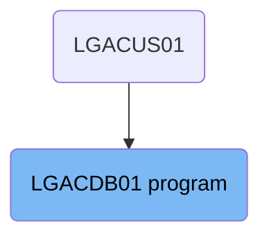

The <SwmToken path="base/src/lgacdb01.cbl" pos="13:6:6" line-data="       PROGRAM-ID. LGACDB01.">`LGACDB01`</SwmToken> program is responsible for managing customer information within the system. It ensures that each customer has a unique identifier, inserts customer details into the database, and calls other programs to add customer records to a VSAM file and manage customer authentication.

The <SwmToken path="base/src/lgacdb01.cbl" pos="13:6:6" line-data="       PROGRAM-ID. LGACDB01.">`LGACDB01`</SwmToken> program first retrieves a unique customer number to ensure each customer is uniquely identified. It then inserts the customer's details, such as name, date of birth, and contact information, into the database. After that, it calls the <SwmToken path="base/src/lgacdb01.cbl" pos="72:3:3" line-data="       77 LGACVS01                     PIC X(8)  VALUE &#39;LGACVS01&#39;.">`LGACVS01`</SwmToken> program to add the customer record to a VSAM file for redundancy and quick access. Finally, it calls the <SwmToken path="base/src/lgacdb01.cbl" pos="71:3:3" line-data="       77 LGACDB02                     PIC X(8)  VALUE &#39;LGACDB02&#39;.">`LGACDB02`</SwmToken> program to add the customer's password details to a security table in the database, ensuring secure management of customer authentication.

# Where is this program used?

This program is used once, in a flow starting from `LGACUS01` as represented in the following diagram:



Lets' zoom into the flow:

```mermaid
graph TD
  A[Insert Customer Info] --> B[Obtain Customer Number]
  B --> C[Insert Customer]
  C --> D[Call LGACVS01 to add customer to VSAM]
  D --> E[Call LGACDB02 to add customer password to DB2]
  E --> B

%% Swimm:
%% graph TD
%%   A[Insert Customer Info] --> B[Obtain Customer Number]
%%   B --> C[Insert Customer]
%%   C --> D[Call <SwmToken path="base/src/lgacdb01.cbl" pos="72:3:3" line-data="       77 LGACVS01                     PIC X(8)  VALUE &#39;LGACVS01&#39;.">`LGACVS01`</SwmToken> to add customer to VSAM]
%%   D --> E[Call <SwmToken path="base/src/lgacdb01.cbl" pos="71:3:3" line-data="       77 LGACDB02                     PIC X(8)  VALUE &#39;LGACDB02&#39;.">`LGACDB02`</SwmToken> to add customer password to DB2]
%%   E --> B
```



<SwmSnippet path="/base/src/lgacdb01.cbl" line="234">

---

## Obtaining Customer Number

First, the <SwmToken path="base/src/lgacdb01.cbl" pos="171:3:7" line-data="           PERFORM Obtain-CUSTOMER-Number.">`Obtain-CUSTOMER-Number`</SwmToken> paragraph is executed to retrieve a unique customer number. This ensures that each customer has a unique identifier before inserting their information into the database.

```cobol
                  VALUES ( :DB2-CUSTOMERNUM-INT,
                           :CA-FIRST-NAME,
                           :CA-LAST-NAME,
                           :CA-DOB,
                           :CA-HOUSE-NAME,
                           :CA-HOUSE-NUM,
                           :CA-POSTCODE,
                           :CA-PHONE-MOBILE,
                           :CA-PHONE-HOME,
                           :CA-EMAIL-ADDRESS )
             END-EXEC
             IF SQLCODE NOT EQUAL 0
               MOVE '90' TO CA-RETURN-CODE
               PERFORM WRITE-ERROR-MESSAGE
               EXEC CICS RETURN END-EXEC
             END-IF
           ELSE
```

---

</SwmSnippet>

<SwmSnippet path="/base/src/lgacdb01.cbl" line="251">

---

## Inserting Customer

Next, the <SwmToken path="base/src/lgacdb01.cbl" pos="172:3:5" line-data="           PERFORM INSERT-CUSTOMER.">`INSERT-CUSTOMER`</SwmToken> paragraph is executed to insert the customer's information into the CUSTOMER table. This includes details such as the customer's name, date of birth, address, and contact information.

```cobol
             EXEC SQL
               INSERT INTO CUSTOMER
                         ( CUSTOMERNUMBER,
                           FIRSTNAME,
                           LASTNAME,
                           DATEOFBIRTH,
                           HOUSENAME,
                           HOUSENUMBER,
                           POSTCODE,
                           PHONEMOBILE,
                           PHONEHOME,
                           EMAILADDRESS )
                  VALUES ( DEFAULT,
                           :CA-FIRST-NAME,
                           :CA-LAST-NAME,
                           :CA-DOB,
                           :CA-HOUSE-NAME,
                           :CA-HOUSE-NUM,
                           :CA-POSTCODE,
                           :CA-PHONE-MOBILE,
```

---

</SwmSnippet>

<SwmSnippet path="/base/src/lgacdb01.cbl" line="271">

---

## Calling <SwmToken path="base/src/lgacdb01.cbl" pos="72:3:3" line-data="       77 LGACVS01                     PIC X(8)  VALUE &#39;LGACVS01&#39;.">`LGACVS01`</SwmToken>

Then, the program calls <SwmToken path="base/src/lgacdb01.cbl" pos="72:3:3" line-data="       77 LGACVS01                     PIC X(8)  VALUE &#39;LGACVS01&#39;.">`LGACVS01`</SwmToken> to add the customer record to a VSAM KSDS file. This step ensures that the customer's information is also stored in a VSAM file for redundancy and quick access.

More about <SwmToken path="base/src/lgacdb01.cbl" pos="72:3:3" line-data="       77 LGACVS01                     PIC X(8)  VALUE &#39;LGACVS01&#39;.">`LGACVS01`</SwmToken>: <SwmLink doc-title="Updating Customer Records (LGACVS01)">[Updating Customer Records (LGACVS01)](/.swm/updating-customer-records-lgacvs01.vkv87eub.sw.md)</SwmLink>

```cobol
                           :CA-PHONE-HOME,
                           :CA-EMAIL-ADDRESS )
             END-EXEC
             IF SQLCODE NOT EQUAL 0
               MOVE '90' TO CA-RETURN-CODE
               PERFORM WRITE-ERROR-MESSAGE
               EXEC CICS RETURN END-EXEC
             END-IF
      *    get value of assigned customer number
               EXEC SQL
                 SET :DB2-CUSTOMERNUM-INT = IDENTITY_VAL_LOCAL()
               END-EXEC
           END-IF.

           MOVE DB2-CUSTOMERNUM-INT TO CA-CUSTOMER-NUM.

           EXIT.
      *================================================================*

      *================================================================*
```

---

</SwmSnippet>

<SwmSnippet path="/base/src/lgacdb01.cbl" line="291">

---

## Calling <SwmToken path="base/src/lgacdb01.cbl" pos="71:3:3" line-data="       77 LGACDB02                     PIC X(8)  VALUE &#39;LGACDB02&#39;.">`LGACDB02`</SwmToken>

Finally, the program calls <SwmToken path="base/src/lgacdb01.cbl" pos="71:3:3" line-data="       77 LGACDB02                     PIC X(8)  VALUE &#39;LGACDB02&#39;.">`LGACDB02`</SwmToken> to add the customer's password details to a security table in the <SwmToken path="base/src/lgacdb01.cbl" pos="234:6:6" line-data="                  VALUES ( :DB2-CUSTOMERNUM-INT,">`DB2`</SwmToken> database. This step is crucial for managing customer authentication and ensuring their data is secure.

More about <SwmToken path="base/src/lgacdb01.cbl" pos="71:3:3" line-data="       77 LGACDB02                     PIC X(8)  VALUE &#39;LGACDB02&#39;.">`LGACDB02`</SwmToken>: <SwmLink doc-title="Adding Customer Passwords (LGACDB02)">[Adding Customer Passwords (LGACDB02)](/.swm/adding-customer-passwords-lgacdb02.yipnfb7p.sw.md)</SwmLink>

```cobol
      * Procedure to write error message to Queues                     *
      *   message will include Date, Time, Program Name, Customer      *
      *   Number, Policy Number and SQLCODE.                           *
      *================================================================*
       WRITE-ERROR-MESSAGE.
      * Save SQLCODE in message
           MOVE SQLCODE TO EM-SQLRC
      * Obtain and format current time and date
           EXEC CICS ASKTIME ABSTIME(WS-ABSTIME)
           END-EXEC
           EXEC CICS FORMATTIME ABSTIME(WS-ABSTIME)
                     MMDDYYYY(WS-DATE)
                     TIME(WS-TIME)
           END-EXEC
           MOVE WS-DATE TO EM-DATE
           MOVE WS-TIME TO EM-TIME
      * Write output message to TDQ
           EXEC CICS LINK PROGRAM('LGSTSQ')
                     COMMAREA(ERROR-MSG)
                     LENGTH(LENGTH OF ERROR-MSG)
```

---

</SwmSnippet>

&nbsp;

*This is an auto-generated document by Swimm 🌊 and has not yet been verified by a human*

<SwmMeta version="3.0.0" repo-id="Z2l0aHViJTNBJTNBa3luZHJ5bC1jaWNzLWdlbmFwcCUzQSUzQVN3aW1tLURlbW8=" repo-name="kyndryl-cics-genapp"><sup>Powered by [Swimm](https://app.swimm.io/)</sup></SwmMeta>
