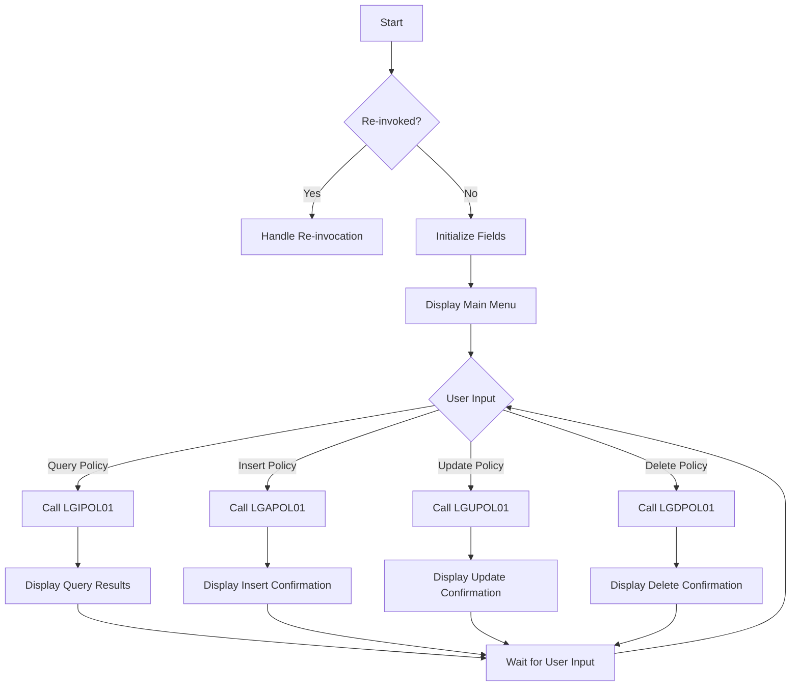

The <SwmToken path="base/src/lgtestp3.cbl" pos="11:6:6" line-data="       PROGRAM-ID. LGTESTP3.">`LGTESTP3`</SwmToken> program is a COBOL application designed to handle house policy transactions. This document will cover:

1. What the Program Does
2. Program Flow
3. Program Sections

## What the Program Does

The <SwmToken path="base/src/lgtestp3.cbl" pos="11:6:6" line-data="       PROGRAM-ID. LGTESTP3.">`LGTESTP3`</SwmToken> program is designed to manage house policy transactions. It provides a menu for users to perform various operations such as querying, inserting, updating, and deleting house policy information. The program interacts with other CICS programs to perform these operations and displays the results on a CICS map.

## Program Flow

The program starts by checking if it is being re-invoked. If not, it initializes various fields and displays the main menu. Based on the user's input, it performs different operations such as querying, inserting, updating, or deleting house policy information. The program then sends the appropriate map to the user and waits for further input.



<SwmSnippet path="/base/src/lgtestp3.cbl" line="27">

---

## Program Sections

First, the program checks if it is being re-invoked by examining the <SwmToken path="base/src/lgtestp3.cbl" pos="32:3:3" line-data="           IF EIBCALEN &gt; 0">`EIBCALEN`</SwmToken> field. If it is, it jumps to the <SwmToken path="base/src/lgtestp3.cbl" pos="33:5:7" line-data="              GO TO A-GAIN.">`A-GAIN`</SwmToken> section. Otherwise, it initializes various fields and displays the main menu.

```cobol
       PROCEDURE DIVISION.

      *---------------------------------------------------------------*
       MAINLINE SECTION.

           IF EIBCALEN > 0
              GO TO A-GAIN.

           Initialize SSMAPP3I.
           Initialize SSMAPP3O.
           Initialize COMM-AREA.
           MOVE '0000000000'   To ENP3CNOO.
           MOVE '0000000000'   To ENP3PNOO.
           MOVE '00000000'     To ENP3VALO.
           MOVE '000'          To ENP3BEDO.


      * Display Main Menu
           EXEC CICS SEND MAP ('SSMAPP3')
                     MAPSET ('SSMAP')
                     ERASE
```

---

</SwmSnippet>

<SwmSnippet path="/base/src/lgtestp3.cbl" line="50">

---

Now, the program sets up handlers for different AID keys and conditions. It then waits for the user to interact with the menu by receiving the map input.

```cobol
       A-GAIN.

           EXEC CICS HANDLE AID
                     CLEAR(CLEARIT)
                     PF3(ENDIT) END-EXEC.
           EXEC CICS HANDLE CONDITION
                     MAPFAIL(ENDIT)
                     END-EXEC.

           EXEC CICS RECEIVE MAP('SSMAPP3')
                     INTO(SSMAPP3I)
                     MAPSET('SSMAP') END-EXEC.
```

---

</SwmSnippet>

<SwmSnippet path="/base/src/lgtestp3.cbl" line="64">

---

Then, the program evaluates the user's input and performs the corresponding operation. It can query, insert, update, or delete house policy information by calling other CICS programs (<SwmToken path="base/src/lgtestp3.cbl" pos="70:10:10" line-data="                 EXEC CICS LINK PROGRAM(&#39;LGIPOL01&#39;)">`LGIPOL01`</SwmToken>, <SwmToken path="base/src/lgtestp3.cbl" pos="106:10:10" line-data="                 EXEC CICS LINK PROGRAM(&#39;LGAPOL01&#39;)">`LGAPOL01`</SwmToken>, <SwmToken path="base/src/lgtestp3.cbl" pos="196:10:10" line-data="                 EXEC CICS LINK PROGRAM(&#39;LGUPOL01&#39;)">`LGUPOL01`</SwmToken>, <SwmToken path="base/src/lgtestp3.cbl" pos="129:10:10" line-data="                 EXEC CICS LINK PROGRAM(&#39;LGDPOL01&#39;)">`LGDPOL01`</SwmToken>). After performing the operation, it sends the appropriate map back to the user.

```cobol
           EVALUATE ENP3OPTO

             WHEN '1'
                 Move '01IHOU'   To CA-REQUEST-ID
                 Move ENP3CNOO   To CA-CUSTOMER-NUM
                 Move ENP3PNOO   To CA-POLICY-NUM
                 EXEC CICS LINK PROGRAM('LGIPOL01')
                           COMMAREA(COMM-AREA)
                           LENGTH(32500)
                 END-EXEC
                 IF CA-RETURN-CODE > 0
                   GO TO NO-DATA
                 END-IF

                 Move CA-ISSUE-DATE      To  ENP3IDAI
                 Move CA-EXPIRY-DATE     To  ENP3EDAI
                 Move CA-H-PROPERTY-TYPE To  ENP3TYPI
                 Move CA-H-BEDROOMS      To  ENP3BEDI
                 Move CA-H-VALUE         To  ENP3VALI
                 Move CA-H-HOUSE-NAME    To  ENP3HNMI
                 Move CA-H-HOUSE-NUMBER  To  ENP3HNOI
```

---

</SwmSnippet>

<SwmSnippet path="/base/src/lgtestp3.cbl" line="233">

---

Going into the final section, the program sends a message to the terminal and returns control to CICS.

```cobol
      *    Send message to terminal and return

           EXEC CICS RETURN
           END-EXEC.

       ENDIT-STARTIT.
           EXEC CICS RETURN
                TRANSID('SSP3')
                COMMAREA(COMM-AREA)
                END-EXEC.
```

---

</SwmSnippet>

&nbsp;

*This is an auto-generated document by Swimm 🌊 and has not yet been verified by a human*

<SwmMeta version="3.0.0" repo-id="Z2l0aHViJTNBJTNBa3luZHJ5bC1jaWNzLWdlbmFwcCUzQSUzQVN3aW1tLURlbW8=" repo-name="kyndryl-cics-genapp"><sup>Powered by [Swimm](/)</sup></SwmMeta>
